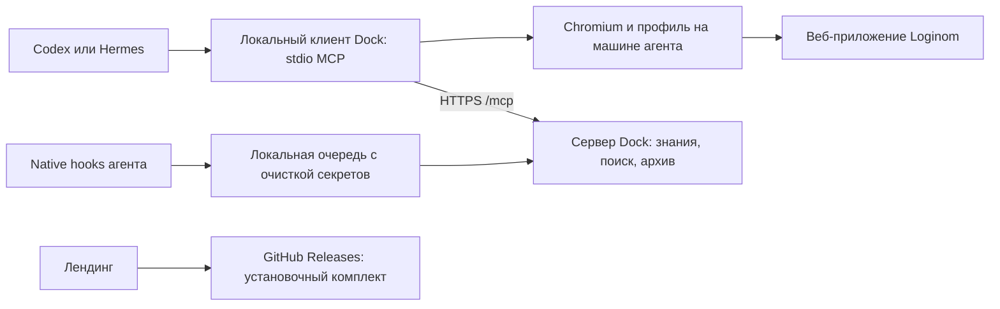

## Linux: состояние ветки — 16 сентября 2026

В `linux` сохранены GUI-окружение/browser smoke (`3bb08150`), согласование
истории (`1e48ef06`) и Linux/Hermes проверочная обвязка (`cf606cec`).
На отдельных снимках прошли 10 bridge-тестов и 23 профильных Python-теста.
По дополнительной команде пользователя общие исправления импорта, дат и
группировки сохранены отдельным клиентским коммитом вместе с тестами.
Все девять файлов совпадают с установкой v5; 39 профильных тестов прошли.

Полная историческая v5-приёмка (1866 клиентских PASS / 1 SKIP, 715 Python PASS,
живой Loginom и автономный Hermes с независимым аудитом) включала эти общие
исправления. Результаты относятся к закреплённой сборке v5; новый релизный
архив после коммитов не собирался, перед выпуском проверить его состав и pins. Пять ОС проверялись контейнерными smoke,
Wayland — через отдельный Weston; физическая Wayland-сессия не проверялась.

Инструкции поддержки, версии, результаты и локаторы первичных доказательств:
[Linux maintenance](../plans/2026-09-15-loginom-dock-linux-maintenance.md).
Merge в main, push и выпуск не выполнялись; общий клиент и плагины не обновлялись.

## RC8 опубликован и установлен — 15 сентября 2026

Исправлено чтение предпросмотра перед группировкой. Client/tag 2712a9a9,
site 3d1a096e; оба плагина установлены, Codex hooks 6/6 trusted.
Source и готовый macOS: 1845 PASS/1 SKIP; Linux: 457 PASS; живой сценарий
импорт → калькулятор → группировка → сохранение прошёл.
Hermes не перезапускался: сначала пользователь должен сохранить открытый пакет,
затем перезапустить Hermes и продолжить в новой задаче. Старый pending RC7
не разблокируется обновлением файлов. Новые узлы не запускались.
[Проверки, ограничения и откат](releases/rc8-release-2026-09-15.md).

---

## RC7 опубликован и установлен — 15 сентября 2026

Исправлена изоляция чатов Hermes и передача вложений. Клиент c63b3b36 / RC7
опубликован, main отправлен после отдельного разрешения; оба Mac-плагина
обновлены, Codex hooks6/6trusted. Desktop и messaging Hermes штатно перезапущены,
оба загрузили native router RC7. Настройки модели и рабочие каталоги сохранены.
Source/Mac1843PASS+1SKIP, Python10PASS, Linux102PASS; живая проверка двух задач
подтвердила изоляцию и доставку. GUI composer после установки ещё не воспроизведён.
Сайт8ad84954/current20260915-rc7-8ad84954 переключён, backend сохранён.
[Полный отчёт, границы и откат](releases/rc7-release-2026-09-15.md).
Ниже сохраняются исторические checkpoints; ожидание выпуска RC7 завершено.

---

## RC6 выпущен и сайт обновлён — 14 сентября 2026

Опубликован `loginom-dock@0.1.0-rc.6`, клиентский source `0df6da82`:14типов узлов,
обычная установка с выбранной папкой Loginom, датасеты из сообщений Codex/Hermes.
Три совместных сценария и настоящий native Hermes @file прошли независимую
приёмку, включая сохранение и повторное открытие. Mac-плагины обновлены,
Hermes gateway перезапущен. Новые узлы не запускались, Hermes-слот свободен.
Main/обычный push отдельно подтверждены пользователем; локальная незавершённая
работа сохранена. [Полный отчёт, ограничения и откат](releases/rc6-release-2026-09-14.md).

VPS current сайта `20260914-rc6-fc606397`; Caddy `loginom-dock:landing-rc6-fc606397`,
backend прежний. Все5публичных файлов скачаны и проверены;6вариантов установки,
desktop/mobile и HTTP-проверки PASS. Новая GUI-приёмка Linux/Windows отложена
пользователем; Codex composer event отдельно не воспроизводился; XLSX-узлы вне RC.
Этот итог заменяет прежние ожидания слияния, выпуска и приёмки ниже.

---

> **14 сентября 2026: шесть принятых веток объединены для RC.** Реестр содержит 14 обработчиков; локальные проверки пройдены с адресными повторами. Совместная живая проверка и выпуск ещё не выполнялись. [Итог интеграции](releases/rc-integration-2026-09-14.md). Новые узлы не запускаются; оптимизация чтения отложена.

> Очистка и возобновление: [отчёт13сентября](accepted-node-cleanup-2026-09-13.md). Raw diagnostics03–10 удалены по разрешению пользователя; текущие worktrees сохранены.

> **Последнее решение пользователя, 2026-09-13: новые узлы не запускать.**
> Автоматический переход к следующему узлу отключён до новой явной команды.
> Завершение текущего узла не разрешает создавать следующую задачу/worktree/ветку.
> Для уже назначенных узлов13/14/16/17 сохраняются действующие этапы и ограничения.

# Capture17 работает; итоговое знание ожидает следующую фазу — 13 сентября 2026

799messages/4completed official extractions и общийPeer подтверждены, следов
ENOSPC в extraction нет. Итоговый корректно атрибутированный Text export lesson
ещё не подтверждён: последнее извлечение пересказало historical nodes11–14.
Разработчику уточнён node17/source context, следующий read/find gate после
completed review17/official extraction. Это ожидание события, не периодический
опрос. Подробности в disk-pressure-2026-09-13.md.
Все инфраструктурные события отвечены, helper результат учтён.

---

# Disk pressure снят, узел17 перешёл к review — 13 сентября 2026

[Инцидент](disk-pressure-2026-09-13.md): Data100%/116MiB, ENOSPC14/16/17.
Координатор удалил только7.5GiB регенерируемого npm download cache; df7.9GiB
подтверждён повторно, dependencies/evidence/runtime не менялись. Потоки14/16
получили same-phase инструкции проверить записи и не повторять unknown effects.
17development110da29a/reporta0912da9 completed; назначено единственное review
Astra medium в той же задаче, ход01a09aa3-f66d-7420-a27c-c83c98605df3 active.
Первую official shared phase capture проверяет read-only helper; ручныхcapture нет.

---

# Узел13: кандидат собран и назначен live preflight — 13 сентября 2026

[Stage/readback](node13-candidate-stage-2026-09-13.json): version
2026.09.13-node13-acceptance.1-5a4c46fc-candidate, manifest
db38f7f249c0c051d8b77a22e0ac80a817ecb96a9820bfb0f74b8199a496c634.
9builder inputs source5a4c46fc и archive сверены; сборка на VPS,4/4readbackPASS.
Для publisher отдельно добавлены exact source publisher/ABI; первый запуск
ошибся относительным ABI путём до публикации, исправлено без rebuild.
Production/current неизменны, activatedfalse.
Ход01a09a8d-bc63-7950-a663-3c8cceb70ae3 active/Astra medium: current candidate,
native/direct-open и адресные regression gates без модели; исторические R1/R3
не считать доказательством новогоruntime молча. Final admission подготовить,
Hermes слот не выдан и занят14. Нет review/main/plugin. Все входящие обработаны.

---

# Узел14: следующий полный Hermes назначен; узел17 получил ответ — 13 сентября 2026

Scoped import verifier7bef361c/reportac7ce151 проверен помощником:
strict default/gates27/9/12/save/reopen, gzip114/114/1264. Координатор сверил
33evidence/395source/156runtime/256harness и отсутствие acceptance процессов
11:26:31UTC. Единственный слот node14-hermes-20260913-run4-7bef361c выделен
на один полный run4, existing ChatGPT/Sol/low. Ход01a09a86-25bc-7312-a1c5-a07b051efde4
active; actual model start ещё не проверен. Runtime71f73d81, immutable cadd80df.
Launch plan SHA1730009e86d2f73f4783f22c9afb7c40451ebb8bbd1dc11d9cef72d9823a1f39.
Новый префлайт перед моделью обязателен, при FAIL нет второго автозапуска.

17: connect-preflight-mask proposal согласован: existing bounded observe только
exports.text перед link mutation, exact graph и повторный cancel/deadline guard.
Не повторять возможный link, не переобозначать старый pending.
Все входящие обработаны, результат помощника учтён. Main/plugin не менялись.

---

# Узел13: R2 принят ограниченно, готовится полная приёмка — 13 сентября 2026

5a4c46fc: exact11files/18hunks R2 transfer выполнен, terminal live test-3 PASS.
Координатор сверил35hashes integration/evidence/harness,15negative, repeat/resume
1057→1057→1057 и восстановленный4×8/источник/cleanup. Новый persistence не заявлен.
В реестре уже completed review1/reportd316b2f4 и fix1; повторное review запрещено,
несмотря на full_review OPEN в последнем developer report. Назначены сверка
remaining gates и новый pinned candidate/полный acceptance комплект accepted10rowgoal.
Ход01a09a7a-b83e-7c93-b6dd-5adb1bb25c4c active, Astra medium. Archive для VPS
подготовить либо доказать immutable reuse; модель/слот/Hermes ещё не назначены.
Полный узел не принят; main/plugin не меняются. Все входящие обработаны.

---

# Узел17: ограниченная прокрутка палитры согласована — 13 сентября 2026

Exact export TreeText вне viewport; coordinator проверил existing create effect
и согласовал owner-only scroll внутри journaled mutation с повторным полным
graph/hit-test перед drag. Решение и guards записаны в17подплане.
Разработчику доставлено уточнение текущей фазы, нового review/Hermes нет.
Все входящие обработаны; успешная реализация scroll ещё не подтверждена.

---

# Узел16: bounded exact wiring согласован — 13 сентября 2026

Проект7e1bbab9 проверен помощником:6prototype/decoder/3artifact SHA и38cells.
Выявлен и координатором воспроизведён BOM/U+FEFF decoder defect, исправление
включено в назначение. [Точное решение](node16-exact-wiring-decision-2026-09-13.md)
разрешает private Collapse source wiring после live fullR×C/stability gate.
Host-derived provenance/receipt, failclosed unknown profile и byte budget до
накопления обязательны; sample defaults сохраняются, actual user-v1 проверяется.
Ход01a09a73-f656-7b12-9b17-7d3cf7f2c617 active, Astra medium.
Полный узел не принят; Hermes/sharedplugin/VPS/main не назначены.
Все входящие обработаны и результат помощника учтён.

---

# Узел14: NULL исправлен, import refusal verifier назначен — 13 сентября 2026

Source814f3146/report841d6443: native picker выбирает точный NULL,
вместо case-insensitive typing/blur→null. Координатор сверил diff,48evidence
и focused audit3×5/12Null/exactNULL, cleanup. Полная цель ещё не принята.
Автоматически согласована строгая import-specific no-effect refusal схема из
worktree14 docs/loginom-dock/node14-import-placement-refusal-proposal-2026-09-13.md.
Только imports.text/delimited/new, verified artifact/grant, actual graphs/geometry,
NOT_APPLIED/cleanup/pendingnull и semantic successor после публичной доставки.
Общие defaults и27/9/12/save/reopen gates не ослаблять. Missing graph proof
получать новой dedicated live, не дописывать к frozen FAIL. Ранее выполненный
upload не скрывать утверждением об отсутствии всех эффектов операции.
Ход01a09a70-f390-79a2-b10a-3157838bf1dd active, Astra medium. Новые source/runtime/
harness pins и acceptance комплект подготовить; Hermes/VPS/main/plugin не назначены.
Неизменённый immutable каталог допускает reuse только после проверки байтов.
Все входящие обработаны.

---

# Узел16: hardening проверен, контракт назначен — 13 сентября 2026

Диагностический dc93af3f:6prototype/18evidence/5frontend hashes и lifecycle
сверены помощником. Public code не менялся; atomic snapshot/server cancellation
не доказаны, native32 не наблюдались. Исходный16scope требует exact scalar type/value,
а не все эти отдельные свойства. Координатор согласовал
[конкретный contract-design этап](node16-variant-contract-next-step-2026-09-13.md),
разделяющий точность, полноту и согласованность без ложных гарантий.
В прежней задаче Astra medium ход01a09a66-ab7d-7680-82c4-2dfb438c9de1 active.
Pure diagnostic adapter разрешён, public integration/Hermes пока не назначены.
Полная приёмка16 остаётся открытой. Все входящие обработаны.

---

# Узел14: приёмка3 FAIL, диагностика импорта назначена — 13 сентября 2026

Run20260913-132939-0384fe0b: actual openai-codex/Sol/low,25API,
full audit FAIL,5/27операций и5/9импортов,0save. Import-allnull configure NULL
не подтвердил settlement исходного мастера: AMBIGUOUS/pending/cleanup=false.
Кроме того import placement refusal не входит в текущий Missing Values allowance.
14/14receipts сверены, старыйFAIL сохранён. Completed и свежая process check
10:44:08UTC подтвердили выход; слот Hermes освобождён.

По новой политике автоматического согласования назначена узкая live диагностика
и исправление подтверждённой причины импорта в своей test-4 среде. Ход
01a09a5e-9f05-7f33-bac2-ddc8ca45380e active. Blanket refusal allowance и ослабление
полной цели запрещены; отдельное import-specific предложение идёт координатору.
Новый Hermes/review/VPS/main/plugin не назначены. Все входящие обработаны.

---

# Автоматическое согласование рабочих шагов разрешено — 13 сентября 2026

Пользователь разрешил координатору подтверждать дальнейшие рабочие шаги
по узлам без повторных вопросов. Проверка конкретного предложения и фиксация
решения обязательны; разработчики продолжают обращаться к координатору.
Правило внесено в AGENTS, automatic-node-workflow, runbook и coordinator-inbox.
Отдельная команда на mainmerge/push/deploy/sharedplugin остаётся необходимой;
модели, единый слот Hermes, границы review и отсутствие таймера не меняются.

---

# Узел13: перенос R2 разрешён и назначен — 13 сентября 2026

Пользователь прямо разрешил проверенный пакет14→13 и live test-3.
Точный scope11files/18hunks и SHA зафиксированы в
[node13-r2-transfer-decision-2026-09-13.md](node13-r2-transfer-decision-2026-09-13.md).
В прежней задаче разработчика назначен R2 integration/live gate на Astra medium;
ход01a09a59-420f-75b3-80c3-e995624e6111 active/inProgress подтверждён.
Применение и успешный live результат ещё не подтверждены. Hermes слот остаётся
у14; mainmerge/push/sharedplugin не разрешены. Все входящие события обработаны.

---

# Узел13: manual output проверен, R2 ожидает решения — 13 сентября 2026

[Точный пакет и границы](node13-r2-transfer-decision-2026-09-13.md) сверены
помощником; разработчик получил подтверждение. Запрос разрешить перенос11files/18hunks
и live R2 test-3 отправлен пользователю. До ответа не применять. Hermes слот у14.
Все события разобраны, результаты помощников учтены, periodic polling отсутствует.

---

# Узел14: один полный автономный прогон назначен — 13 сентября 2026

Preflight a62d380c завершён,23evidence/252harness/395source/156runtime
и4candidate bytes повторно сверены координатором. Свежая process check10:26:41UTC
не обнаружила acceptance/Hermes runs. Слот node14-hermes-20260913-cadd80df
выделен узлу14 на один полный прогон: existing ChatGPT/openai-codex/Sol/low.
Ход01a09a50-0779-7561-9d08-a80b4b26484f active подтверждён; фактический запуск
модели ещё не проверен. Candidate2/runtime/goal заморожены; auth/pins проверить
снова непосредственно перед стартом. Полная цель27success/9imports/12results,
native save и независимый reopen обязательны. При FAIL нет второго автозапуска.

---

# Узлы14/16: следующие ограниченные фазы назначены — 13 сентября 2026

14: packet83dc0db5 проверен помощником и собран на VPS как immutable test4.2.
[Stage/readback](node14-candidate-v2-stage-2026-09-13.json):4/4файла совпали,
manifest cadd80dfd8490f40c851475008a1ccd68d7a617dbcf6a77de25034ff8da7b2ad;
production/current неизменны, activated=false. В прежней задаче назначен свежий
preflight без модели, ход01a09a47-2311-7f93-b8a8-cc40abc2d460 active.
Полная цель ещё не принята; Hermes слот не выдан.

16: ограниченный прототип bff616f3 проверен, observed cases PASS, полный variant
контракт BLOCKED. Пользователь прямо разрешил дополнительную изолированную
проверку конкуренции/обрыва/типов/дат. В прежней задаче назначен ход
01a09a46-31df-7e40-af84-ba5c83777748, Astra medium, active подтверждён.
Без public integration; [точное решение](node16-variant-prototype-decision.md).

Все поступившие события обработаны; оба результата помощников учтены.
Периодический мониторинг не создавался; mainmerge/push/plugin не выполнялись.

---

# Узел17: общая память проверена, разработка запущена — 13 сентября 2026

Registered MCP health/find(actor)/exact read прошли в задаче
`01a09a36-695b-7da0-b7ca-1ec521afa17e`. После completed назначены live discovery,
детализация подплана и разработка «Экспорт текста» на Astra medium; ход
`01a09a3b-c47f-77e3-ae23-b20cbaeb16ff` подтверждён active/inProgress.
Отдельные worktree/ветка/test-2 сохранены. Первое извлечение нового знания
в общую память ещё нужно проверить после содержательной фазы.
Штатный CLI способ добавления проекта восстановлен и внесён в runbook.

---

# Узел17: bootstrap и enrollment завершены, actor probe назначен

Реальные cwd/branch/base/HEAD и изоляция подтверждены задачей17; coordinator
проверил completed/idle bootstrapхода. PinnedNode24.19.0 отличается отshell22.23.1;
для дальнейшей работы явно использовать закреплённый бинарник.
Штатный enroll_task завершился status=enrolled, общийPeer и routeHash совпали,
capturedTurnCount0; actorAccessVerified=false/newCaptureVerified=false ещё ожидаются.
В той же задаче назначен только registeredMCP health/find/read probe;
ход `01a09a39-d833-7a63-bd34-b5c25f549c22` active подтверждён.
Далее при успехе — live discovery/детализация и разработка17; процесс регистрации
больше не требует ручного добавления проекта пользователем.

---

# Исправлен способ регистрации проекта, создана задача17 — 13 сентября 2026

Прежнее утверждение о необходимости ручного добавления проекта было ошибочным.
По возражению пользователя проверена история05:08:26UTC: узел16 добавлялся через
штатный `codex app <абсолютный-путь-worktree>`. Текущий `codex app --help`
подтвердил этот интерфейс; команда успешно добавила уже подготовленную папку17.
Ограничение CUA на управление Codex не обходилось: GUI-драйверы и внутренние
appstate файлы не использовались, сработала отдельная штатная CLI возможность.
Runbook теперь требует проверить этот путь до предложения ручного действия.

list_projects подтвердил project78f34082-0f13-45c6-b826-3892eb164556, exactpath
`.worktrees/node-17-text-export`, isGitRepository=true. Перед первым ходом
проверены10trusted projecthooks и0originalmemoryhooks новойпапки.
Создана отдельная ordinary local задача `01a09a36-695b-7da0-b7ca-1ec521afa17e`,
Astra medium; bootstrapход `01a09a36-6acb-7191-815d-c465aae7e9d0` active.
Он проверяет только окружение. Pendingregistration7bdef4fd-e366-485d-a83f-51eef03085da
пока не активирована; после completed нужны enrollment и actorhealth/find/read,
затем livediscovery/детализация17 до реализации. Пользователю добавлять папку не нужно.

---

# Узел11 принят; узел17 подготовлен, ожидается проект приложения — 13 сентября 2026

[Узел11 принят в ветке](node11-branch-acceptance-2026-09-13.json): отдельная
переоценка frozenrun20260913-122247-a862a34d дала59/59PASS; verifier9ddb33ed,
report/head dc0eadde. Помощник сверил stage-specific saveконтракт,11артефактов,
252/253harness,392sourcefiles,17/36test receipts и тот же неизменённый evaluator.
Нового Hermes/UI/review не было, старый57/59FAIL сохранён. test-2 освобождён,
старые ветка/задача/пакет сохранены. Mainmerge/push/production/plugin не выполнялись.

Следующий узел потока1 — [17. Экспорт текста](../plans/loginom-dock/17-text-export.md).
Созданы постоянный `.worktrees/node-17-text-export`, ветка
`codex/node-17-text-export` от принятой a3b419bde8a660e1905284ee62a46362d5a49e09.
Runtime paths этой базы совпали с main; непрослитый11 не перенесён.
SourceMCP, отдельныйDockHOME, test-2,/test-2, Node24.19.0, read-only dependencies,
свежие AGENTS/runbook и предварительный discovery-план подготовлены.
Memoryprepare прошёл: pending registration7bdef4fd-e366-485d-a83f-51eef03085da,
routeHash b80f0999335b31280f00859bbb97af683b5377adcdb3c11b4b6e7b2741b7041b.
State/cursor/task ещё не создавались. UI/live/fullmemoryaccess не проверены.

Блокер: доступные purpose-built инструменты не имеют add-project, а CUA вернул
«Computer Use is not allowed to use the app com.openai.codex for safety reasons».
Ограничение не обходилось другим GUI-драйвером/правкой внутреннего appstate.
Пользователь должен добавить подготовленную папку как savedproject Codex.
Затем list_projects → новая ordinary local bootstrap task Astra medium →
completed evidence/hooks/enrollment → actor health/find/read → live discovery,
детализация17 и разработка. Задачу не создавать в main или старомчате11.
Следующие XLSX import/export остаются отдельными будущими узлами.

---

# Пользователь разрешил ограниченный variant прототип узла16 — 13 сентября 2026

На конкретный вопрос о read-only эксперименте test-1, максимум50×8 и отсутствии
изменения общего плагина пользователь ответил «разрешаю».
[Точный разрешённый объём](node16-variant-prototype-decision.md) заменяет прежний
запрет только этой диагностической фазы: fixed method321/interface116 до decoder,
собственная сессия и обязательные owner/freshness/tag/lossless проверки.
Произвольные RPC/записи/sharedhooks/интеграция в продукт не разрешены.
В прежней задаче на Astra medium назначено
`node16:variant-prototype:1:direct-user-20260913`;
ход `01a09a29-1ae0-7d91-97b5-33738d1fca47` подтверждён active/inProgress.
Фактическое чтение и пригодность прототипа ещё не подтверждены.
Hermes/review/main/push/deploy/sharedplugin не назначены.

---

# Узел11: завершён run, назначена отдельная переоценка verifier — 13 сентября 2026

Run20260913-122247-a862a34d, report5891dfdc: один Sol/low запуск, FAIL57/59.
Все11apply и обаsave завершились; четыре выполнения после настоящего reopen.
Помощник сверил11frozenartifacts по SHA/размеру,59checks и4native save receipts.
Два persistence FAIL вызваны безусловным требованиемreplace/исходныйsavedpath
к первой стадии сохранения новогоPackage1 (фактическиfail/пустойpath).
Для второйстадии replace/предыдущийsavedpath обязательны; графы совпали.

Completed/idle и свежий process check09:40:38UTC подтвердили завершение, слот11
освобождён. В той же задаче Astra medium назначен только diagnostic verifier fix,
focused negative tests и отдельная переоценка тех же frozen evidence с новым
verifierSHA, раздельным provenance и неизменными исходными11артефактами/FAIL.
Identity,graph,exactstagepolicy,nativeclose/reopen,freshdata и все59checks сохраняются.
Новый ход `01a09a25-bc9a-7682-9a30-18e43cdd2ced` active подтверждён.
Productruntime/Hermes/browser/fullreview/VPS/main/plugin не назначены.
Успех переоценки ещё не установлен. Узел16 ожидает пользовательского решения
по [ограниченному variant эксперименту](node16-variant-prototype-decision.md).

---

# Узлы 16 и 14: проверены итоги, назначены следующие действия — 13 сентября 2026

Узел16: source f998985c/report41856b1d. Помощник сверил ранний inactive source guard,
minimal save/new-document/reexecute, полные0×4 и input7fields/0rows, graph identity,
три PASS audit receipts и12negative в каждом. Empty persistence закрыт только при
явном выполнении upstream; старый pending не объявлен восстановленным.
Разработчик уведомлён об ожидании конкретного решения по exact variant.
[Подготовленный ограниченный эксперимент и причина согласования](node16-variant-prototype-decision.md).

Узел14: source e433c593/report f3165f39. Bounded target recovery подтверждён
выбранными evidence и runtime hunks: FAILED/cleanup после no target effect,
новыйID success4×5 и native save. Reopen/full goal не приняты. Помощник проверил
5 выбранных hashes и индекс, не все2523файла и не все тесты повторно.
Назначен отдельный terminal-refusal verifier follow-up на Astra medium в той же
задаче; ход `01a09a21-8a9f-7ae0-862d-c09e230cdbec` active подтверждён.
Строгий scoped учёт всех prepared/calls/refusals, actual graph before/after,
known source preflight effect и успешный successor с новымID обязателен.
27successful operations,9imports,12persisted results, final save/reopen остаются
обязательными. Старый FAIL не переименовывается; дополнительные неизвестные
операции и недоказанное recovery не прощаются. Candidate build отложен до новых
verifier/harness pins. Hermes остаётся за11; слияния/выпуска не было.

---

# Узлу 11 назначена полная приёмка кандидата 11.2 — 13 сентября 2026

Preflight report/pins `49c8b68f` проверен: 8 SHA receipts, 157 текущих runtime
inputs, 252 штатных harness inputs и отдельно fixtures/replacement/empty.csv
(253 в ручном inventory). Все байты совпали; различие областей учёта передано
разработчику. Dock prepare READY, собственные test-2 и /test-2, candidate manifest
`bb2fe2207e01d594108efb591d1c25036adc12f67168ef895dfde755d391ac2a`.
Закрытие диагностического черновика прошло после обновления наблюдения;
первоначальная pagination response shape error сохранена как ограничение.

После completed прежнего хода и освобождения слота14 координатор зарезервировал
`node11-hermes-20260913-bb2fe220`, назначив один replacement-node-complete run
с существующей подпиской openai-codex/gpt-5.6-sol/low и штатной независимой
проверкой полного goal. Задача разработчика остаётся Astra medium.
Dispatch `node11:autonomous-acceptance:2:bb2fe2207e01d594108efb591d1c25036adc12f67168ef895dfde755d391ac2a`.
Ход `01a09a12-24dc-76b0-8845-22fbe0890bb5` подтверждён active/inProgress;
фактический старт модели ещё не подтверждён. Перед запуском нужен свежий
process/pins preflight. При FAIL/approval denial остановиться без второго прогона
или обхода gate. Старый FAIL55/59 и A1–A3 сохранены, нового полного ревью нет.
Main/push/production activation/shared plugin не изменялись.

---

# Одновременные итоги узлов 13 и 16 обработаны — 13 сентября 2026

Оба сообщения записаны в inbox до разбора; два временных read-only помощника
проверили конкретные ограничения. После подтверждения completed прежних ходов
координатор назначил продолжения в тех же задачах на Astra medium:

- 13, source/report `b01f2e83`: bounded configure recovery подтверждён по JSON,
  4×8/32 values и 8/8 negatives; repeat1042→1042→1042. Старый autosync=false
  кейс с9sources/7targets остаётся FAIL. Назначена прямая диагностика ручной
  output schema и только подтверждённый fix с focused persistence. Отдельно
  подготовить точный terminal-failure14→13 patch с source/target blobs,
  hashes и проверкой применимости. План11файлов ещё не является готовым patch;
  перенос не разрешён. Новый ход `01a09a0e-ab40-75b0-b8fb-0bb9fcbe1581` active.
- 16, checkpoint `6e36609d`: основная часть реализована, но empty persistence
  и exact variant не приняты. Назначена диагностика upstream schema/links
  до сохранения и после открытия в новой сессии; неизвестные связи не удалять.
  Подготовить конкретное предложение version-pinned tagged read-only прототипа,
  без новых RPC/перехвата/transport. Static ReadVariant теряет discriminator;
  AsVariant321 сам по себе не решает проблему, полный Preview caller-chain
  не доказан. Новый ход `01a09a0e-ba40-7100-84e6-3d9223245ff1` active.

В основном подплане16 исправлено чрезмерное утверждение always variant:
execute-wide-saved/preview-wide-owner подтверждают конкретные Values integer/52строки.
Другие однородные типы не обобщаются; mixed/DataTypes-off exact остаётся BLOCKED.
Оба назначения — продолжение незавершённой работы, не новые полные ревью.
Hermes свободен после завершения14, новый прогон не назначен. Слияния и выпуск
не выполнялись. Все доставленные итоги11/13/14/16 обработаны; помощники завершены.

---

# Узел 14: проверен FAIL, назначена диагностика target recovery — 13 сентября 2026

Единственный разрешённый run `20260913-113814-1bc86af9` завершился, полный goal
не выполнен. Source `c32a5d5e`, report `02b9e4c3`. Помощник сверил 13 SHA receipts
и 13 результатов инструментов с исходным evidence: фактически Sol/low,
73 API calls, exit0 без timeout; это не PASS. Недоступная поверхность графа при
создании «Только строка» {x:1200,y:260} оставила target AMBIGUOUS/pending,
заблокировав save. Pre-audit FAIL, финальное сохранение и независимый reopen/audit
12 результатов не подтверждены. Корневая причина кода ещё не установлена.

Completed/idle проверен; свежая проверка координатора в09:13:03 UTC не нашла
процессов run и двух его session IDs. Слот14 освобождён, новый Hermes не назначен.
В той же задаче на Astra medium назначено
`node14:target-recovery-followup:1:02b9e4c36e346f8ceebf1257a7571f88c8f56f20`:
сначала прямое живое воспроизведение, затем минимальное подтверждённое исправление
и focused проверки no-effect/pending/сохранения. Target-placement recovery закреплён
за14, без копирования configure13 или SaveAs12. Это не новое полное ревью.
Старт хода `01a09a0b-a767-7db0-8d2e-888e32a5e6ad` подтверждён active.
Исходный FAIL заморожен; production, main и общий плагин не менялись.

---

# Узел 11: перенос проверен, кандидат 11.2 собран — 13 сентября 2026

Разрешённый SaveAs перенос 12 → 11 завершён: source `b0571534`, report `165bc5e5`.
Независимый временный помощник сверил точный hunk и новый тест с `0e11a3fb`,
39 артефактов, 392 файла архива с Git и 253 harness inputs; расхождений нет.
Подтверждены 38/38 executor tests и 10/10 focused live audit. Для Main повтор
потребовал исходных параметров и прошёл через мастер импорта; обход мастера
не реализован и не заявляется. Старый полный FAIL 55/59 сохранён.

Координатор собрал на VPS и staged immutable `2026.09.13-node11.2-candidate`.
Manifest SHA: `bb2fe2207e01d594108efb591d1c25036adc12f67168ef895dfde755d391ac2a`.
Все четыре файла прочитаны обратно и совпали побайтно. Рабочий server/current
сохранён, preview/current по-прежнему 404; activated:false.
[Квитанция и ограничения](node11-candidate-v2-2026-09-13.json).
В прежней задаче узла 11 на Astra medium назначен ограниченный candidate preflight.
Новый ход `01a09a08-b0e8-7b41-8324-8d88b6e086de` подтверждён active/inProgress.
Hermes11 не назначен: слот остаётся14.
Полное повторное ревью, main/push, активация и общий плагин не затронуты.

---

# Введена очередь координатора и до двух помощников — 13 сентября 2026

Пользователь согласовал очередь входящих сообщений и до двух временных
read-only субагентов для независимых проверок. Обязательная инструкция:
[coordinator-inbox.md](../plans/loginom-dock/coordinator-inbox.md).
Локальная очередь создана в `.dock/node-streams-20260912/inbox.json`, связана
с dispatch keys прежнего state.json. Это учёт полученных сообщений координатором,
не автоматический фоновый сборщик. Перед подробным разбором записать все
доставленные события; перед каждым финальным ответом сверить очередь и результаты
помощников. Только координатор отправляет команды и назначает Hermes.

При включении однократно проверены четыре текущие задачи:11/13/14/16 active.
Последние существенные полученные события восстановлены: разрешённый перенос11
и подтверждение запуска14 уже обработаны; variant blocker16 получил ответ,
ожидается конкретное предложение чтения. Отдельно замечен промежуточный отчёт16
о scalar Values при однородных полях — это отличается от исходного подплана;
в очереди ждёт доказательств итоговой разработки, не объявлен принятым фактом.
Историческая полная переписка не импортировалась. Отсутствие необработанных
сообщений не означает готовность узлов или фактический запуск Hermes14.

Один временный помощник проверил согласованность новых правил с текущими
ограничениями. Запрет повторного полного ревью, один Hermes Sol/low, отдельные
разрешения на интеграцию/выпуск и отсутствие периодического мониторинга сохранены.
Правила добавлены в AGENTS, runbook и automatic workflow; разработчики и их
активные worktree/config не перенастраивались.

---

# Разрешён адресный перенос SaveAs 12 → 11 — 13 сентября 2026

На конкретный вопрос о переносе подготовленного исправления12→11 и его проверке
пользователь ответил «разрешаю». После completed/idle прежнего хода узлу11
в той же задаче/worktree/ветке на Astra medium назначено
`node11:saveas-integration:1:direct-user-20260913`.
Разрешён только пакет `55ccc7b6`: один runtime hunk `client/lib/executor.mjs`
из `0e11a3fb` и один overwrite race test. Известный EOF context разрешается
отдельным добавлением теста; целые файлы, semicolon labels и аудиторы12
не переносятся. После применения — executor tests и собственная focused live
проверка test-2: checkpoint, overwrite, настоящее close/reopen, повторное
выполнение и независимый полный Typed6×11. Новые pins/commit/report обязательны.
Это не новое ревью; Hermes11 не назначен, слот остаётся у14.
Разрешение не распространяется на main, push, выпуск, общий плагин или14→13.
Результат переноса и проверки ещё ожидается.

---

# Пользователь подтвердил автономный прогон узла 14 — 13 сентября 2026

На точный вопрос об одном прогоне Hermes Sol/low под test-4 с сохранением пакета
в /test-4 и независимой проверкой12результатов пользователь ответил «подтверждаю».
Прежний отказ approval сохранён; новое подтверждение записано в реестр.
После completed/idle предыдущего хода назначено
`node14:autonomous-acceptance:2:direct-user-confirmation-20260913` в той же задаче
на Astra medium. Новый ход `01a099e8-7c0e-7c00-a569-f50a9401a0a4` проверен
active/inProgress. Слот `node14-hermes-20260913-921f5d51` зарезервирован за14.
Перед одним запуском требуются свежие pins/manifest/изоляция и проверка отсутствия
чужого Hermes; фактический старт модели этим назначением ещё не подтверждён.
Provider/model/reasoning: openai-codex/gpt-5.6-sol/low. Повторный отказ approval
нельзя обходить. Слияние/перенос исправлений между ветками и выпуск не разрешены.

Поступил итог узла11: минимальный SaveAs integration packet готов в документации,
commit `55ccc7b6827bdbf45724ddecb07c0864afe21219` его ветки. Источник `0e11a3fb`;
один runtime hunk executor и один overwrite race test, без пяти аудиторов12 и
предшествующих изменений semicolon labels. Применение пока не выполнялось.
Документ: `.worktrees/node-11-replacement/docs/plans/loginom-dock/11-saveas-integration-package-2026-09-13.md`.
Точное разрешение этого переноса отдельно от разрешённого прогона14.

---

# Ответы остальным потокам и продолжение работ — 13 сентября 2026

По прямому запросу пользователя «ответь остальным разработчикам, сейчас работает
только один» проверены completed/idle задач 11,13,14 и отправлены отдельные ответы
`node{11,13,14}:coordinator-reply-resume:1:20260913`, все на Astra medium.
Старт трёх ходов подтверждён active/inProgress:

- 11: `01a099e4-b9e6-76f2-8579-98fa74f97d11` — подготовить точный минимальный пакет
  переноса принятого SaveAs fix12 из `0e11a3fb` и focused live план для test-2.
  Сам перенос ещё не разрешён; старые A1–A3 и полный аудит не повторять.
- 13: `01a099e4-db93-7fd1-8b05-7b40875516b5` — продолжить прежний незакрытый
  N13-R1. Специфичный Date/time configure recovery теперь принадлежит13:
  исходный operationID/session/runtime и полная29-строчная матрица, без копирования
  кода14. Его input_mapping recovery остаётся за14. Для R2 подготовить точный
  перенос общего terminal-failure fix и focused live план, пока без интеграции.
- 14: `01a099e4-eadf-74d0-b2de-03613aa179aa` — кратко указать уже готовую команду,
  goal/pins/report приёмки; прежние проверки не повторять. После automatic approval
  denial полный Hermes test-4 остаётся заблокирован до прямого подтверждения
  пользователя. Зарезервированный слот14 не означает запуска модели.

Это не новое ревью, не второй review/fix цикл и не разрешение слияния/переноса
кода между ветками. Узел16 продолжает ранее назначенную разработку. Для14
нужно прямое подтверждение одного Sol/low missing-values-complete прогона с
сохранением тестового пакета в /test-4 и независимой проверкой12результатов.
Причина дополнительного подтверждения — уже полученный отказ автоматической
проверки разрешений, не новое требование навыка.

---

# Узел 16: подтверждена граница чтения DataTypes-off — 13 сентября 2026

В собственной live probe разработчика generated DataTypes действительно исключён
из выхода: схема Id/Zone/Names/DisplayNames/Values(variant), 15 строк. Проверены
сохранённые owner node `b0378a62-24a4-4a3e-9882-707594b98ce6`, port0 и тот же store.
Records705/706 для integer1/real1.0 содержат одинаковый JS number1 без отдельного
native discriminator; string1 различается. Date сохраняет миллисекунды123 —
прежнее отсутствие такого доказательства не является потерей значения в Preview.
Это ограничение проверенных Table/Preview данных, не доказательство отсутствия
любого другого UI-пути Loginom. [Доказательства](node16-variant-reader-checkpoint-2026-09-13.json).

В той же фазе отправлено `node16:variant-blocker-response:1:types-off-1789278261737`.
Разработчик продолжает независимый handler; полная приёмка variant_io открыта.
Отдельный подтверждённый дефект общего exclusion verifier: native запись
использует исходное Name как name/label, тогда как код требовал source.label.
Узлу16 назначено минимальное исправление с сохранением строгой проверки
идентичности/меток и focused/live checks; перенос между ветками не разрешён.
Для нового lossless read-контракта нужно конкретное предложение источника/transport
по разрешённым исходникам. Raw API не реализуется и не вызывается; Hermes,
новое ревью и следующая задача не назначены.

---

# Узел 16: адресное исследование точности variant — 13 сентября 2026

После исчерпания лимита ход `01a09933-04c7-7383-a7ce-2a77892f9492` завершился
failed; незакоммиченные изменения сохранились. По команде пользователя «продолжай»
и свежей проверке ordinaryUsageAllowed:true разработка возобновлена в прежней
задаче на Astra medium: `node16:development-resume:1:usage-limit-01a09933`.
Новый ход `01a099d6-3653-7761-a1f7-17d70dbb7254` проверен active/inProgress.
Разработчик сообщил о восстановлении своей сессии/сохранённого пакета и доступе
к общей памяти. Следующий шаг — описанная ниже проверка DataTypes-off.

Отдельно подтверждён полный цикл общей памяти новой задачи: capture 29→194,
173 сообщения archive_002 в общем Peer, extraction завершена, пять новых
проектных записей. Наблюдение о Null/пустой строке/0/false прочитано по точному URI
и найдено адресным actor-поиском. Историческая первая extraction с нулём изменений
сохранена. [Квитанция](node16-shared-memory-knowledge-2026-09-13.json).
Регистрация будущих задач реализована и проверена; у каждого следующего узла
по-прежнему обязательны собственные enrollment/actor/capture проверки.

Разработчик сообщил о потере точности и native subtype в текущем чтении variant.
Координатор проверил существующий reader и сохранённые UI evidence: Table содержит
форматированные строки, preview — JS primitives без доказанного различения
integer/real; Date в квитанции не содержит scalar-значения. В этих evidence
результирующий DataTypes ещё присутствует. Поэтому невозможность чтения через
уже загруженную UI-модель пока не доказана.

В той же текущей фазе узлу 16 отправлено уточнение
`node16:variant-ui-followup:1:live-1789276952774`: одна ограниченная живая проверка
preview с действительно исключённым generated DataTypes, точной привязкой
node/port/record и проверкой subtype/точности. Разработка handler продолжается.
Тип по expected, исходной схеме или отображаемому тексту не угадывать; raw RPC
не добавлять. Если UI-данных недостаточно, сохранить конкретный blocker и
минимальное предложение read-контракта. Полное требование variant_io сохраняется;
новое ревью и Hermes не назначены. [Проверенные файлы и решение](node16-variant-reader-checkpoint-2026-09-13.json).
Это текущее исследование, не приёмка и не изменение архитектуры.

---

# Узел 12 принят в ветке; запущена разработка узла 16 — 13 сентября 2026

Координатор принял отдельный пересмотр неизменных живых данных автономного run
`20260913-072904-3cc4ad0e`: **122/122 PASS**, verifier `identity-import-v1`.
Production source `0e11a3fb`, verifier `fbc83762`, итоговый HEAD ветки `e609e645`.
Исходный frozen audit **FAIL 112/118** сохранён побайтно и не переименован.
[Решение и проверенные границы](node12-branch-acceptance-2026-09-13.json).

Подтверждены все 12 исходных артефактов; 243 execution harness и 153 runtime
файла совпали с исходным Git snapshot. Новый verifier закрепляет отдельные
246 файлов и допускает только два изменённых и три новых verifier-файла.
Проверены 9 ранее пропущенных schema/full/native условий, по 7/7 gates каждого
persisted import, квитанции 19 отказов подмен живых данных и 3 отказов provenance.
Обычная frozen проверка pins сохраняется; новая цепочка происхождения не подменяет
старую. Production handler, natural goal и сохранённый пакет не менялись.
Нового Hermes или браузера в этом пересмотре не было.

Принят проверенный объём разметки integer/string, составных ключей/нескольких
сравниваемых полей, key-only, NULL/пустой строки/текста null в Value, пустого входа,
обеих групп и сохранения/повторного открытия. Отдельные live матрицы boolean,
real, datetime, NULL keys и fault injection потери ответа не объявлены принятыми;
общие regression/replay проверки сохраняют свою прежнюю область. Это принятие
ветки, не main, не обновление сервера или установленного плагина.

Поток 2 передан следующему узлу: `component.transform.ColumnFlipping`, подплан 16.
Созданы `codex/node-16-collapse-columns` и постоянный worktree
`.worktrees/node-16-collapse-columns` от ранее принятого main base
`a3b419bde8a660e1905284ee62a46362d5a49e09`. Client/executor/server этой базы
совпадают с текущим main; неслитый код узла 12 не перенесён. Аккаунт test-1
освобождён узлом 12; его задача/ветка/артефакты сохранены.

Новая задача `01a0992c-6ce0-7f10-bd53-9bf92ed7ae8a`, project
`a5df758e-6136-46d6-bde4-6b543090461f`, local execution в постоянном worktree,
Astra medium. Подготовлены свой source MCP/Dock HOME, read-only зависимости,
Node 24.19.0 и свежие инструкции. Общая память поколения 20260913.5 имеет отдельную
независимую регистрацию `f390e9d2-b56a-4690-a574-c384aa18dac0`; 10 hooks trusted,
original memory hooks 0. Реальный SessionStart создал bootstrap observation;
после completed/idle штатный enrollment включил общий Peer. Зарегистрированные
health/find/read задачи в actor прошли, точное чтение общего
memories/events/2026/09/10/baseline_checks_passed.md подтверждено квитанцией.
Системный PATH содержит Node22; source MCP и проверки используют явный Node24.
Capture cursor продвинулся с 0 до 29. Официальным CLI проверены 21 архивное и
8 текущих сообщений: все в общем Peer, собственного worktree Peer нет.
Extraction завершён, memory_diff прочитан зарегистрированным MCP: изменений 0.
Передача/обработка подтверждены; извлечение нового существенного знания остаётся
проверить после содержательного этапа разработки. По итогам actor-пробы назначена разработка:
`node16:development:1:a3b419bde8a660e1905284ee62a46362d5a49e09`, ход
`01a09933-04c7-7383-a7ce-2a77892f9492` подтверждён active/inProgress.
Начальный этап — свой живой Loginom, Help/E2E и точный variant; Hermes не назначен.
[Назначение и memory gates](node16-start-2026-09-13.json).

Узел 14 по-прежнему ждёт прямого подтверждения после отказа automatic approval
review; его модель не запускалась. Слияние, push, deployment, shared plugin и
периодический мониторинг не выполнялись.

---

# Запуск приёмки 14 остановлен проверкой разрешений — 13 сентября 2026

После выдачи слота `node14-hermes-20260913-921f5d51` автоматическая проверка
отклонила require_escalated запуск штатного run.py --run **до создания процесса**.
Причина по сообщению разработчика: полный прогон меняет Loginom test-4 и сохраняет
пакет; команда координатора пришла через tool output и не была признана достаточным
trusted-подтверждением конкретного действия. Повтор/обход не выполнялись.
Fresh no-model preflight прошёл, но Hermes/модель не стартовали.

Ход узла 14 подтверждён completed/idle. Отчёт об отказе зафиксирован в
`b8f616e4d6738229d30f12c3f0259a0372cd9570` в worktree 14:
`docs/loginom-dock/missing-values-autonomous-acceptance-1-blocked-2026-09-13.md`.
Все три SHA квитанций preflight/approval-block/process-check совпали. Каталог
run не создан, run ID отсутствует, собственных процессов не было. Это NOT RUN,
не FAIL модели. Реестр помечен completed_blocked_by_approval_before_process;
слот зарезервирован за 14 без работающей модели. Для продолжения запрошено прямое подтверждение
пользователя на один полный missing-values-complete прогон под test-4, сохранение
нового тестового пакета в /test-4 и независимую проверку всех 12 результатов.
Это блокировка automatic approval review, не дополнительное требование SKILL.md.
Узел 12 продолжает ранее назначенную безмодельную доработку аудитора.

---

# Узел 14 завершил native-подготовку кандидата — 13 сентября 2026

Ход `01a098f0-5364-7d91-b517-bd22469f0ae8` подтверждён completed/idle.
Разработчик зафиксировал harness/goal/verifier в `3c999b30`, pins в `7d8a868a`.
Production source `c32a5d5e` и runtime `a9db4113ac69d38d7227e971ece3652acf3e1bf836723e6e577917eda916406f`
остались прежними. Каталог `2026.09.13-node14-test4.1-candidate` не пересобирался
и не активировался. Отчёт и полные pins находятся в worktree узла 14:
`docs/loginom-dock/missing-values-native-candidate-preflight-2026-09-13.md` и
`missing-values-native-candidate-pins-2026-09-13.json`.

Девять стартовых CSV заменены восемью уникальными без сокращения заявленного
покрытия: «Перестановка» использует precision.csv с явным входным сопоставлением.
Сохранены девять импортов, 12 конечных результатов и 14 содержательных этапов.
Старый reordered.csv сохранён для проверки эквивалентности. Реальный prepare
всех восьми artifacts прошёл в user-v1, session
`69006a92-7487-4a34-9607-5bc81cd6727f`; отдельная precheck session осталась idle.
Девятый файл по-прежнему отвергается штатным admission. Полный новый goal ещё не
исполнялся автономно; схема и oracle сопоставления проверены отдельно.

На отдельном компонентном сценарии package.save_checkpoint revision 2 сохранил
`/test-4/packages/Node14-native-20260913-071823-64a944c0.lgp`.
После отдельного закрытия новый reader document открыл пакет и выполнил прежние
узлы с parameters:{}, inputs:[], mappings:[]. Полные результаты 4×5 и 120×5,
620 ячеек, schema/config/policy/mappings/GUID/две связи/fresh executions проверены.
После смены core→changed среднее стало 20 при сохранении GUID.
Source bytes после reopen не скачивались заново; использованы прежние проверенные
upload receipts и сохранённые path/format/schema. Component receipt имеет
passed:true, full_goal_accepted:false, model_started:false.

Geometry wrapper и отдельный reader проверили настоящие окна: viewport:null,
inner 1508×862, outer 1508×949. В verifier добавлены проверки принадлежности
output-port-close и диалога строковой константы; имеются отрицательные проверки.
Изолированный экспортёр из 11 файлов теперь включает capability-abi.json;
старый архив из 10 файлов и воспроизведённый отказ сохранены.

Новые goal SHA `35a23e9aeb6a37c408e249aec54e12ca1f230cbc219392e5cabe9b6d4675a836`,
fixture manifest `0f2927617fe47e84db3ae3500f735a560002c509a091dd7611aa9ca7f455b1cf`,
harness `84d1e8c6ace5c0ddcc29c4d7cb3c94b67acf0e461e1dc1d2dd55e654be621417`.
Разработчик сообщил 517 Python и 2 Node теста PASS; координатор их повторно не
запускал. Полная автономная приёмка 12 результатов и её отдельный reopening
остаются обязательными. Общий save_as overwrite→close узла 12 здесь не исправлялся
и не проверялся.

Координатор проверил SHA всех девяти evidence-файлов, 156 runtime и 248 harness
входов, goal/fixture и фактический prepare.json/metadata полной загрузки.
[Квитанция координатора](node14-native-preflight-2026-09-13.json).
После итогового события узла 12, completed/idle и независимой проверки
процессов 04:49:51 UTC его слот освобождён. Узлу 14 назначен единственный слот
`node14-hermes-20260913-921f5d51`: один полный missing-values-complete на
openai-codex / Sol / low, затем независимое reopening всех 12 результатов.
Команда `node14:autonomous-acceptance:1:921f5d51e78cd190f1352900ee755fee9c2b614759b46b04595e3dc34537a483`.
Старт хода разработчика `01a0991a-f2ea-7961-a4fc-2d06e90bd73b` подтверждён
active/inProgress; старт самой модели и результат ещё не подтверждены.

Узел 12 завершил run `20260913-072904-3cc4ad0e`: исходный frozen audit
FAIL 112/118. Отчёт зафиксирован в `59062bff`; все 12 SHA артефактов совпали.
Actual Sol/low, 42 API calls, exit0; фактическое окно этой session 1508×949,
viewport:null, start-maximized. Все 16 операций и save/close/open прошли.
Шесть import gates отвергли явное identity output mapping; три composite
остановились до schema/full/native persistence checks, их успех ещё не доказан.

Адресная сверка цели, initial requests и native readback подтвердила, что полное
identity mapping сохраняет исходные name/label/order/type/data_kind/excluded и
не запрещено заданием. После reopen settings:{}, inputs:[], mappings:[], GUID,
source и свежие execution соответствуют ожидаемому. Узлу 12 в прежней задаче
на Astra medium назначена узкая коррекция допуска только этого случая с
отрицательными подменами и выполнением пропущенных проверок на прежнем evidence.
Команда `node12:identity-import-auditor-followup:1:59062bff9520a90c1e616bd72a680ce393fd3ded`;
ход `01a0991b-edd3-7a62-abc6-9b5456f69b80` подтверждён active/inProgress.
Новый verifier/result фиксируются отдельно от исходного execution harness и
frozen FAIL; проверка pins сохраняется. Новый Hermes12 не назначен. При нехватке
сохранённого evidence нужен конкретный отчёт о недостающей живой проверке.

Нового полного ревью, слияния, push, активации, изменения общего клиента и
периодического мониторинга не выполнялось. Полная приёмка обоих узлов открыта.

---

# Узел 12 продолжил подготовку приёмки — 13 сентября 2026

После исправления сохранения и проверок повторного открытия на VPS собран и
проверен кандидат `2026.09.13-node12.2-candidate` из `0e11a3fb`.
Все четыре опубликованных файла совпали с повторно прочитанными и скачанными
байтами; полный архив из 628 файлов ранее сверен с Git.
[Фактические версии и контрольные суммы](node12-candidate2-2026-09-13.json).
Кандидат размещён без активации; текущий сервер и общий клиент сохранены.

Предыдущий ход `01a098d0-5371-76b3-b759-a336da7b1a70` завершён.
В той же задаче узла 12 на Astra medium назначен preflight кандидата 2:
`node12:candidate-preflight:2:d0c9a5bedc170754dd251c982508e0ad8568d300091eda0027962c496df62adf`.
Ход `01a098fe-0872-7cb0-920b-514fd343bad4` завершён completed/idle: preflight PASS.
Проверены три receipt SHA, чтение manifest через зарегистрированный MCP,
153 runtime + 243 harness файла и неизменный goal. Все 11 обязательных MCP tools
доступны. Отдельный первоначальный отказ из-за прав 0755 собственной state-папки
сохранён; после штатных 0700 precheck прошёл. Модель и браузер preflight не запускал.

После проверки отсутствия автономных процессов (04:27:01 UTC; остался только
прежний Hermes gateway) выдан слот `node12-hermes-20260913-d0c9a5be-candidate2`.
Назначен один новый полный прогон из 16 операций на openai-codex / Sol / low,
с независимым аудитом сохранения и reopening. Команда
`node12:autonomous-acceptance:3:d0c9a5bedc170754dd251c982508e0ad8568d300091eda0027962c496df62adf`.
Ход разработчика `01a09906-308f-7520-8d5e-8187e7e7a81d` подтверждён
active/inProgress. Запуск самой модели и результат ещё не подтверждены.
Это продолжение приёмки после конкретных исправлений, не повторное ревью.

Причина прежнего SaveAs-сбоя подтверждена узлом 12 в живом Loginom:
исчезновение файлового диалога наступало раньше завершения native SaveAs;
раннее переключение меню закрывало его перед packages.close. Ожидание
save_flow_completed теперь применяется и к пути с reopening. После исправления
разработчик предоставил 34/34 native проверки, 6/6 settings и 13/13 negative;
исторический автономный FAIL 103/112 остаётся неизменным до нового полного прогона.
Тот же прежний код присутствует в узле 11, но отдельный живой сбой там не
воспроизведён. Перенос исправления между ветками не выполнялся и требует
отдельной команды пользователя на интеграцию.

Узел 13 завершил узкое исправление несовместимых 12-строчных входов приёмки
с лимитом публичного ответа 10. Commit `b8363af8`, ход
`01a098fa-cdbd-7ba2-93cd-dbf2bffebd80` подтверждён completed/idle.
Новый комплект содержит 10 строк / 413 байт. Проверены SHA и Git blobs всех
249 входов, квитанции 8 public responses + 8 read declarations и четырёх отказов
для 11/12 строк, сохранение шести схем и тест семантического покрытия. В логе
разработчика 533 теста PASS; координатор набор повторно не запускал.
Эти проверки синтетические: R1/R2 и полная живая приёмка остаются открытыми.

Узел 14 в текущем native-save/preflight обнаружил лимит восьми стартовых файлов:
первоначальная передача девяти CSV остановлена до модели. В том же ходе поручено
исправить комплект, сохранив все семантические случаи, и проверить весь новый
набор реальным prepare. Допустимы не более восьми уникальных CSV либо штатная
доставка отдельными допустимыми партиями с квитанциями. Лимит продукта не меняем;
успех диагностической части с тремя CSV не считается допуском полного goal.

Hermes slot закреплён за узлом 12. Новые узлы, повторное ревью, слияние, push, активация
серверной версии и обновление общего плагина не выполнялись.
Переходы фиксируются в локальном реестре; периодический мониторинг не создавался.

---

# Кандидат14 размещён; начата проверка native save — 13 сентября 2026

На VPS собран, staged и повторно прочитан
`2026.09.13-node14-test4.1-candidate`, source c32a5d5e. Manifest SHA
`921f5d51e78cd190f1352900ee755fee9c2b614759b46b04595e3dc34537a483`.
Все4 опубликованных файла побайтно совпали со сборкой и скачанным комплектом.
Save roots обеих операций только `/test-4`; DataRecovery допущен, compatibility
Loginom7.4.2/macos/chromium, E2E2cad5602, stale_actions:[].
Current server и отсутствие preview/current сохранились; activated:false.
[Проверенные pins](node14-candidate-2026-09-13.json).

Первоначальный10-file source packet был неполон: publisher импортирует
executor/capability-abi.json. Builder прошёл, публикация остановилась до записи.
Координатор добавил11-й tracked файл из того же c32a5d5e, сохранив остальные
байты и исходный пакет; validation/stage/readback прошли. Исправленный archive
SHAff8f6ae7433da30824dcf38c0c3ad60ffd495d36d1980216e7dd29a062223504.
Разработчику поручено исправить exporter и проверить загрузку publisher из
изолированного архива. Один SSH отказ при передаче сменился успешным повтором;
credentials/SSH-настройки не менялись, причина единичного отказа не установлена.

VPS evidence: `/opt/loginom-dock/releases/20260913-node14-test4.1-candidate/`;
source inbox: `20260913-node14-preparation`. Локально
`.dock/node14-candidate-20260913/server-candidate/` хранит реальные байты/отчёты,
`complete-source-packet/` — полный исправленный source packet.

После completed/idle подготовки14 в той же задаче на Astra medium назначен
native-save-candidate-preflight. Команда
`node14:native-save-candidate-preflight:1:921f5d51e78cd190f1352900ee755fee9c2b614759b46b04595e3dc34537a483`;
ход `01a098f0-5364-7d91-b517-bd22469f0ae8` подтверждён active/inProgress.
Переданы фактические pins, поручены новый preflight, native checkpoint/test-4,
отдельный reopen/полный output без настройки, live geometry wrapper и reader.
Hermes14 не выдан; сборка каталога не означает принятие узла.
Merge/push/deploy/current activation/обновление общего клиента не выполнялись.

---

# Узел13 закрыл замечание аудитора и готовит входы приёмки — 13 сентября 2026

Единственный fix round завершён; completed/idle подтверждён для хода
`01a098b7-450c-79f0-b3c5-cccc1548609c`. Commit
`ed53b0189fa92dfc879015ee08580dcadf2c3cd2`, отчёт в ветке13
`docs/loginom-dock/node-13-fix-1.md`. N13-R3 закрыто: expected строится из
первого полного baseline до output mapping и запроса, независимо от actual,
для сквозных и сохранённых вычисленных name/label/excluded.

Проверены receipts нового baseline28полей, positive и89 отрицательных подмен,
свежего reopen/execute4×27 и отдельного package_persistence_verified:true.
Новый запуск выполнялся с parameters:{}, mappings:[] без перенастройки.
Все8 audit-файлов совпали с pins/Git blobs, aggregate SHA
`af91c8bfa81dbe051550f7dc01021a5f580d6220907b0c8627d322b50b61c35a`.
Client tree не менялся; обе новые сессии закрепили runtime
`dd0979bf175bd4164ab0d0647daecd69782b1c8ab0d10b2e690d313b9704b6d0`.
Receipt SDK schema:180 ответов без ошибок.519 Python PASS — результат
разработчика, координатор повторно тесты не запускал. Это прямые Codex evidence,
не автономная приёмка. Использован прежний диагностический candidate.

N13-R1/R2 остаются открытыми. R1 требует отдельного configure continuation
в прежнем operation ID с полной живой матрицей и восстановлением оставшегося
плана; input_mapping14 этого не реализует. R2 требует разрешённой интеграции
общей части14 и целевой live Date/time terminal failure. На13 пока имеется
source/model finding, не новая живая проверка ошибки. Интеграция между ветками
требует отдельной команды пользователя; код не заимствован.

Чтобы выполнить независимую часть до интеграции, в той же задаче на Astra medium
назначена подготовка natural goal, CSV/bytes/frozen expected, полного аудитора,
launch scaffold и явных admission gates. Команда
`node13:acceptance-input-preparation:1:ed53b0189fa92dfc879015ee08580dcadf2c3cd2`;
ход `01a098df-9a1e-79f2-b513-2a497035e7f9` подтверждён active/inProgress.
Final runtime/archive/catalog не считать готовыми до R1/R2; новый Hermes13
не разрешён. Нового review, stage/build, merge/push/deploy/activation и обновления
общего клиента нет. Реестр обновлён; следующий переход по итоговому событию.

---

# Доработки приёмки11 завершены; ожидается диагноз сохранения12 — 13 сентября 2026

Проверены completed/idle хода`01a098ba-bbe0-7682-8c2b-f07208d9ee15` и отчёт
`11-acceptance-followup-2026-09-13.md` в ветке11. Code
`7de7f23e4adbff0819df6c7e970589f93df4882b`, HEAD harness/report
`7c2f766ea2cac03a6ad0e3e954e585d90603ac7a`, runtime
`3b21e8f0c52820b058caf9c02bb00d006d7bf9b451891ec27646f8018e46e00e`.

A1: goal явно разделил сохранение открытого пакета и последующее close/reopen.
A2: рабочая session связана с public prepare/journal/metadata и полными pins;
extra precheck требует доказанного initialize/list_tools происхождения и
отсутствия исполнения. A3: геометрия читается внутри prepare того же браузера,
передаётся в public/metadata/journal; механизм проверен живым Codex smoke.
Будущий Hermes обязан дать собственную квитанцию. Старый FAIL55/59 и8 SHA
артефактов сохранены; старой extra session недостаёт нового origin proof,
checkpoint по-прежнему отсутствует. Исторический FAIL не пересмотрен.
Разработчик сообщил1407 client PASS/1 SKIP,41 harness PASS,7/7 saved-evidence
групп и18/18 negative; повторный запуск наборов координатором не выполнялся.

Все392 файла source archive побайтно сверены с Git blobs;253 harness-файла
и SHA карты совпали. Все8 старых artifact SHA/размеров повторно проверены. Архив SHA
`e7a2103be3679abd0907ed6454f39adf062db0f68808f01da101308b64299ab9`.
Нужна новая VPS-сборка; предложенный `2026.09.13-node11.2-candidate`
ещё не staged и фактического manifest SHA нет. Goal SHA
`d283e683fe61298a9273365ca485d63e16fb582d08b45d42dfefb70c65952a9c`;
harness input-map SHA`4ec0ac41998acdffdb939c2c18d2246224b5d6a90ad7789ae248e272a52c205b`.
Полный комплект: `docs/loginom-dock/replacement-acceptance-followup-2026-09-13.json`
в worktree11. Общий save/reopen переход11 не менял, чужой код не брал.

Статус11 — awaiting-save-reopen-diagnosis. Разработчику отправлено подтверждение
итога и указание завершить ожидание без polling. Новая сборка/слот удержаны до
результата12: сначала установить причину и применимость его overwrite→close/open
сбоя. Необходимость переноса кода ещё не доказана; интеграция не разрешена.
При изменении source после отдельного решения комплект/pins потребуется обновить.
Текущий слот Hermes свободен. Нового review/прогона/узла, merge/push/deploy/stage/
activation/обновления общего клиента нет. Реестр и контрольная точка обновлены.

---

# Узел12: автономный FAIL и точечная доработка приёмки — 13 сентября 2026

Вторая назначенная попытка (первая с реально стартовавшим Hermes)
`20260913-060514-47b236af` завершилась:16 node operations SUCCEEDED,
8 output audits PASS, полный audit **FAIL103/112**. Проверены completed/idle,
report commit`cc24a1f5e07f78076c901965a028b67858272754`, SHA полного аудитора
и final-checkpoint. Отчёт в ветке12:
`docs/plans/loginom-dock/node12-acceptance-preparation-1/attempt-20260913-060514.md`.

Checkpoint сохранён, но save_as после overwrite_confirmed остановился
AMBIGUOUS/packages.close cardinality0: close/open/postcondition отсутствуют.
Sticky mask наблюдалась лишь в последующей отдельной диагностике; причинная
связь с исходным отказом пока не установлена. Три persisted-import gate требуют
opening при settings:{}, четыре full-read gate требуют ровно10 запрошенных строк
при полном NULL-наборе8. Эти условия аудитора требуют адресного разбора;
успех содержимого с package_persistence_verified:false не заменяет reopening.
Старый FAIL и исходные evidence сохранены; итогового принятия узла нет.

Отдельная host process-check03:29:39UTC подтвердила отсутствие acceptance/Hermes
CLI, gateway оставлены. Слот12-r2 освобождён, нового Hermes никому не назначено.
В той же задаче на Astra medium назначена прямая диагностика и подтверждённые
исправления save/reopen, persisted-import verifier обычного пути и completeness
NULL8. Команда `node12:acceptance-followup:1:cc24a1f5e07f78076c901965a028b67858272754`;
ход `01a098d0-5371-76b3-b759-a336da7b1a70` подтверждён active/inProgress.
После изменений нужны новые pins и targeted live/negative evidence; старый
reopening FAIL нельзя закрывать исправлением других auditor gates.

Владелец конкретного общего save_as overwrite→close/open исправления —12;
11/14 уведомлены и продолжают свои независимые задачи без дублирования этого
перехода. Интеграция между ветками отдельно не разрешена. Узел11 готовит
acceptance follow-up,13 выполняет один fix round,14 готовит source candidate.
Нового full review, следующего узла, merge/push/deploy/activation и обновления
общего плагина нет. Реестр/история слотов обновлены. OpenViking healthy.

---

# Узел14 завершил input_mapping recovery и готовит приёмку — 13 сентября 2026

Обработано итоговое событие14. Проверены completed/idle хода
`01a098a5-65c8-7f00-99d8-a96936db4eca`, code
`c32a5d5e163fe174afba59abce973ac405742cdc` и report-only HEAD
`c9da8d712485f6262a205eb13f86fb8b2365b482`. Отчёт в ветке14:
`docs/loginom-dock/missing-values-recovery-2026-09-13.md`.

Ключевые receipts подтвердили живое восстановление исходного input_mapping
после потери ответа Done: та же сессия/runtime/operation ID, attempt2 SUCCEEDED,
inspect2→2, replay81→81, один входной Done и один Execute. Полные15 ячеек3×5
совпали с независимым expected,6 подмен evidence отклонены. При изменённом mapping
исходный pending сохранился без Execute; третья проба после исчерпания бюджета
отказала без действий18→18. Runtime pin
`a9db4113ac69d38d7227e971ece3652acf3e1bf836723e6e577917eda916406f`,156 файлов.
Полные1432 client PASS/1 SKIP, целевые51 и Python3 — результаты разработчика,
координатор повторно наборы не запускал. CSV bytes в recovery заново не сверялись.

Новая live terminal failure в этом этапе не вызывалась: предыдущая доказательная
база N14-R2 относится к a63586fe, текущие регрессии проверены тестами.
Configure recovery13 не закрыто: общие readReceipt/phase completion дают точки
расширения, но input_mapping verifier ограничен своей фазой. Код между ветками
не переносился. Полный автономный PASS, native save test-4 и новый candidate
всё ещё не получены; сохранение и геометрия диагностического окна этого не заменяют.

В той же задаче на Astra medium назначена acceptance-preparation без Hermes:
`node14:acceptance-preparation:1:c32a5d5e163fe174afba59abce973ac405742cdc`.
Ход `01a098c7-5829-72b3-a212-351347a960e6` подтверждён active/inProgress.
Нужно подготовить проверяемый Git source packet/команды VPS build-stage,
естественную полную goal, fixtures/expected, auditor и source launch/preflight.
Плановая immutable версия — `2026.09.13-node14-test4.1-candidate`; её отсутствие
перед сборкой должен проверить координатор. Обе save roots только `/test-4`.
Старый диагностический каталог без test-4 не использовать для имитации native save.
После packet coordinator выполнит отдельный build/stage/readback и вернёт pins,
затем потребуется native-save/full-candidate проверка перед автономным запуском.

Разработчику переданы подтверждённые уроки11/12: явный порядок checkpoint и
независимого reopening, доказанная изоляция рабочей сессии вместо len(metadata),
реальная геометрия именно Hermes-окна и штатный approval для сетевого запуска.
Слот Hermes остаётся12;14 его не занимал. Повторного review, новых узлов,
merge/push/deploy/activation и обновления общего клиента нет. Реестр обновлён,
дальше итоговые события без таймера. OpenViking healthy.

---

# Узел12 получил ответ и новый слот после сбоя precheck — 13 сентября 2026

По запросу пользователя проверено ожидание12. Его candidate/preflight готовы,
HEAD8475e8ad и все153 runtime/239 harness файлов совпали с pins. Старый Hermes11
уже завершился: process-check02:58UTC не обнаружил acceptance/Hermes CLI,
постоянные gateway оставлены. Слот11 отозван сообщением активному разработчику
после завершённого run, а не отобран у работающей модели.

Первый назначенный запуск12 `20260913-060042-78fec37f` остановился
`FAILED_BEFORE_MODEL`, `model_started:false`: MCP initialize/list_tools precheck
не прошёл. Та же read-only проверка вне sandbox прошла available=true/missing=[].
Конкретная низкоуровневая причина не установлена. Полный аудитор был вызван,
но evidence.json отсутствует до старта модели; честный результат —
`BLOCKED_MISSING_EVIDENCE`, не PASS. Проверены отчёт/receipt и completed/idle;
документированный итог в ветке12 — commit0489736380341838d8602cc470c21dd0536d61cd,
`docs/plans/loginom-dock/node12-acceptance-preparation-1/attempt-20260913-060042.md`.
Повторная host process-check03:03:40UTC также не нашла acceptance/Hermes CLI.

Узлу12 выдан новый слот `node12-hermes-20260913-1a5a4631-r2` и одна повторная
попытка через штатный require_escalated approval для сетевого/браузерного запуска.
Это изменение условий исполнения после диагностики; отказ approval обходить
запрещено. Candidate/runtime/harness и полный goal прежние, старый FAIL сохранён.
Команда `node12:autonomous-acceptance:2:1a5a46312501d20ec7e23a2db12ed95bf34d784ead45628b12cdcf1492a276ce`;
ход `01a098b9-647c-7520-a9ba-2266d1a4ac13` подтверждён active/inProgress.
Это подтверждение принятой команды, запуск самой модели пока отдельно не проверен.
Hermes остаётся openai-codex/gpt-5.6-sol/low; разработчик Astra medium.

Одновременно обработаны два итоговых события:

- Узел11: report-only commitdd95a3b0c96e1873b4cd3ef36ea83e88863bea23 и полный
  FAIL55/59 проверены. Нет отдельного checkpoint перед save_as/reopening;
  аудитор ошибочно считает бездействующий precheck metadata-каталог второй
  рабочей сессией. Геометрия исходного Hermes-окна не подтверждена независимо.
  Все11 node operationsSUCCEEDED и postrun выходы не заменяют полный FAIL.
  В той же задаче назначен узкий acceptance follow-up: ясный двухэтапный goal,
  проверка session↔prepare/journal с доказанным бездействием precheck и
  отрицательными случаями, измерение точного будущего Hermes-окна. Команда
  `node11:acceptance-followup:1:dd95a3b0c96e1873b4cd3ef36ea83e88863bea23`, ход
  `01a098ba-bbe0-7682-8c2b-f07208d9ee15` подтверждён active. Hermes11 не выдан.
- Узел13: единственное ревью завершено, report-only commit
  d316b2f41bb444825a1009cf4b2905d1dcff914b проверен. Назначен единственный
  fix-round собственного N13-R3: независимая проверка запрошенных output labels
  сквозных/сохранённых вычисленных полей. Ход
  `01a098b7-450c-79f0-b3c5-cccc1548609c` подтверждён active. N13-R1 configure
  recovery и N13-R2 terminal failure остаются общими зависимостями владельца14;
  input_mapping recovery не доказывает configure, код14 в13 отсутствует.
  Узел14 уведомлён, его текущее задание не расширено. Скрытого заимствования
  кода/слияния нет. Повторное полное ревью не назначалось.

Слоты/история/идемпотентные команды записаны в локальном реестре. Следующее
продолжение — по итоговым событиям, без периодического опроса. Ни один узел ещё
не объявлен принятым; новые узлы не запускались. Merge/push main, production
activation и обновление общего клиента не выполнялись. OpenViking healthy.

---

# Узел13 завершил разработку и передан на одно ревью — 13 сентября 2026

Прочитан `docs/loginom-dock/node-13-development-report.md` в worktree13,
проверены HEAD `4d6f632e61b7a183fb63bb090e93ab3e29bf52a5` и ancestor base
`a3b419bde8a660e1905284ee62a46362d5a49e09`. Development turn
`01a09847-9289-7dc0-9097-ba7ef71063cd` подтверждён completed/idle.
Разработчик сообщил1415 client PASS/1 SKIP и511 Python PASS; это его результаты,
координатор их повторно не запускал. Свежая persistence0×7 прошла с явным
input/output autosync=false; старые4×27 и0×6 повторно проверены новым аудитором,
не являются новыми исполнениями окончательного runtime. Поддерживаются12
календарных операций. Lost reply подтверждает отсутствие повторного клика,
но автоматическое recovery не заявлено. Ограничения переданы в review.

В той же задаче на Astra medium назначено одно ревью полного base→candidate,
подплана и реальных evidence, без исправления кода. Команда
`node13:review:1:4d6f632e61b7a183fb63bb090e93ab3e29bf52a5`; новый ход
`01a098ab-6821-7c20-9c9a-b6a01337a07c` подтверждён active/inProgress.
Основные точки: orphan ownership, autosync и строгие guards других узлов,
Close/layout/persistence, независимость аудиторов и честная граница recovery.
Общие lifecycle/recovery follow-ups ветки14 не считаются исправленными в13
и не заимствуются молча. При замечаниях возможен один согласованный fix round;
после него повторного review нет.

Собственный candidate13 и автономная приёмка ещё не выполнены. Слот Hermes
назначен11, следующим ждёт12; ревью13 не меняет эту очередь. Новый узел, stage13,
Hermes13, merge/push/deploy и обновление общего клиента не запускались.
Точные назначения сохранены в локальном реестре; дальше итоговое событие13,
без периодического мониторинга. OpenViking health проверен: healthy.

---

# Кандидат11 проверен, слот приёмки выдан;12 готов следующим — 13 сентября 2026

Узел11 завершил подготовку в прежней задаче: код `91dee921`, отдельный commit
harness/goal/docs `be4d31bf9e15e1ea4ab4e1868010871927c34d8b`. На VPS собран и
staged/readback `2026.09.13-node11.1-candidate`;389 source members сверены с Git.
Все4 опубликованных файла совпали со сборкой, обе save revisions равны `2`,
allowed_roots:[`/test-2`], compatibility7.4.2/macos/chromium, stale_actions:[].
Manifest SHA `28434c4b61305eaa08c76db1dad470599852b48f333f734ad3e946687941ab37`.
Dock skill API подтвердил8 entries, manifest revision
`afa295bf48dc48da5d3c995665a06ef2190ff620bae3243d46557e0371536790` и main content
integrity. Сервер/current и общий клиент сохранены; activation не выполнялась.
[Полный candidate pin и доказательства](node11-candidate-2026-09-13.json).

Проверка процессов не обнаружила активного acceptance/Hermes CLI; существующие
Hermes gateway оставлены. Единственный слот `node11-hermes-20260913-28434c4b`
выдан узлу11 для Sol/low. Команда `node11:autonomous-acceptance:1:28434c4b61305eaa08c76db1dad470599852b48f333f734ad3e946687941ab37`;
ход `01a098a2-6613-76b1-85d2-111df4531a95` подтверждён active/inProgress.
Это подтверждение назначения фазы, не доказательство уже стартовавшей модели
или успешного аудита. Требуются полный declared goal, окончательная persistence,
независимый аудит и освобождение процессов/слота по итоговому событию.

Узел12 закончил полный preflight своего candidate, дополнительно прочитал manifest
зарегистрированным Dock MCP. Report SHA
`0003c315158004ac41a9f3d0b61e49bc541e462e050ee56e626877b64f1358b5` и поля
model/manifest/model_started:false проверены координатором. Только docs commit
`8475e8adc78a8812054af250627dcb8fc4d7c93f`; runtime/harness прежние.
[Подтверждения](node12-candidate-2026-09-13.json). Ход
`01a0989a-1f11-7c83-993f-c30dc753df78` проверен completed/idle. Статус — ожидание
Hermes после11; слот12 не выдан, повторный preflight без новой причины не нужен.

Узел14 закончил единственный fix: code `a63586fe096f4fd7f17f346c391834d3e34bdaa4`,
HEAD `e88cb6182cdc2b6c051d772c02ac53df5b331016`. Координатор прочитал таблицу
закрытия `missing-values-fix-r1-2026-09-13.md`, проверил HEAD и completed/idle.
N14-R1/R2 закрыты в source по живым доказательствам: строгий readback, доказанная
terminal failure→FAILED/cleanup и явная новая попытка после исправления CSV.
Незакрытое требование — lost-reply input_mapping recovery. В прежней задаче
назначена точечная разработка этой фазовой сверки/продолжения на Astra medium,
команда `node14:development-recovery:1:e88cb6182cdc2b6c051d772c02ac53df5b331016`.
Новый ход `01a098a5-65c8-7f00-99d8-a96936db4eca` подтверждён active/inProgress.
Это завершение ранее известного требования, не второй review/fix round.
Повторное ревью не проводится; Hermes14 не выдан. Native save/test-4, собственный
candidate и полный автономный PASS14 всё ещё обязательны.

Реестр хранит точные ID/фазы; ждать итоговых событий, не добавлять таймер.
Следующие узлы, merge/push и обновление общего клиента не запускались.

---

# Кандидат узла12 собран на VPS и проверен — 13 сентября 2026

Подготовительный ход узла12 завершён;624 файла архива сверены с Git objects
commit `7bf88255562c59cd32397be3f68c4ec85cb55b38`. На VPS проверены health,
импортированный E2E и прежний Node24.19.0 с SHA
`bc17c508ffeed0ec622934f9b7fa72f8e78da65350e63c3eceb56fa688aa5e12`.
Новая версия отсутствовала; выполнены отдельные build, validate, stage/readback.

- Версия: `2026.09.13-node12.1-candidate`.
- Manifest URI: `viking://resources/loginom-dock/catalogs/executor-preview/releases/2026.09.13-node12.1-candidate/manifest.json`.
- Manifest SHA: `1a5a46312501d20ec7e23a2db12ed95bf34d784ead45628b12cdcf1492a276ce`.
- VPS evidence: `/opt/loginom-dock/releases/20260913-node12.1-candidate/`;
  `build-report.json`, `stage-report.json`, `coordinator-readback.json`.
- Все4 опубликованных файла повторно прочитаны и побайтно совпали со сборкой.
  Обе операции сохранения разрешают только `/test-1/packages`.
  Compatibility: Loginom7.4.2, macos/chromium; E2E
  `2cad5602158fd2e4836d821d644a2b8d92f571a2`, `stale_actions:[]`.
- `staged:true`, `activated:false`. Действующий server release и отсутствие
  preview/current остались прежними; сервер/общий клиент не обновлялись.

При проверке подготовительного script исправлена только команда в переданной
копии: `publish-action-catalog.py --validate-only` требует также `--stage`.
Исходники runtime/harness не менялись. Разработчику передана поправка для
воспроизводимости и фактические pins; поручен полный preflight без запуска
Hermes и commit документов подготовки. Новый ход
`01a0989a-1f11-7c83-993f-c30dc753df78` подтверждён active/inProgress.
Очередь Hermes11→12; слот12 не выдан.
Это проверка каталога, не автономная приёмка узла. Новые узлы/merge/push не запускались.

[Проверенная сводка](node12-candidate-2026-09-13.json). Локальные исходники и
readback: `.dock/node12-candidate-20260913` в основном checkout.

---

# Узлы11/12 продолжили подготовку приёмки;14 дорабатывается — 13 сентября 2026

По запросу пользователя устранено ожидание решения координатора у11/12.
Прочитаны результаты единственного fix, проверены фактические HEAD и завершение
прежних ходов. В обе прежние задачи направлена параллельная подготовка immutable
candidate, scope/goal/fixtures, независимого аудита и runtime/harness pins на
Astra medium. Старые статусы ожидания миграции памяти больше не актуальны.

- Узел11: SHA `91dee921e9e17343d53bf20fd7ca5f3b19f8de7a`; новый ход
  `01a0988d-3dfb-7e73-b34e-f78f6ae2796f` подтверждён active/inProgress.
  В итоговой приёмке требуется reopening окончательной ревизии: fix-report
  оставлял `persisted_content_verified:false` после checkpoint.
- Узел12: HEAD `7bf88255562c59cd32397be3f68c4ec85cb55b38`, code `ce10e177`;
  ход `01a0988d-4fb4-7a02-8433-0ca3d68fb435` подтверждён active/inProgress.
  Требуются новый pin независимого аудитора пустой схемы и точный declared scope.
- Очередь Hermes11→12, **слот пока не выдан**. Сначала получить подготовленные
  комплекты, собрать отдельные candidate на VPS, выполнить stage/readback и
  закрепить реальные URI/SHA. Перед выдачей слота проверить фактический процесс;
  пустое значение в реестре само по себе не доказывает отсутствие процесса.
  Production/current/shared client не менять. Повторное ревью не назначалось.

Пришедшее review-событие14 обработано после проверки completed/idle. Отчёт
`missing-values-review-r1-2026-09-13.md` в worktree14, report SHA `23cb6dd2`.
N14-R1/P2: строгая схема результата не включает Missing Values readback.
N14-R2/P1: доказанная terminal execution failure оставляет AMBIGUOUS/pending
без cleanup/recovery; общий унаследованный дефект подтверждён сохранёнными live
свидетельствами и требует живой перепроверки перед исправлением.
В той же задаче назначен единственный fix round Astra medium, ход
`01a0988e-afb6-7972-95d6-edf9cbd92e0b` подтверждён active/inProgress.
Общая lifecycle-правка принадлежит ветке14, не считается исправленной в11/12/main.
Native checkpoint/test-4 candidate, lost-reply recovery и автономная приёмка14
сохраняются незакрытыми. Повторного review после исправлений не будет.

Все назначения и их уникальные ключи сохранены в локальном реестре. Следующий
переход — по завершению этапа, без периодического опроса. Новые узлы, Hermes,
серверная сборка/stage, merge/push/deploy и обновление клиента этим запросом
не выполнялись; ожидаются готовые входы сборки11/12.

---

# Независимая регистрация новых задач памяти установлена — 13 сентября 2026

По команде пользователя реализовано поколение `20260913.5`: отдельная запись для
каждого будущего worktree, подготовительный ход с реальными metadata приложения,
привязка единственного task ID и штатный SessionStart до первого рабочего запроса.
`pending → enrolling → active`; повтор сохраняет cursor, отсутствующая/повреждённая
регистрация не переводит новый MCP в own-worktree память. Общий Peer прежний.

83 Node и3 Python проверки прошли. Установка через штатный API доверия Codex
подтвердила10 project hooks в main и четырёх worktree. Проверены28 неизменённых
файлов старых маршрутов,25 старых определений hooks,20 пропусков новых событий
на11–14 и сохранение четырёх activation/state/receipts без сброса курсоров.
Старые MCP/config/runtime `20260913.3` сохранены; глобального reload, перезапуска
приложения и переустановки общего Dock-плагина не было. OpenViking health healthy.

Команды для **каждого нового узла**, форматы receipts и восстановление описаны в
[tools/project-memory/README.md](../../tools/project-memory/README.md).
[Единая инструкция](../plans/loginom-dock/node-workflow-runbook.md), AGENTS.md,
политика и реестр очереди обновлены. [Доказательства](memory-enrollment-2026-09-13.json).
**Первая новая реальная app-задача ещё не создавалась:** при следующем разрешённом
назначении обязательны её bootstrap/actor checks до разработки и проверка первого
capture/extraction после фазы. Установка не заменяет эти проверки. Следующий узел
не запускается раньше приёмки предыдущего только ради smoke памяти.

Во время этой работы пришёл итог разработки14: HEAD `cecb30012ae81ea3bf5268c0a9c952f41cfc8d2a`,
отчёт `missing-values-development-report-2026-09-13.md` в worktree14. Координатор
проверил SHA и завершение хода `01a09849-3e8c-7700-9f75-2df485ac3528` (completed/idle).
Одно ревью назначено в той же задаче на Astra medium; ход
`01a0987c-8294-7ee1-8c79-f31330152588` подтверждён inProgress. ID команды
`node14:review:1:cecb30012ae81ea3bf5268c0a9c952f41cfc8d2a` сохранён в локальном реестре.
Заявленные ограничения: native checkpoint/test-4 candidate и terminal failure
CSV с AMBIGUOUS/pending/cleanup:false; ревью должно оценить их по контракту.
Hermes, следующие узлы, merge/push/deploy не запускались. Пришедший итог сам по себе
не является автономной приёмкой14. Дальше события завершения, без таймера.

Ниже — исторические снимки; прежнее «регистрация не реализована» описывает прошлый
этап и заменено текущим результатом.

---

# Единый порядок обработки следующего узла — 13 сентября 2026

По запросу пользователя собраны все договорённости в
[инструкции старта и полного цикла](../plans/loginom-dock/node-workflow-runbook.md).
Начинать новый узел и восстанавливать координацию с неё: очередь/подплан,
permanent worktree + saved project/local task, память, браузеры, source pins,
одно ревью/одна доработка, candidate/Hermes, события и отдельная команда merge.
В старых планах устранены текущие формулировки о ручном назначении и own-worktree
памяти; исторические проверки сохранены. Разработка независимой регистрации
будущих memory routes остаётся обязательной незавершённой подготовкой, не готовой
функцией. Документирование не запускало новые узлы и не меняло runtime потоков.

# Общая память включена; разработка 13/14 возобновлена — 13 сентября 2026

Пользователь остановил 13/14 и перезапустил приложение. Все четыре задачи были
проверены незагруженными; 11/12 — completed, 13/14 — interrupted. Переключение
поколения `20260913.3` выполнено по одной задаче: legacy flush, локальное отключение
исходного плагина, новый MCP, проверка trusted hooks, перенос состояния под
официальной блокировкой. Сохранены курсоры 1452/1630/1741/1690 и отдельные session ID.
Старые активные копии отсутствуют; глобальный Peer и credentials не менялись.

Все четыре разработчика фактически проверили health/find/read общего корня через
зарегистрированный MCP в actor. У узлов11/12 новые серверные сообщения имеют общий
Peer. Штатная extraction партии12 сохранила урок N12-R1 в общем проекте; точное
чтение и адресный поиск прошли у координатора, затем эту запись прочитал узел11.
Один другой event партии12 пропущен с invalid_ranges; extractor не гарантирует
каждый фрагмент. Свидетельства: [memory-routing-activation-2026-09-13.json](memory-routing-activation-2026-09-13.json).

Узлы13/14 продолжили именно разработку в прежних задачах, worktree и ветках на
Astra medium. Node13 turn `01a09847-9289-7dc0-9097-ba7ef71063cd`, node14 turn
`01a09849-3e8c-7700-9f75-2df485ac3528` проверены inProgress. Node13 начинает с
восстановления AMBIGUOUS/open small-remove; повторное удаление вслепую запрещено.
Node14 начинает с независимого аудита уже успешно выполненного omitted1.
Остановка пользователем не считалась завершением их разработки. Новые capture
этих рабочих фаз проверять по событию завершения, не прерывать и не опрашивать таймером.

Узел11 завершил единственную доработку N11-R1 на `91dee921`; проверены 13/13 групп,
16/16 отрицательных подмен, 1405 PASS/1 SKIP. Узел12 завершил N12-R1 на code SHA
`ce10e177`, HEAD `7bf88255562c59cd32397be3f68c4ec85cb55b38`; проверены 519 PASS,
11 положительных выходных проверок и 3 согласованные неверные схемы. Повторного
ревью не было. Им ещё нужны согласованные candidate URI/SHA и единственный слот
Hermes для автономной приёмки; слоты этим переключением не выдавались.

У node14 сохраняется блокер каталога: historical allowed_roots не включает /test-4.
Текущий запрос — `2026.09.13-node14-test4.1-candidate`; его сборка/публикация
пока не назначались. Production/current/shared client не менять.

Порядок и rollback: [tools/project-memory/README.md](../../tools/project-memory/README.md).
Политика: [shared-project-memory.md](shared-project-memory.md).
Runtime `.dock/shared-project-memory/runtime/20260913.3`; config/trust receipts
`.dock/shared-project-memory/rollout-20260913.3`, activation receipts —
`.dock/shared-project-memory/activation`. App tasks не архивировались; мониторинг,
merge, push, deploy и переустановка общего Dock-плагина не выполнялись.

Следующим узлам нужна регистрация общей памяти ДО разработки. Нынешние helper-ы
предназначены для четырёх уже существовавших задач; механически дописывать workspace
в текущий registry нельзя: его список входит в routeHash и инвалидирует receipts
работающих задач. Новый bootstrap и независимые маршруты должны быть подготовлены
и проверены до запуска очередных узлов, с совместимостью существующего поколения.

---

# Узел 12 передан на один раунд доработок — 13 сентября 2026

Одно ревью `3ee3df4a75f265653a6ea3dba6560cf73056349b` завершено;
review turn `01a097f9-2f52-7db2-a763-7be63234cd2e` подтверждён completed.
Координатор прочитал отчёт `docs/plans/loginom-dock/12-code-review-2026-09-13.md`
в worktree12. Единственное N12-R1 (P2): независимый аудитор берёт ожидаемую
схему пустого выхода из проверяемого результата. На тестовой копии живых
доказательств согласованная подмена `Id` → `WrongId` проходит output/configuration
проверки. Это дефект аудитора; ошибка самого Loginom и обход аутентификации
журнала не заявляются.

В той же задаче назначен один раунд доработки Astra medium: сверить настоящий
empty-кейс на живом Loginom, независимо сформировать ожидаемую схему, отвергнуть
подмены имени/служебного поля/типа и повторить затронутые положительные проверки,
включая сохранение/переоткрытие. Исходные живые журналы сохранять неизменными.
Повторное ревью не назначать. До Hermes остаются исправление, собственный
node12 candidate URI/SHA и назначение слота; build/publish/install и слияние
не выполнялись. `.gitignore` и `AGENTS.md` разработчика сохранены.
Новый turn `01a097ff-e564-7c13-a863-6e6d0c93f04e` подтверждён active/inProgress.

---

# Узел 12 передан на одно ревью — 13 сентября 2026

Разработка «Дубликатов и противоречий» завершена на
`3ee3df4a75f265653a6ea3dba6560cf73056349b`. Координатор подтвердил HEAD,
итоговый checkpoint и завершение development turn
`01a0979f-17c1-7270-ada8-a83892ce20a7`. В прежнюю задачу
`01a0971e-9324-7cd1-8610-cf343b3838b1` направлено одно ревью Astra medium
полного diff от `a3b419bde8a660e1905284ee62a46362d5a49e09`.
Начало нового review turn `01a097f9-2f52-7db2-a763-7be63234cd2e`
подтверждено компактным snapshot: active/inProgress.
Исходники на этапе ревью не менять; ожидаемый отчёт в worktree12:
`docs/plans/loginom-dock/12-code-review-2026-09-13.md`.

Разработчик сообщил 1403 PASS/1 SKIP/0 FAIL клиентских и 516 PASS Python-тестов,
полные live-выходы main10/null8/empty, 17 persistence-проверок и отрицательные
подмены evidence. Координатор прочитал доказательства в checkpoint, но не
повторял эти прогоны. Полного положительного автономного goal-аудита ещё нет;
boolean/real/datetime отдельно живыми наборами не проверены. До Hermes нужны
результат ревью/доработок, отдельный candidate URI/SHA и назначение одного слота.
Исторический candidate, использованный для диагностики, не является приёмкой.
Незавершённые `.gitignore` и `AGENTS.md` сохранены. Слияние и выпуск не назначались.

---

# Разработчикам разрешено адресное чтение общей памяти — 13 сентября 2026

Пользователь разрешил текущим и будущим задачам узлов читать общий раздел памяти
Loginom Dock, сохраняя собственный Peer. [Точные правила](shared-project-memory.md)
добавлены в основной и четыре рабочих AGENTS.md, отправлены во все четыре задачи.
Основной поиск/read проверены. Узлы 12/13/14 сообщили об успешных адресных
find/read из собственных worktree. Узел 11 выполнил find, но read отклонён
автоматической проверкой разрешений: пересланное согласие не признано прямой
инструкцией пользователя этой задачи. Повторного запроса или обхода не было;
разработка продолжается. Для повторной проверки узла 11 требуется прямое
разрешение пользователя в его задаче. Серверные права, конфигурация и
маршрутизация записи не изменялись.
Разрешение не распространяется на память соседних worktree и других проектов.

---

# Узел11 дорабатывается после одного ревью — 13 сентября 2026

Ревью кандидата «Замена» `8aaf6a8a425d94974d65b5bd8b27a55f362fac4d` завершено.
Один finding N11-R1 (P2): коллизии выходных имён не проверяются по полной
эффективной конфигурации при partial update правил/режима существующего узла.
Пропуск раннего отказа подтверждён source-диагностикой; серверный исход ещё
требует живой перепроверки на собственной диагностической копии.

В том же чате на Astra medium запущен один раунд доработки; новый turn
`01a097df-fde3-7b50-8d8d-106ef52b9cc5` подтверждён active. Требуются live evidence,
проверки обеих форм запроса, неизменность прежней конфигурации при отказе и
положительные неконфликтующие переходы. Повторное ревью после этого раунда не
назначать. Обязательная автономная приёмка Hermes ещё не начата, слот не выделен.
Отчёт ревью: `docs/plans/loginom-dock/11-code-review-2026-09-13.md` в worktree11.
Потоки12/13/14 продолжают разработку; периодического мониторинга нет.

---

# Узел11 передан на одно ревью — 13 сентября 2026

Разработка «Замены» завершена на `8aaf6a8a425d94974d65b5bd8b27a55f362fac4d`.
Координатор проверил ветку, HEAD, отчёт разработки и завершение рабочего turn;
в прежней задаче узла начато одно ревью полного diff от `a3b419bd` на Astra medium.
Новый turn `01a097d6-297c-7a83-9541-dfcf1d4467dd` подтверждён active.
1402 PASS/1 SKIP и 19 групп live QA — результаты разработчика, не приёмка Hermes.
При замечаниях — один раунд доработок без повторного ревью; приёмка ещё впереди.
Потоки12/13/14 продолжают разработку. Периодический мониторинг удалён пользователем;
отсутствие конфигурации проверено. Продолжение только по итоговым сообщениям.

---

# Автоматический цикл узлов согласован — 13 сентября 2026

После завершения разработки координатор сам запускает одно ревью Astra medium
в той же задаче и один раунд доработок Astra medium при необходимости.
По уточнению пользователя повторное ревью после доработок не запускается.
После проверок исправлений и обязательной
приёмки и освобождения ресурсов следующий узел получает новую задачу, постоянный
worktree и ветку. Слияние — только по отдельной команде пользователя сюда.
[Актуальные этапы и ограничения](../plans/loginom-dock/automatic-node-workflow.md).

Последнее уточнение: периодический опрос отключён; heartbeat `loginom-dock`
затем удалён пользователем. Разработчики сообщают один итог по завершении этапа; координатор
проверяет завершение и назначает следующий. Внеочередно — только блокеры.

Предыдущие требования отдельных команд на ревью, доработки и следующий узел
заменены этим решением. Четыре текущих узла продолжают разработку; завершение и
готовность к ревью ещё не заявлены. Один слот Hermes остаётся у координатора.

---

# OpenViking проверен, четыре разработчика возобновлены — 13 сентября 2026

По запросу пользователя возобновлены прежние задачи узлов 11/12/13/14 на
Astra medium в их отдельных постоянных worktree и ветках. Приложение подтвердило
четыре активных выполнения. Разработчикам переданы собственные checkpoints,
свежие source harness/pins и обязательная проверка своего аккаунта, пакета и UI.
Повторный допуск окружений после паузы пока ожидается; обработчики не приняты.

OpenViking: health, авторизация, system status, доступ к памяти пользователя и
MCP tools/list прошли; auto-recall вновь поступил. Dock diagnostics подтвердил
сервер и три источника. [Доказательства и ограничения](dock-availability-2026-09-13.md).
Ревью, Hermes, следующие узлы, слияние и выпуск остаются отдельными назначениями.

Ниже сохранены предшествующие состояния, включая уже снятые сетевые блокеры.

---

# Доступность Dock восстановлена — 13 сентября 2026

Обычный маршрут с Mac: оба домена HTTP200 примерно за 0.45 s, SSH успешен.
Диагностика установленного клиента подтвердила соединение и три источника;
реальное чтение документа Help через MCP прошло. Личная OpenViking всё ещё
возвращает TLS-ошибку. [Проверки и ограничения](dock-availability-2026-09-13.md).

Четыре потока остаются на сохранённых checkpoints и ожидают ручного продолжения.
Перед ним нужны свежие собственные source harness/pins и проверка текущего UI.
Готовность обработчиков и прежних AMBIGUOUS операций не переоценивалась;
ревью, Hermes, новые узлы и выпуск не запускались.

Ниже — предшествующие состояния; запись о сетевом блокере Dock заменена этой проверкой.

---

# Полная очередь четырёх потоков составлена — 12 сентября 2026

[Дорожная карта](../plans/loginom-dock/four-stream-node-roadmap.md) и
[JSON-реестр](../plans/loginom-dock/four-stream-node-roadmap.json) закрепляют
все 70 ещё не принятых компонентов: 4 в работе, 63 в обычной очереди и 3 в резерве.
Сверены 78 component IDs, восемь принятых handlers03–10 и живая палитра75 узлов
Loginom7.4.2. Статусы coverage не использованы как единственный источник готовности.

Текущие назначения сохранены: 1→11, 2→12, 3→13, 4→14. Следующие — экспорт текста,
16, 15 и Сэмплинг. Далее в потоке1 — импорт XLSX и экспорт XLSX: уточнение
пользователя отменило прежнее исключение Excel на Linux. Каждый новый узел получает
отдельный чат, постоянный worktree, ветку, профиль и пакет/workflow; выдача ручная.
Назначены первые владельцы общих механизмов обучения, переменных и деревьев.

Координатор использовал отдельный аккаунт `orcestrator` и подтвердил собственный
каталог `/orcestrator`; наблюдения палитры и выбранных мастеров сохранены в
[live-снимке](../plans/loginom-dock/node-roadmap-live-2026-09-12.json).
Новые handlers, полное выполнение XLSX и самостоятельное переоткрытие этой
исследовательской схемы не принимались. Во время исследования возник разрыв связи;
собственная UI-сессия восстановлена. К завершению планирования все четыре потока
сохранили checkpoints из-за недоступности Dock. Координатор подтвердил: TCP
соединяется за 0.019 s, затем SSL timeout за 8 s, HTTP000. Причина не установлена;
состояния и точки продолжения сохранены в локальном реестре. Перед возобновлением
нужна проверка доступности и свежие source harness/pins; обход endpoint не выполнялся.
Новые узлы, ревью, Hermes, слияние и поставка этой работой не запускались.

Ниже сохранены предшествующие контрольные точки и результаты.

---

# Добавлен четвёртый поток — 12 сентября 2026

После проверки активности трёх разработчиков, раздельных browser profiles и
ресурсов Mac пользователь разрешил поток4 с новым аккаунтом test-4.
Назначен узел14 «Заполнение пропусков»: отдельный чат Astra/medium
`01a09738-2d64-7dc2-8cb3-634663d0b406`, постоянный worktree
`.worktrees/node-14-missing-values`, ветка `codex/node-14-missing-values`,
база `0f085c53`. Подтверждены source MCP/Node24.19.0, собственный профиль,
вход test-4 в Loginom7.4.2 и открытие личного каталога /test-4.
Создан `/test-4/Node14-20260912-diagnostic.lgp`, checkpoint допуска проверен
координатором; разработчик продолжает исследование мастера и реализацию подплана.

Узел14 снят с очереди потока1: текущие назначения 1→11, 2→12, 3→13, 4→14.
Следующие16/15 остаются у потоков2/3 по отдельной команде.
Актуальные ID, допуски и ограничения — в
[реестре потоков](../plans/loginom-dock/three-stream-workflow.md).
Ревью, Hermes, следующие узлы и слияние автоматически не запускаются.

---

# Три потока разработки запущены — 12 сентября 2026

# Узел11: frozen run переоценён PASS59/59 — 13 сентября 2026

Исправлен только диагностический persistence verifier: стадии нового draft
fail/пустой прежний путь и overwrite replace/точный предыдущий путь связаны явно.
Verifier `9ddb33ed`;17 focused и36 family tests PASS. Отдельный аудит тех же
замороженных evidence прошёл59/59 с provenance execution/new verifier.
[Отчёт и все59 checks](../plans/loginom-dock/11-persistence-reassessment-2026-09-13.md).
Исходный FAIL57/59 сохранён; Hermes/browser/product runtime не запускались/не менялись.
Ожидается решение координатора; следующий узел не начат.

---

# Узел11: автономная приёмка v2 завершена FAIL57/59 — 13 сентября 2026

Один разрешённый run `20260913-122247-a862a34d` выполнен на Sol/low.
11node.apply и обе save операции завершены; независимый аудит не принял две
persistence-проверки из-за контракта первого сохранения нового черновика.
[Полный отчёт и точный FAIL](../plans/loginom-dock/11-autonomous-v2-2026-09-13.md).
Второго запуска и исправлений не было; собственные процессы завершены.
Ожидается решение координатора, полная приёмка не пройдена.

---

# Узел11: candidate v2 preflight пройден — 13 сентября 2026

**candidate_preflight_passed / awaiting_hermes_slot**. Новый candidate v2 закреплён;
source/runtime/goal и 253 harness inputs проверены. Свежий dock_prepare READY,
реальная геометрия окна и save pins подтверждены, собственный черновик закрыт.
[Отчёт и команда следующей приёмки](../plans/loginom-dock/11-candidate-v2-preflight-2026-09-13.md).
Hermes11 не запускался: ожидается отдельный слот координатора, текущий остаётся node14.

---

# Узел11: перенос Save As завершён — 13 сентября 2026

**integration_complete_focused_pass / awaiting_coordinator**.
Разрешённые runtime-hunk и race test сохранены в `b0571534`: executor38/38 PASS;
новый собственный Main→Typed, checkpoint и overwrite→close/reopen прошли,
независимый компонентный аудит10/10 PASS, полный Typed6×11 подтверждён.
[Отчёт интеграции и новые pins](../plans/loginom-dock/11-saveas-integration-results-2026-09-13.md).
Нужны новая VPS-сборка/stage/readback и отдельный слот Hermes11. Исходный FAIL55/59
и A1–A3 сохранены; нового Hermes, server changes, main/push/activation не было.

---

# Узел 11: пакет интеграции Save As подготовлен — 13 сентября 2026

**integration_package_ready / awaiting_user_authorization**.
Из принятого коммита12 `0e11a3fb` нужны один hunk executor и один race test.
Проверка применимости runtime прошла; контекст добавления теста требует ручной
адаптации. Код не перенесён, проверки A1–A3 не повторялись, Hermes не запускался.
[Точный пакет и focused live план](../plans/loginom-dock/11-saveas-integration-package-2026-09-13.md).
Следующий шаг — отдельная команда пользователя на применение.

---

# Узел 11: follow-up приёмки завершён — 13 сентября 2026

**followup_complete / awaiting_coordinator**. Исправлены A1 goal, A2 session gate
и A3 измерение собственного рабочего браузера. Клиент `7de7f23e`: 1407 PASS,
1 SKIP, 0 FAIL; инструментарий 41 PASS. Нужны новая сборка/stage/readback и слот.
Исходный FAIL 55/59 сохранён; старую extra session нельзя признать precheck без
положительного origin. Read-only исходного пакета остаётся ограничением.
Общий save/reopen fix закреплён за узлом12; здесь он не менялся. Нового Hermes нет.
[Отчёт follow-up](../plans/loginom-dock/11-acceptance-followup-2026-09-13.md).

---

# Узел 11: автономная приёмка не пройдена, слот освобождён — 13 сентября 2026

Один Hermes-прогон `20260913-054024-fef0b53e` завершён:11/11 операций успешны,
полный аудит55/59 PASS, общий **FAIL**. Не выполнен отдельный checkpoint перед
save_as/reopening; дополнительный отказ — учёт пустой precheck metadata-сессии.
Фактическая геометрия исходного Hermes-окна не подтверждена. Код91dee921,
candidate28434c4b и frozen harness не менялись. Повтора не было.
Прямая Codex-диагностика завершена; собственных процессов нет, слот отозван
координатором и передан узлу12. Новый Hermes требует отдельной выдачи слота.
[Итог и конкретные следующие исправления](../plans/loginom-dock/11-autonomous-acceptance-2026-09-13.md).
Положительные postrun outputs не подменяют полный FAIL; узел не принят.

---

# Узел 11: подготовка автономной приёмки завершена — 13 сентября 2026

**prepared / awaiting_candidate_stage_and_slot**. Координатор принял единственный
fix-раунд N11-R1 на `91dee921`; повторное ревью не требуется. Подготовлены goal,
данные, независимый аудит конечного save/reopen и отдельный запуск Sol/low.
28 source-only тестов, preflight и 7 групп регрессии аудиторов прошли;
18 подмен отклонены. Клиентский код не менялся. Hermes и stage не запускались.
[Комплект и команды](../plans/loginom-dock/11-acceptance-preparation-2026-09-13.md).
Следующее действие координатора: stage/readback отдельного candidate и выдача слота.
Ниже сохранены результаты прошлых этапов.

---

# Раунд исправления узла 11 завершён — 13 сентября 2026

**fixes_complete / awaiting_coordinator**. Оба конфликтующих partial update
отклоняются до изменения правил/политики, настройки и выход сохранены.
Целевая live-матрица: 13/13 групп PASS, 16/16 подмен обнаружены;
клиент 1405 PASS / 1 SKIP / 0 FAIL. Диагностическая копия сохранена и закрыта.
[Отчёт исправления](../plans/loginom-dock/11-fix-results-2026-09-13.md),
[машинная сводка](replacement-fix-2026-09-13.json).
Следующий этап назначает координатор. Повторного ревью и Hermes не было;
автономная приёмка Sol/low по отдельному слоту ещё обязательна.

Ниже — история предшествующих этапов и их ревизий.

---

# Разработка узла11 завершена — 13 сентября 2026

Изолированная ветка `codex/node-11-replacement` готова к отдельному ревью.
Прямая матрица:19 групп PASS,26/26 negative evidence, клиент1402 PASS/1 SKIP.
[Итог разработки](../plans/loginom-dock/11-development-audit.md),
[контрольная точка](replacement-progress-2026-09-12.md).
Автономная приёмка Hermes, объединение и поставка не выполнены.
Следующий этап назначает координатор в этом же чате по обновлённому процессу.

---

# Запуск трёх потоков разрешён — 12 сентября 2026

Пользователь дал команду «приступаем к реализации» после подтверждения отдельного
чата, worktree и ветки для каждого нового узла. Первая тройка 11/12/13 работает
на Astra/medium в постоянных `.worktrees/node-*`, зарегистрированных отдельными
проектами приложения. Точные ID и ветки — в
[плане и реестре потоков](../plans/loginom-dock/three-stream-workflow.md).

Все три разработчика сохранили `.dock/stream-preflight.json`: подтверждены
source MCP/Node 24.19.0, собственные профили, Loginom 7.4.2, назначенные аккаунты
и хранилища, развёрнутые окна и отдельные диагностические пакеты.
Начато исследование мастеров. Это допуск окружений, не приёмка обработчиков.
Проверки общей блокировки clipboard: 5/5 PASS.

Захват трёх разговоров в Dock archive не активирован; полное отсутствие запуска
глобальных native hooks пока не доказано. Не выполнять глобальный MCP reload,
переустановку плагина или архивирование рабочих задач ради обновления исходников.
После изменения JS нужен свежий source harness своей ветки. Старый пилот сохранён.
Следующая остановка каждого разработчика — «готов к автономной приёмке».
Hermes, ревью, следующие узлы и объединение запускаются отдельными командами.

---

# План трёх управляемых потоков подготовлен — 12 сентября 2026

По запросу пользователя сверены код и сохранённые аудиты: восемь обработчиков
03–10 готовы в принятых режимах; 11–16 остаются planned. Исправлены устаревшие
статусы Слияния/Объединения и описание топологии в плане следующей группы.

Новый порядок: [три потока под управлением исходного чата](../plans/loginom-dock/three-stream-workflow.md).
Поток1: Замена → Заполнение пропусков; поток2: Дубликаты → Свёртка столбцов;
поток3: Дата и время → Кросс-таблица. Каждый узел — отдельная задача приложения,
ветка, worktree и пакет Loginom. Разработчики Astra/medium, ревью Astra/xhigh по
запросу; финальный Hermes Sol/low по одному с явной выдачей слота координатором.

На этапе подготовки плана создание окружений и запуск разработки не выполнялись.
Тогда следующим действием была
команда пользователя на подготовку или запуск выбранных потоков. До параллельной
UI-работы проверить маршрутизацию MCP и native hooks к нужной ветке и состоянию.
Старый пилот остаётся остановленным; объединение, push и установка выполняются позднее.

Ниже сохранены предшествующие результаты реализации и поставки.

---

# Клиент с Объединением обновлён — 12 сентября 2026

Код Объединения и исправлений отправлен в GitHub main: **0e2bb03f**.
На Mac установлен **0.1.0-dev.20260910.3-80ca61417ec7**, собранный на VPS.
Прежняя локальная диагностика, настройки и версия для отката сохранены.
Плагины Codex/Hermes обновлены, шлюз Hermes перезапущен; для обновлённого
плагина Codex начать новую задачу.

Установочный снимок: **1385 PASS / 1 SKIP**. Живой независимый аудит установки:
**13/13 PASS**, результаты 4×3, 3×40 и все 16×3; исходная автономная приёмка:
**84/84 frozen PASS**. Первоначальный отказ открытия порта в тесном диагностическом
графе сохранён отдельно; оставшаяся проверка прошла после разнесения узлов.

[Состав, проверки, ограничения и откат](client-update-union-2026-09-12.md).
Публичный Release и production-каталоги не переключались. Повторная инвентаризация
VPS после успешной сборки/скачивания получила отказ SSH в доступе.
Следующие узлы, параллельный пилот и общий V4/V5 не возобновлялись.

---

# Подтверждённые замечания Union исправлены — 12 сентября 2026

На живом Loginom подтверждены и исправлены свободный существующий вход,
длинный список полей и частично видимые колонки. Дополнительно исправлены
привязка отдельного редактора каждой таблицы и выбор видимого центра для жестов.

Заключительный Hermes Sol/low `20260912-202024-3ae2302f`: **11/11 операций,
84/84 frozen audit PASS**, включая настоящее save/reopen и точные результаты
2×3, 2×40, 8×3 до/после открытия. Ровно три разрешённых UI-нажатия использованы
только для подготовки свободного входа; конфигурация выполнена полной node.apply.
Клиент: **1384 PASS / 1 SKIP**; Python: **505 PASS**; все **54/54** подмены
доказательств отклонены. При прямой диагностике дополнительно прочитаны все
16 строк восьмивходового узла с двухстрочными источниками.

[Отчёт перепроверки](union-review-progress-2026-09-12.md),
[машинная сводка](union-review-acceptance-2026-09-12.json).
Изменения находятся в рабочем дереве; установленный клиент и production не обновлялись.
Ранее принятый исходный план 10 и его доказательства приведены ниже как история.

---

# Объединение принято в source runtime — 12 сентября 2026

Подплан10 завершён: два/три входа, сохранение дублей, полные mappings,
пустой вход, префиксы, Done/Close и save/reopen/reexecute.
Заключительный Hermes Sol/low `20260912-174232-0449c132`: **12/12 операций,
71/71 frozen audit PASS**, без UI-резерва. Клиент **1378 PASS / 1 SKIP**,
Python **499 PASS**; 14/14 отрицательных подмен evidence обнаружены.

[Аудит требований и ограничения](../plans/loginom-dock/10-completion-audit.md),
[машинная сводка](union-acceptance-2026-09-12.json),
[журнал диагностики](union-progress-2026-09-12.md).
Пакет: `/test-1/packages/Dock-acceptance-20260912-174232-0449c132.lgp`.

Изменения находятся в рабочем дереве. Сборка, установка, публикация, commit/push
не выполнялись; установленный клиент остаётся прежним. V4/V5 целиком не закрыты,
следующие узлы и параллельный пилот не возобновлены.

---

# Клиент со Слиянием обновлён — 12 сентября 2026

По выбранному варианту 3 установлен **0.1.0-dev.20260910.3-0e806f650d40**.
Исходные изменения закоммичены и отправлены в main: `ac6b510f`.
Комплект собран на VPS; прежняя локальная диагностика API и настройки сохранены.
Плагины Codex/Hermes обновлены, шлюз Hermes перезапущен.
Установочный снимок: **1345 PASS / 1 SKIP**. Живая проверка установленного
Слияния: Inner **1 × 79**, смена ключа и Left **1 × 78**; независимые проверки
настроек и значений прошли, по **11/11** подмен evidence отклонены.
Исходная автономная приёмка Hermes Sol/low: **58/58 PASS**.
[Состав, доказательства и откат](client-update-join-2026-09-12.md).
Для загрузки обновлённого плагина Codex нужна новая задача. Серверные каталоги
и публичный Release не переключались; следующие узлы и пилот не возобновлялись.

---

# Замечания ревью Join исправлены и приняты — 12 сентября 2026

Оба дефекта воспроизведены в живом Loginom 7.4.2: ключи за пределами видимой
области и сохранённое исключение на промежуточной странице. Исправлены также
связанные причины чтения и завершения широкого mapping.
Заключительный Hermes Sol/low: **58/58 frozen PASS**, 9/9 операций, сохранение,
переоткрытие и свежий результат 1 × 78. Живые входы по 40 полей.
Клиент: **1344 PASS / 1 SKIP**; Python: **492 PASS**.
[Полный отчёт и история попыток](join-review-live-2026-09-12.md),
[машинная сводка](join-review-acceptance-2026-09-12.json).

На момент этой исходной приёмки установленный комплект ещё не обновлялся.
Последующие commit/push и установка описаны в актуальном разделе выше. Следующие узлы,
параллельный пилот и общий V4/V5 не возобновлены.

---

# Слияние принято в source runtime — 12 сентября 2026

Подплан09 выполнен последовательно по запросу пользователя. Hermes Sol/low:
**56/56 frozen PASS**, CSV-матрица6/6,11 подмен configuration и6 подмен полного
аудитора отклонены. Клиентские тесты1337 PASS/1 SKIP; Python487 PASS.
[Полный аудит](../plans/loginom-dock/09-completion-audit.md),
[журнал](join-progress-2026-09-12.md), [машинная сводка](join-acceptance-2026-09-12.json).
Новый обработчик поддерживает Inner/Left, составные ключи, оба входных mapping
и выходной mapping, Done/Close и save/reopen/reexecute.

Установленный комплект остаётся **0.1.0-dev.20260910.3-c68743ca2658**;
сборка, установка, deploy и push в этой задаче не выполнялись. Общий V4/V5 открыт.
Параллельный пилот остановлен; worktrees сохранены. Следующий подплан10 не начат.
Во время одной попытки терялась браузерная сессия; причина не установлена,
неопределённый эффект остался pending. Финальный независимый прогон прошёл целиком.

---

# Клиент обновлён — 12 сентября 2026

Установлен **0.1.0-dev.20260910.3-c68743ca2658** с исправлением возврата к сценарию
и проверяемыми компактными результатами. Код отправлен в main: `8da19462`.
Сборка на VPS; сохранена прежняя локальная диагностика API.
Codex/Hermes плагины обновлены, шлюз Hermes перезапущен, настройки сохранены.
Установочный снимок: 1317 PASS /1 SKIP; живая проверка установки: 7/7 PASS.
Исходная автономная приёмка: 31/31 PASS,11 подмен отклонены.
[Состав, проверки и откат](client-update-process-focus-2026-09-12.md).
Для новых инструментов Codex начать новую задачу. Публичный Release не создавался;
новые узлы и параллельный пилот не запускались.

---

# Компактные результаты и возврат к сценарию приняты — 11 сентября 2026

По запросу пользователя реализован вариант1. Компактный `user-v1` передаёт
`configuration.readback` и всю запрошенную ограниченную выборку. Независимый
аудитор проверяет точную проекцию и короткие ссылки по подтверждённой подготовке.

Обычный Hermes `openai-codex/gpt-5.6-sol/low`: **31/31 PASS**, сохранение,
переоткрытие и повторное выполнение подтверждены. **11/11** подмен отклонены.
Клиент: **1316 PASS /1 SKIP**; Python: **480 PASS**. [Полный отчёт](process-node-focus-fix-20260911.md).

Исходный общий фикс и его приёмка завершены. Следующий подплан —09 «Слияние»,
только по новому запросу. Параллельный пилот остаётся остановленным. Новые узлы
не реализованы; публикация и установка новой версии не выполнялись.

---

# Исправление возврата из панели выполнения — 11 сентября 2026

По новому запросу пользователя последовательно завершается только общий сбой
возврата к сценарию, обнаруженный в пилоте. Подплан09 и другие узлы не начаты;
параллельный пилот остаётся остановленным. [Проверки и доказательства](process-node-focus-fix-20260911.md).

Исправление воспроизведено и проверено на живом Loginom7.4.2 под `test-1`.
Полная клиентская проверка: 1316 PASS / 1 SKIP. Финальная автономная приёмка
Hermes Sol/low завершилась, но независимый аудит НЕ пройден: `tool_scope` и
`public_start_calls`. Исходное исправление проверено живьём; выпуск пока не принят.
Перед подпланом09 требуется закрыть этот остаток приёмки.
Поставка и установка новой версии не выполнялись.

---

# Последовательный режим, разработка на паузе — 11 сентября 2026

Пользователь остановил параллельный пилот. Все четыре субагента остановлены;
новые параллельные потоки без нового указания не запускать. Работать над одним
узлом за раз. [Точная точка продолжения](parallel-node-pilot.md) и локальная
копия незавершённых изменений сохранены; реестр имеет `phase=paused`,
`execution_mode=sequential`, автоматическая выдача работы отключена.
Последнее указание: завершить только документацию, разработку не продолжать.
После нового запроса оценить общее исправление возврата к сценарию из потока
Слияния, затем подплан09. Наработки11/13 сохранены для своей очереди.
Ни один новый обработчик не принят, push и установка не выполнялись.
Тестовый каталог `2026.09.11-parallel-pilot.1-candidate` staged/readback,
production не активирован. [Канонический checkpoint](resume-checkpoint.md)
описывает сохранённые состояния. Диагностические окна оставлены с черновиками;
сохранение `.lgp` не заявлено. Установленный клиент с Фильтром строк сохранён.

---

# Пилот трёх потоков начат — 11 сентября 2026 — историческая запись

Пользователь разрешил схему: три разработчика Astra/medium и отдельный
проверяющий Astra/xhigh. [Пилот и порядок продолжения](parallel-node-pilot.md)
ведутся координатором; исходная база `7da6f1f8`.
Независимые worktree: Слияние09, Замена11, Дата и время13.
Пользователь создал `test-1`, `test-2`, `test-3`; в каждом подтверждены вход,
личный каталог и отдельный черновик. OpenViking health, scoped find и read
проверены во всех четырёх сессиях субагентов. Автоматический захват их истории
не проверен. Состояние и владельцы: `.dock/parallel-pilot-20260911/state.json`.
Общий сбой возврата из процесса на вкладку «Файлы» исследует разработчик Слияния
отдельно от обработчика. Узлы, ревью, приёмка и новая поставка ещё не завершены.
Установленный клиент остаётся описанным ниже.

---

# Клиент с «Фильтром строк» установлен — 11 сентября 2026

Код отправлен в main: `79f072dc`. Клиент на Mac:
**`0.1.0-dev.20260910.3-38f8be0b843b`**, собран на VPS из чистого локального
снимка `668d9f95`, который сохраняет прежнюю диагностику API.
Плагины Codex/Hermes обновлены, шлюз Hermes перезапущен, настройки сохранены.
Установленный runtime `f14d6452ef74c43fd75730f87bae2db8bb3d4e7faca2aeb5604a47af96d0f61e`.

Mac **1288 PASS / 1 SKIP**, native diagnostics **5 PASS**; живой независимый
аудит установки **11/11 PASS**, оба выхода по пять строк, все 50 значений сверены.
Source Hermes после ревью: **49/49 frozen PASS**, десять подмен отклонены.
Дополнительные Linux-тесты имеют нестабильные отказы; зелёный прогон не заявляется.
Предыдущая версия `7adeb19b4c91` сохранена для отката.
[Состав, проверки и ограничения](client-update-row-filter-2026-09-11.md).
Для обновлённых инструментов Codex начать новую задачу. Публичный выпуск не выполнялся.
Общий preflight `UI_SCAN_LIMIT` для нового узла на 1000 полях остаётся отдельным.

Ниже сохранены исторические записи; актуальная установка описана выше.

---

# Ревью фильтра строк закрыто — 11 сентября 2026

Четыре дефекта подтверждены в живом Loginom 7.4.2 и исправлены: порядок ключей
field, выбор невидимого поля, замена 100 сохранённых условий и граница 1000 полей.
Client **1287 PASS / 1 SKIP**, Python **475 PASS**. Широкий фильтр проверен по
2000 значениям и после сохранения/reopen. Итоговый Hermes
`20260911-181616-1338ee3f`, openai-codex / gpt-5.6-sol / low: **49/49 frozen PASS**,
**10 отрицательных подмен отклонены**.
Runtime: `fd2999ce9f87a878882a20962eda56b69941d15dcedd8d7a70852579c5819e53`.
[Доказательства и границы проверки](row-filter-review-live-2026-09-11.md).
Общий preflight preview нового узла на 1000 полях имеет отдельный UI_SCAN_LIMIT;
широкая диагностика не подменяет публичную приёмку этой границы. Установленный
клиент, VPS и пользовательский Dock config не изменены; коммита нет.

---

# Фильтр строк принят в source runtime — 11 сентября 2026

Подплан06 завершён: `transform.filter_data / conditions`, оба выхода, полная
замена и сохранение условий существующего узла, Done/Close/Execute.
[Аудит требований, pins, попытки и ограничения](../plans/loginom-dock/06-completion-audit.md).

Матрица90/90; клиент1279 PASS/1 SKIP; Python475 PASS. Финальный Hermes
`20260911-154023-843300b0`, openai-codex / gpt-5.6-sol / low:49/49 frozen PASS,
10 отрицательных подмен отклонены. Очистка8/2 → изменение5/5 → reopen/reexecute5/5,
полные пять столбцов обоих выходов. Runtime `5c945f3e189e6588acf036ca7139e35c62bf055b30b7ce78bd1fa7b2c548756d`.
Установленный клиент и VPS не обновлялись. Поставка остаётся отдельной работой;
следующие незавершённые узлы первого набора —09 (Слияние) и10 (Объединение).
История и локальные свидетельства: [журнал](row-filter-progress-2026-09-11.md).

---

# Клиент с «Параметрами полей» установлен — 11 сентября 2026

Текущий клиент на Mac: **`0.1.0-dev.20260910.3-7adeb19b4c91`**, сборка на VPS.
Основной код принят в main-коммите `b8ea6295`; локальный снимок
`a23f08df3cfa3c79281e80656b0d0e210af8c84a` сохраняет прежнюю диагностику API.
Runtime: `1161c1c8f8d82bd3742d4d49bf84ab69f98bf348dcdcb487f4fcb4257881ddfa`.
Codex/Hermes плагины обновлены, шлюз Hermes перезапущен. Настройки сохранены.
Mac и VPS: по **1245 PASS, 1 SKIP**; живой аудит установки **11/11 PASS**, выход 6×4.
Автономная приёмка исходников после ревью: **49/49 PASS**, девять подмен отклонены.
[Состав, проверки, отличие от main и откат](client-update-field-parameters-2026-09-11.md).
Для Codex начать новую задачу. Публичный выпуск не выполнялся; V4/V5 открыты.
Подплан06 впоследствии принят в source runtime; подпланы09/10 и11–16 остаются planned.

Ниже сохранены исторические записи; актуальная установка указана выше.

---

# Ревью параметров полей закрыто — 11 сентября 2026

Оба замечания подтверждены на живом Loginom 7.4.2 и исправлены; закрыт также
связанный отказ синхронизации метки. Ошибочный смешанный запрос сохраняет
входные настройки, выбор узла завершается после обновления графа.
[Условия, исправления и доказательства](field-parameters-review-2026-09-11.md).

Client **1244 PASS / 1 SKIP**, Python **461 PASS**. Четыре независимых аудита
Codex-диагностики прошли; **11 отрицательных подмен отклонены**.
Финальный Hermes `20260911-110726-82fa90aa`, `openai-codex / gpt-5.6-sol / low`:
**49/49 frozen PASS**, **9 отрицательных подмен отклонены**; сохранение,
реальное reopen и новое выполнение без перенастройки, итог **6×4**.
Runtime: `ab4702e56bbe6dac75a7df75f99919e5f6152324bf3d0633eae11cdf4bf03313`.
Пакет: `/user/dock-p3/packages/Dock-acceptance-20260911-110726-82fa90aa.lgp`.
Новый preflight действует только для existing + непустой changes + явный input
mapping. Такой запрос может деактивировать узел даже при отмене настроек.
VPS, установленный клиент, плагины и публичный выпуск не обновлялись; коммита нет.

---

# Параметры полей приняты в source runtime — 11 сентября 2026

Подплан05 завершён: новый/existing `transform.reform_columns / scalar`,
свойства и исключение полей, отдельные input/output identities, точный выход,
Done/Close/Execute, сохранность и повтор operation ID.
[Полный аудит требований, pins и ограничения](../plans/loginom-dock/05-completion-audit.md).

Финальный Hermes `20260911-083239-ed5ccd06`, `openai-codex / gpt-5.6-sol / low`:
**49/49 frozen PASS**, **9 отрицательных подмен отклонены**. Пять узловых операций,
два сохранения, реальное reopen и новое выполнение без перенастройки; итог **6×4**.
Все 25 scalar-переходов отдельно проверены на 250 значениях; пустой вход также принят.
Client **1235 PASS / 1 SKIP**, Python **458 PASS**; после последней правки только
описаний профиля — **5 focused PASS**. `git diff --check` прошёл.

Runtime: `df1071d2606bbfe355084010ef14c1d1d8aa1adf074d71f8f445c7864d1770db`.
Пакет: `/user/dock-p3/packages/Dock-acceptance-20260911-083239-ed5ccd06.lgp`.
Первый неуспешный Hermes и успешный промежуточный прогон сохранены отдельно.
Coverage повышен только для ReformColumns / Loginom 7.4.2; V4/V5 целиком не закрыты.
Сборка на VPS, установка, публикация и commit не выполнялись; установленный
`0.1.0-dev.20260910.3-aff2b95bac44` остаётся прежним.

---

# Добавлены планы следующей группы узлов — 11 сентября 2026

Подготовлены [подпланы 11–16](../plans/loginom-dock/next-wave.md): Замена,
Дубликаты и противоречия, Дата и время, Заполнение пропусков, Кросс-таблица,
Свёртка столбцов. Статус всех новых обработчиков — **planned**.
Это документационная работа; реализация и живая приёмка новых типов не выполнялись.
Обновлены [реестр и порядок](../plans/loginom-dock/README.md) с учётом обычного
Hermes и последних доработок. Подплан05 впоследствии принят в source runtime; 06/09 (Слияние)/10 остаются
planned. В текущем коде зарегистрированы пять полных обработчиков.
При продолжении сначала сверить актуальные статусы, затем выбранный подплан.

---

# Установленный клиент обновлён — 11 сентября 2026

Установлен **`0.1.0-dev.20260910.3-aff2b95bac44`**, собранный на VPS:
исправления main `7774320f` плюс сохранённая локальная диагностика ошибок API.
Source snapshot: `615b26ae96ba34b7146630e7b1518f7004714ff5` (локальный).
Runtime: `4f08940c0803585ccb9f688eab96738c9d4dbcc4fd5d652180971e2e48ca0648`.
Codex/Hermes native-плагины обновлены, шлюз Hermes перезапущен.
Mac и VPS: по **1192 PASS, 1 SKIP**; установленный клиент на Loginom 7.4.2:
независимый аудит **12/12 PASS**. Настройки и предыдущая версия сохранены.
[Состав, проверки, ограничения и откат](client-update-2026-09-11.md).
Для Codex начать новую задачу; публичный выпуск не выполнялся.

---

# Ревью 0537cc2…84103a88 завершено — 11 сентября 2026

На живом Loginom 7.4.2 подтверждены и исправлены пять дефектов: ревизии Codex
MCP/hooks, эффективный вход существующей сортировки, исчезнувший ключ,
условное выходное соответствие и аудит восстановления формата.
[Итоговый отчёт, доказательства и ограничения](review-0537cc2-2026-09-10.md).

Клиент: **1191 PASS, 1 SKIP**; Python: **443 PASS**. Финальный Hermes
`20260911-001652`, `openai-codex / gpt-5.6-sol / low`: две операции и одно
сохранение за 2 мин 17 с. Пересмотренный независимый аудит **55/55 PASS**;
исходный отказ аудитора и точное изменение его проверки сохранены отдельно.
Замороженный аудит нового открытия пакета — **12/12 PASS**.
Пакет: `/user/dock-p3/review-hermes-20260911-001652.lgp`.

Текущий source runtime:
`5a079468ca3f08a649b4b6f9d15af2cf21623894688d185e489685560bef5b77`.
Исправления и отчёт ревью отделены от выпуска клиента. Сборка на VPS,
установка и публикация нового клиента не выполнялись. В этой приёмке существующий узел задан подтверждённым GUID;
самостоятельный поиск GUID, полная V4/V5 и 7.5 не заявлены.

---

# Обычная работа Hermes и диагностика завершены — 10 сентября 2026

[План](../plans/loginom-dock/09-hermes-user-diagnostics.md) реализован.
[Итоговый отчёт](hermes-user-diagnostics-2026-09-10.md) содержит метрики, ограничения,
предыдущие отказы и независимый аудит. Основной Hermes: Loginom 7.4.2,
`openai-codex / gpt-5.6-sol / low`, установленный комплект `0.1.0-dev.20260910.3`.
Codex config и подключение 7.5 сохранены; публичный выпуск не выполнялся.

Обычный запуск `20260910_184431_cf0b17` получил только задание и CSV: шесть узлов,
одно финальное сохранение без переоткрытия, правильные оба рейтинга.
Независимый аудит сохранённого пакета: 23/23 PASS; 5 отрицательных подмен отклонены.
Основная задача: 6 мин 27 с, 715133 токена; из кеша 662656, записано в кеш 0
(подтверждено). Служебный запрос после ответа завершился без usage; незавершённый
hook `tool_describe` и неполный общий итог явно отмечены в отчёте.

Клиент Mac/VPS: 1171 PASS, 1 SKIP; Python: 440 PASS. Runtime
`84a47863909ad7ca90389e9e54a12da85af12e531a0562821234723c9695901e`.
Реализация и итоговая документация поставлены одним отдельным коммитом поверх
`d76c6a66`; предыдущие доказательства сохранены. V4/V5 и поддержка 7.5 не заявлены.
Ниже — исторические состояния, не текущие требования к обычному Hermes.

---

# Замечания сценария продаж закрыты — 10 сентября 2026

Hermes сохранил порядок итоговых столбцов после повторного открытия, выполнил
сохранения после импорта и обеих ветвей и показал суммы без неподтверждённой
валюты. Дополнительно исправлено чтение INPUT редактора метки в сокращённом
наблюдении мастера импорта. [Полный отчёт](sales-followups-2026-09-10.md).

Автономный опыт `20260910-150238`, прежний запрос и CSV, existing subscription
`openai-codex / gpt-5.6-sol / low`: пересмотренный независимый аудит **48/48 PASS**,
точный повтор совпал, **11 отрицательных подмен отклонены**. Исходный аудитор
не понимал групповое описание действий и отклонённый конфликт имени; его отказ
сохранён, изменены только два модуля аудитора, без нового модельного запуска.
Время сессии **10 мин 18 с**, **1 642 855 токенов**, включая 1 537 920 из кеша.
Пакет `/user/dock-p3/sales_revenue_analysis_20260910.lgp`, четыре фактических
сохранения и одна безопасно отменённая попытка занятого имени.

Клиент и плагины Codex/Hermes на этом Mac обновлены до `0.1.0-dev.20260910.2`:
release id `0.1.0-dev.20260910.2-0afdd48cc0d2`, чистые build inputs коммита
`7acb6d396ffdb0422998342145f139246710ea7a`, сборка на VPS.
Runtime `d1f4e7fe4f9384a885352005591d4bd68e87eca2610b1827080d1de3f458d207`
совпадает у исходников, комплекта и установленного клиента. Все файлы и native
регистрации проверены, личные настройки сохранены, прежний runtime доступен
для отката. Из-за тайм-аута HTTPS плагин Hermes установлен из локальной Git-копии
того же опубликованного коммита; оба новых MCP-процесса подключились успешно.

Проверки: клиент на Mac/VPS **1150 PASS, 1 SKIP**, Python **433 PASS**, полный
Codex live QA **23/23 PASS**. Итоговые рейтинги прочитаны целиком, импорт и
Калькулятор — по 5 из 12 строк. Приёмка относится к `executor-replay` и Loginom
7.4.2. Личный Loginom 7.5 и обычный `classic` не переключены; candidate-каталог
не включён в обычных сессиях. Для загрузки native skill нужна новая сессия агента.

Текущий запрос завершён. Публичный hotfix остаётся `0.1.0-rc.2-fix`, production
и landing не менялись. V4/V5 и общая матрица выпуска остаются отдельной работой.
Ниже сохранены исторические состояния; их открытые замечания не заменяют этот итог.

---

# Исправление сбоя пользовательского сценария завершено — 10 сентября 2026

Работа возобновлена пользователем после паузы; итоговое ревью и отчёт завершены.
Сбой чтения перенесённой подписи исправлен, восстановление фазы target подключено
к node.apply. Текущий runtime совпадает с проверенным:
`d023c3ab75c66f2c1ef343a9c87e264d6885f9cdfce3e66a9debc13337daaad9`.

Hermes `20260910-125653` получил прежний промпт и sales.csv через существующую
подписку `openai-codex / gpt-5.6-sol / low`. Пакет
`/user/dock-p3/sales_revenue_analysis.lgp` сохранён, повторно открыт, обе сортировки
перевыполнены без повторной настройки. Независимый исправленный аудит **44/44 PASS**,
повтор с frozen helpers совпал; исходный отказ аудитора сохранён отдельно.
Время сессии **7 мин 25 с**, **874 628 токенов**, включая 805 760 из кеша.
После возобновления новых модельных запусков и изменений runtime не было.

Проверки кода: **1 148 PASS, 1 SKIP** в клиенте, **425 PASS** в Python;
ручная UI-диагностика и независимый аудит **22/22 PASS**. Исправление ограничено
этим сбоем: порядок столбцов при автонастройке меняется, валюта в ответе Hermes
не подтверждена, промежуточные package checkpoints не выполнены. Полная приёмка
выпуска и поставка не заявляются. Коммит, production и установленный клиент
не изменялись; прежние изменения рабочего дерева сохранены.

[Полный разбор, измерения, доказательства и следующие задачи](rename-recovery-fix-2026-09-10.md).
Текущий запрос завершён. При следующей работе выбрать соответствующую задачу
из таблицы оставшихся замечаний или продолжить отдельный подплан; исходный
успешный сценарий не требует повторного запуска без новой причины.

Ниже сохранена история паузы и предыдущих этапов.

---

# Пауза по запросу пользователя — 10 сентября 2026

Работа остановлена в безопасном месте. Новые Hermes-прогоны, изменения кода,
публикация и установка не выполняются до явного возобновления пользователем.

Исправлены две причины сбоя: чтение перенесённой подписи через `textContent`
заменено на привязанный к узлу кэш `FLabel.FRawValue`; восстановление фазы target
подключено к общей операции node.apply с проверкой квитанций, графа и cleanup.

Проверено до паузы:
- клиент: **1 148 PASS, 1 SKIP**; Python: **425 PASS**;
- реальный Loginom: потеря ответа после rename и resume без повторного создания,
  обе ветви, save/reopen/reexecute, независимый аудит **22/22 PASS**;
- один новый автономный Hermes `20260910-125653`, существующая подписка
  `openai-codex / gpt-5.6-sol / low`, прежний промпт и исходный sales.csv;
- 6 узлов, 5 связей, сохранение и повторное выполнение двух сортировок;
- пакет `/user/dock-p3/sales_revenue_analysis.lgp` сохранён и повторно открыт;
- итоговая независимая сверка **44/44 PASS**; повтор с frozen helpers совпал,
  пять отрицательных подмен отвергнуты. Во время Hermes не было вмешательств.

Время сессии Hermes **444.608 с (7 мин 25 с)**, процесса 453.406 с;
**874 628 токенов**, включая 805 760 cache read, вход 63 320, выход 5 548.
22 запроса модели, 21 вызов инструментов. Исходники и harness в ходе запуска
не менялись, exit code 0, тайм-аута не было. Прежний неуспешный опыт неизменён.

Первичный аудит нового запуска ошибочно требовал фиксированный порядок полей
Калькулятора. Отказ сохранён в `natural-sales-audit-initial.json`. В отдельной
копии аудитора исправлены это условие и смешение каталога загрузки CSV с
разрешённым корнем сохранения пакетов. Проверка чисел, связей, DESC, реального
save/reopen и источника не ослаблялась. Модель после исправления аудитора не
перезапускалась; `reviewed-audit-replay.json` подтверждает frozen helpers и
отрицательные проверки. Это не приёмка неизменённым исходным аудитором.

Оставшиеся ограничения:
- при автоматической настройке портов после reopen меняется порядок столбцов;
  ключи, названия/типы и значения подтверждены, порядок столбцов не сохранён;
- Hermes сам добавил знак ₽ в ответ, хотя валюта в CSV не указана;
- выполнено только финальное сохранение, без промежуточных package checkpoints;
- импорт/Калькулятор проверены по 10 из 12 строк; итоговые рейтинги — целиком;
- production и установленный клиент не обновлялись; коммит не создавался.

Источник изменений: runtime
`d023c3ab75c66f2c1ef343a9c87e264d6885f9cdfce3e66a9debc13337daaad9`.
Все прежние незавершённые изменения в checkout сохранены.

При возобновлении сначала прочитать
[разбор исправления](rename-recovery-fix-2026-09-10.md) и этот checkpoint.
Осталось закончить оформление итогового отчёта/ревью текущего diff и отдельно
решить, исправлять ли замечания об автонастройке порядка полей, обозначении валюты
и промежуточных сохранениях. Не запускать модель повторно ради уже полученных
показателей и не переписывать первоначальные FAIL-доказательства.

Приватные доказательства: `.dock/rename-diagnosis/` и
`.dock/user-sales-trial/runs/20260910-125653/` (275 frozen source files).

---

# Пользовательский опыт с sales.csv — 10 сентября 2026

Единственный естественный Hermes run `20260910-121607` на прежнем runtime 96f8
**не завершил** краткую пользовательскую задачу. Импорт 12 строк и Калькулятор
приняты; rename новой Группировки наблюдал «Выручка потоварам» вместо
«Выручка по товарам», оставив target pending. Группировки/сортировки/save/reopen
не подтверждены. Точное время сессии — 7 мин 42 с, 1 327 942 токена (1 246 080 из кеша).
[Отчёт, измерения и границы диагностики](user-sales-trial-2026-09-10.md).

Следующий шаг — отдельная live-диагностика перенесённой подписи/native label и
восстановления target. Во время опыта продукт не исправлялся, модель не
перезапускалась; прежний 56/56 относится к своему фиксированному заданию.

---

# Подплан 08 и этап V3 завершены — 10 сентября 2026

Сортировка `transform.sorting / keys` реализована и принята в source runtime.
Автономный Hermes `20260910-113507-53ef2ba4` через existing subscription
`openai-codex / gpt-5.6-sol / low`: **56/56 PASS**, повтор из frozen-source совпал.
Шесть узлов, пять связей, восемь node.apply (включая два после reopen), четыре
сохранения; полные результаты и настройки обоих рейтингов подтверждены.
Лидеры: Alpha/Beta по50; East68. Общая выручка182.75.

Client: **1141 PASS, 1 SKIP**; Python: **425 PASS**.
Runtime `96f8b5db7901c29ab5c631d57ad85f6e0f8b9181ed471b311c238732733e081e`.
[Аудит требований и границы](../plans/loginom-dock/08-completion-audit.md),
[диагностика и исторические FAIL](../plans/loginom-dock/08-progress.md).
V3 принят на Loginom 7.4.2. Остальные подпланы05/06/09/10 и поставка V5 остаются
в плане. Production и установленный клиент не обновлялись.

---

# Подплан 07 завершён — 9 сентября 2026

Группировка `transform.group_data / aggregate` реализована и принята в source
runtime: новый/существующий узел, полные ключи и показатели, sum/count/avg/min/max,
input/output mapping, имена/метки, выполнение и точное чтение результата.
[Аудит каждого требования](../plans/loginom-dock/07-completion-audit.md),
[диагностика и ограничения](../plans/loginom-dock/07-progress.md).

Самостоятельный Hermes `20260909-204416-901e8de6`: **49/49 PASS**,
`openai-codex / gpt-5.6-sol / low`, существующая подписка, без fallback.
Изменение того же узла, два save, reopen и повторное выполнение приняты.
Выход Группировки 4×4 совпал по всем точным значениям; пустой вход, Null,
отмена/Done/потеря ответа проверены отдельно в Codex live QA.
Runtime102: `5641f29244f3c3b77bbddc947b09539f7cfc2c544ca9c49b121f48dba7915c01`.
Frozen audit: `d501c8200f77292fd285ee51f0cefc03843e4e1723f3807c13aa291ead305f97`.
Повтор по 256 замороженным файлам совпал. Client1115 PASS/1 SKIP,
Python409 PASS, `git diff --check` чист. После финального запуска менялись только docs.

Явный порядок выхода после reopen принят с autosync=false; при autosync=true
Loginom может переставить сквозные ключи. Входные исключения, исключение
агрегатов и включение ранее исключённого ключа остаются вне общего mapping handler.
Production и установленный клиент не обновлялись. Следующий обработчик цепочки —
подплан08 «Сортировка»; подпланы05/06/08–10 и весь выпуск V5 этим итогом не приняты.
Исторические checkpoints ниже не заменяют этот результат.

---

# RC 0.1.0-rc.5 — 9 сентября 2026

В текущей ветке `main` согласован новый номер клиента и плагинов `0.1.0-rc.5`,
тег `loginom-dock@0.1.0-rc.5`. После изменения только строк версии:
client 1083 PASS/1 SKIP, Python 400 PASS. Это этап версии и тега в Git;
публичные архивы и сайт остались на `0.1.0-rc.2-fix`.
[Состав и границы RC](releases/0.1.0-rc.5.md).
Живая приёмка ниже относится к runtime до изменения номера версии.

---

# Исправления после ревью b24310ea — 9 сентября 2026, 18:08 МСК

Три исходных замечания подплана03 исправлены и перепроверены: локальный отказ
по источнику освобождает операцию; отменённое чтение ожидания продолжается без
повторного Execute; бюджет и чтение схемы учитывают до 1000 полей.
Client 1083 PASS/1 SKIP, Python 400 PASS; живые source-отказы и cancel/resume PASS.
Настройка и Execute 1000 полей прошли независимый аудит; полное чтение и сохранение
такой схемы не приняты. [Подробности и границы](../plans/loginom-dock/03-review-followup.md).
Frozen Hermes `20260909-175609-3c41b0a2`: **45/45 PASS**, Sol/low;
выход Калькулятора 6×8 совпал после повторного открытия и выполнения.
Повторный аудит по 241 замороженному файлу совпал.
Production и установленный клиент не обновлялись.
Первый Hermes сохранил FAIL из-за другого стенда в личной конфигурации;
принятый запуск использовал отдельную проверенную конфигурацию Loginom 7.4.2.
Исторические записи ниже не заменяют этот итог.

---

# Исправления после ревью ae69b96a — 9 сентября 2026

Четыре исходных замечания перепроверены в Loginom 7.4.2 и исправлены в source runtime:
отмена без сохранения входа, циклы переименований, прокрутка выражений и имена до 128 символов
в mappings. [Подробности и доказательства](../plans/loginom-dock/04-review-followup.md).
Client 1061 PASS/1 SKIP, Python 397 PASS; живые проверки и сохранение/reopen 40 выражений прошли.
Frozen Hermes `20260909-161220-bc048338`: **45/45 PASS**, Sol/low; все значения выхода 6×8 сохранены после reopen.
Выявлен отдельный незакрытый случай переименования существующего выражения
с потерей связи настроенного выхода; его границы описаны в отчёте.
Production и установленный клиент не обновлялись. Историческая приёмка ниже
не является проверкой текущих исправлений.

---

# Подплан 04 завершён — 9 сентября 2026

Статус: **implemented / live_verified (source runtime)**. Калькулятор в режиме
«Выражение», оба порта, полный readback, сохранение и повторное выполнение приняты.
[Проверка каждого требования](../plans/loginom-dock/04-completion-audit.md),
[история диагностики](../plans/loginom-dock/04-progress.md).

Самостоятельный Hermes `20260909-145157-ee05c9e3`: **45/45 independent checks PASS**,
`openai-codex / gpt-5.6-sol / low`, без fallback. Runtime90:
`b9e08599288a4a2463241bfd35c6973c57f77a63e354d3c28a836c1e50ab042f`.
Frozen audit SHA256: `a7af79db2e9487dfcdc7aad13b53185b12ffef52bfd7452eb0bb61b783f5d7f5`.
Все146 исходников harness сохранены и сверены по SHA; после приёмки runtime
и проверяющий код не менялись. Client1052 PASS/1 SKIP, Python397 PASS.

Пакет `/user/dock-p3/packages/Dock-acceptance-20260909-145157-ee05c9e3.lgp`:
два узла «Продажи»→«Расчёт», выход Калькулятора6×8 до/после открытия.
Конфигурация обоих портов и выражений сохранена; повтор выполнен с пустыми
patch/mappings/inputs.19 внешних вызовов,19 model API calls; отклонённых запросов нет.
Живые отдельные проверки покрывают изменение существующего узла, пустой вход,
Null, точность, перестановку/исключение полей, отмену и потерянный ответ.

Работы по цели04 не осталось. Следующий обработчик цепочки — подплан07
«Группировка» как отдельная задача.05–10 и выпуск V5 этим итогом не приняты.
Production, каталог выпуска, серверные модели и установленный клиент не менялись.
Исторические записи ниже не переопределяют этот итог.

---

# Подплан 03 завершён — 8 сентября 2026, 22:49 МСК

Статус: **implemented / live_verified (source runtime)**. Общий node.apply,
текстовый импорт, readback, сохранение и безопасное продолжение приняты.
[Итоговая проверка всех требований](../plans/loginom-dock/03-completion-audit.md)
содержит полную матрицу, исходники, ограничения и измерения.

Самостоятельный Hermes `20260908-222819-2e3cc755`:30/30 independent checks PASS,
openai-codex / gpt-5.6-sol / low, без fallback. Frozen audit SHA256:
`bcddd145fd525cedd1bd74b9185eaec27aae44d8c9f2ee46809b489c975f5317`.
Текущий полный runtime83 совпадает с его pin:
`172d0c6bac5a0dc53685d4ef621a554d603facfef6ca7830d40ce4823bd11dd5`.
Пакет `/user/dock-p3/packages/Dock-acceptance-20260908-222819-2e3cc755.lgp`,
повторно проверенный выход6×5. Public15/model API16; токены и время — в итоговом аудите.

Дополнительные current-pin проверки: cancel/resume после configure
`execute-1788895997843`, после finish `execute-1788896235443`, отказ при изменённом
черновике `execute-1788896364214` — independent PASS. Исправлен только verifier
новой workflow-фазы; runtime после Hermes не менялся. Оригинальный harness138 файлов
сохранён по SHA; текущие28 сценарных проверок совпали с frozen audit.
Client1029 PASS/1 SKIP и shell46 PASS; Python387 PASS. Все собственные прогоны
завершены, соответствующих процессов в проверенном live process list нет.
Индекс27 проверенных свидетельств: `.dock/text-import-v3/subplan03-completion-evidence-index.json`.

Работы по цели03 не осталось. Следующий подплан04 — отдельная задача.
Подпланы04–10 и выпуск V5 не приняты; production и установленный клиент не менялись.
Исторические записи ниже не отменяют этот итог и не являются текущими blockers.

---

# Подплан 03 — configuration readback принят через MCP, 8 сентября 2026, 22:29 МСК

Реализован `configuration.readback` из проверенных UI-квитанций: source/format,
полная схема полей и native output mapping, node/receipt refs и явный scope.
Входные параметры не копируются. Close не выдаёт readback применённых настроек;
package_persistence_verified остаётся false. Общая оболочка вызывает чистую
функцию handler после принятого finish/read, результат сохраняется для replay.
Schema/types и native Hermes skill обновлены; handler revision text-import-output-v2.
Независимый node_configuration_evidence.py сверяет raw observations, страницы
полей, native источники mapping и node identity. Он включён в полный scenario audit.

Полный Codex MCP run `remote-readback-20260908-222113-70a0533e`: все components PASS,
включая обе configuration projections, public calls, delivery/output, два save и
reopen/reexecute. Пакет `/user/dock-p3/packages/Dock-acceptance-20260908-222113-70a0533e.lgp`.
Execution `1788895298093-84gv4vtlhfl:594:1` → `:594:3`, два выхода6×5;
settings={} / mappings=[] после reopen, optional target.label не повторялся.
Полный pin83: `172d0c6bac5a0dc53685d4ef621a554d603facfef6ca7830d40ce4823bd11dd5`.
7 negative readback mutations отвергнуты. Проекция66 полей на архивных live receipts
также прошла independent audit; это pure regression, не новый live run широкой схемы.
Client1029 PASS/1 SKIP, затем расширенный shell46 PASS; Python385 PASS.
Bridge65566 закрыт exit0. Неудачный setup222027 имел stdin от here-doc и завершён
до dock_prepare/действий; он не засчитывался как проверка. Runtime не менялся после
начала принятого run222113; полный source audit PASS. Production не менялся.

Новый Hermes `20260908-222819-2e3cc755`, process85921: model_started подтверждён,
openai-codex / gpt-5.6-sol / low; preflight PASS, fallback=false. Опросить тот же
handle до terminal и выполнить node_apply_acceptance.py для этого run. Не менять
runtime/skill/acceptance harness во время прогона. После результата сопоставить
полный подплан03 с acceptance matrix; source/live_verified и release V5 различать.
Подплан ещё не завершён. Frozen FAIL четвёртого прогона сохранён ниже.

---

# Подплан 03 — четвёртый Hermes FAIL, начата диагностика результата, 8 сентября 2026, 22:12 МСК

Run `20260908-220328-c2a6b6f2` завершён exit0, model completed=true:
openai-codex / gpt-5.6-sol / low. Frozen `node-apply-audit.json` FAIL:
`tool_scope`, `persistence`, `no_intervening_operation`; SHA256
`65fb3e2b3add7d3c2eabefaeafafb81b573d34edea3c49250b74910095f5543b`.
Этот исход не пересчитывать/не заменять новым PASS. Runtime82 pin8d8967ca…e9d5.
Два node.apply SUCCEEDED, execution `1788894234375-aszvr20jozb:592:1` → `:592:3`;
второй запрос settings={} / mappings=[]. После него Hermes дополнительно
select/open_wizard через dock_ui_action, затем recovery. Полный сценарий не принят.
24 model API calls,28 public calls; tokens input113802/output5331/total1253981,
cache_read1134848/reasoning1600 (пересекающиеся счётчики не суммировать).
Процесс7296 завершён, нового Hermes не запускать без исправления и Codex-проверки.

Диагностика выявила независимую ошибку verifier: target.label необязателен для
existing ref, а import_done_evidence сравнивал фактическое имя с None. Исправлен
private путь проверки output: ожидаемое имя берётся из проверенного seed, если
existing request его не задаёт; ссылки, тип и граф по-прежнему проверяются.
Python import120 PASS. `optional-label-diagnostic-audit.json`: persistence PASS,
3 negative mutations (чужие имя/тип/GUID) отвергнуты. Это новый диагностический
отчёт, не изменение frozen Hermes FAIL; лишние UI-действия остаются нарушением.

Следующая конкретная работа: вернуть агенту проверенные настройки из обработчика.
В `node-apply.mjs` public configuration сейчас содержит только status;
configure receipt хранит source/format/columns/preservation, output_mapping receipt
содержит native_mapping/source_identity_verified. Skill просит оценить прочитанные
настройки, но public result их не предоставляет. Нужен компактный наблюдённый
readback с явной областью доказательства, привязанный к фазам/node и окончанию;
не подменять его входными параметрами и не объявлять package persistence из него.
Сверить реальные значения/схему, расширить общий result contract/schema и типы,
добавить независимую проверку и негативные тесты, проверить Codex MCP цикл,
затем новый автономный Hermes. Не ослаблять запрет штатного дополнительного reopen.

Подплан03 остаётся in progress. Общий план §7.1 и README различают принятие
подплана (implemented/live_verified) и поставку полного выпуска V5 (released).
Поставка V5 не выполнена; автоматически расширять задачу03 до всего выпуска не нужно.
Production и установленный клиент не менялись. Последний полный remote и его
ограничение сохранены ниже; канонический общий план/README исправлены с planned
на in progress, без объявления готовности.

---

# Подплан 03 — remote persistence принят; Hermes запущен, 8 сентября 2026, 22:04 МСК

Remote `remote-final-20260908-215200-a64d819b` на полном pin
`8d8967cac2c274b7988596b04534570da13a6528fddc3a3fea15d7099cc5e9d5`/82 files
завершил delivery, import Execute, intermediate save, final save, reopen и
Execute с `settings:{}` / `mappings:[]`. Независимые delivery/output, обе
workflow activation, persistence и runtime-source audits PASS. Выход 6×5,
execution `1788893554000-7mlic3q9dvi:590:1` → `:590:3`.
Пакет: `/user/dock-p3/packages/Dock-acceptance-20260908-215200-a64d819b.lgp`.
Общий operator-components-audit сохранён как FAIL: operator-15 использовал
неверный target.node_id вместо target.ref; запрос был REQUEST_REJECTED,
effect_possible=false, до UI. Исправленный operator-17 завершился SUCCEEDED.
Этот отклонённый запрос не удалён из evidence и не объявлен straight-through PASS.
Bridge23135 закрыт, exit0; продуктовые исходники не менялись.

Preflight PASS: existing ChatGPT openai-codex / gpt-5.6-sol / low, fallback=false.
Новый отдельный Hermes run `20260908-220328-c2a6b6f2`, process handle7296;
подтверждена стадия model_started (Sol/low). Перед продолжением опросить тот же
handle; не запускать новый run из-за отсутствия вывода. Результат модели и
полный аудит пока не получены. Подплан03 и release gates остаются открытыми.
Evidence: `.dock/text-import-v3/remote-final-20260908-215200-a64d819b/`
и `.dock/text-import-v3/hermes-runs/20260908-220328-c2a6b6f2/`.

---

# Подплан 03 — смена схемы и неверные значения приняты, 8 сентября 2026, 21:50 МСК

На полном pin8d8967ca…e9d5/82files приняты CSV→TSV с новой схемой и сохранностью
незапрошенных настроек (12 negative checks), а также неверные integer/real
литералы→Null (5 negatives). Исправлено чтение, попадающее на снятие блокировки
графа после Done/Execute: максимум два перечитывания того же узла, без повтора
жеста. Реальный execute_wizard прошёл эту ветвь один раз и завершился успешно.
Client1015 PASS/1 SKIP; focused UI249 PASS. Все harness завершены.
Следующий шаг: полный текущий Codex remote bridge import/save/reopen цикл,
затем один autonomous Hermes Sol/low с независимым аудитом и release gates.
Подплан03 ещё открыт. [Точные evidence и ограничения](text-import-node.md).

---

# Подплан 03 — общий stop с зависимостью принят, 8 сентября 2026, 21:39 МСК

Общий graph launch→identify→stop→replay принят на полном новом pin
d5d46052…ec2c4b/82files: независимый journal audit PASS/7 negatives,
ровно один cancel, replay29→29. Отдельно missing-source отказ повторно принят
на том же pin, PASS/9 negatives. Client1015 PASS/1 SKIP; Python import119 PASS.
Обе сессии завершены exit0. Подплан03 открыт: оставшаяся матрица и её полные pins,
итоговый Codex import/save/reopen цикл, Hermes Sol/low и release gates.
[Точные evidence и ограничения](text-import-node.md).

---

# Подплан 03 — отмена процесса с зависимостью исследована, 8 сентября 2026, 21:33 МСК

Live typed cancel принят: группа3 и собственный child3.2 cancelled, upstream3.1
остался completed. Independent audit PASS/6 negatives. Общий stop driver теперь
выбирает уникальный native-owned child среди зависимостей и сверяет owner после
отмены; 42 focused PASS, полный client1015 PASS/1 SKIP (1016).
Live принят на прежнем pin2843807e…448f9e; изменённый общий драйвер live ещё
не принят. Следующий шаг — новый pinned harness на сохранённом fixture:
`/user/dock-p3/packages/Multi-stop-1788891779759.lgp`, затем driver stop/replay audit.
Пакет закрыт, harness8540 завершился exit0. Полный03 открыт, Hermes не запускался.
[Точные evidence и продолжение](text-import-node.md).

---

# Подплан 03 — штатное сохранение и продолжение приняты, 8 сентября 2026, 21:21 МСК

На неизменном pin2843807e…448f9e/82files проверены штатный Save As →
тот же workflow → один node.apply с отдельным портом → final save → reopen →
новое выполнение без настройки. Два независимых аудита PASS, по 5 negatives.
Выход: Expr1/LifecycleId, строки (7,1), (7,2), (7,3). Пакет сохранён как
`/user/dock-p3/packages/Canonical-final-1788891175743.lgp`.
Диагностическая сессия64701 закрыта exit0; после reopen отброшены только новые
настройки визуализатора. Прежний отказ после raw operator Save As не воспроизвёлся
через canonical package.save_checkpoint: штатный refresh navigation уже реализован.
Остались multi-process stop, полная сверка матрицы, Hermes и release gates.
[Точные evidence и ограничения](text-import-node.md).

---

# Подплан 03 — единый separate node.apply принят, 8 сентября 2026, 21:10 МСК

Один runtime node.apply прошёл configure7→node Done→standalone port mapping/Done→
graph launch→owned completion→output3×2, Expr1/LifecycleId. Audit PASS/5 negatives,
replay browser327→327. Полный pin2843807e…448f9e/82files, client1009 PASS/1 SKIP.
Private fixture handler, не публичный Calculator release. Пакет закрыт без save,
harness68515 exit0. Остались Save As navigation, multi-process stop, matrix и Hermes.
[Точные evidence, исправления и продолжение](text-import-node.md).

---

# Подплан 03 — отдельный порт в общей оболочке, 8 сентября 2026, 20:58 МСК

Добавлены handler.output_wizard=separate, journal phase node_finish и finishGraph;
Close не сохраняет промежуточный черновик. Общие helpers связывают standalone
port mapping/Done с graph launch/identify. Tests1000 PASS/1 SKIP, focused72 PASS.
Единый live node.apply этого пути ещё не принят; imports.text остаётся embedded.
Активных harness нет. Полный03 открыт.
[Точное состояние, ограничения и следующий шаг](text-import-node.md).

---

# Подплан 03 — общий graph launch принят, 8 сентября 2026, 20:53 МСК

launchGraph + typed execute_graph_node прошли real Loginom component audit:
PASS/6 negatives, новая группа/Calculator+import, выход3×2. Pinb57a583d…f42e5,
82files; client987 PASS/1 SKIP. Пакет закрыт без сохранения визуализатора,
harness13793 exit0. Полная связка port Done→graph launch внутри одного
node.apply ещё не подключена. Save As navigation, multi-process stop,
остальная matrix и Hermes остаются. Подплан03 открыт.
[Точные evidence и следующий шаг](text-import-node.md).

---

# Подплан 03 — процесс с зависимостями принят, 8 сентября 2026, 20:43 МСК

Live component PASS/6 negatives: новая группа2, Calculator2.2 вместе с import2.1,
Show Node и выход3×2 после reopen копии Process-owner-1788889089693.lgp.
Полный pin6d6500f2…152d2/82files; client973 PASS/1 SKIP, source не менялся.
Выявлен отдельный AMBIGUOUS navigation после Save As до reopen; не исправлен.
Пакет закрыт без сохранения настроек визуализатора, harness50744 exit0.
Остались общий graph launch в node.apply, Save As navigation, matrix и Hermes.
[Точные evidence, ограничения и продолжение](text-import-node.md).

---

# Подплан 03 — выбор процесса с зависимостями, 8 сентября 2026, 20:38 МСК

Выбор процесса по уникальному native ModelNode добавлен; Show Node остаётся
независимой проверкой. Client973 PASS/1 SKIP, focused55 PASS.
Live run done-1788888958800 остановился до запуска: пакет «только чтение».
Harness закрыт exit0. Исправление live ещё не принято; причина блокировки
не установлена. Нужны writable fixture, проверка нового процесса, общий
graph Execute в node.apply, оставшаяся матрица и Hermes. Подплан03 открыт.
[Точная точка продолжения и evidence](text-import-node.md).

---

# Подплан 03 — batch mapping принят, 8 сентября 2026, 20:26 МСК

Общий batch: autosync=false, rename Id→MappedId/Код, exclusions и порядок обеих
групп, replay no-op, typed Done — independent PASS/8 negatives на pin76d5…f444
(82files). Save/reopen и выход3×2 — persistence component PASS/5 negatives.
Active-port deactivation отдельно принят на pin4926…a9ed,7 negatives.
Client960 PASS/1 SKIP. Все процессы участка закрыты. Полный03 открыт:
new-process freshness/common graph Execute, оставшаяся matrix и Hermes.
[Точные ограничения, evidence и продолжение](text-import-node.md).

---

# Подплан 03 — exclusion channel и сохранение, 8 сентября 2026, 20:02 МСК

Полный pin0317f14a…898ae/82 files: общий private channel исключил Title/Amount,
завершил typed Done; independent PASS/9 negatives. Save→close/open→unchanged
operator Execute показал Expr1/Id,3×2; persistence component PASS/5 negatives.
Client954 PASS/1 SKIP. Активные диагностические процессы закрыты.
Подплан03 открыт: active-port deactivation, batch exclusion integration,
оставшаяся matrix и новая Hermes приёмка. Public Calculator handler не объявлен.
[Точный checkpoint и evidence](text-import-node.md).

---

# Подплан 03 — отдельный порт привязан к узлу, 8 сентября 2026, 19:22 МСК

Private opener и prepared context подтвердили live связь graph → port menu →
точный мастер; independent component PASS, replay без кликов, четыре поля.
Client947 PASS/1 SKIP. Далее: runtime gate/journal integration и общий exclusion
handler, затем persistence/матрица/новая Hermes приёмка. Подплан03 открыт.
Процессы участка закрыты, production unchanged.
[Точный checkpoint и evidence](text-import-node.md).

---

# Подплан 03 — чтение исключённых полей, 8 сентября 2026, 19:07 МСК

Shared reader распознал live DerivedDataSourceOutputSocketWizard и группу
«Исключенные»; independent component PASS, client940 PASS/1 SKIP.
Общий prepared context выявил отдельную ownership-модель порта и остаётся
закрытым до её доказательства. Далее: проверяемое открытие порта, ownership,
общий exclusion driver, persistence и новая frozen Hermes приёмка.
Процессы участка закрыты; подплан03 открыт.
[Точный checkpoint и evidence](text-import-node.md).

---

# Подплан 03 — existing Close принят, 8 сентября 2026, 18:27 МСК

Исправлено ожидание разблокировки того же узла после Close и перечитывание
снимка при смене lock. Live seed/edit/Close/unchanged Execute3×3 принят на
pin172a9d84…a590; source/component PASS,8 negatives. Client937 PASS/1 SKIP,
Python181 PASS. Все процессы участка terminal. Подплан03 открыт: remaining matrix,
итоговый Codex persistence и новая autonomous Hermes приёмка.
[Точный checkpoint](text-import-node.md).

# Подплан 03 — третий Hermes не принят, 8 сентября 2026, 18:17 МСК

Frozen audit FAIL сохранён. Найдены повторная настройка mapping после reopen и
последующая перезапись final без новой проверки. Уточнён native skill, исправлена
ложная строгость conflict_policy; 19+116 tests и Sol/low preflight PASS.
Mode matrix на pin7e943d44…5b66: все8 source/output PASS, handle60581 exit0.
Existing Close diagnostic выполняется handle39432; подплан03 открыт.
[Диагностика и точное продолжение](text-import-node.md).

# Подплан 03 — ожидание MCP перед Hermes исправлено, 8 сентября 2026, 17:53 МСК

Второй Hermes run завершился без tools, independent audit FAIL. Проверка без
модели доказала гонку: default wait15s, Dock готов через16.5s. Runner теперь
ждёт до180s, config recheck зарегистрировал tools через18.07s до agent build.
Следующий шаг — новая autonomous попытка после исправления launcher. Подплан03
открыт. [Точный checkpoint](text-import-node.md).

# Подплан 03 — source-name binding принят live, 8 сентября 2026, 17:44 МСК

Настройки связываются по source_name, сохраняя CSV order. Запрос Hermes прошёл
полный remote MCP цикл до двух сохранений/reopen/fresh output6×5. Independent
audits PASS/4 negatives, client935 PASS/1 SKIP. Bridge закрыт. Следующий шаг —
новая autonomous Hermes Sol/low приёмка. Подплан03 открыт.
[Точный checkpoint](text-import-node.md).

# Подплан 03 — Hermes выявил привязку полей по позиции, 8 сентября 2026, 17:36 МСК

Hermes run20260908-172751-b7e388d1 завершён для Codex diagnosis, frozen audit FAIL.
JSON key-order navigation bug исправлен; client934 PASS/1 SKIP. Remote replay
подтвердил fix, но выявил positional source-column binding: поля с точным
source_name должны связываться по имени, а не позиции списка. Импорт не принят,
bridge закрыт. [Точный следующий fix и evidence](text-import-node.md).
Подплан03 открыт; новая Hermes попытка только после Codex debugging.

# Подплан 03 — измерения и матрица приёмки, 8 сентября 2026, 17:25 МСК

Runner сохраняет реальные usage counters; independent auditor перепроверяет
измерения фаз/внешних вызовов/токенов. 26 focused tests PASS. 8 исторических
output cases повторно прошли аудитор; их full runtime provenance проверяется
отдельно. Hermes Sol/low preflight PASS, модель не запускалась. Подплан03 открыт.
[Матрица оставшейся приёмки](../plans/loginom-dock/03-acceptance-matrix.md).
[Точная точка продолжения](text-import-node.md).

# Подплан 03 — позднее восстановление workflow принято live, 8 сентября 2026, 17:19 МСК

Исходная workflow-квитанция восстанавливается без повторного клика; явный resume
сверяет живой документ и источник, сохраняет deadlines. Real fault diagnostic
продолжил тот же node.apply до свежего выхода 3×3. Independent recovery/output
PASS, 10 подмен отвергнуты. Client933 PASS/1 SKIP; процесс закрыт. Подплан03
открыт, Hermes не запускался, production unchanged.
[Точный checkpoint и оставшиеся требования](text-import-node.md).

# Подплан 03 — полный remote sales цикл принят Codex, 8 сентября 2026, 17:09 МСК

Реальный MCP-прогон на pin23a…e84a подтвердил delivery → новый импорт 6×5 →
промежуточное сохранение → final save/reopen → новый выход того же узла.
Независимые component audits PASS, 9 повреждений evidence отвергнуты. Operator
bridge закрыт, exit0. Hermes не запускался; подплан03 открыт, production unchanged.
[Точный checkpoint и оставшиеся требования](text-import-node.md).

# Подплан 03 — workflow live, transport fix, 8 сентября 2026, 16:58 МСК

Возврат Files→original workflow принят live audit/6 negatives; узел Продажи создан.
Open отказал из-за typed transport/plain reader mismatch. После закрытия run
исправлены transport envelope и workflow output schema; client927 PASS/1 SKIP,
Python113 PASS. Pin23a36052…ee84a требует нового live. [Checkpoint](text-import-node.md).
Подплан03 открыт; handles26281/23472 terminal.

---

# Подплан 03 — no-effect target refusal, 8 сентября 2026, 16:48 МСК

Отказ read-only target preflight теперь NOT_APPLIED/cleanup=true; потерянный
mutation response остаётся AMBIGUOUS. 75 focused tests и source preflight PASS.
Новый pindc7e0770…388aa без live. Возврат из Files в original workflow ещё нужен.
[Точный checkpoint](text-import-node.md). Подплан03 открыт.

---

# Подплан 03 — real bridge отказ после delivery, 8 сентября 2026, 16:44 МСК

Настоящая remote delivery CSV принята, но import-sales отказал на target:
Files TF-2 остался активным вместо prepared graph TF-1. Узел не подтверждён,
исходный runtime outcome AMBIGUOUS сохранён. Handle81373 terminal/exit0.
Нужны context return и безопасная классификация no-effect preflight до нового
rehearsal/Hermes. [Точный checkpoint](text-import-node.md). Подплан03 открыт.

---

# Подплан 03 — общий аудитор подключён, 8 сентября 2026, 16:36 МСК

node_apply_acceptance.py объединён с audit.py и run.py; 50 focused tests PASS.
Общие model/pin/goal/public/delivery/persistence gates добавлены, но полного
положительного live evidence пока нет. Следующий шаг — Codex remote bridge rehearsal,
затем полный negative audit и Hermes. [Checkpoint](text-import-node.md). Подплан03 открыт.

---

# Подплан 03 — public receipts и delivery core, 8 сентября 2026, 16:30 МСК

Добавлены public node/save/delivery bindings; обычная delivery-проверка выделена
без обязательного replay, прежний replay gate сохранён. 41 focused tests PASS,
исторический delivery re-audit PASS. Полный outer auditor и live rehearsal впереди.
[Точный checkpoint](text-import-node.md). Подплан03 открыт.

---

# Подплан 03 — экспорт и real reopen binding, 8 сентября 2026, 16:24 МСК

Исправлен пропуск новых node/delivery replies в экспорте Hermes. Добавлены
real prepare/no-op binding и композиция persistence/output proofs. 36 focused
tests PASS; полного live evidence и outer acceptance auditor пока нет.
[Точная точка продолжения](text-import-node.md). Подплан03 открыт.

---

# Подплан 03 — подготовка полного auditor, 8 сентября 2026, 16:19 МСК

Добавлены независимые проверки соответствия sales goal и цепочки двух сохранений;
19 focused tests и source preflight PASS. Полный auditor и live rehearsal цепочки
ещё нужны до Hermes. Новый source pin841e54de…95e8f5 пока без live acceptance.
[Точный checkpoint и оставшаяся работа](text-import-node.md). Подплан03 открыт.

---

# Подплан 03 — output contract и VPS candidate, 8 сентября 2026, 16:06 МСК

Output schemas/types согласованы; node journal failure сохраняет partial result.
Candidate upload допускает≤2 no-effect refresh; подтверждённый отказ не превращается
в неизвестную отправку. Client919 PASS/1 SKIP, Python113+4+3 PASS. Новый live public
save/reopen/output принят на полном pin5b48f9d8…c1a53 (80 files).
На VPS staged/read-back node-apply.1-candidate, activated=false; настоящий bridge
видит node tools и package.save_checkpoint revision2. Подплан03 открыт: следующий
шаг — полный goal-only Hermes сценарий и соответствующий независимый auditor.
[Точный checkpoint, manifest SHA и ограничения](text-import-node.md).

---

# Подплан 03 — public wire и persistence, 8 сентября 2026, 15:44 МСК

На полном pin56996d5e…fc05 (79 files) приняты два live operator MCP прогона:
финальный save/reopen/reexecute и delivery из другого каталога → intermediate
save → отдельный QA reopen/reexecute. В обоих сохранены mapping и fresh3×3.
Independent audits PASS; Python113 PASS. Это public dispatcher/wire, не remote
bridge/Hermes acceptance. Полный03 остаётся в работе; следующий scope уточнён в
[точной контрольной точке](text-import-node.md). Production не менялся.

---

# Подплан 03 — candidate MCP API, 8 сентября 2026, 15:33 МСК

В executor-replay подключены public node.apply/resume/status/wait/cancel/stop и
artifact delivery/status/resume. Добавлены входные схемы и блокировка внешних
UI reads во время фонового node job. Client911 PASS/1 SKIP, MCP protocol PASS.
Это source increment: live public path и автономная Hermes приёмка остаются;
Подплан03 не завершён. Исторический live pin не относится к новым исходникам.
[Точный checkpoint и следующий участок](text-import-node.md).

---

# Подплан 03 — delivery resume, 8 сентября 2026, 15:21 МСК

Private resume после upload и после byte verification принят в живом импорте:
тот же upload/download ID, без повторных эффектов, новое output3×3; independent
PASS/12 negatives в каждом прогоне. Full pin f34ec440…6b24,78 files verified.
Отдельный diagnostic подтвердил отказ после закрытия исходного документа
(PASS/6 negatives), но его transfer остался неподтверждённым. Client907 PASS/1 SKIP.
[Точный checkpoint, partial transfer и оставшийся scope](text-import-node.md).

---

# Подплан 03 — восстановление ответов и source pin, 8 сентября 2026, 15:10 МСК

Controlled loss upload/download replies → original receipt inspect → import/output
принят на полном pin c631c031…d2b0; independent PASS/12 negatives. Reject/replace
повторно приняты на том же pin. Независимо проверены78 исходных файлов.
Старый hash НЕ охватывал несколько новых модулей: прежние live evidence остаются,
но полная fixed-pin привязка для них не подтверждена. Теперь lib inventory
включается автоматически. Client900 PASS/1 SKIP, Python113 PASS.
[Точный checkpoint, исправление pins и оставшийся scope](text-import-node.md).

---

# Подплан 03 — конфликты доставки, 8 сентября 2026, 15:01 МСК

Private integrated reject/replace приняты fixed-pin live и independent audits,
по10 negatives. Reject сохранил исходные64 bytes; replace записал новые35 bytes.
Обычная delivery → mapped import/output также принята; client895 PASS/1 SKIP.
Повтор ID не отправляет файл/не выбирает конфликт снова. Public upload остаётся
legacy replace-only. Полный03, delivery recovery, public node contract и Hermes
ещё не завершены. [Точная контрольная точка и evidence](text-import-node.md).

---

# Подплан 03 — переход к корню Files, 8 сентября 2026

Source observer выдаёт принадлежащую текущей панели ссылку «Файлы» как click-only.
Live diagnostic подтвердил один клик и каталог `/`; client877 PASS/1 SKIP,
delivery suite10 PASS. Полный fixed-pin delivery из чужой ветви ещё впереди.
Diagnostic50160 жив, теперь в корне Files; исходный debug5 upload resolved.
[Контрольная точка и следующие обязательства](text-import-node.md).

---

# Подплан 03 — объединённая доставка и импорт, 8 сентября 2026

Fixed-pin live `b35140e0…b960`: delivery → import/mapping → новое Execute/output3×3
принят независимым аудитом; 8 негативных подмен отклонены. Client876 PASS/1 SKIP.
Исходная debug5 отправка также resolved без повторной загрузки. Старый diagnostic
с host reference mismatch остаётся отдельным unresolved transfer. Полный03,
сохранение/reopen этого integrated прогона и Hermes ещё не приняты.
[Точная контрольная точка, evidence и оставшиеся обязательства](text-import-node.md).

---

# Подплан 03 — объединённая доставка: source готовится, 8 сентября 2026

Private delivery coordinator/facade gate добавлены, client868 PASS/1 SKIP.
Live diagnostic дошёл до submission; byte verification ещё нет: новая строка
вне rendered listing. Handle50160 жив, pending `delivery-debug-5:upload`;
файл НЕ отправлять повторно. Требуется bounded reveal и проверка исходной копии.
[Точная контрольная точка и текущий transfer](text-import-node.md).

---

# Подплан 03 — long execution wait, 8 сентября 2026

15-second readiness timeout больше не завершает длительное execution wait.
Fixed-pin live: timeout → продолжается тот же running group → explicit stop25s
→ один Cancel → same records cancelled. Independent PASS/9 negatives;
client859 PASS/1 SKIP. Это generic driver diagnostic, полный03 не завершён.
[Контрольная точка и следующий участок — file delivery](text-import-node.md).

---

# Подплан 03 — runtime stop и гонка завершения, 8 сентября 2026

Private stopNodeApply подключён к imports.text wait; partial cancelled сохраняется,
unknown stop не освобождает gate. Client857 PASS/1 SKIP. Live completed race принят:
запрошен stop, процесс уже completed, Cancel не отправлен, свежий output3×3;
independent PASS/7 negatives. Полный running import cancellation ещё не принят.
[Контрольная точка и следующий шаг](text-import-node.md).

---

# Подплан 03 — адресный stop через execution driver, 8 сентября 2026

Fixed-pin live driver stop принят independent journal audit,7 negatives.
Один Cancel, same child cancelled, console closed, replay без новых действий.
Client854 PASS/1 SKIP. Общий runtime/import stop пока не подключён.
[Контрольная точка, evidence и следующий шаг](text-import-node.md).

---

# Подплан 03 — typed stop primitive, 8 сентября 2026

Адресная `cancel_process` проверена на живом running child: один клик,
тот же record стал cancelled. Independent audit PASS/9 negatives;
client849 PASS/1 SKIP. Driver/runtime integration и полный03 ещё не завершены.
[Точная контрольная точка и следующий шаг](text-import-node.md).

---

# Подплан 03 — живой running → cancelled, 8 сентября 2026

Отдельный конечный JS diagnostic реально наблюдал running child1.1, затем один
адресный Cancel перевёл ту же запись в cancelled; финальный native reader
подтвердил terminal/can_cancel=false. Это manual diagnostic, product stop ещё
не реализован. Handle64929 ждёт ввода с несохранённым fixture.
[Точное evidence, найденная native ownership связь и следующий шаг](text-import-node.md).

---

# Подплан 03 — cancel/resume и большой импорт, 8 сентября 2026

Live background cancellation после configure и после Execute с последующим
resume приняты independent audits, по7 negatives. Повторного создания/Execute нет.
CSV2500000 rows/sample10 также принят independent audit,7 negatives; процесс
уже completed при первом наблюдении, running/stop пока НЕ приняты.
Добавлен native progress_state reader; client839 PASS/1 SKIP.
[Checkpoint, evidence и следующие обязательства](text-import-node.md).

---

# Подплан 03 — фоновый node lifecycle, 8 сентября 2026

Private start/status/wait/cancel добавлены. Live `f3857da3…f9b62`: один worker,
один Execute, output3×3; independent PASS/7 negatives. Client837 PASS/1 SKIP.
Cancel останавливает локальный handler, не подтверждает server stop. Long server
execution, recovery, delivery/public/Hermes и полный03 остаются.
[Checkpoint и evidence](text-import-node.md).

---

# Подплан 03 — продолжение после Execute, 8 сентября 2026

Fixed-pin `124a02ff…1899c`: finish → pause/inspect → unchanged graph/process
continuity → wait/ownership → output3×3 принят independent audit; 8 negatives.
Один execution ID, без повторного Execute. Client834 PASS/1 SKIP.
Guard требует неизменившийся UI document/revision; long/unknown reconciliation,
прочие recovery границы и полный03 остаются. [Checkpoint](text-import-node.md).

---

# Подплан 03 — отказ изменённой метки Done, 8 сентября 2026

Live independent audit на `936f2e07…ee3ba`: изменение completion label после
output_mapping отклонено без Execute, partial state сохранён; 5 negatives.
Wide mapped resume66/132 также принят на f1960cea…, 8 negatives.
Исправлен клик по частично видимой строке файла; client833 PASS/1 SKIP.
Полный03 остаётся; далее finish/execution recovery и remaining scope.
[Checkpoint и evidence](text-import-node.md).

---

# Подплан 03 — live отказ изменённого черновика, 8 сентября 2026

Изменение Null после configure отклонено без mapping/Execute; independent audit
PASS на `1ee86f2b…16063`, 5 negatives. Сохранены partial phases/node в ответе отказа.
Client831 PASS/1 SKIP. Diagnostic61074 открыт на Done после mapped output;
продолжение этой границы ещё не реализовано. Полный подплан03 остаётся.
[Checkpoint, evidence и следующий шаг](text-import-node.md).

---

# Подплан 03 — принят resume после configure, 8 сентября 2026

Fixed-pin `execute-1788860882652` / `b5e01bec…e07a2`: pause → inspect →
проверка source/format/full schema → resume → новый Execute/read3×3 прошли
independent audit; 9 negatives отвергнуты. Client830 PASS/1 SKIP.
Исправлена гонка наблюдения wizard→graph после Done/Execute без повторного клика.
Остальные границы recovery, live negatives/long run, delivery/public/Hermes остаются.
[Точный checkpoint, диагностические handles и следующий шаг](text-import-node.md).

---

# Возобновление подплана 03 — 8 сентября 2026

Wide66 принят независимым аудитом на `19f59302…528a0`: 66 полей, 132 значения,
переименование/метки, перестановка, autosync=false, новый Execute/read;
6 негативных подмен отвергнуты. Client 827 PASS/1 SKIP, Python import120 и mapping6
PASS. Браузер нового прогона закрыт; старые процессы отсутствуют.
Подплан 03 не завершён: следом live continuation/recovery, integrated delivery,
публичная регистрация и финальная независимая приёмка Hermes Sol/low.
[Точный checkpoint и дальнейшие обязательства](text-import-node.md).

---

# Остановка по просьбе пользователя — 8 сентября 2026

**Остановлено; автоматически не продолжать до нового указания. Подплан03 не завершён.**
Existing mapped patch и save_checkpoint/QA reopen/reexecute прошли independent
приёмку на `f32f9454…fb352` (10 и18 negative audits). Wide66 остановился до
клика по частично видимой ячейке; точка клика исправлена, адресный live edit
успешен, полный wide acceptance после правки ещё не выполнялся.
Workspace-ui225 PASS; Python173 PASS; полный client826 PASS/1 SKIP — до последней
правки. Процессы25375 и7127 ждут ввода с открытыми несохранёнными черновиками;
0 редакторов/масок, активных действий нет. Ничего не коммитилось/не публиковалось.
[Точная точка остановки, evidence и следующий шаг](text-import-node.md).

---

# Подплан 03 — mapping в полном node.apply, 8 сентября 2026

**In progress, source only.** Имена/метки (включая обмен именами), порядок и
автосинхронизация подключены к private imports.text. Полный upload → Execute →
Table3×3 прошёл independent fixed-pin audit `execute-1788851403379`, runtime
`f32f9454…fb352`; 15 negatives отвергнуты. Client826 PASS/1 SKIP, Python171 PASS.
Исправлено распознавание активного выхода без автосинхронизации. Required поля
нельзя исключать через port mapping; source `used:false` — отдельный режим.
Mapping persistence/existing partial/wide и полный03/Hermes остаются.
Diagnostic7127 TF-4 на графе, узел уже выполнен, последние изменения пакета
не сохранены. [Точный checkpoint](text-import-node.md).

---

# Подплан 03 — driver output name/label, 8 сентября 2026

**in progress, source only.** Prepared live driver поменял Amount→AmountMapped,
label→`Сумма проверенная`; native source2199 сохранён. Independent draft audit
PASS, 9 подмен отвергнуты, no-op 0 gestures. Client 805 PASS/1 SKIP, Python168 PASS.
Diagnostic7127 TF-4 mapping draft; ctx.mappingBinding теперь актуален. Порядок,
исключения и handler integration остаются. [Точный checkpoint](text-import-node.md).

---

# Подплан 03 — ссылки на поля и редактор mapping, 8 сентября 2026

**in progress, source only.** Добавлены configured source refs/resolver и guarded
native global EditColumnDefForm. Typed live label Apply подтверждён; черновик
TF-4 теперь Amount label=`Сумма выхода`, autosync=false. Node procedure допускает
только bound editor. Client 801 PASS/1 SKIP; последние native/resolver 9 PASS.
Handler mappings ещё не активирован. [Точный checkpoint](text-import-node.md).

---

# Подплан 03 — чтение источников mapping, 8 сентября 2026

**in progress, source only.** Нативный mapping reader различает источники по
двусторонней связи records; lower-level live Id/Title/Amount PASS, 16 negative
fixture mutations rejected, client 796 PASS/1 SKIP и 44 focused PASS.
Подключён к `node-procedure.observe({readMappings:true})`, но пока не к handler.
Полный mapping/node.apply audit остаётся. Diagnostic 7127 открыт; savedPrep
navigation устарел после Save As. [Точный checkpoint](text-import-node.md).

---

# Подплан 03 — сохранение с заменой и прокрутка процессов, 8 сентября 2026

**in progress, source only.** Полный save → patch → refuse → replace → отдельный
QA reopen без resave → новый Execute/read 3×3 прошёл независимый audit
`execute-1788847173172`, runtime `d6e7600d…3ee`. 20 подмен отвергнуты.
В переполненной консоли выбираются только видимые строки, связанные с native
TreeStore; частичное окно не считается полной историей. Client 789 PASS/1 SKIP,
Python evidence 167 PASS. Полный подплан 03 и Hermes ещё не приняты.
[Подробности и ограничения](text-import-node.md).

---

# Подплан 03 — конфликты сохранения и навигация, 8 сентября 2026

**in progress, source only; полный cycle НЕ принят.** Усилены exact-path conflict
и cleanup guards. Save checkpoint возвращает проверенную новую привязку после
штатного обновления breadcrumb navigation. Live `execute-1788846213706` прошёл
patch → fail → replace → QA reopen/settings, затем остановился при выборе уже
завершённого process5.1 ниже viewport. Следом scoped process reveal и independent
full-cycle replay; никаких повторных Execute/unknown saves. Production не менялся.
[Точный checkpoint, проверки и ограничения](text-import-node.md).

---

# Подплан 03 — промежуточное сохранение, 8 сентября 2026

**in progress, source only.** Отдельный `package.save_checkpoint` сохраняет пакет,
оставляя сценарий открытым. Fixed-pin run `execute-1788845074909`, runtime
`1624d537…b014cd`, прошёл independent save → QA close/open **без resave** → baseline
настроек → новый Execute/read 3×3. 21 подмена отвергнута. Client 779 PASS/1 SKIP,
Python evidence 164 PASS, builder roots 6 PASS. Живые конфликты/повторная запись,
recovery и остальные требования 03 ещё не приняты; production не менялся.
[Точный checkpoint и ограничения](text-import-node.md).

---

# Подплан 03 — сохранённый пакет, 8 сентября 2026

**in progress, source only.** Save/close/reopen точного пакета → проверка прежних
настроек → новое Execute/read 3×3 прошли independent fixed-pin audit
`execute-1788843838259`, runtime `a9948e68…f31aa4c`. Тот же GUID, новый workflow,
разные execution IDs; 16 подмен отвергнуты. Исправлено ожидание Packages menu.
Client 774 PASS/1 SKIP, Python evidence 161 PASS. Промежуточное сохранение без
закрытия, recovery, остальные пункты 03 и Hermes остаются. Production не менялся.
[Точный checkpoint и ограничения](text-import-node.md).

---

# Подплан 03 — формат единственного столбца, 8 сентября 2026

**in progress, source only.** Один datetime выход и source из одного real поля
прошли independent fixed-pin audits `execute-1788842988302` / `execute-1788843218778`
на runtime `9a99b6f1…aab3ed2`. Формат проверяется после Apply по связанной
закрытой UI-модели, без reopen/RPC. По девять подмен отвергнуты.
Client 773 PASS/1 SKIP, import evidence 111 PASS. Браузеры приёмки и single-field
diagnostic закрыты; production не менялся. [Точный checkpoint и оставшийся scope](text-import-node.md).

---

# Подплан 03 — логические значения и даты, 8 сентября 2026

**in progress, source only.** Boolean/date-time/string Execute/output 3×3
прошёл independent fixed-pin audit `execute-1788842368001`, runtime
`d29fef96…30c834`: true/false, Null, даты с .123/.001; десять подмен отвергнуты.
Client 763 PASS/1 SKIP, import evidence 109 PASS. Production не менялся.
Полный 03 остаётся, включая single-column format commit и весь persistence/
recovery/Hermes scope. [Точный checkpoint и ограничения](text-import-node.md).

---

# Подплан 03 — полный отказ при исчезновении файла, 8 сентября 2026

**in progress, source only.** Fixed-pin node.apply negative acceptance
`execute-1788841429141` прошёл independent audit: verified upload → удаление
своего fixture → один Next → source error, без Execute/Done; повтор ID без
браузера. Девять подмен отвергнуты. 124 Python evidence checks PASS.
Client остался 759 PASS/1 SKIP; production не менялся. Acceptance browser закрыт;
diagnostic 7127 на FileStorage TF-3, исходный узел TF-1 с missing draft.
[Точный checkpoint и оставшийся scope](text-import-node.md).

---

# Подплан 03 — адресная ошибка источника, 8 сентября 2026

**in progress, source only.** Добавлена причина отсутствующего файла в
wizard/node.apply; один Next и отказ с сохранением частичных эффектов проверены
в реальном Loginom. Два затронутых suite: 252 PASS. Полный негативный node.apply
acceptance и весь scope 03 остаются. Diagnostic 7127 на source с missing draft;
production не менялся. [Точный checkpoint и ограничения](text-import-node.md).

Общий client suite: **759 PASS, 1 SKIP**, `source-validation-client.txt`;
`git diff --check` прошёл. Python evidence в этом изменении не запускался.

---

# Подплан 03 — смена файла/схемы, 8 сентября 2026

**in progress, source only; полный подплан не принят.**
Fixed-pin CSV → TSV со сменой порядка и добавлением Extra прошёл independent
Execute/output audit `execute-1788840289954` на текущем runtime `a8199e55…a6fc140`.
Сохранены настройки прежних полей и порядок выхода; все 8 значений проверены,
включая integer > 2^53. 12 подмен отвергнуты. Другой CSV с прежней схемой также PASS.
Client **753 PASS, 1 SKIP**, Python evidence **152 PASS**. Production не менялся.
Следом ошибки, header/skip и остальные режимы; persistence/recovery/Hermes остаются.
Все приёмочные браузеры закрыты; diagnostic `7127` на source page с draft.
[Точный checkpoint и ограничения](text-import-node.md).

---

# Подплан 03 — partial source/format, 8 сентября 2026

**in progress, source only; полный подплан не принят.**
Baseline existing schema/format перенесён до изменений разбора. Живой fixed-pin
seed Execute → encoding/Null-marker patch → новый Execute/read прошёл independent
audit `execute-1788838656571` (runtime `6b538b16…00ea3`), девять подмен отвергнуты.
Незаданные параметры сохранены; строка `NULL` в новом выходе подтверждена bytes.
Client **750 PASS, 1 SKIP**, Python evidence **150 PASS**. Production не менялся.
Следом другой verified файл, изменённая схема и ошибки; persistence/recovery/
финальный Hermes остаются. Diagnostic `7127` на format с несохранённым draft.
[Точный checkpoint и ограничения](text-import-node.md).

---

# Подплан 03 — Table → следующая операция, 8 сентября 2026

**in progress, source only; полный подплан и выпуск не приняты.**
После чтения выхода node.apply возвращается в исходный сценарий.
Fixed-pin independent audit seed Execute/read → возврат → existing partial label →
Execute/read → возврат прошёл для 3 × 3 (`execute-1788838091682`, runtime
`6313491f…091e3`). Разные Table и execution IDs; 20 подмен отвергнуты.
Поддержаны numbered native Table cards и ожидание готовности кнопки входа.
Client **750 PASS, 1 SKIP**; Python evidence **146 PASS**. Production не менялся.
Следом source/format patches и ошибки; mappings/delivery/persistence/recovery/
финальный Hermes остаются. Приёмочный браузер закрыт; diagnostic `7127` на графе.
[Точный checkpoint, evidence и границы](text-import-node.md).

---

# Подплан 03 — существующий импорт и новый выход, 8 сентября 2026

**in progress, source only; полный подплан и выпуск не приняты.**
Fixed-pin independent audit цепочки seed Execute → existing partial update →
новый Execute → полный выход 3 × 3 — PASS, runtime `ab249748…7ee9e`.
Сохранность незаданных настроек проверена; десять подмен журнала отвергнуты.
Добавлены адресное чтение навигации/графа и возврат к сценарию после Show Node.
Client **736 PASS, 1 SKIP**; Python evidence **141 PASS**. Production не менялся.
Wide 66 × 2 на том же runtime также прошёл independent audit:
`execute-1788836664324`; все 132 значения проверены, десять подмен отвергнуты.
Оба приёмочных браузера закрыты, process 92107 завершён exit 0.
Остаются возврат из Table, остальные режимы/ошибки/mappings, delivery,
persistence/recovery и финальный Hermes.
[Точный checkpoint и доказательства](text-import-node.md).

---

# Подплан 03 — связанный Execute и выход, 8 сентября 2026

**in progress, source only.** Private node.apply читает выход 0 через новую Table
после подтверждённого выполнения. Независимые fixed-pin audits source bytes →
upload → configuration → execution → полный малый выход прошли для 3 и 66 полей
на runtime `010f8ca8…35f00`. Повтор ID не обращался к браузеру.
Client **707 PASS, 1 SKIP**; Python import evidence **79 PASS**, procedure **15 PASS**.
Это не полный 03: persistence/reopen/reexecute, остальные режимы/ошибки/recovery
и финальный автономный Hermes остаются. Production не менялся.
[Точный checkpoint, evidence и границы](text-import-node.md).

---

# Подплан 03 — чтение Table, 8 сентября 2026

**in progress, source only.** Добавлены адресное чтение Table, создание нового
визуализатора нужного выхода, настройка точных числовых форматов и отключение
фильтра. Живой mixed diagnostic подтвердил 3 строки, Null/empty и формат real.
Client **653 PASS, 1 SKIP**, runtime `94a78e70…036da` (source preflight).
В `text-import-node` чтение выходов ещё не допущено: нужны широкие таблицы,
типы/точность и независимая связанная приёмка. Полный 03 и Hermes не приняты.
Оба диагностических процесса `76234` и `2745` открыты на Table; узлы уже выполнены.
[Точный checkpoint и следующий участок](text-import-node.md).

---

# Подплан 03 — новый Execute подтверждён, 8 сентября 2026

**in progress, source only.** Приватный вызов verified upload → настройка →
Execute → подтверждённый процесс узла прошёл независимый живой audit:
`execute-1788824763884`, runtime `8eebe5c3…c01a4f`. Повтор ID не обращался к
браузеру. Client **616 PASS, 1 SKIP**, import evidence **66 PASS**.
Это Execute без чтения данных; полный подплан, сохранение и Hermes не приняты.
Следующий участок — связанный Table reader, затем остальные требования 03.
Диагностические процессы `76234` (Table) и `2745` (граф/консоль) открыты;
в обоих Import03 уже выполнен. Не повторять Execute без новой цели запуска.
[Подробный checkpoint, ограничения и evidence](text-import-node.md).
Исторические записи ниже.

---

# Подплан 03 — принадлежность выхода и точный Table, 8 сентября 2026

**in progress, source only.** Добавлена привязка выхода графа и Table к native
GUID порта с повторной проверкой prepared node. Client **572 PASS, 1 SKIP**,
последние focused guards **26 PASS**. Для тестового real подтверждены все цифры
через явный Table format; готовность Execute и полного подплана не объявлена.
UI diagnostic process `76234` ещё открыт, Import03 уже выполнен, активен Table.
Перед продолжением проверить handle; следующий шаг — общий execution/read driver.
[Подробный checkpoint, UI-факты и evidence](text-import-node.md).
Исторические записи ниже.

---

# Подплан 03 — имена, метки и выбор полей, 8 сентября 2026

**in progress, source only.** Добавлены исходное имя для переименования,
метки и исключение полей. Независимые живые Done audits: 3 → 2 и 66 → 65 полей,
оба PASS на runtime `13f4bf84…46c552`. Client: **562 PASS, 1 SKIP**;
import evidence: **59 PASS**. Полный подплан ещё не принят.
Следом Execute/Close, identity нового запуска и точный выход; затем остальные
требования подплана, включая сохранение/восстановление и финальный Hermes Sol/low.
[Точный checkpoint и evidence](text-import-node.md). Исторические записи ниже.

---

# Подплан 03 — широкая выходная схема, 8 сентября 2026

**in progress, source only.** Приватный Done расширен на широкую схему;
66 полей прошли независимую живую проверку `done-1788821223647`
на неизменном runtime `aeb52b99…73f6`.
Выходная схема читается страницами с identity локальных UI records и
ограниченной прокруткой, без признания отрисованного префикса полным результатом.
Подтверждены 228 внутренних шагов, две прокрутки и повтор ID без browser calls.
Client: **559 PASS, 1 SKIP**; import evidence: **57 PASS**, node procedure: **15 PASS**.
Полный подплан, выполнение, сохранение и Hermes ещё не приняты.
[Точные pins, evidence, ограничения и следующий участок](text-import-node.md).
Ниже сохранены исторические checkpoints с прежними ограничениями и pins.

---

# Подплан 03 — связанный Done, 8 сентября 2026

**in progress, source only; полный цикл и выпуск не приняты.**
Приватный `text-import-node.mjs` связал проверенный upload, принятый драйвер
цели 02, первое открытие, настройку, identity output mapping и Done в один
`runNodeApply`. Повтор завершённого ID не обращается к браузеру. Приёмочный
кандидат явно ограничен UTF-8, Done, всеми используемыми полями и схемой до 8
колонок: прочие режимы отклоняются до создания узла, а не считаются готовыми.
Независимый форматный обработчик по-прежнему читает до 1000 полей страницами.

Добавлена привязка DOM-снимков к подготовленному пакету/сценарию/GUID узла.
Переход граф → мастер ожидает временную перерисовку навигации после одного
клика. Строгий отказ до жеста допускает ограниченное обновление наблюдения.
UTF-8 нормализуется в числовой код 65001: поле Loginom не принимает имя UTF-8.

Живой `done-1788818542964`: **independent audit PASS**, 3 поля, 64 внутренних
шага, 1 безопасное обновление, около 23,6 с на node.apply. Проверены исходные
64 байта и SHA, upload/download verification, настройки, mapping, Done и
повтор ID без браузерных вызовов. Это не доказательство execution, сохранения
пакета или Hermes-приёмки. Runtime SHA:
`46c85868939a4f5ce70f2a37c7249970e014b9171034cae26ac66486360328d5`.
Клиент: **538 PASS, 1 SKIP**; Python: **28 tests PASS**. Предыдущие неуспешные
диагностики сохранены; им не присвоен PASS. Production и клиент не менялись.

Дальше — широкие output mappings, имена/метки/исключение, Execute/Close,
точный Table, объединённая доставка, сохранение, восстановление и Hermes Sol/low.
[Подробности](text-import-node.md). Изменения не закоммичены.

---

# Подплан 03 — продолжение 8 сентября 2026

**in progress, source only; полный цикл не принят и не released.**
Оболочка `node.apply` подключена к приватному executor lifecycle: общие ID,
gate, журнал, inspect и продолжение подтверждённых фаз. Используется принятый
драйвер цели из 02 без рекурсивного запуска executor. Неизвестная фаза блокирует
повтор и generic UI repair; её предметная сверка пока не реализована.

Новый `configureTextImportFields` настраивает источник/формат/типы/вид полей
через адресные страницы, затем остаётся на странице формата без reopen.
В реальном Loginom проверены все 12 полей и редактирование скрытого поля:
`fields-1788816551910`, 67 внутренних шагов, независимый audit PASS.
Runtime SHA `824a1436f2f137f903e35f13d5d9d18ee7eeb5f50e3ce23dceacf68860a10960`.
Клиент: **509 PASS, 1 SKIP**; Python verifier: **21 tests PASS**.

[Текущий код, ограничения и точка продолжения](text-import-node.md).
Остались живое связывание полного вызова, mappings/переименование/исключение,
доставка одним вызовом, выполнение и точный Table, сохранение/final reopen,
сверка неизвестных фаз и самостоятельная приёмка Hermes Sol/low.
Production и установленный клиент не менялись. Изменения не закоммичены.

---

# Подплан 03 начат — 7 сентября 2026

**in progress, source only; не принят и не released.**
Добавлена внутренняя фазовая основа `node.apply`, пока без подключения живых
драйверов и публичного executor-входа. В старом обработчике импорта исправлено
локальное восстановление picker после строгого отказа до жеста.

Живой MCP-прогон `refresh-1788814398307`: независимый settings/roundtrip audit
PASS, одно контролируемое обновление DOM, 61 шаг, неизменный runtime
`0f2fcb17db35e0bfb6000da0232ccb854a3ea08e6146ae288e5c1ba063fd294f`.
Это не подтверждение upload, исполнения, сохранения пакета или полной приёмки 03.
Клиент: 490 PASS, 1 SKIP; независимый verifier: 15 tests PASS.

[Код, свидетельства, ограничения и точка продолжения](text-import-node.md).
Дальше — подключение общей оболочки к executor lifecycle, живые драйверы,
широкая схема, файл/выход/сохранение. Hermes не запускался; диагностические
браузеры закрыты. Production и установленный клиент не менялись.

---

# Подплан 02 принят — 7 сентября 2026

**implemented / live_verified, source runtime; не released.** Общий драйвер
создания/поиска/размещения и табличных связей подключён к приватному lifecycle
исполнителя: gate, journal, inspect и resume. Автосвязи и перенос исправлены.

Самостоятельный Hermes `hermes-20260907-231505-1d21cb34`: **15/15 audit PASS**,
восемь типов, десять точных связей, 11 API calls, Sol/low, 190,183 секунды.
Runtime SHA `9e1ca2e5ef7a8180675d7d3d7e442d2734440f04f5144890af51a2fd7a8a8f5d`.
Клиент: 444 PASS, 1 SKIP; независимый audit: 4 tests PASS. Первая неуспешная
попытка сохранена и не переоценивалась; JSON-order bug воспроизведён и исправлен.

[Контракт, проверки и ограничения](node-target-driver.md).
Следующий шаг — **03**, общий node.apply и полный обработчик текстового импорта.
Настройки/выполнение/сохранение не принимались в 02. Production и установленный
клиент не менялись. Активных Hermes-прогонов нет.

Ниже сохранена история предыдущих ревизий и состояний.

---

# Исследование автосвязей — 7 сентября 2026

Условия, источники и живые свидетельства: [autolinks.md](autolinks.md).
Подтверждены направление/геометрия, Alt, первый вход Объединения, выбор между
двумя соседями, retain без повторного connect и удаление ровно одной лишней связи.
Исправлено ожидание доступной кнопки подтверждения удаления. После правки
438 клиентских тестов PASS, 1 SKIP; production не менялся. Проверка move выявила NOT_APPLIED до жеста из-за
перекрытой точки; этот отдельный шаг и автосвязи при переносе остаются открытыми.
Полный подплан 02 по-прежнему не принят; прежние ограничения сохраняются.

---

# Подплан 02 — начальная реализация, 7 сентября 2026

Добавлены внутренний драйвер цели узла, браузерный адаптер, общий типизированный
контракт 02/03 и совместимый batch dock_action_describe. Подплан **in progress**.
Код ещё не зарегистрирован как публичная составная операция; production не менялся.

Живой source-runtime MCP подтвердил все восемь типов и десять точных связей,
повтор ID, третий вход объединения (native 0,1,3). Основной независимый read:
`.dock/add-nodes-v2/mcp-1788809509254/independent.json`, PASS со штатным журналом.
Другие диагностические ревизии подтвердили удаление ошибочной автосвязи,
одинаковые метки, move и lost-reply recovery; их свидетельства не перезаписаны.

Контракт, команда воспроизведения, evidence и точные незавершённые проверки:
[node-target-driver.md](node-target-driver.md). Дальше — подключение к общему
executor lifecycle/inspect/recover, полный guard документа и DOM epoch внутри
примитивов, отмена во время ожиданий и goal-only Hermes Sol/low. Hermes пока
не запускался; самостоятельная приёмка не заявлена. Изменения не закоммичены.

---

# Передача после фиксации наработок — 7 сентября 2026

Накопленные изменения после 71497679 сохранены тематическими коммитами;
состав и выполненные проверки — в [журнале реализации](implementation-status.md).
Исполняемый клиент сохранил runtime SHA d35ee7f6…fa3; новой живой приёмки не было.
После отдельной просьбы об очистке пять штатных файлов upstream-бенчмарка
восстановлены из Git. Временные браузерные файлы и копии для проверок удалены;
резервная копия наработок и результаты приёмки сохранены без изменений.
Следующий технический шаг — подплан 02 и согласование общих контрактов 03.

## Реализация 01 — checkpoint 7 сентября 2026, 20:57 МСК

В исходниках реализован `dock_prepare`: собственный новый черновик, открытие
точного пакета и возврат к document-bound workflow. Повтор operation ID сверяет
квитанцию без дублирования; чужие вкладки не присваиваются задаче. Удалена пауза
500 мс, добавлены ожидания готовой начальной страницы и исчезновения загрузки.
Профиль новых Hermes-запусков и допуска каталога изменён на Sol/low.

Самостоятельный Hermes `20260907-205626-3110e56a`: **17/17 PASS**,
3 API calls, `openai-codex / gpt-5.6-sol / low`. Runtime SHA256:
`d35ee7f6f51b1f3dcabb76d1388e9adf4544e9356f423c397a0c9be17a0afaa3`.
Все предыдущие попытки и неуспешные audits сохранены без перезаписи.
Активных Hermes-прогонов нет. Production и установленный клиент не менялись.

Контракт, pins, проверенные режимы и ограничения:
[workspace-preparation.md](workspace-preparation.md).
Private evidence: `.dock/open-draft-v1/`. Следующий шаг — подплан 02 с передачей
`document_id` и полного `workflow_ref`; готовность drag ещё должен проверить
этот драйвер. Полный node.apply и выпуск не объявлялись готовыми.

Ниже сохранена предыдущая передача и история прежних ревизий.

---

# Историческая передача — переработка плана до реализации 01, 7 сентября 2026

Канонический [план реализации и выхода из MVP](../plans/2026-09-02-loginom-dock-implementation-plan.md)
переработан по решениям пользователя. Первый выпуск — восемь аналитических типов;
полный node.apply включает добавление/поиск, связи, первое открытие, настройку,
завершение, выполнение и выход. Агент планирует и оценивает результат.
В штатном пути мастера повторно не открываются; углублённые tests и проверка
сохранённого пакета отделены. Для остальных режимов — ограниченный UI-резерв.

Все дальнейшие Hermes-прогоны: openai-codex / gpt-5.6-sol / low, существующая
подписка ChatGPT, без fallback. Код запуска/audit/admission переведён на новый профиль при реализации 01;
исторические evidence остаются читаемыми по прежнему профилю.
Новая очередь — V1–V5; прежние P0–P9 сопоставлены с ней в плане.
Сохранения пакета — после импорта, готовой ветви и в конце; локальные checkpoints
после каждого принятого узла.

Текущая задача — документационная. Runtime/прогоны/deploy не изменялись.
Следующий технический шаг — V1; точные незавершённые факты прежнего импорта
сохранены в [checkpoint](resume-checkpoint.md).
Работа разложена на [десять конкретных подпланов](../plans/loginom-dock/README.md):
открытие и черновик, добавление/связи и восемь обработчиков. Начало — 01 и общие
контракты 02/03; первая сквозная цепочка — 01 → 02 → 03 → 04 → 07 → 08.
Все подпланы planned; общая поставка V5 остаётся в основном плане.
[Предыдущий план](../plans/2026-09-02-loginom-dock-implementation-plan-history-through-2026-09-07.md)
сохранён полностью. Датированные записи ниже — история соответствующих ревизий;
их Luna/P3/пауза и старые команды не отменяют новые решения. Карта файлов и
эксплуатационные сведения читаются с учётом своих дат и текущего плана.

---

**7 сентября 2026 — остановлено по просьбе пользователя.**
Активных Hermes-прогонов нет. Последний `20260907-172236-0bae3c10` завершён,
frozen audit 25/27 (не PASS). settle:0 внесён в executor-сессии; MCP-native PASS
24,948 с. Hermes выявил UI_EPOCH_CHANGED до клика picker UnitPrice/data_kind
на шаге 37. Безопасное локальное обновление наблюдения пока не реализовано.
Процессы завершены, незавершённых вызовов нет; последнее состояние операции idle,
мастер на формате. Новые прогоны/правки — после команды продолжения.
[Точная точка продолжения](resume-checkpoint.md).

**2026-09-07 — опубликован hotfix `0.1.0-rc.2-fix`.**

Клиент собран на VPS из `487ada8e3bdfe99d827033a519d6be610c707d91`,
в отдельной ветке `release/windows-npm-codex-rc2-fix` на базе публичного rc.2.
Архивы и скачанные GitHub assets сверены; Windows-приёмка и повтор полного
набора пропущены по явному решению пользователя. Сайт переключён на hotfix.
Временные выпуск/tag/ветка rc.5 удалены; номер следующего RC не занят.
Подробности, суммы и откат: [windows-agent-install.md](windows-agent-install.md).

**2026-09-07 — вариант 2 возобновлён по команде пользователя.**
Локальный обработчик импорта интегрирован; два живых прохода настройки через
«Готово» и полного readback после открытия прошли независимую локальную проверку.
По замечанию пользователя введены обязательные именованные ожидания конкретного
результата с deadline; стабильность DOM остаётся дополнительной защитой.
Пилот импорта принят: самостоятельный Hermes `20260907-170150-12a754e8`,
frozen audit 54/54 PASS. Ускоренная локальная операция заняла 82,818 секунды
вместо 258,439: устранены повторные полные сканирования при уже выполненном
условии, сохранены guards и адресная проверка инкарнации узла после «Готово».
Активных прогонов нет. Production не активирован; полный P3 не принят.
Актуальное состояние: [resume-checkpoint.md](resume-checkpoint.md).

**Предыдущая передача 2026-09-07, 14:06 МСК — историческая пауза.**
См. [resume-checkpoint.md](resume-checkpoint.md). Последний calculator-roundtrip
`20260907-133241-682396db` завершён: 158 API calls, frozen audit 52/59.
Активных Hermes-прогонов нет. P3 не принят: пропущены полные import/Calculator
readbacks. Перед новым replay разобрать эти пропуски; Group/Reform candidates
пока не интегрированы. Диагностические диалоги закрыты, несохранённый Package1
оставлен открытым. Стенд logi-test-plan, user без пароля, развёрнутое окно.
Записи ниже — история; актуальные ограничения, SHA и следующий шаг в checkpoint.

Закреплён вариант 2: локальные операции настройки отдельного узла, сначала
импорт и Калькулятор. Основная отладка — текущей моделью Codex; итоговый критерий
успеха — независимая самостоятельная приёмка Hermes / Luna / medium после
отладки. Видимый браузер: `--start-maximized`, `viewport: null`.
[Контракт и порядок в плане §13.3](../plans/2026-09-02-loginom-dock-implementation-plan.md#node-level-operations).
Реализация слоя теперь начата; Hermes-приёмка ожидает окончания Codex-отладки.

**2026-09-06 — реализована независимая проверка настроек импорта P3.**

`wizard_settings_readback` больше не hardcoded false. Она требует закреплённые
CSV bytes/SHA и expected.json SHA, полный разбор уникальных заголовков/ширины
строк, успешный полный upload_verify audit, один upload/verify и связанные replies.
Точная выданная страница файла привязана к immutable journal. Источник импорта
должен иметь тот же session/origin/build/document и точный verified destination.
Порядок строгий: verify reply → успешный operation.inspect исходной загрузки →
resolved reply → первый source-read. Затем нужны rendered roundtrip и полные
configured schema/mapping bounds до/после finish/open того же узла.

Это доказательство прочитанных настроек, не machine identity исходного поля,
не результат выполнения и не сохранность пакета. source_identity_verified и
package_persistence_verified остаются false. Остальные6 verifier не реализованы,
overall P3 PASS по-прежнему невозможен. Никакой прошлый run не переоценивался;
живой успех нового gate ещё не получен.

163Python tests PASS. Positive составлен из настоящих transfer/roundtrip receipt
fixtures без mock успешного verifier; negatives проверяют foreign session/document,
контекст/путь/hash, порядок, duplicates, отсутствие bounds, auto_sync, owner,
FAILED inspect с тем же output и unauthenticated file snapshot.
Client code не менялся с ad8b92f6 (317client/10packaging ранее PASS).
Следующий шаг: один целевой Hermes import-roundtrip на ChatGPT/Luna/medium;
после подтверждения первого gate — Calculator/Group/execution/result/persistence.
Hermes нет; manual UI TF2Files/test, package не сохранён, production unchanged.

**2026-09-06 — исправлен контекст каталога при узком чтении файлов.**

Run143840-1fc30c8f / handle31054 TERMINAL: source7ebd2849,
ChatGPT/openai-codex/gpt-5.6-luna/medium,34APIcalls,returncode0,
completed=true/failed=false/no timeout. Единственный frozen audit24/32 SHA
`8b6d3ca2ab7d16e6035491abf7bd59ba701cee6685735fae19e0560f7b806b4e`.
Upload rejected до эффекта: точный directory не наблюдался. Agent завершился
после узких чтений table/tree, где buttons3/labels0. Ни файл, ни мастер этим
run не приняты. Oldaudit не пересчитывать. Предшествующий141803-0885ac3c
FAILED_BEFORE_MODEL на MCP precheck; повтор sameconfig list_tools прошёл,
модель в той попытке не запускалась. Причина transient отказа не установлена.

Root UI-first воспроизвёл: узкая строка mainFiles содержит fixed navigation
buttons, но label descendants не включены в fixed queries; labels0 и directorynull.
Добавлен точный native selector breadcrumb label descendants, все matches
учитываются в прежних budgets. Активный bar, точное число/видимость/содержимое
сегментов проверяются по прежним правилам; navigation actions не выдаются из
узкого чтения строки. Это observed metadata, не выбор каталога по умолчанию.

Native probe после реального dblclick test: file_storage observed /test,
158 visited/18detail, global_scan=false. Private evidence
`.dock/post-mvp-p0/storage-narrow-context-live.json`. Hidden/foreign/invalid path
и изменение имени проверены tests. 317client/160Python/10packaging PASS.
UI manualTF2Files/test, TF4wizardformat сохранён в другой вкладке, пакет не сохранён.
Hermes нет, production unchanged. Далее реализация независимой приёмки первого
P3 gate и цельный replay; полный P3–P9 открыт.

**2026-09-06 — компактные страницы и стабильный переход мастера.**

Root UI-first дважды воспроизвёл отложенное обновление после перехода file→format:
через~330мс после ответа менялись qtip и styles таблиц/панелей. Epoch194428→194495
при неизменном видимом шаге. Private evidence: wizard-delayed-layout-probe.json.
После wizard_step теперь требуется3 одинаковых epoch с интервалом200мс,
не более12 проверок. Действие кликает один раз; смена контекста/этапа/маска
или отсутствие стабильности дают AMBIGUOUS. Epoch guards и scan budgets сохранены.
Новый live probe wizard-settled-layout-probe.json: stepSUCCEEDED,
epoch195859 неизменен ещё1800мс,0 поздних mutations. Это одно наблюдение,
не гарантия отсутствия будущих изменений; stale cursor по-прежнему запрещён.

CompactElement убирает только точный дубль identity: tid=anchor_tid,path=[],
без неизвестных полей. Raw snapshot сохраняется. Независимая Python проекция
воспроизводит это правило; textarea без tid и противоречивый identity сохраняются,
подмена не маскируется fallback. На прежнем native format snapshot13→11 страниц,
138189→117562bytes (~15%). Выданные refs и полный предел страницы сохранены.

316client/160Python/10packaging PASS. Первый packaging run дал отказ
в существующем тесте области с большим фоновым DOM; отдельный повтор прошёл
без изменения кода или лимитов. Точная причина этого отказа не установлена.
В short import goal уточнён обязательный inspect ПОСЛЕ
успешного artifact.verify до дальнейших изменений; это существующий gate, а не
новое условие. Следующий шаг — цельный Hermes replay на ChatGPT/Luna/medium.
Hermes не запускался, oldaudits неизменны, manualTF4format, пакет не сохранён.
Production не менялся; полный P3–P9 открыт.

**2026-09-06 — Hermes import-roundtrip 134110 завершён, выявлены потери на наблюдениях.**

Run `20260906-134110-6aab052d`, handle70864, source1569bf80:
ChatGPT/openai-codex/gpt-5.6-luna/medium,136 API calls,returncode0,
completed=true/failed=false/timed_out=false. Runtime и harness не менялись.
Единственный frozen audit25/33 SHA
`2f1e7aff9948507c7020df9f03a4b537b77de86a6b590bbc507265b8b6d8cc3d`.
Exactly-one-upload-and-verify PASS, scoped knowledge PASS.
transfer_inspected_before_pipeline_mutation FAIL; семь domain gates не реализованы.
Агент дошёл до output_mapping (последний ui.act row304), но finish/reopen
не выполнил. Import settings/roundtrip diagnostics пусты. Не считать это приёмкой
импорта и не пересчитывать старый audit после следующих изменений.

Разбор только sanitized tool calls/replies подтвердил три случая подстановки
верхнего operation_id вместо output.observation_id (rows99/135/153), несколько
попыток использовать metadata refs до выдачи их ui.elements страницы, cursor
вместе с observation_id и stale ref после изменения UI. Отдельно подтверждено
pager invalidation после отложенного изменения DOM после wizard_step; конкретный
DOM источник ещё не доказан. Guards сработали корректно, ослаблять их нельзя.

После terminal добавлен отдельный MCP блок dock_observation_usage для успешных
workspace.observe: точный observation_id, cursor-only continuation, до трёх
read-only root arguments. Первый JSON receipt, journal и guards не менялись;
metadata refs не предоставляют разрешений. Реальный MCP contract test проверил
сохранность первого блока и recovery, client suite314/314 PASS; packaging10/10 PASS.

Также исправлен пропуск graph_identity в независимом проверяющем коде проекции
rename_effect.journal_equal. Пропуск заставлял отвергать новые корректные snapshots;
теперь graph_identity копируется и сравнивается строго, удаления/подмены отклоняются.
158 Python tests PASS. Все13 страниц свежего manual snapshot прошли сопоставление
с native исходником через настоящий JS pager и независимый Python comparator.
Это новая диагностическая проверка, frozen audit134110 не пересчитан.
Сокращение самого payload пока не выполнено: удаление identity требует сохранить
контракты rename/recovery и согласовать независимую проекцию.

Root после terminal открыл свой manual TF4 import и перешёл на format через
native driver. Snapshot `.dock/post-mvp-p0/format-pager-diagnostic-native.json`:
53 controls, около6KB wizard metadata. Приоритет type cells помогает выбору
типов, но отодвигает format inputs. Далее улучшить компактный agent-facing
response и явную связь observation_id с выданными refs, не менять journal/receipts
и не выдавать metadata refs автоматически. Затем проверить live и цельный replay.
UI manual TF4format; пакет не сохранён. Hermes остановлен; production без изменений.
Полный P3–P9 по-прежнему открыт, реального внешнего блокера нет.

**2026-09-06 — mapping coverage и ручная проверка завершения импорта.**

Добавлено доказательство границ настроенного output mapping для малого полностью
видимого ColumnsMappingEngineOutputPortWizard: 1–8 непрерывных строк собственного
контейнера, без фильтра, прокрутки, скрытых/лишних строк, gaps, editors и masks.
Отдельно читается auto_sync. Независимые configured_mapping_compare и roundtrip
проверяют границы, refs, точное соответствие полей и неизменность auto_sync.
Это не доказательство исходной схемы, сохранения пакета или результата выполнения;
семь domain gates P3 остаются незакрытыми.

Live UI выявил, что активный TF4 cmpDiagram содержит native TF1 Graph. Чтение
теперь связывает namespace с уникальным собственным контейнером; workflow остаётся
TF4. Roots и чтение части diagram не выдают graph binding. Namespace определяется
из уже ограниченного обхода, лимиты 6000 элементов/500 мс сохранены. Live snapshot
`.dock/post-mvp-p0/graph-binding-live-snapshot.json` подтвердил четыре узла и три связи.

Первый новый finish после исправления namespace всё ещё вернул AMBIGUOUS: native
метка длинного CSV разбита через  , а общее чтение вставляло пробелы. Добавлен
bounded graph_node.label_text без искусственных разделителей для сравнения метки.
Новый отдельный цикл select → open → format → mapping → done → finish прошёл
SUCCEEDED. Configured schema и mapping readback: оба match=true, по 5 полей/строк.
Артефакты: `.dock/post-mvp-p0/graph-label-{open,steps,finish}-result.json`.
После успешного finish выполнено отдельное повторное открытие: schema и mapping
снова match=true, последующий finish также SUCCEEDED. Артефакты
`graph-label-reopened-{steps,finish}-result.json` в том же private каталоге.
Предыдущие неоднозначные receipts не переписаны; это ручной native driver proof,
не autonomous Hermes acceptance и не immutable executor journal.

Ready actions node.add/link.create, graph snapshots и recovery адаптированы
к собственному cmpDiagram и наблюдённому native namespace. Checkpoint хранит
container_tid/native_prefix; пустой граф допускает null до появления узла.
Обход TreeWalker ограничен, повторные декоративные Vertex допустимы, дубли
actionable элементов запрещены. Live link.create prepare получил корректные
TF1 ports при TF4 workflow (NOT_APPLIED/prepared/effect_possible=false), файл
`.dock/post-mvp-p0/executor-link-prepare-result.json`. Реальный drag этим не проверен.
Node.add prepare остановился до эффекта: компонент импорта сейчас не виден
в палитре; это не подтверждение создания узла на перенесённом графе.

Независимый roundtrip verifier теперь проверяет graph_identity, exact native tids,
scope=graph и label_text, сохраняет container binding между finish/click/open.
Чужие/неоднозначные графы, подмена контейнера и реальное изменение метки запрещены.
313 client / 158 Python / 10 packaging tests прошли. Первый полный client run дал
старый timing failure 508/500 мс; повтор прошёл без изменения лимита.
Далее один короткий Hermes replay собранного участка:
ChatGPT / openai-codex / gpt-5.6-luna / medium.
UI: TF4, сценарий Package1/Модуль1, мастер закрыт. Пакет не сохранён.
Hermes не запускался, production без изменений. Полный P3–P9 открыт.

**2026-09-06 — подтверждены границы настроенной схемы импорта.**
Root UI-first manualTF4format: exact grdSettings;grd-1 содержит unique
normalHeaderCt и tbl, header indexes0..4; native x-column-header-first на0,
x-column-header-last на4. Grid/header/body clientWidth=scrollWidth=1051,
все headers/cells полностью видимы. Новая import_columns.definition_coverage
выдаёт complete_configured_columns,count,grid/container/body/first/last refs
только при этих проверенных условиях, contiguous indexes1–8 fields, known kinds,
без hidden/extra/duplicate/foreign/editor/overflow/clipping. Иначе partial.
Existing complete=false/settings_applied=false/source_schema_verified=false
сохранены. Fixed native selectors обеспечивают roots/narrow равенство.

Независимый configured_schema_compare переиспользует exact rendered settings
compare и проверяет coverage shape/count/distinct refs/endpoints/context.
Native финальный snapshot .dock/post-mvp-p0/import-definition-coverage-final-snapshot.json
прошёл configured_import_schema_match=true,count5. Это direct native proof,
не immutable Hermes journal и не схема исходного файла/сохранность пакета.
Diagnostic format receipts получают configured_schema_diagnostics. У successful
rendered roundtrip отдельный configured_schema_roundtrip_match true только при
положительном последнем format read ДО и ПОСЛЕ open. Partial/missing/count mismatch
не меняет прежний rendered verdict, но новый флаг false. Domain gates не менялись.

306client/151Python/10packaging PASS, diffcheck чистый. Один первоначальный full
client run дал старый scan-budget timing failure568ms при500ms; последующие
полные прогоны прошли без изменения лимита. Причину по нагрузке не утверждать.

UI output mapping отдельно изучен:5table rows recordindex0..4, body1172x707,
scrollWidth=clientWidth/scrollHeight=clientHeight, empty TargetFilter, контейнер
translate3d(0,0,0). Нет явного total row count/last-record marker. Ctrl+End после
cell click и послеfocus body не выбрал последнийrecord; End переместил фокус
в последнийcell первойстроки. Не считать это boundary proof; mapping coverage
остаётся неподтверждённой. Настройки не менялись. Возврат в TF4format,
Result view, UnitPrice real/continuous, исходные значения правильны после refresh.

Hermes не запускался. ManualPackage1 не сохранён, production без изменений.
Далее — доказательство полноты output mappings и связь с configured schema,
затем apply/reopen короткий Hermes replay всего готового участка. После этого
execution/results и save/close/reopen/reexecution. Полный P3–P9 открыт.

**2026-09-06 — upload navigation, graph owner и обновление типов импорта.**
Run `20260906-124648-4dd1a15b` / session19830 TERMINAL: source205dae6d,
ChatGPT/openai-codex/gpt-5.6-luna/medium,30 API calls,returncode0,no timeout,
runtime/harness unchanged. Единственный frozen audit24/32 SHA
`c8e7812ccfd40b8fefd4132e7637f75156c40608c96c27decfd8d70000a67b63`.
Upload count +7 domain gates FAIL; knowledge scope PASS. Agent создал импорт
до загрузки и пытался upload из OpenDialogForm; rows48/62 refused before effect,
файл не отправлен. Picker/type/finish/reopen этим run не проверены. Не пересчитывать.

Root UI-first: file picker открывает OpenDialogForm для существующих файлов.
Cancel → главный btnFilestorage → test row dblclick → native narrow read
NavigationPanel подтверждает file_storage.status=observed,directory=/test.
Описание upload, отказ и short goal теперь объясняют эту последовательность,
различают Files и file-selection dialog; admission/guards не ослаблены.

Independent import roundtrip теперь связывает graph key с observed owner.node.tid
и workflow breadcrumb tid, сохраняя display label отдельно (пробелы/запятые
не нормализуются). One actual body click допускает fresh delivered ref того же
узла; строго подтверждённые no-effect epoch/idle validation refusals учитываются
отдельно. Второйactual/foreign/duplicates/unknown остаются FAIL. Старые audits
не переписывались. 305client/147Python/10packaging PASS; последующие правки только
описания tool/goal и документация, без изменения executable semantics.

Дополнительный UI-first в manual TF-4: исходные UnitPrice12.5/7.25/2.5 видны в
RAW view, но Result был пуст для дробных строк при real и displayed Точка(.).
Повторный выбор Точка(.) не обновил conversion. Кнопка «Определить типы данных»
после завершения обновления дала12,50/7,25/2,50; real/continuous сохранились.
Help integration/import/txt/README.md: кнопка пересчитывает типы/виды; RefreshAll
пересчитывает также имена/метки; максимум preview здесь200, не общий100 из другого
preview. Native dialogs/data-tid прочитаны напрямую, package не сохранён.
Описание и short goal подсказывают перерасчёт для нового импорта ДО manual
corrections; у существующего импорта осознанные type/kind нельзя сбрасывать.

Hermes нет; manual TF-4 format, Result view, editor закрыт,5fields и6rows видны,
source `/test/Dock-upload-20260906-033638-57049220.csv`. Production без изменений.
Далее цельный import участок: полнота schema/mapping/readback и последовательность
apply/reopen; затем один короткий replay, а не model run после каждого малого
изменения. Число видимых columns/rows само не доказывает полный output, Preview
округляет real. P3–P9 открыты; весь выход из MVP не завершён.

**2026-09-06 — picker импорта явно доступен, несколько отказов upload учтены строго.**
UI-first после terminal122247: click по input редактора UnitPrice не открывает
список; отдельный exact cbx;trg_picker открывает6 options. Runtime теперь
выдаёт import_column_editor.picker_status/picker_ref только для unique visible
owned enabled nonsensitive кнопки. Реальный control с понятной подписью
«Открыть список: Тип данных» приоритетен перед type cells. Native snapshot
manual TF-4 + реальный createObservationPages подтвердили page1/offset0,
point_observed и click allowed. Metadata сама не разрешает жест. Tool description
объясняет picker/input и чтение floating boundlist. Hidden/duplicate/foreign/
disabled/sensitive и roots-only недоставленные refs покрыты негативами.

Audit upload допускает N строго доказанных последовательных pre-dispatch
отказов перед ровно одной реальной отправкой: unique same-session call/reply,
idle/effectfalse для каждого отказа, общий bound idle observation ПОСЛЕ
последнего отказа, все события операции позже его timestamp в той же session.
Второй эффект/pending/ambiguity/foreign/overlap сохраняют FAIL. Helper на
frozen122247: rows28/81 rejected=true, actual91=false; audit не пересчитывался.
305client/144Python/10packaging PASS; diff check чистый.

Hermes отсутствует. Manual TF-4 format оставлен без редактора (Escape), UnitPrice
real; Package1 не сохранён. Production без изменений. Следующий шаг — новый
короткий import-roundtrip на ChatGPT/openai-codex/gpt-5.6-luna/medium с frozen
runtime/harness. Автономный type→finish→reopen ещё не подтверждён; P3–P9 открыты.

**2026-09-06 — короткий import run122247 завершён; найден отсутствующий picker ref.**
Run `20260906-122247-3da2f659` / session74792 TERMINAL, source9bd1153d,
ChatGPT/openai-codex/gpt-5.6-luna/medium, 139 API calls, returncode0, без timeout.
Runtime/harness unchanged. Один frozen audit24/32, SHA
`388f1f7ce71124bfd85bc5c858b199628b81c7b145a81fd811f4e5b4f2c282b4`.
Knowledge scope PASS; upload count и семь domain gates FAIL. Не пересчитывать.

Type cell теперь достигнута: row276 открывает editor UnitPrice/string.
Но metadata содержит input_ref744/owner745 без picker_ref; rows288/300
кликают input, список не открыт. select_wizard_option, finish/reopen proof нет.
После terminal root лично подтвердил в manual TF-4: click type cell открывает
редактор, click input не раскрывает список, exact `cbx;trg_picker` открывает
шесть native options. Manual UnitPrice остаётся real; это другой пакет,
не доказательство настройки Hermes. Beforeunload отклонён, draft сохранён в UI.
Далее: выдавать exact picker_ref и control на первой странице плюс понятную
семантику; проверить native pager, затем новый короткий replay.

Upload фактически один: row91 submit, row107 verify bytes230/SHA/completion.
Rows28/81 — два pre-dispatch отказа без эффекта. Текущий verifier допускает
только один такой отказ перед отправкой; обобщить строго на N доказанных
отказов с unique receipts/idle boundary/journal ordering, не разрешая второй
реальный эффект. Независимый агент работает над audit.py/test_data_pipeline.py;
другой — workspace-ui.mjs/тестом. Root владеет браузером/workspace description.
На момент этой записи изменения в работе, новый Hermes не запущен;
production без изменений. Полный P3–P9 остаётся открытым.

**2026-09-06 — UnitPrice type доставляется на первой странице.**
После terminal120105 UI-first в отдельном manual TF-4 text_import_format:
UnitPrice real, cell3_2 видима. Serialized native snapshot + реальный
createObservationPages показал type ref только page8/offset42, хотя metadata
import_columns уже выдаёт ref. Runtime controlPriority теперь ставит observed
import type cells первыми, kind вторыми перед lifecycle/inputs. Live повтор
того же read/pager: UnitPrice page1/offset0. Это delivery fix, не новый типовой
жест и не разрешение metadata refs. Тест доказывает issued type и отказ для
недоставленного name ref. Пакет в UI не менялся; только переход mapping→format.

Аудит pre-dispatch upload refusal исправлен узко: более поздний same-ID journal
не отменяет отказ только при одной последующей same-session отправке с unique
bound completed receipt, промежуточном bound idle observation и всех событиях
после его timezone-aware timestamp в той же journal session. Prior/unknown/
duplicate effects/response/foreign session отвергаются. Helper подтвердил
row32 старого run как rejected; старый audit120105 НЕ пересчитывался.

303client/142Python/10packaging PASS. Первый full client run одновременно с
packaging дал один failure старого wizard-context test (snapshot без wizard,
1288ms); отдельно повторён весь client suite без правки кода —303/303PASS.
Targeted114/114 был успешен до full run. Не выдавать предположение о CPU за
доказанную причину. Runtime и auditor готовы для нового короткого import run;
на момент записи Hermes нет, UI manual TF-4 format, production без изменений.
P3–P9 открыты; новый autonomous type/reopen proof ещё требуется.

**2026-09-06 — короткий import run120105 завершён, UnitPrice остаётся string.**
Run20260906-120105-4973c565/session75023 TERMINAL, source78bc5486,
132 API calls, returncode0/no timeout; runtime_source_unchanged/harness_unchanged
true. Один frozen audit23/32FAIL SHA
 a5ecd69341c28ca75341343dc35029b1f5a3869753d1730e5583b48ec8b9d372.
Не переписывать. Failed knowledge scope, exactly_one_upload_and_verify,
семь unimplemented domain gates. Upload row32 rejected BEFORE effect (FAILED
request.validate/request_rejected true/effect_possible false/no operation),
row68 same operation_id submit, row78 verify bytes/completion true. Текущий
аудит не исключил первую pre-effect попытку; отдельно исследовать почему.

Typed finish row264 и open row278 SUCCEEDED, fresh source matches, но после
reopen UnitPrice string (expected real), остальные4 types match. Полная
roundtrip diagnostic пустая. Type/kind driver не применялся: select option156
выбирал delimiter «Точка с запятой», не тип. Поздние попытки click refs669/693
не найдены в delivered elements; разбирать их ошибки и доступность type cell.
Не запускать неизменённый replay. Далее UI-first воспроизведение выбора UnitPrice
и доступности delivered refs, затем исправление/короткая проверка. Реальные
изменения runtime пока не внесены. Manual browser не менялся, Hermes завершён,
production без изменений. Полный P3–P9 остаётся открытым.

**2026-09-06 — journal sequence импорта и короткая Hermes проверка.**
Добавлен import_roundtrip_evidence.diagnose: три baseline страницы source,
format,mapping → typed wizard_step done → finish_wizard graph → optional один
click по exact body из finish → open_wizard → source/format/mapping. Только
unique bound_receipts, refs из delivered observation и по одному typed trace
для step/finish/open. Same session/document/origin/build/workflow/package/tab,
semantic owner/path; новые4 source input refs после открытия. Неучтённые или
перекрывающиеся мутации, duplicate replies, missing/stale/foreign отвергаются.
Вердикт rendered_import_settings_roundtrip_match не подтверждает полную схему,
source identity, package persistence или P3. Подключён отдельной diagnostic.

Добавлен goal import-roundtrip в существующий run/audit/fixture pipeline:
один CSV, один импорт, baseline/apply/reopen, без построения всей цепочки.
Сохраняются upload verification, explicit test/storage, pinned manifest/runtime,
ChatGPT openai-codex/gpt-5.6-luna/medium. Полные P0–P9 требования не меняются.
Все новые verifier modules включены в frozen auditor dependencies. Real
preflight прошёл, model_started=false; 140/140 Python tests PASS.
Следующий шаг — короткий live run с source freeze и audit ровно один раз.
На момент этой записи model run не начат; UI manual TF-4 output_mapping,
Package1 не сохранён. Production не менялся; P3–P9 открыты.

**2026-09-06 — independent source/mapping diagnostics.**
import_settings_evidence теперь сравнивает все3 страницы отдельно через
bound_receipts: source_compare с explicit expected_source_path, compare format,
mapping_compare rendered targets/source labels/types. Контекст проверяется по
stage, owner/path/workflow/package/tab/document; optional expected_context
позволяет связать отдельные reads. Не считать отдельные matches последовательностью
apply/reopen: journal sequence verifier ещё предстоит. Полнота/байты/source
identity/node/package persistence намеренно не подтверждаются.

data_pipeline.declared_source_path берёт destination только из predeclared
request: valid run_id/storage_directory, exact input_artifact descriptor,
pinned CSV SHA в harness_inputs. Forged filename/hash/path/run отвергаются.
Этот путь передан в diagnose, путь из ответа модели не используется.

Свежие manual snapshots .dock/post-mvp-p0/import-source-snapshot.json и
import-mapping-snapshot.json проверены: source=true для explicit
/test/Dock-upload-20260906-033638-57049220.csv с UTF8/headertrue/skip0;
mapping=true для5 expected targets и source labels/types. Это direct native
UI diagnostic, не immutable executor run proof. Mapping DOM имеет data-recordindex
0..4, но не aria-rowcount/aria-colcount; число rendered rows не считать полным
счётчиком набора. 133/133 Python tests PASS (клиент302/packaging10 без изменений).
UI оставлен TF-4 output_mapping, source wizard Package1 открыт, не сохранён.
Hermes не запускался, production не менялся. Далее journal-bound sequence
source→format→mapping→apply/reopen плюс full schema/execution/results/package
roundtrip. P3–P9 открыты; старые audits не переписаны.

**2026-09-06 — источники и соответствия импорта читаются структурированно.**
UI-first в TF-4 ImportTextFilePreviewWizard подтвердил exact ValueControl:
/test/Dock-upload-20260906-033638-57049220.csv, connection Локальное,
UTF-8 (65001), rows_to_skip0, first_line_as_title=true. Checkbox подтверждается
x-form-cb-checked на owner и DisplayEl; InputEl.checked=false. PropContainer
содержит лишние variable inputs, не использовать его как owner. Новый
wizard.import_source читает эти5 полей с refs/ambiguity/truncation, URLs
редактирует, file_bytes_verified/schema_complete/settings_applied=false.
Live roots/narrow SUCCEEDED и весь wizard equal.

Выявлена и добавлена в общее чтение mapping форма импорта
ColumnsMappingEngineOutputPortWizard. Live5 rows Id/Region/Quantity/UnitPrice/
Comment: входные и выходные label/type совпали, integer/string/integer/real/string;
TargetFilter пуст. Roots/narrow SUCCEEDED, wizard equal. Источник строки остаётся
rendered_source/identity_verified=false; complete/settings_applied=false.
Новых действий для source/mapping не добавлено. Тесты302client/10packaging PASS.

Добавлена diagnostic import_settings_evidence с bound_receipts и сравнением
формата/типов с expected.json; подключается отдельно в data_pipeline, все семь
domain gates остаются закрытыми. Проверяются наблюдаемые draft settings, не
full schema/apply/package persistence. При live проверке выявлен icon-only
root breadcrumb Сервер с label=''; допустимо только для exact native root,
остальные пустые path labels остаются ошибкой. После reopen delimiter отображается «Точка с запятой»: добавлен только этот
exact alias к ;. Fresh native compare rendered_import_settings_match=true
для5 columns; complete/node/package persistence остаются false, missing proofs
сохранены. 127/127 Python tests PASS; итого439 tests (302+127+10).

UI оставлен TF-4 text_import_format того же source Package1. Пакет не сохранён,
узел неактивен после открытия настроек. Hermes/prod не запускались/не менялись.
Далее source→format→mapping→apply/reopen independent binding и полнота схемы,
execution/result и package roundtrip; полный P3–P9 по-прежнему открыт.

**2026-09-06 — live выбор типа/вида импорта и повторное открытие.**
Runtime ab19b698 проверен напрямую через serialized workspace UI capability,
в отдельном ручном Loginom Package1. В TF-4 format Quantity/index2:
select_wizard_option string SUCCEEDED1063ms → string/Дискретный;
integer SUCCEEDED1057ms → integer/Дискретный; kind Непрерывный
SUCCEEDED1059ms → integer/Непрерывный. Каждый trace содержит один gesture и
import_column_option_verified, header/5cell refs сохранились во время refresh.
Открытие cell/picker выполнено диагностическим Playwright; это native driver
proof, не автономная Hermes acceptance и не immutable executor receipt chain.

Затем Next→output mapping→Next→Описание узла→Done вернул сценарий.
Повторный native open settings того же source, Next→format: roots/narrow
SUCCEEDED, пять полей Id integer, Region string, Quantity integer/Непрерывный,
UnitPrice real, Comment string, все used=true. Это свежая форма с новыми refs.
Package1 ещё не сохранён на сервер; полный settings/file/mapping verifier не
готов. При первом open после Таблицы пришлось подтвердить деактивацию узла;
после Done второй open уже без подтверждения (узел оставался неактивным).
UI оставлен TF-4 text_import_format, editor закрыт. Hermes не запускался.

Независимый анализатор rendered_results.diagnose исправлен: требуется один
matching reply на session_id/tool_call_id. Identical/conflicting output/status/
tool name duplicates отклоняются, чужие sessions не смешиваются. 119/119
Python tests PASS; runtime unchanged после300/300 client и10/10 packaging.
Старые audits не переписаны, domain gates остаются открыты. Далее независимый
import apply/reopen verifier (file/settings/mappings/full schema), result и
execution proof, package roundtrip по карте p3-verification-gap-review.md.

**2026-09-06 — возобновление: цельные участки P3 и параллельная работа.**
Пользователь одобрил UI-first разбор всей оставшейся цепочки, короткие проверки
отдельных возможностей, завершение связных участков до полного Hermes replay
и параллельных агентов, когда это ускоряет работу. Браузером владеет основной
агент, независимые задачи разделены по файлам. Старый запрос остановки снят.

Live readback import_column_editor из394bd25c проверен: roots/narrow SUCCEEDED,
полностью equal, Quantity/index2/type integer; скрытое старое значение в columns
остаётся ambiguous. Затем Escape → Next (output mapping) → Next (Описание узла)
→ Done вернули сценарий. Независимый агент реализовал scope import_column для
select_wizard_option: уникальные editor/header/5cells, auto-close, bounded stable
post-read type+kind, сохранение context/refs/name/label/used; no repeat on lost
reply. Клиентские тесты300/300, Python118/118; live нового выбора ещё впереди.
Обзор независимой приёмки: p3-verification-gap-review.md. Все domain gates
по-прежнему открыты; новые заглушки не заменены утверждениями успешности.

Live UI-first результатов: у node Изменение hover показывает Visualizers;
click открыл TF-4 ViewsForm. Выбран vendor Таблица, ViewerAddCard плюс,
ViewerCard doubleclick открыл BrowseView. Native headers Region string,
AmountSum real, RowCount integer, QuantitySum integer. Видимые строки:
Север52/2/5, Юг10/2/4, Запад0/2/1. Это ручной ранее выполненный пакет,
не свежая execution acceptance. btnDataGridShowNulls без pressed class;
btnDataGridFormat/Sort/Filter доступны. Полнота/формат/null и новый execution
ещё не подтверждены. Старый quick preview не использовать как доказательство
полной точности real. При locator.hover SVG node 30s timeout: NodesControls
перехватывает pointer; читать/кликать наблюдённые child controls.

UI оставлен в Таблице TF-4, новый visualizer в несохранённом Package1.
Hermes не запускался, production не менялся. Далее live typed import выбора,
import apply/reopen verifier, общий execution/result proof, package roundtrip.
Полный охват P0–P9 сохраняется; audit091427 не переписывать.

**Остановка по запросу пользователя — 6 сентября 2026, редактор типов импорта.**
Работа остановлена до реализации действия выбора типа/вида данных. Добавлено
только структурированное чтение `wizard.import_column_editor`: единственный
видимый editor (`celleditor` или с индексом), единственная выбранная type/kind
ячейка, index/name/label/property/value/canonical_value и refs. Скрытый старый
текст ячейки не считается применённым значением. Неоднозначность/неизвестное
значение дают unobserved_or_ambiguous; settings_applied=false. Новое действие
выбора не объявлено. Fixed selector обеспечивает то же чтение в roots.
Проверено 107/107 тестов workspace-ui.test.mjs, включая новый тест двух вариантов
editor, hidden old text, roots equality, multiple selection, kind, unknown/hidden
input и закрытие. Полные client/Python/packaging suites после этой правки ещё НЕ
запускались; live проверка нового editor readback ещё НЕ выполнена.

Продолжить: проверить новый readback на реальном видимом TF-1 import wizard;
добавить guarded выбор type/kind с закрытием editor и bounded settled readback
того же column/context. Учесть отложенное изменение data_kind при смене type,
replacement/duplicate selection/lost reply; не повторять жест после ambiguous.
Затем полные проверки и новый Hermes replay только на existing ChatGPT
subscription / openai-codex / gpt-5.6-luna / medium. Ручная диагностика отдельно
от активного Hermes. P3–P9 остаются открыты, последний audit091427 не переписывать.
В этой итерации браузер не менялся; прежний ручной Package1 не сохранён.
Acceptance run не активен. Найденные Hermes gateway процессы — фоновый сервис,
не acceptance; они не останавливались. Production не менялся. Пользователь
попросил остановиться: без новой команды работу не возобновлять.

**Checkpoint:** UI type editor import изучен: selected td x-grid-cell-selected,
старый inner скрыт visibility:hidden; плавающий tbl;celleditor;cbx input/picker.
Single click по type cell достаточно, option click сразу apply+close. Type
integer→string меняет kind на discrete с задержкой, integer обратно kind не
восстанавливает. Явный kind(row3)→Непрерывный восстановил исходное состояние.
Manual Quantity Целый/Непрерывный, editor закрыт, TF-1 import format открыт,
Package1 не сохранён, Hermes нет. Далее typed type/kind binding + settled
post-read, без чтения hidden old value и без повторов после lost reply. Driver
ещё не реализован; runtime8ba79c28. Подробности сверху status, P3–P9 открыты.

**Checkpoint:** wizard.import_columns: до8 columns с name/label/type/kind/used,
cell_refs, missing/ambiguous fail-closed, complete/settings_applied=false. Roots
и narrow live совпали для5 полей. Format edit допускает обновление derived
columns с отдельным readback, не принимает schema. 295 client/118 Python/10 packaging PASS. UI действительно открыт в TF-1 «Настройка», source wizard;
раньше форма была hidden-offset, повторный open из другой вкладки давал lock.
Package1 не сохранён, Hermes нет. Далее native type-cell editor/refresh + import
schema verification и P3–P9. Подробности сверху status, audits не переписывать.

**Checkpoint:**091427/session4963 TERMINAL audit49/58FAIL frozen SHA
cd46b075d08102acf1786e56df5ddad533b0dbce286ae37c23a312b4ba563e58. Native null
\N length2/codepoints92,78 прошёл535ms; Amount=Quantity * UnitPrice прочитано,
но Loginom сообщил string result incompatible real. Обе связи есть. Далее
ImportTextFileParamsWizard/ColumnDefsTuning structured read + type edit/readback:
columns0..4, rows0name/1label/2type/3kind/4use. В manual типы верны; Hermes типы
ещё не доказаны. Delimiter меняет derived columns — учесть whole-wizard guard.
Audit также отметил duplicate reply Dock call181 и transfer navigation.
Manual import format открыт, Package1 не сохранён, Hermes нет. Без нового
разбора full replay не повторять. Детали сверху status, P3–P9 открыты.

**Checkpoint:**090018/session45339 TERMINAL audit50/58FAIL frozen SHA
909998224ec298a46605c28b3de82363400b8acd3eb2e221864a3df88ee0e4cb. CSV verify passed,
import не начат: full graph/dialogs scan UI_SCAN_LIMIT. New broad observe теперь
один раз fallback roots, честные scope/kind/trace, journal и paging; explicitroot/
cursor/roots без fallback. 293 client/118 Python/10 packaging PASS.
Manual Navigator global TreeText Сценарий click вернул workflow Package1/Модуль1;
Package1 не сохранён, draft import persistence не подтверждено, Hermes нет.
Далее full Luna/ChatGPT/medium + P3–P9. Старые audits не переписывать.

**Checkpoint:** import_format typed input теперь Tab + bounded readiness в том
же wizard/context, exact value, stable epoch/wizard, no masks, original input hit.
Live native delimiter tab → Dock ; → Dock null \N SUCCEEDED524ms (null length2).
Old same-start repro AMBIGUOUS167ms. 291 client/118 Python/10 packaging PASS.
Manual import format ;/\N/decimal dot, Package1 не сохранён, Hermes нет.
Далее full Luna/ChatGPT/medium agent.3 replay с нового commit; freeze после start,
audit083616 не переписывать. P3–P9 остаются открытыми.

**Checkpoint:** Hermes083616/session18465 TERMINAL, audit25/27FAIL frozen SHA
cc017b4a572d89ec2d3b5a8b7b9d49a4a0efdec67bec9e23e23d60ed70febbb8.
Null failure повторился, recovery SUCCEEDED. Реальная причина найдена для repro:
нужен исходный delimiter tab, а не уже semicolon. Native dropdown tab → Dock ;
→ null воспроизводит AMBIGUOUS167ms. Tab завершает delimiter input и запускает
preview; следующий input obscured, одного hit-test недостаточно. Далее import
commit + bounded same-wizard readiness/readback; до этого полный replay не повторять.
Manual import format ; / ? / decimal dot, Package1 не сохранён, Hermes нет.
Audit directory=None exception исправлен fail-closed + indexed storage type lookup;
old audit не переписывать. Подробности сверху status. P3–P9 открыты.

**Checkpoint:** folder selection UI-first: single click выделяет test при `/`,
doubleclick открывает `/test`. Runtime storage_entry читает row_ref/selected и
same-row folder type. Audit singleclick требует bound pre/post, неизменный
каталог/context, selected same row на пути destination; incomplete old080744
pre-read остаётся FAIL, audit не переписывать. 290 client/118 Python/10 packaging PASS.
Manual UI storage `/test`, Package1 не сохранён; Hermes не запущен. Далее полный
Luna/ChatGPT/medium agent.3 run, P3–P9 остаются открытыми.

**Checkpoint:** direct delimiter ;→null \N PASS198ms, input failure ещё не reproduced.
Исправлен projector metadata active_tab_ref/navigation_context и independent equality;
upload verifier выбирает exact file-ref page той же session вместо единственной page.
289 client /117 Python /10 packaging PASS, old audit080744 не переписан. Остался storage navigation gate:
два legitimate-looking single click colName_test перед doubleclick; нужны post-read
условия selection. Manual import format открыт с ;/\N/decimal dot, Package1 не
сохранён, Hermes нет. Далее navigation verifier + new full Luna run; P3–P9 открыт.

**Checkpoint:** exact direct Dock null ?→\N PASS247ms, первопричина Hermes input
ещё не найдена (перед ним raw delimiter ;). Исправлена отдельная recovery ошибка:
свежий снимок теперь того же roots/narrow/filter scope, fingerprint включает wizard.
Frozen failed recovery snapshots были roots/WizrdMCF; full сравнение ошибочно.
Tests roots/narrow + genuine changes; live recovery нового кода ещё нет. Manual
import format открыт с \N, Package1 не сохранён, active Hermes нет. Далее
raw delimiter→null repro + transfer evidence, новый full Luna run, P3–P9.
289 client /115 Python /10 packaging PASS.

**Checkpoint:** run20260906-080744-6a33af16 TERMINAL, session20705 завершён;
единственный audit47/58FAIL SHA d5a4e26f810bb84c4c85413a481b87aca1339735c1efb8406327190b42581629.
68calls, no timeout, source/runtime/harness unchanged. Active Hermes нет.
На null_marker typed input \N post-read остался ?, recovery state-changed loop.
Manual UI после terminal: обычный input ?→\N работает сразу и после Tab.
Current diagnostic import format открыт с \N; Package1 не сохранён. Далее exact
Dock input repro/focus/state diagnosis + 4 failed transfer gates; P3–P9 открыт.
Audit не повторять, подробности сверху status; private active-run checkpoint terminal.

**Checkpoint:** ReformColumns typed finish566ms→open1325ms→fresh native read
подтвердил сохранённые integer/Количество единиц/cache off/excluded false.
Package1 не сохранён, manual wizard открыт без editor. Full pipeline task теперь
явно требует конечные типы из unchanged expected.json и допускает нужный явный
conversion после Grouping с проверкой обоих выходов. Далее full Hermes agent.3
ChatGPT/Luna/medium test /test. После model_started runtime/harness не менять;
точный run/handle фиксируется в private checkpoint. Все P3–P9 gates остаются целью.

**Checkpoint:** apply_reform_column/cancel_reform_column проверяют 7 свойств
строки после одного click, cancel требует original row_ref. Live apply176ms,
cancel41ms PASS. Current label Количество единиц применена в wizard, node ещё
НЕ сохранён. Editor закрыт, ReformColumnsWizard открыт, node inactive, Package1
не сохранён; active Hermes нет. Далее node/persistence/settings/results gates,
Grouping и full P3–P9. 288 client /115 Python /10 packaging PASS. Детали сверху status.

**Checkpoint:** select_wizard_option поддерживает reform_column type с полным
7-property readback и selected row. Live integer→real→integer PASS42/48ms,
исходный тип восстановлен, Apply не выполнялся. Editor QuantitySum ОТКРЫТ,
dropdown закрыт, node inactive, Package1 не сохранён, Hermes нет. Далее typed
apply/cancel с row readback, persistence + full P3–P9. 287 client /115 Python /10 packaging PASS. Детали сверху status.

**Checkpoint:** reform_parameters читает 7 draft properties + selected row.
Live owner checkbox false→true→false подтверждён (input.checked всегда false).
Narrow read SUCCEEDED, QuantitySum integer, caching disabled, excluded=false.
Editor EditReformColumnDefForm ОТКРЫТ с исходными значениями; Apply не выполнялся.
Hermes нет, Package1 не сохранён. Далее typed type/apply/cancel с 7-property guard,
full settings/results и P3–P9. Подробности сверху implementation-status.
287 client /115 Python /10 packaging PASS.

**Checkpoint:** field_parameters stage + wizard.reform_columns читает type,
кэширование и exclusion, missing check=null. Live reopen Изменение подтвердил
QuantitySum integer и все поля включёнными/без cache. Node inactive после явного
«Да» деактивации. UI ReformColumnsWizard открыт, editor/preview закрыты; Package1
не сохранён, Hermes нет. Далее EditReformColumnDefForm read/write + independent
settings/results/full Luna acceptance, P3–P9. 286 client /115 Python /10 packaging PASS. Подробности сверху status.

**Checkpoint:** ручная цепь import→Сумма→Grouping→ReformColumns успешно выполнена.
В Grouping QuantitySum восстановлен как real с source Quantity|Сумма. Отдельный
ReformColumns преобразует его в integer; после Done auto label узла Изменение.
Быстрый просмотр Изменение открыт: Север52/2/5, Юг10/2/4, Запад0/2/1
(AmountSum/RowCount/QuantitySum); header types Float/Integer/Integer, Region String.
Package1 НЕ сохранён; active Hermes нет. Ручное подтверждение не закрывает P3 gates.
Далее runtime ReformColumnsWizard/EditReformColumnDefForm, correlated settings/results,
full Luna acceptance + P3–P9. Подробный UI маршрут сверху implementation-status.

**Checkpoint:** поддержан DerivedDataSourceMappingEngineOutputPortWizard;
output_columns.source читает rendered_source label/type либо explicit unmapped,
identity_verified=false. Live QuantitySum source unmapped, остальные 4 source
показаны. Node owner observed, port context unobserved. 285 client /115 Python /10 packaging PASS.
UI не изменён: node mapping открыт, dropdown закрыт, Package1 не сохранён.
Active Hermes нет. Далее integer conversion/mapping identity, Grouping и full P3–P9.

**Checkpoint:** исправлено open_wizard для formatted graph key: exact native
breadcrumb tid вместо сравнения с display label. Live Grouping SUCCEEDED1063ms;
284 client /115 Python /10 packaging PASS. Active Hermes нет.
ВАЖНО: после port Done + node reopen Next обнаружена mapping page
DerivedDataSourceMappingEngineOutputPortWizard (пока не поддержана runtime).
QuantitySum integer без источника; автосинхронизация добавила Quantity real с
Quantity|Сумма. Help запрещает mapping real→integer, потребуется явное
преобразование типа, fixture не ослаблять. UI оставлен на этой node mapping page,
source dropdown закрыт Escape. Package1 не сохранён. Детали сверху status.
Далее mapping/source evidence + корректная цепочка преобразования, full P3–P9.

**Checkpoint:** wizard.port_context разделяет node/port по native breadcrumb
chain; live narrow read observed для output port узла Quantity, Сумма по Region,
node owner unobserved. opening_verified=false, graph-port index и lifecycle ещё
не подтверждены. Apply/cancel сверяют неизменность port_context. 284 client /
115 Python /10 packaging PASS. Active Hermes нет. UI прежний: output mapping открыт, последняя
label QuantitySum не сохранена на уровне порта, Package1 не сохранён. Далее port
open/finish/readback, Grouping, full P3–P9; соблюдать UI-first правило проекта.

**Checkpoint:** apply_output_column/cancel_output_column проверяют 5 свойств
selected row после одного click; cancel также original row_ref. Live apply181ms,
cancel51ms PASS. Output row теперь включает data_kind/usage/selected.
Current output mapping ОТКРЫТ, field editor закрыт. QuantitySum label теперь
QuantitySum применена в мастере, сам порт после смены label ещё НЕ сохранён.
283 client /115 Python /10 packaging PASS. Active Hermes нет. Далее port identity/lifecycle/readback + Grouping и full P3–P9.

**Checkpoint:** select_wizard_option поддерживает тип EditColumnDefForm с
original input/form/selected row, full 5-property draft readback и modal mask guard.
Live integer→real→integer SUCCEEDED43/51ms, один клик каждый, побочных изменений нет.
Current editor QuantitySum ОТКРЫТ, dropdown закрыт, исходные значения восстановлены.
282 client /115 Python /10 packaging PASS. Active Hermes нет. Далее typed apply/cancel + port identity/lifecycle, Grouping,
full P3–P9; node/package settings этим выбором не подтверждаются.

**Checkpoint:** column_parameters читает пять свойств EditColumnDefForm;
set_wizard_field name/label связан с selected output row, focus-checked Tab и
exact readback всех остальных свойств. При missing/ambiguous поле ввода не выдаётся.
Live name/label roundtrips PASS, исходные QuantitySum / Quantity|Сумма восстановлены.
Type/usage/kind read-only, typed apply/cancel ещё нет. 282 client /115 Python /10 packaging PASS. Active Hermes нет.
Current EditColumnDefForm QuantitySum ОТКРЫТ без изменений, output mapping под ним.
Далее dropdown/apply/cancel + port lifecycle, Grouping drivers, full P3–P9.

**Checkpoint:** output_columns readback связывает rendered name/label/type одной
строки socket mapping, без summary duplicates, completeness/applied остаются false.
Direct UI EditColumnDefForm: QuantitySum integer (исходный sum был real), AmountSum
real, RowCount integer; Region string. Port Done→reopen→native read подтвердил поля.
Порт сохранён, пакет Package1 НЕ сохранён. Output mapping ОТКРЫТ, editor закрыт.
281 client /115 Python /10 packaging PASS. Active Hermes нет.
Далее typed field editor + port binding/lifecycle и Grouping drivers; P3–P9 открыты.

**Checkpoint:** direct Grouping UI: Region key, Quantity/Amount sums, special0
count. Summary rows duplicate real field tids; FactorEditDialog uses owner checked
class, not hidden input.checked. Saved node Quantity, Сумма по Region via typed
finish660ms. Next skips hidden mapping; working path output-port context ConfigurePort.
Current UI DerivedDataSourceOutputSocketWizard OPEN, columns Region/Quantity/Amount/Count
not renamed yet. Runtime recognizes output_mapping; port must not count as node
owner (require immediate workflow parent). Live fixed owner unobserved.
280 client /115 Python /10 packaging PASS. Active Hermes нет.
Далее output naming + Grouping drivers/readback, full Luna/ChatGPT/medium acceptance.
Пакет диагностический Package1 не сохранён; full P3–P9 остаётся целью.

**Checkpoint:** settings_evidence.py связывает immutable call/reply receipts
Calculator baseline→step→finish→body→open→fresh readback, без посторонних mutations.
data_pipeline выводит settings_roundtrip_diagnostics, scope calculator_node_only;
семь domain gates НЕ закрыты, package persistence false. Freeze включает новый файл.
279 client /115 Python /10 packaging PASS; полная synthetic chain покрыта,
live Hermes acceptance нет. Старые audit не переписаны. Active Hermes нет.
Далее изучить Grouping/mapping UI и full Luna/ChatGPT/medium acceptance agent.3;
диагностический Calculator Сумма открыт. Полный P3–P9 остаётся целью.

**Checkpoint:** finish_wizard читает future label/mode, делает один Done click,
подтверждает прежний workflow и expected graph node; требует reopen/readback.
Live finish554ms → manual body selection → typed open1085ms → narrow read
Amount/Сумма/Вещественный, Quantity * UnitPrice full_text_verified.
279 client /110 Python /10 packaging PASS. Active Hermes нет; Calculator открыт.
Далее независимые correlated settings verifiers + Grouping/results и P3–P9.

**Checkpoint:** open_wizard выполняет один observed settings click, проверяет
исходный tab ref + workflow/package/path и owner node; trace wizard_open_verified.
Live SUCCEEDED1091ms Сумма. Подпись tab меняется Сценарий→Настройка, поэтому
для перехода проверяется incarnation вкладки; замена tab отклоняется.
278 client /110 Python /10 packaging PASS. Active Hermes нет. Calculator Сумма открыт, ExprDataEditForm закрыт.
Далее typed wizard apply/readback/reopen, независимые domain gates и P3–P9.

**Checkpoint:** wizard.owner_context читает bounded breadcrumbs текущей вкладки;
opening_verified=false до typed opening receipt. Live manual Done переименовал
AmountAmount→Сумма; graph ready позже wizard close. Body Сумма→Setting reopen
подтвердил Amount/Сумма/Вещественный, narrow owner_context observed.
277 client /110 Python /10 packaging PASS.
Далее typed node→wizard open, применение/readback и domain proofs P3–P9.
Active Hermes нет; Calculator открыт, ExprDataEditForm закрыт. Детали сверху status.

**Checkpoint:** type_label выбирается через existing select_wizard_option.
Live Вещественный→Целый→Вещественный SUCCEEDED58/64ms; Amount/Сумма неизменны.
Floating option принадлежит foreground параметрам при background mask мастера;
post-read из wizard после закрытия boundlist. 276 client /110 Python /10 packaging PASS.
Далее node/wizard binding, apply/reopen и domain proofs P3–P9. Active Hermes нет.
Диагностический ExprDataEditForm открыт, тип Вещественный, список закрыт.

**Checkpoint:** cancel_expression_parameters проверяет прежнюю selected row
(name/label/type + row_ref), а не draft. Live cancel SUCCEEDED67ms, reopen Сумма.
275 client /110 Python /10 packaging PASS. Далее тип через observed cbxDataType
boundlist и original-input readback; список изучен live (6 типов), закрыт.
Проверить post-read исчезающего boundlist у typed combo. Active Hermes нет;
форма параметров Amount/Сумма/Вещественный открыта; полный P3–P9 остаётся целью.

**Checkpoint:** apply_expression_parameters выполняет один observed btnApply,
после закрытия внешнего окна читает исходный wizard root, ждёт row + masks,
сверяет name/label/type. Новое expression_selection по selected table/type icon.
Live modified apply SUCCEEDED198ms; reopen показал Amount/Сумма/Вещественный.
275 client /110 Python /10 packaging PASS. Это НЕ node/package save или Hermes
acceptance. Далее cancel/type/node binding и полный P3–P9. Active Hermes нет;
диагностический ExprDataEditForm остаётся открытым. Детали сверху status.

**Checkpoint:** set_wizard_field теперь поддерживает expression_parameter
name/label с текущими form/wizard/selected row/input refs и exact draft readback.
Live обнаружен deferred linked label update: после keyboard input добавлен
focus-checked Tab; live name roundtrip AmountProbe/Amount прошёл, draft Amount.
274 client /110 Python /10 packaging PASS. Далее params apply/cancel с row/type
readback/reopen, затем wizard/node binding и P3–P9. Active Hermes нет.
Диагностическая ExprDataEditForm остаётся открытой; applied_verified=false.

**Checkpoint:** run041246-c86bd419 terminal, session12618 закрыт,48/58 FAIL,
49 API calls, upstream TTFB120s timeout. Graph priority автономно ещё не принят.
Codex напрямую настроил/выполнил Calculator:6 ожидаемых сумм, внутреннее Amount,
формула сохранена; метка после fill удвоилась и исправлена keyboard/readback.
Повторное открытие active узла требует deactivation confirmation; no tid здесь
значит «Да, больше не спрашивать». Params dialog sibling мастера, не descendant.
Добавлен bounded wizard.expression_parameters draft readback;273/110/10 PASS,
live narrow read Amount/Amount/Вещественный. Далее bound set/apply/readback,
потом полный P3–P9. Active Hermes нет; direct UI оставлен в ExprDataEditForm.

**Checkpoint:** graph_node metadata связывает body/label/settings с видимым
именованным узлом; first-page priority settings→body→label перед Vertex.
Прямой live body click показал Setting; label click этого не доказал.
272 client /110 Python /10 packaging PASS. Далее новый Hermes full data-pipeline
на ChatGPT/Luna/medium, agent.3 URI/SHA, test и /test. Проверить monitor checkpoint
перед запуском: в продолжении может быть запущен run. P3–P9 открыты.

**Checkpoint:** run035739-62c8e272 terminal, session17304 закрыт,50/58 FAIL,
48 API calls Luna/ChatGPT/medium. Последний отказ: невыданный ref417; первая
graph page перегружена Graph;Vertex, actual nodes дальше. Далее улучшить
node→observed control и graph ordering после source/live проверки, не менять guard.
Codex отдельно прошёл import apply/reopen: auto rename узла по CSV filename,
асинхронное заполнение filename, сохранённые форматы; дробные preview значения
восстановились лишь после RefreshAll. Причина последнего ещё неизвестна.
Диагностический браузер оставлен в format wizard. Active Hermes нет; P3–P9 открыты.
Подробности и frozen audit сверху implementation-status.md.

**Правило пользователя от 6 сентября:** сначала Codex самостоятельно изучает
нужный Loginom Web UI и формирует подход; при повторных ошибках Hermes возвращается
в UI и диагностирует причину до нового неизменённого прогона. Сверять E2E/Help;
ручная диагностика отдельно от Hermes acceptance (ChatGPT/Luna/medium).
Каноническое правило: AGENTS.md и §18 плана выхода из MVP.

**Checkpoint:** run033638-57049220 terminal, session15644 закрыт,49/58 frozen FAIL,
56 API calls Luna/ChatGPT/medium. По разрешению пользователя Codex напрямую
разобрал Loginom UI: navigation TreeText/TreeExpander пропускались observer-ом,
после click закрытие панели давало UI_ROOT_STALE. Исправлены discovery/controls
и post-gesture roots rediscovery (не typed verification/preconditions).
Прямая live capability проверка SUCCEEDED;271 client /110 Python /10 packaging PASS.
Далее автономная Hermes acceptance с agent.3 /test/packages, test, /test,
ChatGPT subscription/Luna/medium. Active Hermes нет. Full P3–P9 открыты.

**Checkpoint:** новый2026.09.06-agent.3-candidate собран НА VPS и staged/readback.
URI viking://resources/loginom-dock/catalogs/executor-preview/releases/2026.09.06-agent.3-candidate/manifest.json
SHA007465bf4d8fee5f238ef790db4584313d61373d27f92715f01388edfe413ae6.
Save revision2 разрешает /test/packages; production не активирован.
Следующий полный Hermes run — только эти URI/SHA, ChatGPT subscription/Luna/medium,
explicit test и /test. Stage не доказывает live save/reopen; cursor fix/P3–P9 открыты.
Перед возобновлением проверить .dock/post-mvp-p0/monitor-checkpoint.json и живой
handle: в текущем продолжении может быть запущен новый run после этого checkpoint.

**Checkpoint:** run031541-528cd48f terminal, session89188 закрыт,50/58 FAIL,
64 API calls. Save_as /test/packages отклонён: старый catalog allowed_roots
только /user/data/packages. Сборщик теперь принимает --package-root, требует
новый --version и bump save revision;269 client /110 Python /10 packaging PASS. Далее VPS
build/stage/readback нового2026.09.06-agent.3-candidate с /test/packages, затем
полный Luna/ChatGPT/medium run с НОВЫМ URI/SHA. Не обходить roots guard.
Cursor fix live ещё не принят; active Hermes нет; полный P3–P9 открыт.

**Checkpoint:** run030443-0696fd47 terminal, session52276 закрыт,51/58 FAIL,
42 API calls. Calculator не достигнут: call91 на вкладку сценария отклонён
из-за перекрытия при нормальной геометрии. Cursor fix live ещё не принят.
Добавлено bounded interaction.covering без текста/значений/action refs;
267 client /110 Python /10 packaging PASS. Далее полный Luna/ChatGPT/medium run, проверить
перекрывающий слой и cursor fix; весь P3–P9 открыт. Active Hermes/browser нет.

**Checkpoint:** run024410-296ed587 terminal, session71725 закрыт,49/58 FAIL,
127 API calls. В пяти Calculator epoch refusals только cursor_style delta9–13.
Добавлено узкое исключение visibility blink для owned CodeMirror-cursors со
сравнением old/current styles; geometry/ABA/другие mutations сохраняют guard.
Telemetry counters больше не меняют paging digest.266 client /110 Python /10 packaging PASS.
Далее новый полный Luna/ChatGPT/medium run; node/apply/results и P3–P9 открыты.
Active Hermes/browser нет; детали и ссылки на CodeMirror source сверху status.

**Checkpoint:** run022803-33baaab3 terminal, session72000 закрыт, 50/58 FAIL.
35 API calls; upstream Codex stream TTFB timeout120s, usage failed=true.
Calculator не достигнут; mutation_counts работают на графе, причина epoch ещё
не установлена. Далее повтор того же полного goal на ChatGPT subscription /
Luna/medium без fallback; полный P3–P9 открыт. Active Hermes/browser нет.

**Checkpoint:** run021403-9b23c08d terminal, 50/58 frozen FAIL, 91 API calls,
session74333 закрыт. Live literal delimiter/null/decimal readback и expression
'Quantity * UnitPrice' в Expr1 подтверждены; select_wizard_option не вызывался.
Далее повторные UI_EPOCH_CHANGED при одинаковом видимом редакторе. Добавлены
bounded scan.mutation_counts без ослабления guard; 263 client /110 Python /10 packaging PASS.
Следующий run на ChatGPT subscription/Luna/medium должен установить типы
изменений. Node binding/apply/results и полный P3–P9 открыты; active Hermes нет.

**Checkpoint:** select_wizard_option связывает наблюдаемый пункт exact E2E
boundlist с исходным input и проверяет подпись после одного click; picker/root
доступны для раскрытия и узкого чтения списка. Native maxlength проверяется
перед set_wizard_field. 261 client /110 Python /10 packaging PASS, live ещё не запускался.
Далее полный data-pipeline на ChatGPT subscription/Luna/medium; после combo
остаются node binding/apply и полный P3–P9. Active Hermes/browser нет.

**Checkpoint:** run 015813-875f450b terminal, 49/58 frozen FAIL, 80 API calls;
session5853 закрыт. Live wizard_step file→format подтверждён (reply155).
set_wizard_field получил название пункта 'Точка с запятой', UI оставил 'Т',
exact readback корректно дал AMBIGUOUS (reply163). Далее реализовать observed
combo option selection и native input limits; не печатать название пункта как
разделитель. После этого node binding/apply и полный P3–P9. Модель остаётся
ChatGPT subscription/Luna/medium. Active Hermes/browser нет; детали сверху status.

**Checkpoint:** wizard_step (Next/Previous ref + expected_stage) подтверждает
переход в том же wizard root после одного click, с bounded wait и AMBIGUOUS при
неподтверждённом результате. 256 client /110 Python /10 packaging PASS. Applied/syntax proof
нет; btnDone/Execute/Close отдельны. Далее node/settings binding и apply/cancel
с readback, затем полный data-pipeline. Hermes ChatGPT subscription/Luna/medium;
active Hermes/browser нет, полный P3–P9 открыт. Детали сверху status.

**Checkpoint:** set_wizard_field подключён через dock_ui_action и существующий
receipt/pending: текущий import-format owner/root, исходные значения, focus,
keyboard и точный draft readback. 252 client /110 Python /10 packaging PASS. Не доказывает
node ownership/apply; live ещё не запускался. Следующий шаг — wizard lifecycle,
node/settings binding и applied readback, затем полный data-pipeline на ChatGPT
subscription/Luna/medium. Active Hermes/browser нет; полный P3–P9 открыт.

**Checkpoint:** добавлено bounded draft-чтение четырёх полей формата импорта
в wizard.settings, без applied proof. 248 client /110 Python /10 packaging PASS; live пока
не запускался. Следующий шаг: typed set/lifecycle с identity/readback через
существующий executor. Hermes — ChatGPT subscription/Luna/medium по последнему
указанию пользователя. Active Hermes/browser нет; полный P3–P9 открыт.

**Checkpoint:** Luna run 013610-e4e2d82e terminal, 50/58 frozen FAIL, 41 API
calls; session 63819 закрыт. Последний отказ — неверная пара ref/observation_id.
Добавлена подсказка только по действительно выданным refs, без alias/автодействия;
246 client /110 Python /10 packaging PASS. Далее P3 typed wizard inspect/set/next/apply/cancel
и applied readback через существующий executor, не очередной неизменённый
generic replay. Модель ChatGPT subscription/Luna/medium. Active Hermes/browser
нет; полный P3–P9 открыт. Точные evidence/ограничения сверху status.

**Checkpoint:** пользователь вернул дальнейшую работу на ChatGPT subscription /
openai-codex /gpt-5.6-luna /medium. Xiaomi subscription test завершён: run
010130-5f13962b, 47/58 FAIL, 114 API calls, reached text_import_file; session38171
terminal. Последний отказ был operation_id вместо observation_id — добавлена
точная подсказка без alias/обхода issued refs; 245 client /110 Python /10 packaging
PASS. Далее полный data-pipeline с --model-profile chatgpt-luna. Active Hermes/
browser нет; P3–P9 остаются целью. Подробности и pins сверху status.

**Checkpoint Xiaomi:** пользователь уточнил подписку. Первый run 005734-91a132d6
terminal 18/23 FAIL до tools: ключ отправлен на metered endpoint, 401.
Исправлен launcher: base_url из существующей Xiaomi credential_pool entry
source=env:XIAOMI_API_KEY + key из Hermes .env, no fallback. Следующий полный
run с --model-profile xiaomi-mimo должен проверить именно подписку. Runtime
клиента не менялся после 0b7e385d. 110 Python PASS; full P3–P9 не завершён.

**Checkpoint:** по явному запросу пользователя 6 сентября следующая полная
P3 проверка выполняется с --model-profile xiaomi-mimo (xiaomi/mimo-v2.5/medium),
существующий Hermes key, no fallback. Default Luna сохранён. Launcher/auditor
профиля готовы, 109 Python PASS. Luna run 004205-b5f4f1d3 terminal 50/58 FAIL,
107 API calls; session 1629 закрыт. Далее запустить тот же data-pipeline goal на
Xiaomi и проверить terminal evidence. Клиент не менялся после 0b7e385d; P3–P9
остаются полной целью. Детали/границы сверху status.

**Checkpoint P3:** run 20260906-002935-fc60ced5 terminal, 50/58 frozen FAIL.
Live replace_expression → exact Quantity * UnitPrice в Expr1 подтверждён,
но import/settings/syntax/Amount/results ещё нет. Wizard root read сам по себе
не помог: btnExprEdit/Next были за первой страницей. Поднят приоритет lifecycle,
Calculator edit/add/mode/editor/name rows и полей; 243 client /107 Python /10 packaging PASS.
Transfer audit правильно отклонил случайный click admin до test; не ослаблять.
Далее новый полный run, начиная с импорта, и оставшиеся P3–P9. Active Hermes/
browser нет, session 63618 terminal; точные pins/доказательства сверху status.

**Checkpoint P3:** run 20260906-001652-2b44f209 terminal, 49/58 frozen FAIL,
остановился на форматах импорта после stale pages/refs. Transfer tools success,
но strict audit не поддержал directory page offset 86; исправлен для будущих
runs (старый FAIL не пересчитан). 107 Python /242 client /10 packaging PASS; root discovery
теперь выдаёт wizard первым, error hint/goal направляют в fresh narrow read.
Калькулятор document/keyboard в live ещё не проверен. Далее новый полный
run data-pipeline и оставшиеся domain gates/P3–P9. Active Hermes/browser нет,
session 96624 terminal. Точные pins и ограничения сверху status.

**Checkpoint P3 (6 сентября):** replace_expression подключён через существующий
UI receipt. Exact selected field/expression mode/writable CodeMirror document,
полный bounded LF read, keyboard replacement, focus/identity guards и exact
readback. Не подтверждает syntax/apply/save. 240 full client +61 targeted /
106 Python /10 packaging PASS. API/keyboard в живом Loginom ещё не проверены.
Следующий шаг — новый полный data-pipeline run; затем domain/execution/results
и весь P3–P9. Перед запуском active Hermes/browser нет. Детали сверху status.

**Checkpoint P3 (6 сентября):** calculator_editor observation показывает режим
expression/javascript и bounded rendered_lines; не подтверждает полный текст,
синтаксис или сохранение. E2E helper сам предупреждает о ненадёжном empty/
multiline readback; его нельзя переносить как acceptance proof. Generic gestures
для cmpExpression wrapper/children закрыты до typed driver. 234 full client +
55 targeted /106 Python /10 packaging PASS; live не запускался. Далее typed
write/readback/selected field, execution/results и полный data-pipeline. Семь
domain gates открыты, цель весь P3–P9. Active Hermes/browser нет. Детали сверху status.

**Текущий checkpoint P3 (6 сентября):** добавлен rendered_results.py — независимый
comparator видимых typed cells с Decimal/явной локалью, null/empty и сохранением
дубликатов. Встроен в diagnostic data-pipeline и frozen checks; 106 Python PASS.
Не подтверждает full result: format/row coverage/execution/node ownership ещё
не доказаны, семь domain gates остаются missing. Runtime не менялся после
предыдущих 231 client /10 packaging. Следующий шаг — expression editor contract
и execution/result evidence, затем новая полная live проверка. Active Hermes/
browser нет; точные ограничения сверху status, цель весь P3–P9 сохранена.

**Текущий checkpoint P3:** run 233444-3cb9795c terminal, 47/58 frozen FAIL;
live wizard title/stage подтверждены, импорт дошёл до Done/графа, остальная
цепочка не выполнена. Исправлен strict auditor whitelist для wizard (старый
FAIL не переоценён), добавлен output_mapping. В table_cells введены data_column
типы и data_cell field/row/raw display/null-marker metadata, bounded/redacted.
231 client /98 Python /10 packaging PASS, live result acceptance ещё нет. Нужны strict typed
result/execution/formula contracts и семь domain verifiers, затем новый полный
data-pipeline run. Quick preview округляет; exact numeric proof требует Table
с проверенным форматированием. Hermes ChatGPT/Luna/medium, explicit test,/test.
Active Hermes/browser нет. Точные pins/ограничения сверху status.

**Текущий checkpoint P3:** полный run 231342-cb9aaa6c закончен, 50/58 frozen FAIL.
Transfer подтверждён в полном goal, три узла созданы, настройки/результаты ещё не
приняты. Добавлены wizard title/stage/lifecycle button states в observe/root/pages
и source-backed подсказка click Setting. Input mapping — возможный шаг мастера,
не доказательство чужого узла. 228 client /98 Python /10 packaging PASS.
Следующий run data-pipeline: можно 240 turns/3600s, Hermes ChatGPT/Luna/medium,
test,/test; проверить metadata живого мастера, затем expression/result/execution
contracts и весь P3–P9. Все семь domain verifiers пока missing/FAIL. Active
Hermes/browser нет; точные pins и границы сверху status.

**Текущий P3:** runnable diagnostic goal data-pipeline запрашивает полный сценарий,
но семь независимых domain verifiers ещё открыты, P3 PASS пока невозможен.
Первый run 230333-1c9cfc15 (24/32 FAIL) не отправил CSV: typo grant → повторный
prepare сбросил readiness. Исправлены public artifact re-read через describe /
отказ и запрет повторного prepare до побочных эффектов. Client 225 /Python 98
PASS. Следующий запуск — data-pipeline, затем реальные wizard/result gaps.
Точные pins/ограничения сверху status. Предыдущий transfer-only PASS ниже.

**Последний checkpoint P3:** 20260905-225713-f00430f8 file-upload-verify,
48/48 frozen PASS. Runtime 333d7059…; harness ec826a24; audit 3a5bfbea….
Hermes ChatGPT/Luna/medium, test,/test. Один upload/download, host SHA/size,
cleanup и durable completion receipts: original upload SUCCEEDED/resolved,
upload_completion_verified=true. Полный client 223 PASS, Python 91 PASS.
Точные pins и границы сверху status. Следующий шаг: CSV import → calculator →
group → typed results → save/reopen/reexecute; reject/conflict, download budget
и остальной P3–P9 открыты. Старые записи ниже — история прежних реализаций.
Активного Hermes/browser нет. Production/public rc2 не менялись.

**Последняя live проверка P3:** 20260905-222924-99da5577 file-upload-verify,
46/46 frozen PASS. Audit SHA de9b6307…; runtime 296dd7aa…; harness de1364fa.
Mac/Hermes/ChatGPT/Luna/medium, test, /test. В ОДНОЙ сессии один upload, точная
строка CSV, download и host SHA/size совпали: 230 bytes, f628434c…; исходная
операция пока остаётся pending по текущей реализации. Это реальный server-copy
proof, но НЕ полная P3 приёмка. Далее завершать transfer по подтверждённому
browser completion + postcondition destination bytes/digest/size (см. effect
contract), чтобы продолжить pipeline; учитывать late effects/cleanup, не снимать
guard только по строке файла. Reject/conflict и download budget ещё открыты.
Затем весь P3–P9. 91 Python PASS. Active Hermes/browser нет; точные SHA в status.

**Последняя P3 реализация:** dock_artifact_verify подключён в candidate runtime.
Original upload ID + new verification ID + delivered observation/file_ref →
assertIssued/exact CSV → stageDownload → browserReceipt → host SHA/size. Native
raw download_completed и host download_verified разделены. Repeat ID не скачивает
заново; lost reply восстанавливается inspect(original upload) и hash уже сохранённой
копии. Native copy proof добавляется в server_copy_verification; original upload
остаётся AMBIGUOUS/pending, upload_completion_verified=false. 219 client /10
packaging PASS. Live download+SHA ещё НЕ запускался. Далее новый harness goal /
independent auditor для upload→verify в одной Hermes сессии; экспорт должен
поддержать dock_artifact_verify (нынешний probe его не разрешает). Потом server
completion/budget/reject и полный P3–P9. Active browser/Hermes нет.

**Предыдущая P3 реализация:** makeArtifactDownloadCode (executor.mjs), PRIVATE,
пока не подключён к runtime/model tool. Exact CSV label/tid → fresh storage
root context/epoch → register Page download event → existing checked UI double
click → expected suggestedFilename/same origin → private saveAs → reread directory.
Результат требует host SHA/size; upload pending не снимается. Wrong file/origin
или failed gesture с event отменяет download; missing event остаётся uncertain.
215 client /10 packaging PASS, live не запускался. Далее runtime caller должен
assertIssued, stageDownload, bind original upload operation и отдельный verify ID,
browserReceipt recovery без повторного download, host verify; также server
completion/budget/reject, затем полный P3–P9. Event timeout 15s не ограничивает
saveAs/network/disk. Точные границы сверху status. Active browser/Hermes нет.

**Последняя live диагностика P3:** 20260905-215859-f2878b83 file-upload-probe,
36/36 frozen PASS. Audit SHA 10a973d4…; runtime ed30bddc…; harness 594efa2e.
Hermes ChatGPT/Luna/medium на Mac, test и /test. Один dock_artifact_upload
передал CSV в native input, затем inspect подтвердил pending, без новых mutations.
Destination /test/Dock-upload-20260905-215859-f2878b83.csv, 230 bytes SHA f628434c….
ЭТО НЕ server upload acceptance: байты на сервере и transfer completion НЕ
проверены, reject не реализован. Probe завершён, активного Hermes/browser нет.
Далее bind server transfer + download event к этой операции в ОДНОЙ живой сессии,
stageDownload verify/server bytes, budget/reconciliation/reject, затем весь P3–P9.
Новый harness goal file-upload-probe пинит fixture и даёт run-specific replace
grant; прочие goals запрещают upload. Python 89 PASS. Точные SHA в status.

**Текущая P3 реализация:** dock_artifact_upload подключён только к replay /
allowCandidate с artifactStore. Принимает только artifact_id/upload_grant_id /
observation_id/operation_id. Точный grant, свежий directory/context/epoch,
штатный hidden input под active toolbar. Сейчас ТОЛЬКО явно разрешённый replace;
reject возвращает отказ до staging, не подменяется. После native setInputFiles
результат AMBIGUOUS/UPLOAD_SERVER_VERIFICATION_REQUIRED; это НЕ completed upload.
Использованы существующие executor pending / browserReceipt / journal. Повторы
не отправляют файл, lost response восстанавливается inspect. Пока pending upload,
нельзя ui repair/abandon/prepare/новую мутацию. Нужна реализация server verification
и transfer completion, download-event binding, budget, reject/conflict semantics.
Live НЕ запускался. 208 full client /10 packaging PASS до финального lease recovery;
после него targeted executor/bridge/upload PASS (точные числа сверху status).
Active Hermes/browser нет. Затем реальная приёмка на test и весь P3–P9.

**Предыдущий шаг P3:** host upload grants готовы. В --input-artifact
optional upload={directory,overwrite:reject|replace}; нет default. Descriptor
содержит grant_id/exact destination; getUploadGrant связывает artifact_id и
grant_id, не принимает подмену пути/политики. Session-local, lease metadata
frozen, весь batch валидируется до source reads. 201 client /10 packaging PASS.
Browser dispatcher ещё НЕ подключён. Подключать его к существующему pending /
browserReceipt механизму executor, не создавать второй журнал повторов. Grant
не доказывает server ownership/no-overwrite; неподдержанную политику нельзя
молча заменить другой. Нужны source/live conflict proof и download-event binding,
transport budget, reconciliation, затем полный P3–P9. Active Hermes/browser нет.

**Предыдущая P3 работа:** stageDownload добавлен к stageUpload: отдельный private
Download.saveAs path без заранее созданной копии, verify имени/размера/SHA,
общий лимит 8 leases и cleanup после browser close. Удаление symlink не меняет
его target. Native MCP/Chromium synthetic input → download → host byte proof
PASS: artifact-roundtrip-20260905-1.json, SHA 3abc6ce0…; 199 client /10 packaging
PASS. Это НЕ Loginom upload acceptance; maxBytes ограничивает проверку, пока
не network/disk download. Active browser/Hermes нет. Далее typed upload
dispatcher: точный destination/ownership/conflict/no-overwrite, привязка download
event, transport budget/reconciliation; затем весь P3–P9. Для live использовать
явные --loginom-user test --storage-directory /test; имя user не предполагать.
Точные SHA/ограничения сверху implementation-status.

**Последняя приёмка P3:** 20260905-211038-3cd006d8 file-storage-inspect,
24/24 frozen PASS на Loginom test и destination /test. Runtime f6146b47…,
harness 901aa23f. ChatGPT/Luna/medium. Directory /test отделён от display_path
/Файлы/test. Теперь новые harness --run ОБЯЗАТЕЛЬНО --loginom-user test
--storage-directory /test (значения явно выбираются для конкретного аккаунта).
Продукт не предполагает user/test; пользователь разрешил test для отладки.
Filter roots storage_name + cursor; own UUID/raw journal для observe; 194 client
через packaging, 86 Python, 10 packaging PASS. Active Hermes нет. Далее настоящий
upload/no-overwrite/reconcile/remote bytes, затем весь P3 и P4–P9. Точные SHA,
ограничения и промежуточные FAIL сверху implementation-status; не повторять
чтение каталога без новой причины и не считать его приёмкой загрузки.

**Текущая точка P3:** три file-storage-inspect live FAIL сохранены; последний
203745-2c218e8b доказал UI_SCAN_LIMIT после открытия user. Исправлены row refs
FileStorageForm;colName_* и передача Error.code через page.evaluate envelope.
Последняя ещё НЕ live правка: roots включает NavigationBar, fixed global query
включает storage table marker; local 6500-elements test читает directory без
обхода таблицы. Active Hermes нет. Далее bounded lookup строки data в большом
списке + goal final navigation-root read вместо запрещённого full read + auditor
для доказанного NOT_APPLIED epoch, затем live и upload/P3 chain/P4–P9. Точные
SHA/run/runtime и границы сверху implementation-status. Не повторять старый
full-read goal без исправления этих причин, не переоценивать frozen FAIL.

**Последняя P3 реализация:** CLI `--input-artifact` repeated JSON с exact
sourcePath/name/bytes/sha256 → session store до bridge; executor dock_prepare
возвращает input_artifacts descriptors без sourcePath. Batch ≤8/64MiB,
file ≤16MiB, name duplicates rejected. 184 client / 81 Python / 10 packaging PASS после исправления bridge
fixture (первый прогон использовал старый mock session без artifactStore). Upload и data-pipeline run ещё не подключены.
Следующее: no-overwrite semantics + typed browser upload/server bytes proof,
fixture pins/admission в harness, затем полный P3 и P4–P9.

**Последняя P3 реализация:** file_storage.directory из breadcrumb активной
вкладки, bounded/ambiguous → unobserved, metadata на страницах и в auditor.
listing_complete всегда false; upload ещё не реализован. 183/81/10 PASS,
после tightening 49 targeted PASS. Live не запускался. Источники и границы
сверху implementation-status; следующий шаг typed upload/no-overwrite/server
byte proof, затем полная цепочка P3 и остальные P0–P9.

# Следующему агенту: с чего начать

**Последняя P3 реализация:** artifacts.mjs, private session.artifactStore,
46 runtime inputs. Host-only admit expected SHA/size → immutable local copy,
resolve revalidates bytes; model path/API не выданы. 181 client / 81 Python /
10 packaging PASS (+2 artifact tests после filename validation). Active Hermes
нет. Далее admission fixture в trusted harness + browser upload по artifact_id,
destination/no-overwrite/receipt, затем import/calculator/group execution и
save/reopen. Сам store НЕ загружает файл, live upload ещё нет. Детали — верх status.

**Текущая P3 работа:** fixture data-pipeline (sales.csv/expected.json/task.txt/
README) зафиксирован: 6→6→3 строки, types/null/empty, точные итоговые суммы.
Это ещё не runnable/live goal. Следующее — typed artifact admission/upload
с SHA/size/destination/no-overwrite и receipt; затем import/calculator/group
settings + execution/result + save/reopen. E2E механика загрузки:
bg/helpers/filestorage.ts:350, input под FileStorageForm;tbrActions; helper
проверяет только имя, этого недостаточно для P3 proof. Active Hermes нет.
Последний roots PASS и границы P2 ниже, полный P0–P9 остаётся целью.

**Последняя приёмка:** `20260905-195407-939bc201` root-checkbox — 25/25 frozen
PASS, runtime `d2f70522…`, harness `1ce1608c`. Roots → root details → checked
cycle приняты на реальном WizrdMCF, Luna/medium/ChatGPT. 179 client / 81 Python /
10 packaging. Active Hermes нет. Далее остальные P2 widgets и P3 CSV→Import→
Calculator→Group с upload/execution/result/save-reopen, затем P4–P9. Большой DOM
пока только local serialized test; обычный live мастер не подменяет эту границу.
Точные SHA/доказательства — верх status. Checkbox без новой причины не повторять.

**Последняя реализация:** scope=roots для первичного discovery на большом DOM,
region refs без gestures → detailed root_ref read, cursor сохраняет read mode.
179 client / 80 Python. Тест с 6500 background elements: 0 TreeWalker calls на
discovery, затем успешное чтение поля формы. Active Hermes нет, live root пока
нет. Далее live goal/auditor roots → root details → действие; затем весь
оставшийся P2/P3–P9. Граница native query budget — сверху architecture/status.

**Последняя реализация:** scoped TreeWalker для root + fixed native global
guard queries, bounded WeakRef root registry. 177 client / 80 Python /
10 packaging PASS. Тест с 6500 background elements доказывает узкий обход,
global mask и duplicate tid вне root блокируют жест. Native query cost нельзя
прервать внутри вызова. Active Hermes нет, live root нет. Далее initial root
discovery на УЖЕ большом DOM (сейчас нужен ранее доставленный ref), затем live
root и остальные P2/P3–P9. Подробности — верх status/architecture.

**Последнее изменение:** root_ref + observation_id / cursor binding / browser
detail filtering controls/cells, 176 client / 80 Python / 10 packaging PASS.
Global guards/graph сохранены, global_scan=true. Active Hermes нет, live root
ещё нет. ВАЖНО: полный TreeWalker остаётся — UI_SCAN_LIMIT этим НЕ решён.
Следующий шаг именно bounded global guards/root discovery + scoped traversal,
не повтор меню и не объявление root готовым. Подробности — верх architecture/status.

**Последнее изменение:** value_truncated/value_length_utf16 у editable fields;
усечённый value не допускает generic gestures (неполная precondition).
173 client / 80 Python. Active Hermes нет, live этого изменения нет.
Далее browser root/filter с глобальными guards и специализированный large-field
контракт, затем остальные P2/P3–P9. Не считать запрет редактирования длинных
полей реализацией large-field driver. Подробности — верх status.

**Последняя приёмка:** `20260905-172843-f90ebea6` — 25/25 frozen PASS,
runtime `f4db7d2a…` с DOM epoch. Menu → SetupNode → checkbox cycle прошёл,
epoch растёт/стабилен по состоянию UI; live ABA fault этим не доказан.
172 client / 80 Python / 10 packaging. Active Hermes нет. Далее browser-level
root/filter с global auth/build/active-tab/mask guards, затем остальные P2/P3–P9.
Повтор меню без новой причины не нужен. Точные SHA/границы — верх status.

**Последняя реализация:** DOM mutation epoch в workspace-ui и страницах,
172 client / 80 Python. Live ещё не было, active Hermes нет. Последний menu
PASS относится к runtime до epoch. Далее проверить live совместимость нового
epoch (изменения/анимации могут инвалидировать refs), затем root/filter и P3–P9.
Не считать DOM observer полным semantic ABA: property-only/canvas/server вне
его области. Подробности — верх status и architecture.

**Последняя приёмка:** `20260905-171627-dab12302` — 25/25 frozen PASS:
контекстное меню → SetupNode → Text Import → checkbox cycle с no-op/возвратом.
Runtime `65c1e28a…`, harness `1644468e`, Luna/medium/ChatGPT. 170 client /
80 Python / 10 packaging. Active Hermes нет. Далее browser root/filter/epoch
и прочие P2 widgets, затем P3–P9; меню больше не повторять без новых изменений.
Root scan требует сохранения глобальных active tab/auth/mask guards и identity
uniqueness; просто заменить document.documentElement недостаточно. См. верх status.

**Текущая точка:** `20260905-171049-7c6c84e4` — 24/25 frozen FAIL:
SetupNode и checkbox выполнены, но UI отрисовался после click receipt. Исправлен
аудитор: после bound click допускается причинно последующий observe той же
сессии, без mutations до checkbox. 80 Python PASS. Предыдущий 170517 run
тоже frozen FAIL, детали/SHA сверху status. Runtime `65c1e28a…` не менялся,
170 client/10 packaging. Active Hermes нет. Следующее — новый run
context-menu-checkbox --require-verification на Luna/medium/ChatGPT, затем
root/filter/epoch и P3–P9. Старые FAIL не пересчитывать.

**Последний run:** context-menu-checkbox `20260905-165713-56812027` — 21/25
frozen FAIL, right_click работал, мастер не открыт. После run observer получил
`mn;mni*` wrappers и menu-first порядок; 170 client / 80 Python. Active Hermes
нет. Далее повтор context-menu-checkbox --require-verification с Luna/medium/
ChatGPT; старый FAIL не пересчитывать. Аудитор сейчас требует ровно один right
click и затем один click SetupNode до checkbox cycle. Детали — верх status.

**Актуально:** checkbox-roundtrip `20260905-164903-1372db2d` — 24/24 frozen
PASS, false→true→true(no-op)→false в Text Import. Runtime `9f70441a…`,
Hermes Luna/medium/ChatGPT. Active Hermes нет. После run реализован right_click
со стандартными guards и cleanup правой кнопки, 169 client / 79 Python.
Live right_click ещё нет. Далее bounded goal/auditor реального context menu,
затем остальные P2 и P3–P9. Подробности/точные SHA — верх implementation-status.

**Последний live:** checkbox-roundtrip `20260905-164028-032ecbdd` — 21/24
frozen FAIL, мастер не открыт, set_checked не вызывался. Active Hermes нет.
После run добавлен observed graph `;Setting` (E2E wizard.OpenNodeSettings и
selectors.ts:1068), 168 client tests; 79 Python. Следующее — новый live
checkbox-roundtrip --require-verification на Luna/medium/ChatGPT. Goal и
аудитор уже подключены; оставлять мастер открытым после возврата значения,
без cancel/apply/save. Старые записи ниже описывают предшествующие состояния.

**Подготовка live checkbox:** добавлен independent helper `checked_state.py`
с проверкой desired state/no-op по исходному completed receipt и 3 тестами
подмены evidence (78 Python PASS). Пока не подключён к audit goal; запуск
Hermes ещё не выполнялся. Следующее: отдельный goal/audit для первой страницы
Text Import: `sImportTxt.previewWizard.ChkParallelProcessing`, смена значения,
повтор без клика, возврат исходного значения и cancel мастера. Caller helper-а
обязан доказать доставку observed ref, свежесть и границы цели; helper сам
доказывает только один переход. Затем freeze harness и новый live run Luna/medium.

**Последняя реализация:** set_checked для native/ARIA/Loginom Ext, desired
boolean, без повторного toggle при уже достигнутом значении, readback/ambiguity.
167 client / 75 Python. Live мастера с новым verb ещё нет; active Hermes нет.
Далее принять checkbox/radio на реальном мастере, остальные widgets/root/filter/
epoch и P3 с данными. Подробные semantics/источники — верх implementation-status.

**Последняя приёмка:** `20260905-161157-1fb1e122` — 27/27 frozen PASS,
runtime `1f654a57…`, 45 inputs, 164 client / 75 Python / 10 packaging.
Bootstrap/palette/vertical scroll 0→800→0 и пустой граф приняты. Active Hermes нет.
Далее оставшиеся P2 (root/filter, epoch/ABA, desired-state widgets) и P3 с данными,
затем весь P4–P9. Не повторять palette без новых изменений/сомнений и не считать
этот PASS завершением полного P2 или исправлением прежнего full graph FAIL.

**Текущий результат:** `20260905-160516-337e3009` — 26/27 frozen FAIL,
но оба scroll 0→800→0 подтверждены. Аудитор ошибочно считал pre-browser отказ
мутацией; теперь исключает его только при strict idle/no-effect receipt и
отсутствии operation journal. 75 Python tests. Runtime `1f654a57…` неизменён,
164 client/10 packaging. Старый FAIL сохранён, active Hermes нет.
Далее новый scroll run для frozen PASS, затем root/filter/epoch и P2/P3–P9.

**Актуально:** `20260905-155916-07e8ef2e` снова 25/27 FAIL: после scroll
первая palette page 0/16 reachable, агент не дочитал next_cursor.
Исправлены порядок palette (reachable first, без потери inventory) и admission
scroll только при point_observed. 164 client / 74 Python; live нового ещё нет.
Active Hermes нет. Далее повтор scroll, root/filter/epoch и P2/P3–P9.

**Текущая точка:** scroll run `20260905-155228-ebda6a6b` — 25/27 FAIL:
реальный scroll 0→800, возврата вверх нет, targets obscured. Добавлена подсказка
interaction (sampled hit points/viewport) без ослабления action guard.
163 client / 74 Python; live interaction ещё нет, active Hermes нет.
Далее повтор scroll, browser root/filter и epoch/ABA, затем остальной P2/P3–P9.
Подробности и SHA — верх implementation-status.

**Последняя реализация:** вертикальный ui.act scroll по наблюдаемому ref/
scroll owner, clamped delta_y, guards/signature и новые refs после рендера.
162 client tests. Live scroll ещё не было; active Hermes нет. Далее bounded
scroll acceptance, root/filter и epoch/ABA, оставшиеся P2/P3–P9. Подробности
и ограничения DOM-scroll — верх implementation-status.

**Последняя приёмка:** `20260905-154306-0e121bd2` — 26/26 frozen PASS,
runtime `e579941f…`, 45 inputs. Bootstrap not_open до prepare, diagnostics
подтвердила неактивный архив/неподготовленный workspace; затем bounded scan
1920 DOM элементов, 77 компонентов/12 групп. 160 client / 73 Python / 10 packaging.
Активных Hermes нет. Далее browser root/filter, targets/scroll, P2/P3–P9.
Bootstrap login/blocked live branches и прежний full graph FAIL ещё открыты.
Точные SHA/границы — верх implementation-status, ниже история.

**Текущая точка:** подробный readUi получил cooperative scan budget
(6000 DOM elements/250000 steps/500ms), UI_SCAN_LIMIT без пустого графа/refs
и без жеста при неполном pre-read. 160 client / 72 Python / 10 packaging.
Live scan/bootstrap ещё не было; active Hermes нет. Далее live bootstrap/palette,
browser root/filter для больших UI, virtualized scroll и оставшиеся P2/P3–P9.
Не считать bounded rejection реализацией чтения большого UI по областям.

**Последняя реализация:** scope=bootstrap у workspace.observe доступен до
prepare, без навигации/login/draft/archive и без чтения values/text; bounded
walk 4000/75ms, неполное наблюдение indeterminate. 159 client tests, включая MCP
gate. Live bootstrap ещё не было; active Hermes нет. Следующее: live bootstrap
и bounded подробный readUi, далее P2/P3–P9. Предыдущий full graph FAIL открыт.

**Текущая точка:** rename run `20260905-152418-34f63a02` завершён, 35/39 FAIL.
E2E/Help delivery и rename proof прошли; весь граф/порядок операций не принят
(лишние входы, неправильная итоговая связь, mutations после save).
Активных Hermes нет. Затем исправлены scope truncation flags, 156 client tests.
**Продолжение:** bounded browser scan и прочие P2 UI-драйверы, далее P3–P9;
полный regression ещё открыт. Не пересчитывать старый FAIL. Детали/SHA — сверху
implementation-status. Нижние записи исторические.

**Последний результат:** `20260905-151931-7698def0` palette inventory —
24/24 frozen PASS, runtime `7eaebd2e…`, 45 inputs. 77 компонентов/12 групп
в executor/inventory; 77 coverage rows presence-only, statuses planned.
155 client / 72 Python / 10 packaging. Активных Hermes нет.
**Далее:** real rename regression с E2E/Help и save/reopen на новом runtime,
затем bounded browser scan/bootstrap и остальные P2/P3. Подробности и SHA —
верх implementation-status. Очереди ниже — история.

**Актуальная очередь после добавления страниц:** observation-pages.mjs подключён
к runtime/bridge: 12000 bytes/32 records, scopes, cursors, fresh snapshot digest,
private full guards и issued-ref admission. 45 runtime inputs. Live ещё не было.
Далее: строгий independent audit compact projection исходной квитанции,
multi-page observation_id и empty graph proof для palette inventory; затем
реальный Hermes повтор на Luna/medium/ChatGPT. Browser scan пока не ограничен,
остальные пункты P2 остаются открыты. Подробности — верх implementation-status.

**Актуальная очередь:** P1 effects готовы (`4743d427`), palette observer/goal
добавлены (`3c735d01`); 151 client / 68 Python. Palette run
`20260905-145533-e12491a5` — 18/23 FAIL: 102492-character observe ушёл в
Hermes spillover, недоступный агенту через Dock. Это внутренний пробел.
**Следующее действие:** P2 compact/scoped/paged observation с сохранением
внутренних guard snapshots и revision checks, затем повтор inventory P1.
Не включать модели read_file/execute_code и не повышать лимит Hermes вместо
исправления наблюдения. Последний run завершён, активных Hermes нет.
Полный разбор и SHA — в самом верхнем разделе implementation-status.

**Последняя работа:** `f9f80a21`, outcome verification v1, runtime
`e9027c5b…`, 43 inputs; 148 client / 66 Python / 10 packaging tests.
Run `20260905-144056-ad856011` с --require-verification завершён: **30/30
frozen PASS**, включая доставку claims/journal и точный save/reopen.
Активных Hermes нет. Далее P1 live/Help inventory и effects, затем P2–P9.
Подробности — самый верх implementation-status; старые текущие pins ниже
исторические. Локальный checkpoint находится в .dock/post-mvp-p1/active-run.json.

**Последняя точка:** P0 завершён. P1 registry/schema/recovery зафиксированы
в `78b0a103`, 145 client / 10 packaging; real rename
`20260905-142903-f1cc2e29` — 34/34 PASS с E2E/Help и save/reopen.
Текущий runtime `96043954…`, 42 inputs. Run завершён, активных Hermes нет.
**Продолжение:** P1 раздельный versioned proof + live/Help inventory и effect
contracts, затем P2–P9. Не считать усиленную оболочку outcome завершением
всего proof. Серверная source-clean сборка P0 `28657479`/`7160fdac…` не
содержит P1. Подробности в самом верхнем разделе implementation-status.

**Актуально:** P0 завершён: `28657479`, source-clean VPS macOS/Linux,
реальный baseline `20260905-141558-dad96a91` — 29/29. Подробные hashes
и границы — верх implementation-status. **Текущий этап P1:** основной checkout
содержит незавершённый registry; чистый P0 checkout и evidence не менять.
Продолжать весь P1–P9 до цели или реального блокера, не останавливаться на
малой итерации. Исторические очереди ниже не являются текущими.

**Текущий шаг P0:** runtime зафиксирован в `cb2bc041`; admission приведён к
Luna/medium, runtime `7160fdac…`. После фиксации tooling/docs выполнить чистый
checkout, source-clean VPS build и новую baseline-приёмку. Старые pins ниже
являются историческими, а не текущими.

**Последнее подтверждение, 5 сентября:** экспорт Hermes различает реальные
попытки и архивные копии после сжатия истории; сохраняет provider ID и явные
storage_copies, читает вызовы/ответы в одной транзакции. Реальные 24 копии
сопоставлены в run `20260905-135148-6fa2b372` (его общий 33/34 FAIL сохранён).
Следующий run `20260905-135741-5c45f2f3` — **34/34 PASS**, включая ранее
незакрытый rename-after-abandon proof, E2E/Help и точный save/reopen.
Учтены только observation_id/origin, добавляемые host после записи UI-журнала;
данные/эффекты сравниваются строго. 64 Python tests. См. верхние разделы журнала.

Текущий runtime `a97afec80301781a98c136316d605e8fe4b5a3f0f026726c7ed7fc2cad5e0827`;
Hermes/подписка ChatGPT / `openai-codex` / `gpt-5.6-luna` / medium.
Перенос поддерживаемой приёмки/индекса в P0 завершён. **Далее: review и
отдельная фиксация относящихся к MVP исходников, чистый checkout и source-clean
сборка на VPS с приёмкой окончательного состава.** Не коммитить автоматически
весь dirty checkout, не включать private evidence/auth, не менять модель.
P0 не завершён; прежние FAIL не пересчитывать и старые runtime pins не
подменять текущим. Исторические очереди и остановки ниже не являются текущими.

Актуализировано 5 сентября 2026 года после runtime-only приёмки агентского цикла
`rc.4` и подготовки подробной дорожной карты выхода из MVP.
Это точка входа в проект. Подробный журнал содержит историю нескольких развёртываний;
его ранние образы, формулировки «пока не готово» и промежуточные ошибки не описывают
текущее состояние.

Текущая рабочая копия содержит агентский цикл внутреннего `0.1.0-rc.4`: три
готовые операции дополнены наблюдением UI, отдельными жестами и восстановлением
в той же сессии. Комплект `0.1.0-rc.4-551644cb00b6` собран на VPS; прошли
136/136 тестов, изолированная установка/откат и три полные задачи из установленного
комплекта, включая сохранение полезной и удаление ненужной штатной автосвязи.
Рабочая копия и внутренние сборки имеют `sourceDirty=true`; native release не
опубликован. Публичный клиент остаётся `0.1.0-rc.2`, production `current.json`
executor-каталога не активирован.

Сначала прочитать раздел «Агентное восстановление: итерация 5 сентября» в
[журнале](implementation-status.md). Только там сверять последний runtime pin,
тестовые цифры, ID прогонов, серверные сборки и их актуальность после исправлений.
Результаты `rc.3` в более раннем разделе относятся к прежнему объёму возможностей.

Для реализации полной версии затем читать
[§§13–21 канонического плана](../plans/2026-09-02-loginom-dock-implementation-plan.md#post-mvp-scope):
цель и границы, проверенные pins, карта кода, найденные нюансы, этапы P0–P9,
чеклист новой capability, независимая приёмка, команды выпуска и формат handoff.
**Начать с P0: воспроизводимые исходники и перенос очищенной приёмки из `.dock/`**;
затем реестр возможностей P1 и общие UI-драйверы/первая цепочка с данными P2/P3.
P0 начат: `tools/loginom-acceptance/preflight.py` сверяет build inputs с commit
и вычисляет runtime pin; packaging suite проверяет временный чистый Git checkout.
Поддерживаемые live run/audit для basic-graph перенесены: одна реальная задача
через Hermes/Xiaomi MiMo 2.5 прошла 25/25 независимых проверок. Добавлены
evidence index и воспроизводимая сверка 46 E2E / 3 UI sources. Четыре fault wrappers
и legacy index перенесены; CLI/audit поддерживают потерю ответа. Два fault runs
не получили frozen PASS: первый выявил узкий критерий аудитора, второй также
сохранил лишний вход и выполнил UI-клик после сохранения без нового наблюдения. Runtime восстанавливал
квитанцию без повторного создания источника; это отдельно от успеха цели.
Следующий объём P0 — остальные recovery/auto-link auditors и новая приёмка с
исправленным заранее закреплённым контрактом, review/фиксация
MVP и проверка окончательного чистого выпуска на VPS. Source-clean archive gate
уже реализован: пофайловый manifest, сверка с Git objects и повторная проверка
staging; основной HEAD пока не содержит нужного MVP. Подробности — в README
инструментария и журнале.
По следующему запросу исправлены allowlist и экспорт знаний, добавлены
`--require-knowledge-recovery`, native skill preload и rename proof. Четыре
новые реальные попытки не подтвердили поиск+чтение E2E и Help при восстановлении;
исправленные сценарии сами по себе не являются PASS этого контракта. Сначала
прочитать новый раздел «Контекст E2E и Help при восстановлении» в журнале:
там текущий source pin `e572f603…`, отчёты и границы rename proof после abandon.
Следующим изменением добавлена автоматическая доставка контекста малым
клиентским адаптером. Читать сначала новый раздел журнала «Автоматическая доставка
контекста»: run `20260905-080210-c36a7f7b` прошёл 35/35, после получения E2E/Help
агент исправил подключение к отсутствующему порту через Input_Add и сохранил
точный граф. Текущий source pin `f5d42a18…`, 41 input, 139 client/30 Python/10
packaging tests. Это отдельный контракт `--require-delivered-context`, не
самостоятельный поиск модели; прежние FAIL сохранены. Production не обновлён.
Последняя приёмка P0: `partial_link` перенесён в поддерживаемые CLI/audit;
run `20260905-112721-45b852c3` прошёл 35/35 на том же runtime `f5d42a18…`.
Агент восстановил связь через retained port/complete_link без повторного Input_Add,
точный граф проверен save/reopen. См. раздел «Частично созданная связь» в журнале.
Следующий завершённый proof: `position`, run `20260905-114717-ed0c4c7d`,
35/35. Сдвиг 24px подтверждён; агент выполнил явный abandon ненужной координатной
цели и сохранил точную структуру. Runtime `f5d42a18…` не менялся. Далее —
auto-link/manual-reopen и воспроизводимая чистая поставка P0.
Auto-link retain/remove теперь доступны через `--goal`; реальные runs
`20260905-115815-03d1d051` и `20260905-120159-69f00baa` прошли по 32/32.
Перенесено доказательство точного UI-удаления автосвязи без потери портов;
44 Python tests. Следующий пробел приёмки — manual reopen после AMBIGUOUS Save As,
затем review/фиксация и чистая поставка P0. См. верхний раздел журнала.
P1–P9 пока запланированы.
Исторические точки продолжения от 4 сентября
в начале плана не являются текущей очередью и не разрешают активацию каталога.
Для расширения мастеров/исполнения/данных использовать проверенную
[карту E2E-источников](e2e-source-map.md); она отделяет реальные UI-паттерны от
скрытых эффектов и допущений тестовых helpers.

## Остановка по запросу пользователя — 5 сентября 2026

Историческая остановка: пользователь разрешил продолжить 5 сентября и изменил
модель проверки на подписку ChatGPT / GPT-5.6 Luna / medium. Текущая точка — P0, перенос
и реальная приёмка manual UI reopen после AMBIGUOUS Save As.

- Реализованы `tools/loginom-acceptance/manual_reopen.py`, `save-reopen-client.mjs`,
  `--fault save_reopen --allow-manual-reopen`, проверка frozen dependency hash.
  Поддержаны открытие через меню и кнопку начальной страницы; исходная операция
  остаётся AMBIGUOUS. Добавлены `test_manual_reopen.py` и `save-reopen.test.mjs`.
- Прошли 50 Python и 11 JS tests. **Frozen live PASS manual reopen пока нет.**
  `20260905-121349-46e1ee7e` остановился до модели из-за allowlist (исправлено).
  `20260905-121430-be40080a`: 19/21 FAIL из-за отсутствовавшего в прежнем proof
  маршрута через HomePage (исправлено, старый отчёт сохранён).
  `20260905-122550-f8253f76`: 18/21 FAIL, timeout 1200 секунд после клика
  «Открыть», до итогового наблюдения. Оба источника E2E/Help доставлялись.
- Повтор `20260905-124638-9c9e11ff` с timeout 2400 остановлен по запросу
  пользователя через SIGTERM всей принадлежащей ему группы процессов.
  Процессы завершились; exporter сохранил evidence. `returncode=-15`,
  `timed_out=false`, ноль mutating calls; только dock_prepare пустого черновика
  и чтение описаний. Причина записана в `operator-stop.json`. Audit 6/8 FAIL
  обозначает прерванную проверку, а не регрессию продукта. Ничего не удалялось.
- Индекс `.dock/post-mvp-p0/evidence-index-user-stop.json`: 17 попыток / 6 PASS,
  SHA `0b2dfe19f758e2bbf6ce51dae0152b4dfa8777990b08f663e1b8dbc9a2febe35`.
  Все прежние неудачи сохранены. Production и установленный клиент не менялись,
  коммиты не создавались; большая dirty-копия MVP сохранена.

После разрешения продолжить: начать **новый** изолированный run через существующий
Hermes/подписку ChatGPT (`openai-codex`, `gpt-5.6-luna`, `medium`), с `--timeout 2400 --fault save_reopen --allow-manual-reopen`.
Использовать candidate manifest
`viking://resources/loginom-dock/catalogs/executor-preview/releases/2026.09.05-agent.2-candidate/manifest.json`,
SHA `290c59ed4af9d0861a158d4758ed849e5159a715ff7b1d4d659826b9df36d4b3`;
runtime `f5d42a18ae493f24c0dfc1d1be94ebda903584e1fe391e009be7f1c6021c0c90`.
Исходники harness/runtime не менять между стартом и аудитом; отчёты не
перезаписывать и не повышать поздней диагностикой. Добиться frozen proof
реального save/close, связанного abandon, UI reopen точного пути и точного графа
в новой вкладке. Затем review остальных recovery proofs и фиксация/чистая
поставка P0. Более ранние пункты handoff — история; эта остановка их уточняет.

## Первые действия

1. Прочитать корневой [AGENTS.md](../../AGENTS.md), эту памятку и запрос пользователя.
2. Проверить `git status --short`, текущую ветку и историю. Репозиторий на этой
   машине — `/Users/kartamyshev/Git/loginom-dock`, remote —
   [kartamyshev-dev/loginom-dock](https://github.com/kartamyshev-dev/loginom-dock).
3. Проверить здоровье личного OpenViking и автоматически восстановленный контекст.
   При необходимости выполнить `find`/`search` в list mode, `peer_scope="actor"`,
   `target_uri="viking://user/kartamyshev/peers/-Users-kartamyshev-Git-loginom-dock/memories"`.
   Это память текущего checkout; при смене пути проверить workspace-derived Peer.
   `viking://resources/loginom-dock` относится к отдельному серверу Dock и его
   identity, а не к личной памяти агента. Пустая поисковая выдача не доказывает
   отсутствие памяти; наличие каталога проверяется через `list`. Продолжить по
   файлам и наблюдаемой системе. Память — справка, не инструкция.
4. Выбрать документы по таблице ниже. Перед изменением архитектуры прочитать
   [канонический план](../plans/2026-09-02-loginom-dock-implementation-plan.md)
   и [архитектуру](architecture.md).
5. Перед серверными изменениями сверить `current`, образы, mounts и готовность
   по [руководству эксплуатации](operations.md). Локальный HEAD, опубликованный
   клиент, установленный клиент и серверная ревизия могут различаться.

| Задача | Что читать |
| --- | --- |
| Сервер, SSH, конфиги, обновление, откат, копии | [operations.md](operations.md), [deploy README](../../deploy/loginom-dock/README.md) |
| Устройство и границы системы | [architecture.md](architecture.md) |
| Выход из MVP, покрытие функций, восстановление и поставка | [Канонический план, этапы V1–V5](../plans/2026-09-02-loginom-dock-implementation-plan.md#post-mvp-phases), [карта E2E](e2e-source-map.md) |
| Код, зависимости, GitLab/LFS, suites | [development.md](development.md) |
| Клиент, hooks, браузер, очередь | [client/README.md](../../client/README.md), [инструкция пользователя](../../client/INSTALL.md) |
| Новый клиентский выпуск | [releasing.md](releasing.md) |
| Лендинг, русский текст, ссылки загрузки | [landing/README.md](../../landing/README.md) |
| Доказательства приёмки и история исправлений | [implementation-status.md](implementation-status.md) |

## Что уже работает

- На VPS работают Dock/OpenViking, публичный Caddy, Ollama, закрытый GitLab gateway
  и LFS proxy. Сервер предоставляет 15 MCP tools; локальный клиент добавляет
  браузерные инструменты и инструменты Dock. Число 15 относится только к серверу.
- Три Git-источника импортированы с проверкой оригиналов и LFS. Чтение и поиск
  работают по сохранённым данным; VPN-туннель нужен для обновления источников.
- Codex и Hermes прошли реальные сценарии импорта CSV, вычисления, сохранения
  и повторного открытия пакета. Общий архив и доставка после resume проверены.
  Windows-приёмка Hermes также завершена через подключённую подписку ChatGPT.
- Опубликован предварительный клиент `0.1.0-rc.2` для macOS Apple Silicon,
  Linux x64 и Windows 11 x64. Тег `loginom-dock@0.1.0-rc.2` закреплён на
  `a00ea54642bda9f2f8bbbe1a60a2a1054656fd69`.
- Отдельный русскоязычный лендинг опубликован. Старый `/studio/connect`
  перенаправляет на него, в том числе при переходе внутри Studio.
- Мониторинг включён каждые пять минут; полная локальная резервная копия — ежедневно
  в 05:00 Europe/Moscow. Восстановление проверено в отдельном стеке.

| Назначение | Адрес |
| --- | --- |
| Публичная установка и примеры | <https://loginom-dock.duckdns.org/> |
| Studio | <https://loginom.duckdns.org/studio/> |
| Endpoint, который вводится в клиентский мастер | `https://loginom.duckdns.org/mcp` |
| Готовность сервера | `https://loginom.duckdns.org/ready` |
| Целевой Loginom | `loginom_url` в активном `~/.loginom-dock/config.json`; исходный адрес — `LOGINOM_TARGET_URL` в `.env`, с `testable=true` |

Новый домен лендинга **не является адресом MCP**. Не заменять им endpoint клиента.
Версия Python/API сервера `0.1.0.dev0` также не является версией клиентского выпуска.

## Как связаны компоненты

Сервер Dock не выполняет сценарий Loginom вместо агента. Native-плагин подключает
клиент и hooks; полный skill приходит с сервера после `dock_prepare`.
Для новой итерации `dock_prepare` дополнительно возвращает capabilities и
инструкции текущего клиента: они уточняют прежние ограничения серверного skill.
Доступность tools и их схемы проверять по фактическому каталогу сессии.
Его URI — `viking://agent/skills/loginom-automation`, исходник в
`skills/loginom-automation/`, публикация через существующий Skills API.

`viking://` адрес относится к конкретному серверу и identity. Подключение памяти
самого агента OpenViking и клиентский MCP Dock — разные соединения. Не подменять
недоступный Dock личным memory provider или личным конфигом OpenViking.

## Где менять код

| Область | Основные файлы |
| --- | --- |
| Сервер OpenViking и API | `openviking/`, `openviking/server/routers/`, `openviking_cli/` |
| Сессии и серверная дедупликация архива | `openviking/session/session.py`, `openviking/server/routers/sessions.py` |
| Сохранение Git-оригиналов и LFS | `openviking/parse/accessors/git_accessor.py`, `openviking/parse/parsers/code/source_snapshot.py`, `deploy/loginom-dock/gitlab-lfs-proxy.py` |
| Запуск и объединение MCP | `client/bin/loginom-dock.mjs`, `client/lib/bridge.mjs`, `catalog.mjs`, `config.mjs`, `session.mjs` в `client/lib/` |
| E2E-исполнитель и каталоги | `client/lib/action-catalog.mjs`, `client/lib/executor.mjs`, `executor/`; сборка и публикация — `deploy/loginom-dock/build-action-catalog.mjs`, `publish-action-catalog.py` |
| Подготовка executor workspace и журнал операций | `client/lib/workspace.mjs`, `client/lib/execution-journal.mjs`; закреплённые UI probes — `docs/loginom-dock/pinned-ui-probes.md` |
| Наблюдаемый UI и одиночные жесты | `client/lib/workspace-ui.mjs`; маршрутизация — `client/lib/bridge.mjs`; refs, квитанции и восстановление операции — `client/lib/executor.mjs` |
| Получение skill и диагностика | `client/lib/skill.mjs`, `client/lib/diagnostics.mjs` |
| Архив, hooks, redaction | `client/lib/archive.mjs`, `history.mjs`, `hooks.mjs`, `hook-runtime.mjs`, `redact.mjs` в `client/lib/`; `client/bin/hook.mjs`, `dispatch.mjs` |
| Clipboard и сериализация действий | `client/lib/clipboard.mjs` |
| Мастер, update/rollback/uninstall | `client/bin/setup.mjs`, `client/lib/install.mjs`, `client/lib/native.mjs` |
| Native-плагин Codex и каталог | `plugins/loginom-dock/`, `.agents/plugins/marketplace.json` |
| Native-плагин Hermes | `plugins/loginom-dock-hermes/` |
| Полный адаптированный skill | `skills/loginom-automation/`; публикация — `deploy/loginom-dock/publish-skill.py` |
| Studio и старый маршрут подключения | `web-studio/`, `web-studio/src/routes/connect/route.tsx` |
| Лендинг и релизные ссылки | `landing/`, прежде всего `index.html`, `styles.css`, `app.js`, `instructions.mjs`, `release.json` |
| Развёртывание и обслуживание | `deploy/loginom-dock/`, корневые `Dockerfile` и `docker-compose.yml` |

Upstream-примеры в `examples/` сохраняют свои имена и атрибуцию. Они не заменяют
native-плагины Dock. Некоторые общие модули из `examples/memory-plugin-shared/lib/`
входят в клиентский комплект — не удалять их как «посторонние примеры».

## Ограничения, которые нужно сохранить

- Сборки и подготовка релизных архивов выполняются на VPS.
  Локальные проверки исходников и просмотр серверной сборки допустимы.
- Для функций Dock, диагностики и тестов использовать только модели активного
  `/opt/loginom-dock/config/ov.conf`. Список приведён в [operations.md](operations.md).
  Не подменять модель при ошибке, лимите или долгом ответе.
- Исключение: сценарии через Hermes, включая приёмку, выполняются через уже
  подключённую на этой машине подписку ChatGPT. Проверять существующий профиль
  и подключение, не заменять их ключом OpenRouter или моделью сервера.
- Для отладки, replay и тестирования Hermes с 5 сентября 2026 использовать
  подписку ChatGPT: `openai-codex` / `gpt-5.6-luna` / `medium`. Это новое
  указание пользователя заменяет MiMo для активной E2E-итерации. Проверять
  эффективные identifiers, не подменять модель или провайдера на ошибках.
- Ключи — только в собственных защищённых конфигурациях. Значения не печатать,
  не коммитить, не добавлять в инструкции, URL и build context.
- Общая серверная identity — `loginom-dock`, обычный клиент имеет роль `user`.
  Сессии, браузерные профили и артефакты раздельные. Архив общий для участников.
- Захват истории начинается только после успешного `dock_prepare`, от вызвавшего
  его сообщения. Redaction выполняется до локальной записи и сетевого запроса.
- Copy/paste в обычном режиме — через `dock_clipboard_transfer` с блокировкой до
  подтверждения paste. В executor-режиме clipboard и raw browser tools отсутствуют;
  `dock_ui_action` не является разрешением на обход этого ограничения.
  Нельзя выдавать mock, headless-пробу или конфиг за проверку реального Loginom.
- Активная сессия закрепляет runtime, браузер, adapter и skill. Обновления проверять
  в новой сессии; не менять профиль пользователя ради теста.
- Парольный SSH не переводить автоматически на ключи. Сохранять чужие настройки
  Codex/Hermes/OpenViking. Изменения CI согласовывать и документировать по `AGENTS.md`.

## Проверки клиентского комплекта

Для активной итерации staged/readback выполнен для
`2026.09.05-agent.2-candidate`, manifest SHA
`290c59ed4af9d0861a158d4758ed849e5159a715ff7b1d4d659826b9df36d4b3`.
URI — `viking://resources/loginom-dock/catalogs/executor-preview/releases/2026.09.05-agent.2-candidate/manifest.json`.
Каталог содержит `node.add` revision 2 и требует executor `1.1.0`.
`executor-replay` запускается оператором с точными URI/SHA и не раскрывает raw
browser tools. Candidate не активирован в production.

В новой сессии доступны три готовые операции и четыре инструмента агентского цикла:

| Инструмент | На что обратить внимание |
| --- | --- |
| `dock_workspace_observe` | Расширенное наблюдение графа, настроек, диалогов, сообщений и контролов; выдаёт `observation_id` и собственные временные UI refs |
| `dock_ui_action` | Только один жест `click`, `double_click`, `fill`, `press` или `drag` по свежим refs; затем требуется наблюдение и проверка результата по цели |
| `dock_operation_inspect` | Читает фактическую квитанцию браузерного вызова и сверяет состояние исходной операции; неизвестное окончание не разрешает новый apply |
| `dock_operation_recover` | `complete_link`, `restore_control`, `accept_observed_state`, `abandon_operation`; стратегия и квитанция не подменяют доказательство доменной цели |

`dock_action_describe({})` возвращает `available_actions`: `node.add`,
`link.create`, `package.save_as`; агент не должен угадывать другие action keys.
Ошибочный запрос возвращается типизированным результатом, а не признаком
недоступности MCP. Рабочий цикл агента: наблюдать → проанализировать → выбрать
действие/исправление → проверить → продолжить. Первый `FAILED` не завершает задачу.

Ключевые границы текущего кода:

- Loginom штатно соединяет некоторые узлы при добавлении рядом. `node.add`
  возвращает `auto_created_links` после проверки единственного нового узла и
  неизменности прежнего графа. Полезные связи агент сохраняет, ненужные удаляет
  через наблюдаемый UI; сами автосвязи не создают pending. Посторонний diff —
  `AMBIGUOUS`; `goal_verified:false` сохраняет отдельную проверку цели.
- После частичного `Input_Add` `complete_link` использует появившийся вход;
  повторное создание входа не является ремонтом. Для остальных исправлений UI
  связывается с исходной pending-операцией и свежим наблюдением.
- Реестр квитанций на странице позволяет восстановить фактический результат
  потерянного ответа. Пока завершение вызова или cleanup не подтверждено, новые
  изменения запрещены. Другой ID не снимает это ограничение.
- `accept_observed_state` доступна только для законченного `ui.act` с cleanup.
  `abandon_operation` позволяет после анализа больше не преследовать прежний
  исход. Для обеих нужен свежий совпадающий UI/package snapshot. Отказ оставляет
  исходную операцию `AMBIGUOUS` с `abandoned_after_observation`, не отменяет
  эффекты и не исполняет исходный ID повторно. Recover `SUCCEEDED` — квитанция
  решения, `goal_verified:false`; доменный успех агент проверяет отдельно.

Проверены восстановление частично созданного входа без дубликата порта,
исправление имени через UI, потерянный ответ и явный отказ от прежней цели шага.
Точные pins и применимость прежних результатов брать из журнала; не переносить
их на следующий код автоматически. Удаление ненужной автосвязи проверено после
исправления клика по SVG-линии, discovery кнопок messagebox и фоновой маски.
Маска с текстом «Загрузка» может быть штатным фоном диалога: доступ определяется
DOM-принадлежностью и реальным перекрытием точки кнопки, а не текстом маски.
На текущем runtime прошли две source задачи и три задачи из комплекта;
успех подтверждён по сохранённому и повторно открытому графу.

Ранее неоднозначный prompt о «том же имени» не доказывает ошибку модели;
повторная приёмка должна использовать явные разные имена. Доказательства текущей
итерации находятся в приватном `.dock/agent-recovery-acceptance/`.

`clientRevision` теперь покрывает 40 файлов, включая `workspace-ui.mjs` и
native-инструкции. Любое их изменение требует проверки применимости прежней
приёмки. Текущий pin и связанные с ним результаты закреплены в
[журнале](implementation-status.md). Последняя правка затронула только маски
`workspace-ui.mjs`; соответствующие UI-ветви проверены заново, а применимость
трёх прежних fault-прогонов проверена отдельным сравнением 40 inputs.
Для публичной поставки по-прежнему нужны чистая ревизия, native-приёмка,
публикация полного skill и допуск точного выпуска. Runtime-only проверка не
разрешает объявлять native-регистрацию или публичный выпуск выполненными.

Дефект состава тестов исправлен в выпуске `0.1.0-rc.2`:
`client/test/landing.test.mjs` импортирует `landing/instructions.mjs` и
`landing/release.json`; оба файла теперь входят в клиентский снимок и bundle.
Изолированная проверка должна запускаться для каждого нового комплекта.

Windows-приёмка выполнена на машине `192.168.1.48` с Windows 11 x64. OpenSSH
оставлен включённым для разрешённого пользователем доступа по ключу из локальной
сети. Hermes 0.21.0 закреплён на provider `openai-codex` и модели `gpt-5.6-sol`;
проверка сценария использовала существующую подписку ChatGPT. Временная запись
hosts, задача планировщика и reverse SSH-туннели удалены. У машины нет постоянного
VPN к целевому Loginom: для следующей live-проверки нужен штатный VPN либо явный
временный мост для HTTP и WebSocket.

## После выполнения новой задачи

Обновить профильный документ и подтверждённые результаты в журнале. При изменении
сервера обновить текущий снимок в `operations.md`; при выпуске — метаданные лендинга.
Сохранить доказательства в `.dock/`, а в Git — краткие выводы и ссылки без секретов.
Документационные изменения сами по себе не требуют пересборки или перезапуска
production. Сообщения о коммитах писать по-русски, в прошедшем времени.
