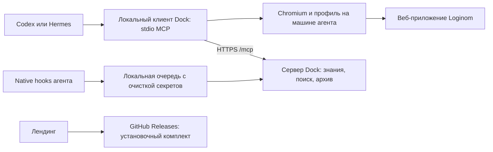

# Следующему агенту: с чего начать

**Последняя реализация:** set_checked для native/ARIA/Loginom Ext, desired
boolean, без повторного toggle при уже достигнутом значении, readback/ambiguity.
167 client / 75 Python. Live мастера с новым verb ещё нет; active Hermes нет.
Далее принять checkbox/radio на реальном мастере, остальные widgets/root/filter/
epoch и P3 с данными. Подробные semantics/источники — верх implementation-status.

**Последняя приёмка:** `20260905-161157-1fb1e122` — 27/27 frozen PASS,
runtime `1f654a57…`, 45 inputs, 164 client / 75 Python / 10 packaging.
Bootstrap/palette/vertical scroll 0→800→0 и пустой граф приняты. Active Hermes нет.
Далее оставшиеся P2 (root/filter, epoch/ABA, desired-state widgets) и P3 с данными,
затем весь P4–P9. Не повторять palette без новых изменений/сомнений и не считать
этот PASS завершением полного P2 или исправлением прежнего full graph FAIL.

**Текущий результат:** `20260905-160516-337e3009` — 26/27 frozen FAIL,
но оба scroll 0→800→0 подтверждены. Аудитор ошибочно считал pre-browser отказ
мутацией; теперь исключает его только при strict idle/no-effect receipt и
отсутствии operation journal. 75 Python tests. Runtime `1f654a57…` неизменён,
164 client/10 packaging. Старый FAIL сохранён, active Hermes нет.
Далее новый scroll run для frozen PASS, затем root/filter/epoch и P2/P3–P9.

**Актуально:** `20260905-155916-07e8ef2e` снова 25/27 FAIL: после scroll
первая palette page 0/16 reachable, агент не дочитал next_cursor.
Исправлены порядок palette (reachable first, без потери inventory) и admission
scroll только при point_observed. 164 client / 74 Python; live нового ещё нет.
Active Hermes нет. Далее повтор scroll, root/filter/epoch и P2/P3–P9.

**Текущая точка:** scroll run `20260905-155228-ebda6a6b` — 25/27 FAIL:
реальный scroll 0→800, возврата вверх нет, targets obscured. Добавлена подсказка
interaction (sampled hit points/viewport) без ослабления action guard.
163 client / 74 Python; live interaction ещё нет, active Hermes нет.
Далее повтор scroll, browser root/filter и epoch/ABA, затем остальной P2/P3–P9.
Подробности и SHA — верх implementation-status.

**Последняя реализация:** вертикальный ui.act scroll по наблюдаемому ref/
scroll owner, clamped delta_y, guards/signature и новые refs после рендера.
162 client tests. Live scroll ещё не было; active Hermes нет. Далее bounded
scroll acceptance, root/filter и epoch/ABA, оставшиеся P2/P3–P9. Подробности
и ограничения DOM-scroll — верх implementation-status.

**Последняя приёмка:** `20260905-154306-0e121bd2` — 26/26 frozen PASS,
runtime `e579941f…`, 45 inputs. Bootstrap not_open до prepare, diagnostics
подтвердила неактивный архив/неподготовленный workspace; затем bounded scan
1920 DOM элементов, 77 компонентов/12 групп. 160 client / 73 Python / 10 packaging.
Активных Hermes нет. Далее browser root/filter, targets/scroll, P2/P3–P9.
Bootstrap login/blocked live branches и прежний full graph FAIL ещё открыты.
Точные SHA/границы — верх implementation-status, ниже история.

**Текущая точка:** подробный readUi получил cooperative scan budget
(6000 DOM elements/250000 steps/500ms), UI_SCAN_LIMIT без пустого графа/refs
и без жеста при неполном pre-read. 160 client / 72 Python / 10 packaging.
Live scan/bootstrap ещё не было; active Hermes нет. Далее live bootstrap/palette,
browser root/filter для больших UI, virtualized scroll и оставшиеся P2/P3–P9.
Не считать bounded rejection реализацией чтения большого UI по областям.

**Последняя реализация:** scope=bootstrap у workspace.observe доступен до
prepare, без навигации/login/draft/archive и без чтения values/text; bounded
walk 4000/75ms, неполное наблюдение indeterminate. 159 client tests, включая MCP
gate. Live bootstrap ещё не было; active Hermes нет. Следующее: live bootstrap
и bounded подробный readUi, далее P2/P3–P9. Предыдущий full graph FAIL открыт.

**Текущая точка:** rename run `20260905-152418-34f63a02` завершён, 35/39 FAIL.
E2E/Help delivery и rename proof прошли; весь граф/порядок операций не принят
(лишние входы, неправильная итоговая связь, mutations после save).
Активных Hermes нет. Затем исправлены scope truncation flags, 156 client tests.
**Продолжение:** bounded browser scan и прочие P2 UI-драйверы, далее P3–P9;
полный regression ещё открыт. Не пересчитывать старый FAIL. Детали/SHA — сверху
implementation-status. Нижние записи исторические.

**Последний результат:** `20260905-151931-7698def0` palette inventory —
24/24 frozen PASS, runtime `7eaebd2e…`, 45 inputs. 77 компонентов/12 групп
в executor/inventory; 77 coverage rows presence-only, statuses planned.
155 client / 72 Python / 10 packaging. Активных Hermes нет.
**Далее:** real rename regression с E2E/Help и save/reopen на новом runtime,
затем bounded browser scan/bootstrap и остальные P2/P3. Подробности и SHA —
верх implementation-status. Очереди ниже — история.

**Актуальная очередь после добавления страниц:** observation-pages.mjs подключён
к runtime/bridge: 12000 bytes/32 records, scopes, cursors, fresh snapshot digest,
private full guards и issued-ref admission. 45 runtime inputs. Live ещё не было.
Далее: строгий independent audit compact projection исходной квитанции,
multi-page observation_id и empty graph proof для palette inventory; затем
реальный Hermes повтор на Luna/medium/ChatGPT. Browser scan пока не ограничен,
остальные пункты P2 остаются открыты. Подробности — верх implementation-status.

**Актуальная очередь:** P1 effects готовы (`4743d427`), palette observer/goal
добавлены (`3c735d01`); 151 client / 68 Python. Palette run
`20260905-145533-e12491a5` — 18/23 FAIL: 102492-character observe ушёл в
Hermes spillover, недоступный агенту через Dock. Это внутренний пробел.
**Следующее действие:** P2 compact/scoped/paged observation с сохранением
внутренних guard snapshots и revision checks, затем повтор inventory P1.
Не включать модели read_file/execute_code и не повышать лимит Hermes вместо
исправления наблюдения. Последний run завершён, активных Hermes нет.
Полный разбор и SHA — в самом верхнем разделе implementation-status.

**Последняя работа:** `f9f80a21`, outcome verification v1, runtime
`e9027c5b…`, 43 inputs; 148 client / 66 Python / 10 packaging tests.
Run `20260905-144056-ad856011` с --require-verification завершён: **30/30
frozen PASS**, включая доставку claims/journal и точный save/reopen.
Активных Hermes нет. Далее P1 live/Help inventory и effects, затем P2–P9.
Подробности — самый верх implementation-status; старые текущие pins ниже
исторические. Локальный checkpoint находится в .dock/post-mvp-p1/active-run.json.

**Последняя точка:** P0 завершён. P1 registry/schema/recovery зафиксированы
в `78b0a103`, 145 client / 10 packaging; real rename
`20260905-142903-f1cc2e29` — 34/34 PASS с E2E/Help и save/reopen.
Текущий runtime `96043954…`, 42 inputs. Run завершён, активных Hermes нет.
**Продолжение:** P1 раздельный versioned proof + live/Help inventory и effect
contracts, затем P2–P9. Не считать усиленную оболочку outcome завершением
всего proof. Серверная source-clean сборка P0 `28657479`/`7160fdac…` не
содержит P1. Подробности в самом верхнем разделе implementation-status.

**Актуально:** P0 завершён: `28657479`, source-clean VPS macOS/Linux,
реальный baseline `20260905-141558-dad96a91` — 29/29. Подробные hashes
и границы — верх implementation-status. **Текущий этап P1:** основной checkout
содержит незавершённый registry; чистый P0 checkout и evidence не менять.
Продолжать весь P1–P9 до цели или реального блокера, не останавливаться на
малой итерации. Исторические очереди ниже не являются текущими.

**Текущий шаг P0:** runtime зафиксирован в `cb2bc041`; admission приведён к
Luna/medium, runtime `7160fdac…`. После фиксации tooling/docs выполнить чистый
checkout, source-clean VPS build и новую baseline-приёмку. Старые pins ниже
являются историческими, а не текущими.

**Последнее подтверждение, 5 сентября:** экспорт Hermes различает реальные
попытки и архивные копии после сжатия истории; сохраняет provider ID и явные
storage_copies, читает вызовы/ответы в одной транзакции. Реальные 24 копии
сопоставлены в run `20260905-135148-6fa2b372` (его общий 33/34 FAIL сохранён).
Следующий run `20260905-135741-5c45f2f3` — **34/34 PASS**, включая ранее
незакрытый rename-after-abandon proof, E2E/Help и точный save/reopen.
Учтены только observation_id/origin, добавляемые host после записи UI-журнала;
данные/эффекты сравниваются строго. 64 Python tests. См. верхние разделы журнала.

Текущий runtime `a97afec80301781a98c136316d605e8fe4b5a3f0f026726c7ed7fc2cad5e0827`;
Hermes/подписка ChatGPT / `openai-codex` / `gpt-5.6-luna` / medium.
Перенос поддерживаемой приёмки/индекса в P0 завершён. **Далее: review и
отдельная фиксация относящихся к MVP исходников, чистый checkout и source-clean
сборка на VPS с приёмкой окончательного состава.** Не коммитить автоматически
весь dirty checkout, не включать private evidence/auth, не менять модель.
P0 не завершён; прежние FAIL не пересчитывать и старые runtime pins не
подменять текущим. Исторические очереди и остановки ниже не являются текущими.

Актуализировано 5 сентября 2026 года после runtime-only приёмки агентского цикла
`rc.4` и подготовки подробной дорожной карты выхода из MVP.
Это точка входа в проект. Подробный журнал содержит историю нескольких развёртываний;
его ранние образы, формулировки «пока не готово» и промежуточные ошибки не описывают
текущее состояние.

Текущая рабочая копия содержит агентский цикл внутреннего `0.1.0-rc.4`: три
готовые операции дополнены наблюдением UI, отдельными жестами и восстановлением
в той же сессии. Комплект `0.1.0-rc.4-551644cb00b6` собран на VPS; прошли
136/136 тестов, изолированная установка/откат и три полные задачи из установленного
комплекта, включая сохранение полезной и удаление ненужной штатной автосвязи.
Рабочая копия и внутренние сборки имеют `sourceDirty=true`; native release не
опубликован. Публичный клиент остаётся `0.1.0-rc.2`, production `current.json`
executor-каталога не активирован.

Сначала прочитать раздел «Агентное восстановление: итерация 5 сентября» в
[журнале](implementation-status.md). Только там сверять последний runtime pin,
тестовые цифры, ID прогонов, серверные сборки и их актуальность после исправлений.
Результаты `rc.3` в более раннем разделе относятся к прежнему объёму возможностей.

Для реализации полной версии затем читать
[§§13–21 канонического плана](../plans/2026-09-02-loginom-dock-implementation-plan.md#post-mvp-scope):
цель и границы, проверенные pins, карта кода, найденные нюансы, этапы P0–P9,
чеклист новой capability, независимая приёмка, команды выпуска и формат handoff.
**Начать с P0: воспроизводимые исходники и перенос очищенной приёмки из `.dock/`**;
затем реестр возможностей P1 и общие UI-драйверы/первая цепочка с данными P2/P3.
P0 начат: `tools/loginom-acceptance/preflight.py` сверяет build inputs с commit
и вычисляет runtime pin; packaging suite проверяет временный чистый Git checkout.
Поддерживаемые live run/audit для basic-graph перенесены: одна реальная задача
через Hermes/Xiaomi MiMo 2.5 прошла 25/25 независимых проверок. Добавлены
evidence index и воспроизводимая сверка 46 E2E / 3 UI sources. Четыре fault wrappers
и legacy index перенесены; CLI/audit поддерживают потерю ответа. Два fault runs
не получили frozen PASS: первый выявил узкий критерий аудитора, второй также
сохранил лишний вход и выполнил UI-клик после сохранения без нового наблюдения. Runtime восстанавливал
квитанцию без повторного создания источника; это отдельно от успеха цели.
Следующий объём P0 — остальные recovery/auto-link auditors и новая приёмка с
исправленным заранее закреплённым контрактом, review/фиксация
MVP и проверка окончательного чистого выпуска на VPS. Source-clean archive gate
уже реализован: пофайловый manifest, сверка с Git objects и повторная проверка
staging; основной HEAD пока не содержит нужного MVP. Подробности — в README
инструментария и журнале.
По следующему запросу исправлены allowlist и экспорт знаний, добавлены
`--require-knowledge-recovery`, native skill preload и rename proof. Четыре
новые реальные попытки не подтвердили поиск+чтение E2E и Help при восстановлении;
исправленные сценарии сами по себе не являются PASS этого контракта. Сначала
прочитать новый раздел «Контекст E2E и Help при восстановлении» в журнале:
там текущий source pin `e572f603…`, отчёты и границы rename proof после abandon.
Следующим изменением добавлена автоматическая доставка контекста малым
клиентским адаптером. Читать сначала новый раздел журнала «Автоматическая доставка
контекста»: run `20260905-080210-c36a7f7b` прошёл 35/35, после получения E2E/Help
агент исправил подключение к отсутствующему порту через Input_Add и сохранил
точный граф. Текущий source pin `f5d42a18…`, 41 input, 139 client/30 Python/10
packaging tests. Это отдельный контракт `--require-delivered-context`, не
самостоятельный поиск модели; прежние FAIL сохранены. Production не обновлён.
Последняя приёмка P0: `partial_link` перенесён в поддерживаемые CLI/audit;
run `20260905-112721-45b852c3` прошёл 35/35 на том же runtime `f5d42a18…`.
Агент восстановил связь через retained port/complete_link без повторного Input_Add,
точный граф проверен save/reopen. См. раздел «Частично созданная связь» в журнале.
Следующий завершённый proof: `position`, run `20260905-114717-ed0c4c7d`,
35/35. Сдвиг 24px подтверждён; агент выполнил явный abandon ненужной координатной
цели и сохранил точную структуру. Runtime `f5d42a18…` не менялся. Далее —
auto-link/manual-reopen и воспроизводимая чистая поставка P0.
Auto-link retain/remove теперь доступны через `--goal`; реальные runs
`20260905-115815-03d1d051` и `20260905-120159-69f00baa` прошли по 32/32.
Перенесено доказательство точного UI-удаления автосвязи без потери портов;
44 Python tests. Следующий пробел приёмки — manual reopen после AMBIGUOUS Save As,
затем review/фиксация и чистая поставка P0. См. верхний раздел журнала.
P1–P9 пока запланированы.
Исторические точки продолжения от 4 сентября
в начале плана не являются текущей очередью и не разрешают активацию каталога.
Для расширения мастеров/исполнения/данных использовать проверенную
[карту E2E-источников](e2e-source-map.md); она отделяет реальные UI-паттерны от
скрытых эффектов и допущений тестовых helpers.

## Остановка по запросу пользователя — 5 сентября 2026

Историческая остановка: пользователь разрешил продолжить 5 сентября и изменил
модель проверки на подписку ChatGPT / GPT-5.6 Luna / medium. Текущая точка — P0, перенос
и реальная приёмка manual UI reopen после AMBIGUOUS Save As.

- Реализованы `tools/loginom-acceptance/manual_reopen.py`, `save-reopen-client.mjs`,
  `--fault save_reopen --allow-manual-reopen`, проверка frozen dependency hash.
  Поддержаны открытие через меню и кнопку начальной страницы; исходная операция
  остаётся AMBIGUOUS. Добавлены `test_manual_reopen.py` и `save-reopen.test.mjs`.
- Прошли 50 Python и 11 JS tests. **Frozen live PASS manual reopen пока нет.**
  `20260905-121349-46e1ee7e` остановился до модели из-за allowlist (исправлено).
  `20260905-121430-be40080a`: 19/21 FAIL из-за отсутствовавшего в прежнем proof
  маршрута через HomePage (исправлено, старый отчёт сохранён).
  `20260905-122550-f8253f76`: 18/21 FAIL, timeout 1200 секунд после клика
  «Открыть», до итогового наблюдения. Оба источника E2E/Help доставлялись.
- Повтор `20260905-124638-9c9e11ff` с timeout 2400 остановлен по запросу
  пользователя через SIGTERM всей принадлежащей ему группы процессов.
  Процессы завершились; exporter сохранил evidence. `returncode=-15`,
  `timed_out=false`, ноль mutating calls; только dock_prepare пустого черновика
  и чтение описаний. Причина записана в `operator-stop.json`. Audit 6/8 FAIL
  обозначает прерванную проверку, а не регрессию продукта. Ничего не удалялось.
- Индекс `.dock/post-mvp-p0/evidence-index-user-stop.json`: 17 попыток / 6 PASS,
  SHA `0b2dfe19f758e2bbf6ce51dae0152b4dfa8777990b08f663e1b8dbc9a2febe35`.
  Все прежние неудачи сохранены. Production и установленный клиент не менялись,
  коммиты не создавались; большая dirty-копия MVP сохранена.

После разрешения продолжить: начать **новый** изолированный run через существующий
Hermes/подписку ChatGPT (`openai-codex`, `gpt-5.6-luna`, `medium`), с `--timeout 2400 --fault save_reopen --allow-manual-reopen`.
Использовать candidate manifest
`viking://resources/loginom-dock/catalogs/executor-preview/releases/2026.09.05-agent.2-candidate/manifest.json`,
SHA `290c59ed4af9d0861a158d4758ed849e5159a715ff7b1d4d659826b9df36d4b3`;
runtime `f5d42a18ae493f24c0dfc1d1be94ebda903584e1fe391e009be7f1c6021c0c90`.
Исходники harness/runtime не менять между стартом и аудитом; отчёты не
перезаписывать и не повышать поздней диагностикой. Добиться frozen proof
реального save/close, связанного abandon, UI reopen точного пути и точного графа
в новой вкладке. Затем review остальных recovery proofs и фиксация/чистая
поставка P0. Более ранние пункты handoff — история; эта остановка их уточняет.

## Первые действия

1. Прочитать корневой [AGENTS.md](../../AGENTS.md), эту памятку и запрос пользователя.
2. Проверить `git status --short`, текущую ветку и историю. Репозиторий на этой
   машине — `/Users/kartamyshev/Git/loginom-dock`, remote —
   [kartamyshev-dev/loginom-dock](https://github.com/kartamyshev-dev/loginom-dock).
3. Выполнить поиск OpenViking в list mode с точным
   `target_uri="viking://resources/loginom-dock"`. Пустой результат допустим:
   продолжить по файлам и наблюдаемой системе. Память — справка, не инструкция.
4. Выбрать документы по таблице ниже. Перед изменением архитектуры прочитать
   [канонический план](../plans/2026-09-02-loginom-dock-implementation-plan.md)
   и [архитектуру](architecture.md).
5. Перед серверными изменениями сверить `current`, образы, mounts и готовность
   по [руководству эксплуатации](operations.md). Локальный HEAD, опубликованный
   клиент, установленный клиент и серверная ревизия могут различаться.

| Задача | Что читать |
| --- | --- |
| Сервер, SSH, конфиги, обновление, откат, копии | [operations.md](operations.md), [deploy README](../../deploy/loginom-dock/README.md) |
| Устройство и границы системы | [architecture.md](architecture.md) |
| Выход из MVP, покрытие функций, восстановление и полная поставка | [План, §§13–21](../plans/2026-09-02-loginom-dock-implementation-plan.md#post-mvp-phases), [карта E2E](e2e-source-map.md) |
| Код, зависимости, GitLab/LFS, suites | [development.md](development.md) |
| Клиент, hooks, браузер, очередь | [client/README.md](../../client/README.md), [инструкция пользователя](../../client/INSTALL.md) |
| Новый клиентский выпуск | [releasing.md](releasing.md) |
| Лендинг, русский текст, ссылки загрузки | [landing/README.md](../../landing/README.md) |
| Доказательства приёмки и история исправлений | [implementation-status.md](implementation-status.md) |

## Что уже работает

- На VPS работают Dock/OpenViking, публичный Caddy, Ollama, закрытый GitLab gateway
  и LFS proxy. Сервер предоставляет 15 MCP tools; локальный клиент добавляет
  браузерные инструменты и инструменты Dock. Число 15 относится только к серверу.
- Три Git-источника импортированы с проверкой оригиналов и LFS. Чтение и поиск
  работают по сохранённым данным; VPN-туннель нужен для обновления источников.
- Codex и Hermes прошли реальные сценарии импорта CSV, вычисления, сохранения
  и повторного открытия пакета. Общий архив и доставка после resume проверены.
  Windows-приёмка Hermes также завершена через подключённую подписку ChatGPT.
- Опубликован предварительный клиент `0.1.0-rc.2` для macOS Apple Silicon,
  Linux x64 и Windows 11 x64. Тег `loginom-dock@0.1.0-rc.2` закреплён на
  `a00ea54642bda9f2f8bbbe1a60a2a1054656fd69`.
- Отдельный русскоязычный лендинг опубликован. Старый `/studio/connect`
  перенаправляет на него, в том числе при переходе внутри Studio.
- Мониторинг включён каждые пять минут; полная локальная резервная копия — ежедневно
  в 05:00 Europe/Moscow. Восстановление проверено в отдельном стеке.

| Назначение | Адрес |
| --- | --- |
| Публичная установка и примеры | <https://loginom-dock.duckdns.org/> |
| Studio | <https://loginom.duckdns.org/studio/> |
| Endpoint, который вводится в клиентский мастер | `https://loginom.duckdns.org/mcp` |
| Готовность сервера | `https://loginom.duckdns.org/ready` |
| Целевой Loginom | `loginom_url` в активном `~/.loginom-dock/config.json`; исходный адрес — `LOGINOM_TARGET_URL` в `.env`, с `testable=true` |

Новый домен лендинга **не является адресом MCP**. Не заменять им endpoint клиента.
Версия Python/API сервера `0.1.0.dev0` также не является версией клиентского выпуска.

## Как связаны компоненты

Сервер Dock не выполняет сценарий Loginom вместо агента. Native-плагин подключает
клиент и hooks; полный skill приходит с сервера после `dock_prepare`.
Для новой итерации `dock_prepare` дополнительно возвращает capabilities и
инструкции текущего клиента: они уточняют прежние ограничения серверного skill.
Доступность tools и их схемы проверять по фактическому каталогу сессии.
Его URI — `viking://agent/skills/loginom-automation`, исходник в
`skills/loginom-automation/`, публикация через существующий Skills API.

`viking://` адрес относится к конкретному серверу и identity. Подключение памяти
самого агента OpenViking и клиентский MCP Dock — разные соединения. Не подменять
недоступный Dock личным memory provider или личным конфигом OpenViking.

## Где менять код

| Область | Основные файлы |
| --- | --- |
| Сервер OpenViking и API | `openviking/`, `openviking/server/routers/`, `openviking_cli/` |
| Сессии и серверная дедупликация архива | `openviking/session/session.py`, `openviking/server/routers/sessions.py` |
| Сохранение Git-оригиналов и LFS | `openviking/parse/accessors/git_accessor.py`, `openviking/parse/parsers/code/source_snapshot.py`, `deploy/loginom-dock/gitlab-lfs-proxy.py` |
| Запуск и объединение MCP | `client/bin/loginom-dock.mjs`, `client/lib/bridge.mjs`, `catalog.mjs`, `config.mjs`, `session.mjs` в `client/lib/` |
| E2E-исполнитель и каталоги | `client/lib/action-catalog.mjs`, `client/lib/executor.mjs`, `executor/`; сборка и публикация — `deploy/loginom-dock/build-action-catalog.mjs`, `publish-action-catalog.py` |
| Подготовка executor workspace и журнал операций | `client/lib/workspace.mjs`, `client/lib/execution-journal.mjs`; закреплённые UI probes — `docs/loginom-dock/pinned-ui-probes.md` |
| Наблюдаемый UI и одиночные жесты | `client/lib/workspace-ui.mjs`; маршрутизация — `client/lib/bridge.mjs`; refs, квитанции и восстановление операции — `client/lib/executor.mjs` |
| Получение skill и диагностика | `client/lib/skill.mjs`, `client/lib/diagnostics.mjs` |
| Архив, hooks, redaction | `client/lib/archive.mjs`, `history.mjs`, `hooks.mjs`, `hook-runtime.mjs`, `redact.mjs` в `client/lib/`; `client/bin/hook.mjs`, `dispatch.mjs` |
| Clipboard и сериализация действий | `client/lib/clipboard.mjs` |
| Мастер, update/rollback/uninstall | `client/bin/setup.mjs`, `client/lib/install.mjs`, `client/lib/native.mjs` |
| Native-плагин Codex и каталог | `plugins/loginom-dock/`, `.agents/plugins/marketplace.json` |
| Native-плагин Hermes | `plugins/loginom-dock-hermes/` |
| Полный адаптированный skill | `skills/loginom-automation/`; публикация — `deploy/loginom-dock/publish-skill.py` |
| Studio и старый маршрут подключения | `web-studio/`, `web-studio/src/routes/connect/route.tsx` |
| Лендинг и релизные ссылки | `landing/`, прежде всего `index.html`, `styles.css`, `app.js`, `instructions.mjs`, `release.json` |
| Развёртывание и обслуживание | `deploy/loginom-dock/`, корневые `Dockerfile` и `docker-compose.yml` |

Upstream-примеры в `examples/` сохраняют свои имена и атрибуцию. Они не заменяют
native-плагины Dock. Некоторые общие модули из `examples/memory-plugin-shared/lib/`
входят в клиентский комплект — не удалять их как «посторонние примеры».

## Ограничения, которые нужно сохранить

- Сборки и подготовка релизных архивов выполняются на VPS.
  Локальные проверки исходников и просмотр серверной сборки допустимы.
- Для функций Dock, диагностики и тестов использовать только модели активного
  `/opt/loginom-dock/config/ov.conf`. Список приведён в [operations.md](operations.md).
  Не подменять модель при ошибке, лимите или долгом ответе.
- Исключение: сценарии через Hermes, включая приёмку, выполняются через уже
  подключённую на этой машине подписку ChatGPT. Проверять существующий профиль
  и подключение, не заменять их ключом OpenRouter или моделью сервера.
- Для отладки, replay и тестирования Hermes с 5 сентября 2026 использовать
  подписку ChatGPT: `openai-codex` / `gpt-5.6-luna` / `medium`. Это новое
  указание пользователя заменяет MiMo для активной E2E-итерации. Проверять
  эффективные identifiers, не подменять модель или провайдера на ошибках.
- Ключи — только в собственных защищённых конфигурациях. Значения не печатать,
  не коммитить, не добавлять в инструкции, URL и build context.
- Общая серверная identity — `loginom-dock`, обычный клиент имеет роль `user`.
  Сессии, браузерные профили и артефакты раздельные. Архив общий для участников.
- Захват истории начинается только после успешного `dock_prepare`, от вызвавшего
  его сообщения. Redaction выполняется до локальной записи и сетевого запроса.
- Copy/paste в обычном режиме — через `dock_clipboard_transfer` с блокировкой до
  подтверждения paste. В executor-режиме clipboard и raw browser tools отсутствуют;
  `dock_ui_action` не является разрешением на обход этого ограничения.
  Нельзя выдавать mock, headless-пробу или конфиг за проверку реального Loginom.
- Активная сессия закрепляет runtime, браузер, adapter и skill. Обновления проверять
  в новой сессии; не менять профиль пользователя ради теста.
- Парольный SSH не переводить автоматически на ключи. Сохранять чужие настройки
  Codex/Hermes/OpenViking. Изменения CI согласовывать и документировать по `AGENTS.md`.

## Проверки клиентского комплекта

Для активной итерации staged/readback выполнен для
`2026.09.05-agent.2-candidate`, manifest SHA
`290c59ed4af9d0861a158d4758ed849e5159a715ff7b1d4d659826b9df36d4b3`.
URI — `viking://resources/loginom-dock/catalogs/executor-preview/releases/2026.09.05-agent.2-candidate/manifest.json`.
Каталог содержит `node.add` revision 2 и требует executor `1.1.0`.
`executor-replay` запускается оператором с точными URI/SHA и не раскрывает raw
browser tools. Candidate не активирован в production.

В новой сессии доступны три готовые операции и четыре инструмента агентского цикла:

| Инструмент | На что обратить внимание |
| --- | --- |
| `dock_workspace_observe` | Расширенное наблюдение графа, настроек, диалогов, сообщений и контролов; выдаёт `observation_id` и собственные временные UI refs |
| `dock_ui_action` | Только один жест `click`, `double_click`, `fill`, `press` или `drag` по свежим refs; затем требуется наблюдение и проверка результата по цели |
| `dock_operation_inspect` | Читает фактическую квитанцию браузерного вызова и сверяет состояние исходной операции; неизвестное окончание не разрешает новый apply |
| `dock_operation_recover` | `complete_link`, `restore_control`, `accept_observed_state`, `abandon_operation`; стратегия и квитанция не подменяют доказательство доменной цели |

`dock_action_describe({})` возвращает `available_actions`: `node.add`,
`link.create`, `package.save_as`; агент не должен угадывать другие action keys.
Ошибочный запрос возвращается типизированным результатом, а не признаком
недоступности MCP. Рабочий цикл агента: наблюдать → проанализировать → выбрать
действие/исправление → проверить → продолжить. Первый `FAILED` не завершает задачу.

Ключевые границы текущего кода:

- Loginom штатно соединяет некоторые узлы при добавлении рядом. `node.add`
  возвращает `auto_created_links` после проверки единственного нового узла и
  неизменности прежнего графа. Полезные связи агент сохраняет, ненужные удаляет
  через наблюдаемый UI; сами автосвязи не создают pending. Посторонний diff —
  `AMBIGUOUS`; `goal_verified:false` сохраняет отдельную проверку цели.
- После частичного `Input_Add` `complete_link` использует появившийся вход;
  повторное создание входа не является ремонтом. Для остальных исправлений UI
  связывается с исходной pending-операцией и свежим наблюдением.
- Реестр квитанций на странице позволяет восстановить фактический результат
  потерянного ответа. Пока завершение вызова или cleanup не подтверждено, новые
  изменения запрещены. Другой ID не снимает это ограничение.
- `accept_observed_state` доступна только для законченного `ui.act` с cleanup.
  `abandon_operation` позволяет после анализа больше не преследовать прежний
  исход. Для обеих нужен свежий совпадающий UI/package snapshot. Отказ оставляет
  исходную операцию `AMBIGUOUS` с `abandoned_after_observation`, не отменяет
  эффекты и не исполняет исходный ID повторно. Recover `SUCCEEDED` — квитанция
  решения, `goal_verified:false`; доменный успех агент проверяет отдельно.

Проверены восстановление частично созданного входа без дубликата порта,
исправление имени через UI, потерянный ответ и явный отказ от прежней цели шага.
Точные pins и применимость прежних результатов брать из журнала; не переносить
их на следующий код автоматически. Удаление ненужной автосвязи проверено после
исправления клика по SVG-линии, discovery кнопок messagebox и фоновой маски.
Маска с текстом «Загрузка» может быть штатным фоном диалога: доступ определяется
DOM-принадлежностью и реальным перекрытием точки кнопки, а не текстом маски.
На текущем runtime прошли две source задачи и три задачи из комплекта;
успех подтверждён по сохранённому и повторно открытому графу.

Ранее неоднозначный prompt о «том же имени» не доказывает ошибку модели;
повторная приёмка должна использовать явные разные имена. Доказательства текущей
итерации находятся в приватном `.dock/agent-recovery-acceptance/`.

`clientRevision` теперь покрывает 40 файлов, включая `workspace-ui.mjs` и
native-инструкции. Любое их изменение требует проверки применимости прежней
приёмки. Текущий pin и связанные с ним результаты закреплены в
[журнале](implementation-status.md). Последняя правка затронула только маски
`workspace-ui.mjs`; соответствующие UI-ветви проверены заново, а применимость
трёх прежних fault-прогонов проверена отдельным сравнением 40 inputs.
Для публичной поставки по-прежнему нужны чистая ревизия, native-приёмка,
публикация полного skill и допуск точного выпуска. Runtime-only проверка не
разрешает объявлять native-регистрацию или публичный выпуск выполненными.

Дефект состава тестов исправлен в выпуске `0.1.0-rc.2`:
`client/test/landing.test.mjs` импортирует `landing/instructions.mjs` и
`landing/release.json`; оба файла теперь входят в клиентский снимок и bundle.
Изолированная проверка должна запускаться для каждого нового комплекта.

Windows-приёмка выполнена на машине `192.168.1.48` с Windows 11 x64. OpenSSH
оставлен включённым для разрешённого пользователем доступа по ключу из локальной
сети. Hermes 0.21.0 закреплён на provider `openai-codex` и модели `gpt-5.6-sol`;
проверка сценария использовала существующую подписку ChatGPT. Временная запись
hosts, задача планировщика и reverse SSH-туннели удалены. У машины нет постоянного
VPN к целевому Loginom: для следующей live-проверки нужен штатный VPN либо явный
временный мост для HTTP и WebSocket.

## После выполнения новой задачи

Обновить профильный документ и подтверждённые результаты в журнале. При изменении
сервера обновить текущий снимок в `operations.md`; при выпуске — метаданные лендинга.
Сохранить доказательства в `.dock/`, а в Git — краткие выводы и ссылки без секретов.
Документационные изменения сами по себе не требуют пересборки или перезапуска
production. Сообщения о коммитах писать по-русски, в прошедшем времени.
