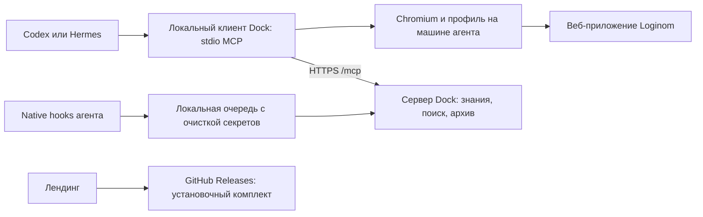

**Checkpoint:** UI type editor import изучен: selected td x-grid-cell-selected,
старый inner скрыт visibility:hidden; плавающий tbl;celleditor;cbx input/picker.
Single click по type cell достаточно, option click сразу apply+close. Type
integer→string меняет kind на discrete с задержкой, integer обратно kind не
восстанавливает. Явный kind(row3)→Непрерывный восстановил исходное состояние.
Manual Quantity Целый/Непрерывный, editor закрыт, TF-1 import format открыт,
Package1 не сохранён, Hermes нет. Далее typed type/kind binding + settled
post-read, без чтения hidden old value и без повторов после lost reply. Driver
ещё не реализован; runtime8ba79c28. Подробности сверху status, P3–P9 открыты.

**Checkpoint:** wizard.import_columns: до8 columns с name/label/type/kind/used,
cell_refs, missing/ambiguous fail-closed, complete/settings_applied=false. Roots
и narrow live совпали для5 полей. Format edit допускает обновление derived
columns с отдельным readback, не принимает schema. 295 client/118 Python/10 packaging PASS. UI действительно открыт в TF-1 «Настройка», source wizard;
раньше форма была hidden-offset, повторный open из другой вкладки давал lock.
Package1 не сохранён, Hermes нет. Далее native type-cell editor/refresh + import
schema verification и P3–P9. Подробности сверху status, audits не переписывать.

**Checkpoint:**091427/session4963 TERMINAL audit49/58FAIL frozen SHA
cd46b075d08102acf1786e56df5ddad533b0dbce286ae37c23a312b4ba563e58. Native null
\N length2/codepoints92,78 прошёл535ms; Amount=Quantity * UnitPrice прочитано,
но Loginom сообщил string result incompatible real. Обе связи есть. Далее
ImportTextFileParamsWizard/ColumnDefsTuning structured read + type edit/readback:
columns0..4, rows0name/1label/2type/3kind/4use. В manual типы верны; Hermes типы
ещё не доказаны. Delimiter меняет derived columns — учесть whole-wizard guard.
Audit также отметил duplicate reply Dock call181 и transfer navigation.
Manual import format открыт, Package1 не сохранён, Hermes нет. Без нового
разбора full replay не повторять. Детали сверху status, P3–P9 открыты.

**Checkpoint:**090018/session45339 TERMINAL audit50/58FAIL frozen SHA
909998224ec298a46605c28b3de82363400b8acd3eb2e221864a3df88ee0e4cb. CSV verify passed,
import не начат: full graph/dialogs scan UI_SCAN_LIMIT. New broad observe теперь
один раз fallback roots, честные scope/kind/trace, journal и paging; explicitroot/
cursor/roots без fallback. 293 client/118 Python/10 packaging PASS.
Manual Navigator global TreeText Сценарий click вернул workflow Package1/Модуль1;
Package1 не сохранён, draft import persistence не подтверждено, Hermes нет.
Далее full Luna/ChatGPT/medium + P3–P9. Старые audits не переписывать.

**Checkpoint:** import_format typed input теперь Tab + bounded readiness в том
же wizard/context, exact value, stable epoch/wizard, no masks, original input hit.
Live native delimiter tab → Dock ; → Dock null \N SUCCEEDED524ms (null length2).
Old same-start repro AMBIGUOUS167ms. 291 client/118 Python/10 packaging PASS.
Manual import format ;/\N/decimal dot, Package1 не сохранён, Hermes нет.
Далее full Luna/ChatGPT/medium agent.3 replay с нового commit; freeze после start,
audit083616 не переписывать. P3–P9 остаются открытыми.

**Checkpoint:** Hermes083616/session18465 TERMINAL, audit25/27FAIL frozen SHA
cc017b4a572d89ec2d3b5a8b7b9d49a4a0efdec67bec9e23e23d60ed70febbb8.
Null failure повторился, recovery SUCCEEDED. Реальная причина найдена для repro:
нужен исходный delimiter tab, а не уже semicolon. Native dropdown tab → Dock ;
→ null воспроизводит AMBIGUOUS167ms. Tab завершает delimiter input и запускает
preview; следующий input obscured, одного hit-test недостаточно. Далее import
commit + bounded same-wizard readiness/readback; до этого полный replay не повторять.
Manual import format ; / ? / decimal dot, Package1 не сохранён, Hermes нет.
Audit directory=None exception исправлен fail-closed + indexed storage type lookup;
old audit не переписывать. Подробности сверху status. P3–P9 открыты.

**Checkpoint:** folder selection UI-first: single click выделяет test при `/`,
doubleclick открывает `/test`. Runtime storage_entry читает row_ref/selected и
same-row folder type. Audit singleclick требует bound pre/post, неизменный
каталог/context, selected same row на пути destination; incomplete old080744
pre-read остаётся FAIL, audit не переписывать. 290 client/118 Python/10 packaging PASS.
Manual UI storage `/test`, Package1 не сохранён; Hermes не запущен. Далее полный
Luna/ChatGPT/medium agent.3 run, P3–P9 остаются открытыми.

**Checkpoint:** direct delimiter ;→null \N PASS198ms, input failure ещё не reproduced.
Исправлен projector metadata active_tab_ref/navigation_context и independent equality;
upload verifier выбирает exact file-ref page той же session вместо единственной page.
289 client /117 Python /10 packaging PASS, old audit080744 не переписан. Остался storage navigation gate:
два legitimate-looking single click colName_test перед doubleclick; нужны post-read
условия selection. Manual import format открыт с ;/\N/decimal dot, Package1 не
сохранён, Hermes нет. Далее navigation verifier + new full Luna run; P3–P9 открыт.

**Checkpoint:** exact direct Dock null ?→\N PASS247ms, первопричина Hermes input
ещё не найдена (перед ним raw delimiter ;). Исправлена отдельная recovery ошибка:
свежий снимок теперь того же roots/narrow/filter scope, fingerprint включает wizard.
Frozen failed recovery snapshots были roots/WizrdMCF; full сравнение ошибочно.
Tests roots/narrow + genuine changes; live recovery нового кода ещё нет. Manual
import format открыт с \N, Package1 не сохранён, active Hermes нет. Далее
raw delimiter→null repro + transfer evidence, новый full Luna run, P3–P9.
289 client /115 Python /10 packaging PASS.

**Checkpoint:** run20260906-080744-6a33af16 TERMINAL, session20705 завершён;
единственный audit47/58FAIL SHA d5a4e26f810bb84c4c85413a481b87aca1339735c1efb8406327190b42581629.
68calls, no timeout, source/runtime/harness unchanged. Active Hermes нет.
На null_marker typed input \N post-read остался ?, recovery state-changed loop.
Manual UI после terminal: обычный input ?→\N работает сразу и после Tab.
Current diagnostic import format открыт с \N; Package1 не сохранён. Далее exact
Dock input repro/focus/state diagnosis + 4 failed transfer gates; P3–P9 открыт.
Audit не повторять, подробности сверху status; private active-run checkpoint terminal.

**Checkpoint:** ReformColumns typed finish566ms→open1325ms→fresh native read
подтвердил сохранённые integer/Количество единиц/cache off/excluded false.
Package1 не сохранён, manual wizard открыт без editor. Full pipeline task теперь
явно требует конечные типы из unchanged expected.json и допускает нужный явный
conversion после Grouping с проверкой обоих выходов. Далее full Hermes agent.3
ChatGPT/Luna/medium test /test. После model_started runtime/harness не менять;
точный run/handle фиксируется в private checkpoint. Все P3–P9 gates остаются целью.

**Checkpoint:** apply_reform_column/cancel_reform_column проверяют 7 свойств
строки после одного click, cancel требует original row_ref. Live apply176ms,
cancel41ms PASS. Current label Количество единиц применена в wizard, node ещё
НЕ сохранён. Editor закрыт, ReformColumnsWizard открыт, node inactive, Package1
не сохранён; active Hermes нет. Далее node/persistence/settings/results gates,
Grouping и full P3–P9. 288 client /115 Python /10 packaging PASS. Детали сверху status.

**Checkpoint:** select_wizard_option поддерживает reform_column type с полным
7-property readback и selected row. Live integer→real→integer PASS42/48ms,
исходный тип восстановлен, Apply не выполнялся. Editor QuantitySum ОТКРЫТ,
dropdown закрыт, node inactive, Package1 не сохранён, Hermes нет. Далее typed
apply/cancel с row readback, persistence + full P3–P9. 287 client /115 Python /10 packaging PASS. Детали сверху status.

**Checkpoint:** reform_parameters читает 7 draft properties + selected row.
Live owner checkbox false→true→false подтверждён (input.checked всегда false).
Narrow read SUCCEEDED, QuantitySum integer, caching disabled, excluded=false.
Editor EditReformColumnDefForm ОТКРЫТ с исходными значениями; Apply не выполнялся.
Hermes нет, Package1 не сохранён. Далее typed type/apply/cancel с 7-property guard,
full settings/results и P3–P9. Подробности сверху implementation-status.
287 client /115 Python /10 packaging PASS.

**Checkpoint:** field_parameters stage + wizard.reform_columns читает type,
кэширование и exclusion, missing check=null. Live reopen Изменение подтвердил
QuantitySum integer и все поля включёнными/без cache. Node inactive после явного
«Да» деактивации. UI ReformColumnsWizard открыт, editor/preview закрыты; Package1
не сохранён, Hermes нет. Далее EditReformColumnDefForm read/write + independent
settings/results/full Luna acceptance, P3–P9. 286 client /115 Python /10 packaging PASS. Подробности сверху status.

**Checkpoint:** ручная цепь import→Сумма→Grouping→ReformColumns успешно выполнена.
В Grouping QuantitySum восстановлен как real с source Quantity|Сумма. Отдельный
ReformColumns преобразует его в integer; после Done auto label узла Изменение.
Быстрый просмотр Изменение открыт: Север52/2/5, Юг10/2/4, Запад0/2/1
(AmountSum/RowCount/QuantitySum); header types Float/Integer/Integer, Region String.
Package1 НЕ сохранён; active Hermes нет. Ручное подтверждение не закрывает P3 gates.
Далее runtime ReformColumnsWizard/EditReformColumnDefForm, correlated settings/results,
full Luna acceptance + P3–P9. Подробный UI маршрут сверху implementation-status.

**Checkpoint:** поддержан DerivedDataSourceMappingEngineOutputPortWizard;
output_columns.source читает rendered_source label/type либо explicit unmapped,
identity_verified=false. Live QuantitySum source unmapped, остальные 4 source
показаны. Node owner observed, port context unobserved. 285 client /115 Python /10 packaging PASS.
UI не изменён: node mapping открыт, dropdown закрыт, Package1 не сохранён.
Active Hermes нет. Далее integer conversion/mapping identity, Grouping и full P3–P9.

**Checkpoint:** исправлено open_wizard для formatted graph key: exact native
breadcrumb tid вместо сравнения с display label. Live Grouping SUCCEEDED1063ms;
284 client /115 Python /10 packaging PASS. Active Hermes нет.
ВАЖНО: после port Done + node reopen Next обнаружена mapping page
DerivedDataSourceMappingEngineOutputPortWizard (пока не поддержана runtime).
QuantitySum integer без источника; автосинхронизация добавила Quantity real с
Quantity|Сумма. Help запрещает mapping real→integer, потребуется явное
преобразование типа, fixture не ослаблять. UI оставлен на этой node mapping page,
source dropdown закрыт Escape. Package1 не сохранён. Детали сверху status.
Далее mapping/source evidence + корректная цепочка преобразования, full P3–P9.

**Checkpoint:** wizard.port_context разделяет node/port по native breadcrumb
chain; live narrow read observed для output port узла Quantity, Сумма по Region,
node owner unobserved. opening_verified=false, graph-port index и lifecycle ещё
не подтверждены. Apply/cancel сверяют неизменность port_context. 284 client /
115 Python /10 packaging PASS. Active Hermes нет. UI прежний: output mapping открыт, последняя
label QuantitySum не сохранена на уровне порта, Package1 не сохранён. Далее port
open/finish/readback, Grouping, full P3–P9; соблюдать UI-first правило проекта.

**Checkpoint:** apply_output_column/cancel_output_column проверяют 5 свойств
selected row после одного click; cancel также original row_ref. Live apply181ms,
cancel51ms PASS. Output row теперь включает data_kind/usage/selected.
Current output mapping ОТКРЫТ, field editor закрыт. QuantitySum label теперь
QuantitySum применена в мастере, сам порт после смены label ещё НЕ сохранён.
283 client /115 Python /10 packaging PASS. Active Hermes нет. Далее port identity/lifecycle/readback + Grouping и full P3–P9.

**Checkpoint:** select_wizard_option поддерживает тип EditColumnDefForm с
original input/form/selected row, full 5-property draft readback и modal mask guard.
Live integer→real→integer SUCCEEDED43/51ms, один клик каждый, побочных изменений нет.
Current editor QuantitySum ОТКРЫТ, dropdown закрыт, исходные значения восстановлены.
282 client /115 Python /10 packaging PASS. Active Hermes нет. Далее typed apply/cancel + port identity/lifecycle, Grouping,
full P3–P9; node/package settings этим выбором не подтверждаются.

**Checkpoint:** column_parameters читает пять свойств EditColumnDefForm;
set_wizard_field name/label связан с selected output row, focus-checked Tab и
exact readback всех остальных свойств. При missing/ambiguous поле ввода не выдаётся.
Live name/label roundtrips PASS, исходные QuantitySum / Quantity|Сумма восстановлены.
Type/usage/kind read-only, typed apply/cancel ещё нет. 282 client /115 Python /10 packaging PASS. Active Hermes нет.
Current EditColumnDefForm QuantitySum ОТКРЫТ без изменений, output mapping под ним.
Далее dropdown/apply/cancel + port lifecycle, Grouping drivers, full P3–P9.

**Checkpoint:** output_columns readback связывает rendered name/label/type одной
строки socket mapping, без summary duplicates, completeness/applied остаются false.
Direct UI EditColumnDefForm: QuantitySum integer (исходный sum был real), AmountSum
real, RowCount integer; Region string. Port Done→reopen→native read подтвердил поля.
Порт сохранён, пакет Package1 НЕ сохранён. Output mapping ОТКРЫТ, editor закрыт.
281 client /115 Python /10 packaging PASS. Active Hermes нет.
Далее typed field editor + port binding/lifecycle и Grouping drivers; P3–P9 открыты.

**Checkpoint:** direct Grouping UI: Region key, Quantity/Amount sums, special0
count. Summary rows duplicate real field tids; FactorEditDialog uses owner checked
class, not hidden input.checked. Saved node Quantity, Сумма по Region via typed
finish660ms. Next skips hidden mapping; working path output-port context ConfigurePort.
Current UI DerivedDataSourceOutputSocketWizard OPEN, columns Region/Quantity/Amount/Count
not renamed yet. Runtime recognizes output_mapping; port must not count as node
owner (require immediate workflow parent). Live fixed owner unobserved.
280 client /115 Python /10 packaging PASS. Active Hermes нет.
Далее output naming + Grouping drivers/readback, full Luna/ChatGPT/medium acceptance.
Пакет диагностический Package1 не сохранён; full P3–P9 остаётся целью.

**Checkpoint:** settings_evidence.py связывает immutable call/reply receipts
Calculator baseline→step→finish→body→open→fresh readback, без посторонних mutations.
data_pipeline выводит settings_roundtrip_diagnostics, scope calculator_node_only;
семь domain gates НЕ закрыты, package persistence false. Freeze включает новый файл.
279 client /115 Python /10 packaging PASS; полная synthetic chain покрыта,
live Hermes acceptance нет. Старые audit не переписаны. Active Hermes нет.
Далее изучить Grouping/mapping UI и full Luna/ChatGPT/medium acceptance agent.3;
диагностический Calculator Сумма открыт. Полный P3–P9 остаётся целью.

**Checkpoint:** finish_wizard читает future label/mode, делает один Done click,
подтверждает прежний workflow и expected graph node; требует reopen/readback.
Live finish554ms → manual body selection → typed open1085ms → narrow read
Amount/Сумма/Вещественный, Quantity * UnitPrice full_text_verified.
279 client /110 Python /10 packaging PASS. Active Hermes нет; Calculator открыт.
Далее независимые correlated settings verifiers + Grouping/results и P3–P9.

**Checkpoint:** open_wizard выполняет один observed settings click, проверяет
исходный tab ref + workflow/package/path и owner node; trace wizard_open_verified.
Live SUCCEEDED1091ms Сумма. Подпись tab меняется Сценарий→Настройка, поэтому
для перехода проверяется incarnation вкладки; замена tab отклоняется.
278 client /110 Python /10 packaging PASS. Active Hermes нет. Calculator Сумма открыт, ExprDataEditForm закрыт.
Далее typed wizard apply/readback/reopen, независимые domain gates и P3–P9.

**Checkpoint:** wizard.owner_context читает bounded breadcrumbs текущей вкладки;
opening_verified=false до typed opening receipt. Live manual Done переименовал
AmountAmount→Сумма; graph ready позже wizard close. Body Сумма→Setting reopen
подтвердил Amount/Сумма/Вещественный, narrow owner_context observed.
277 client /110 Python /10 packaging PASS.
Далее typed node→wizard open, применение/readback и domain proofs P3–P9.
Active Hermes нет; Calculator открыт, ExprDataEditForm закрыт. Детали сверху status.

**Checkpoint:** type_label выбирается через existing select_wizard_option.
Live Вещественный→Целый→Вещественный SUCCEEDED58/64ms; Amount/Сумма неизменны.
Floating option принадлежит foreground параметрам при background mask мастера;
post-read из wizard после закрытия boundlist. 276 client /110 Python /10 packaging PASS.
Далее node/wizard binding, apply/reopen и domain proofs P3–P9. Active Hermes нет.
Диагностический ExprDataEditForm открыт, тип Вещественный, список закрыт.

**Checkpoint:** cancel_expression_parameters проверяет прежнюю selected row
(name/label/type + row_ref), а не draft. Live cancel SUCCEEDED67ms, reopen Сумма.
275 client /110 Python /10 packaging PASS. Далее тип через observed cbxDataType
boundlist и original-input readback; список изучен live (6 типов), закрыт.
Проверить post-read исчезающего boundlist у typed combo. Active Hermes нет;
форма параметров Amount/Сумма/Вещественный открыта; полный P3–P9 остаётся целью.

**Checkpoint:** apply_expression_parameters выполняет один observed btnApply,
после закрытия внешнего окна читает исходный wizard root, ждёт row + masks,
сверяет name/label/type. Новое expression_selection по selected table/type icon.
Live modified apply SUCCEEDED198ms; reopen показал Amount/Сумма/Вещественный.
275 client /110 Python /10 packaging PASS. Это НЕ node/package save или Hermes
acceptance. Далее cancel/type/node binding и полный P3–P9. Active Hermes нет;
диагностический ExprDataEditForm остаётся открытым. Детали сверху status.

**Checkpoint:** set_wizard_field теперь поддерживает expression_parameter
name/label с текущими form/wizard/selected row/input refs и exact draft readback.
Live обнаружен deferred linked label update: после keyboard input добавлен
focus-checked Tab; live name roundtrip AmountProbe/Amount прошёл, draft Amount.
274 client /110 Python /10 packaging PASS. Далее params apply/cancel с row/type
readback/reopen, затем wizard/node binding и P3–P9. Active Hermes нет.
Диагностическая ExprDataEditForm остаётся открытой; applied_verified=false.

**Checkpoint:** run041246-c86bd419 terminal, session12618 закрыт,48/58 FAIL,
49 API calls, upstream TTFB120s timeout. Graph priority автономно ещё не принят.
Codex напрямую настроил/выполнил Calculator:6 ожидаемых сумм, внутреннее Amount,
формула сохранена; метка после fill удвоилась и исправлена keyboard/readback.
Повторное открытие active узла требует deactivation confirmation; no tid здесь
значит «Да, больше не спрашивать». Params dialog sibling мастера, не descendant.
Добавлен bounded wizard.expression_parameters draft readback;273/110/10 PASS,
live narrow read Amount/Amount/Вещественный. Далее bound set/apply/readback,
потом полный P3–P9. Active Hermes нет; direct UI оставлен в ExprDataEditForm.

**Checkpoint:** graph_node metadata связывает body/label/settings с видимым
именованным узлом; first-page priority settings→body→label перед Vertex.
Прямой live body click показал Setting; label click этого не доказал.
272 client /110 Python /10 packaging PASS. Далее новый Hermes full data-pipeline
на ChatGPT/Luna/medium, agent.3 URI/SHA, test и /test. Проверить monitor checkpoint
перед запуском: в продолжении может быть запущен run. P3–P9 открыты.

**Checkpoint:** run035739-62c8e272 terminal, session17304 закрыт,50/58 FAIL,
48 API calls Luna/ChatGPT/medium. Последний отказ: невыданный ref417; первая
graph page перегружена Graph;Vertex, actual nodes дальше. Далее улучшить
node→observed control и graph ordering после source/live проверки, не менять guard.
Codex отдельно прошёл import apply/reopen: auto rename узла по CSV filename,
асинхронное заполнение filename, сохранённые форматы; дробные preview значения
восстановились лишь после RefreshAll. Причина последнего ещё неизвестна.
Диагностический браузер оставлен в format wizard. Active Hermes нет; P3–P9 открыты.
Подробности и frozen audit сверху implementation-status.md.

**Правило пользователя от 6 сентября:** сначала Codex самостоятельно изучает
нужный Loginom Web UI и формирует подход; при повторных ошибках Hermes возвращается
в UI и диагностирует причину до нового неизменённого прогона. Сверять E2E/Help;
ручная диагностика отдельно от Hermes acceptance (ChatGPT/Luna/medium).
Каноническое правило: AGENTS.md и §18 плана выхода из MVP.

**Checkpoint:** run033638-57049220 terminal, session15644 закрыт,49/58 frozen FAIL,
56 API calls Luna/ChatGPT/medium. По разрешению пользователя Codex напрямую
разобрал Loginom UI: navigation TreeText/TreeExpander пропускались observer-ом,
после click закрытие панели давало UI_ROOT_STALE. Исправлены discovery/controls
и post-gesture roots rediscovery (не typed verification/preconditions).
Прямая live capability проверка SUCCEEDED;271 client /110 Python /10 packaging PASS.
Далее автономная Hermes acceptance с agent.3 /test/packages, test, /test,
ChatGPT subscription/Luna/medium. Active Hermes нет. Full P3–P9 открыты.

**Checkpoint:** новый2026.09.06-agent.3-candidate собран НА VPS и staged/readback.
URI viking://resources/loginom-dock/catalogs/executor-preview/releases/2026.09.06-agent.3-candidate/manifest.json
SHA007465bf4d8fee5f238ef790db4584313d61373d27f92715f01388edfe413ae6.
Save revision2 разрешает /test/packages; production не активирован.
Следующий полный Hermes run — только эти URI/SHA, ChatGPT subscription/Luna/medium,
explicit test и /test. Stage не доказывает live save/reopen; cursor fix/P3–P9 открыты.
Перед возобновлением проверить .dock/post-mvp-p0/monitor-checkpoint.json и живой
handle: в текущем продолжении может быть запущен новый run после этого checkpoint.

**Checkpoint:** run031541-528cd48f terminal, session89188 закрыт,50/58 FAIL,
64 API calls. Save_as /test/packages отклонён: старый catalog allowed_roots
только /user/data/packages. Сборщик теперь принимает --package-root, требует
новый --version и bump save revision;269 client /110 Python /10 packaging PASS. Далее VPS
build/stage/readback нового2026.09.06-agent.3-candidate с /test/packages, затем
полный Luna/ChatGPT/medium run с НОВЫМ URI/SHA. Не обходить roots guard.
Cursor fix live ещё не принят; active Hermes нет; полный P3–P9 открыт.

**Checkpoint:** run030443-0696fd47 terminal, session52276 закрыт,51/58 FAIL,
42 API calls. Calculator не достигнут: call91 на вкладку сценария отклонён
из-за перекрытия при нормальной геометрии. Cursor fix live ещё не принят.
Добавлено bounded interaction.covering без текста/значений/action refs;
267 client /110 Python /10 packaging PASS. Далее полный Luna/ChatGPT/medium run, проверить
перекрывающий слой и cursor fix; весь P3–P9 открыт. Active Hermes/browser нет.

**Checkpoint:** run024410-296ed587 terminal, session71725 закрыт,49/58 FAIL,
127 API calls. В пяти Calculator epoch refusals только cursor_style delta9–13.
Добавлено узкое исключение visibility blink для owned CodeMirror-cursors со
сравнением old/current styles; geometry/ABA/другие mutations сохраняют guard.
Telemetry counters больше не меняют paging digest.266 client /110 Python /10 packaging PASS.
Далее новый полный Luna/ChatGPT/medium run; node/apply/results и P3–P9 открыты.
Active Hermes/browser нет; детали и ссылки на CodeMirror source сверху status.

**Checkpoint:** run022803-33baaab3 terminal, session72000 закрыт, 50/58 FAIL.
35 API calls; upstream Codex stream TTFB timeout120s, usage failed=true.
Calculator не достигнут; mutation_counts работают на графе, причина epoch ещё
не установлена. Далее повтор того же полного goal на ChatGPT subscription /
Luna/medium без fallback; полный P3–P9 открыт. Active Hermes/browser нет.

**Checkpoint:** run021403-9b23c08d terminal, 50/58 frozen FAIL, 91 API calls,
session74333 закрыт. Live literal delimiter/null/decimal readback и expression
'Quantity * UnitPrice' в Expr1 подтверждены; select_wizard_option не вызывался.
Далее повторные UI_EPOCH_CHANGED при одинаковом видимом редакторе. Добавлены
bounded scan.mutation_counts без ослабления guard; 263 client /110 Python /10 packaging PASS.
Следующий run на ChatGPT subscription/Luna/medium должен установить типы
изменений. Node binding/apply/results и полный P3–P9 открыты; active Hermes нет.

**Checkpoint:** select_wizard_option связывает наблюдаемый пункт exact E2E
boundlist с исходным input и проверяет подпись после одного click; picker/root
доступны для раскрытия и узкого чтения списка. Native maxlength проверяется
перед set_wizard_field. 261 client /110 Python /10 packaging PASS, live ещё не запускался.
Далее полный data-pipeline на ChatGPT subscription/Luna/medium; после combo
остаются node binding/apply и полный P3–P9. Active Hermes/browser нет.

**Checkpoint:** run 015813-875f450b terminal, 49/58 frozen FAIL, 80 API calls;
session5853 закрыт. Live wizard_step file→format подтверждён (reply155).
set_wizard_field получил название пункта 'Точка с запятой', UI оставил 'Т',
exact readback корректно дал AMBIGUOUS (reply163). Далее реализовать observed
combo option selection и native input limits; не печатать название пункта как
разделитель. После этого node binding/apply и полный P3–P9. Модель остаётся
ChatGPT subscription/Luna/medium. Active Hermes/browser нет; детали сверху status.

**Checkpoint:** wizard_step (Next/Previous ref + expected_stage) подтверждает
переход в том же wizard root после одного click, с bounded wait и AMBIGUOUS при
неподтверждённом результате. 256 client /110 Python /10 packaging PASS. Applied/syntax proof
нет; btnDone/Execute/Close отдельны. Далее node/settings binding и apply/cancel
с readback, затем полный data-pipeline. Hermes ChatGPT subscription/Luna/medium;
active Hermes/browser нет, полный P3–P9 открыт. Детали сверху status.

**Checkpoint:** set_wizard_field подключён через dock_ui_action и существующий
receipt/pending: текущий import-format owner/root, исходные значения, focus,
keyboard и точный draft readback. 252 client /110 Python /10 packaging PASS. Не доказывает
node ownership/apply; live ещё не запускался. Следующий шаг — wizard lifecycle,
node/settings binding и applied readback, затем полный data-pipeline на ChatGPT
subscription/Luna/medium. Active Hermes/browser нет; полный P3–P9 открыт.

**Checkpoint:** добавлено bounded draft-чтение четырёх полей формата импорта
в wizard.settings, без applied proof. 248 client /110 Python /10 packaging PASS; live пока
не запускался. Следующий шаг: typed set/lifecycle с identity/readback через
существующий executor. Hermes — ChatGPT subscription/Luna/medium по последнему
указанию пользователя. Active Hermes/browser нет; полный P3–P9 открыт.

**Checkpoint:** Luna run 013610-e4e2d82e terminal, 50/58 frozen FAIL, 41 API
calls; session 63819 закрыт. Последний отказ — неверная пара ref/observation_id.
Добавлена подсказка только по действительно выданным refs, без alias/автодействия;
246 client /110 Python /10 packaging PASS. Далее P3 typed wizard inspect/set/next/apply/cancel
и applied readback через существующий executor, не очередной неизменённый
generic replay. Модель ChatGPT subscription/Luna/medium. Active Hermes/browser
нет; полный P3–P9 открыт. Точные evidence/ограничения сверху status.

**Checkpoint:** пользователь вернул дальнейшую работу на ChatGPT subscription /
openai-codex /gpt-5.6-luna /medium. Xiaomi subscription test завершён: run
010130-5f13962b, 47/58 FAIL, 114 API calls, reached text_import_file; session38171
terminal. Последний отказ был operation_id вместо observation_id — добавлена
точная подсказка без alias/обхода issued refs; 245 client /110 Python /10 packaging
PASS. Далее полный data-pipeline с --model-profile chatgpt-luna. Active Hermes/
browser нет; P3–P9 остаются целью. Подробности и pins сверху status.

**Checkpoint Xiaomi:** пользователь уточнил подписку. Первый run 005734-91a132d6
terminal 18/23 FAIL до tools: ключ отправлен на metered endpoint, 401.
Исправлен launcher: base_url из существующей Xiaomi credential_pool entry
source=env:XIAOMI_API_KEY + key из Hermes .env, no fallback. Следующий полный
run с --model-profile xiaomi-mimo должен проверить именно подписку. Runtime
клиента не менялся после 0b7e385d. 110 Python PASS; full P3–P9 не завершён.

**Checkpoint:** по явному запросу пользователя 6 сентября следующая полная
P3 проверка выполняется с --model-profile xiaomi-mimo (xiaomi/mimo-v2.5/medium),
существующий Hermes key, no fallback. Default Luna сохранён. Launcher/auditor
профиля готовы, 109 Python PASS. Luna run 004205-b5f4f1d3 terminal 50/58 FAIL,
107 API calls; session 1629 закрыт. Далее запустить тот же data-pipeline goal на
Xiaomi и проверить terminal evidence. Клиент не менялся после 0b7e385d; P3–P9
остаются полной целью. Детали/границы сверху status.

**Checkpoint P3:** run 20260906-002935-fc60ced5 terminal, 50/58 frozen FAIL.
Live replace_expression → exact Quantity * UnitPrice в Expr1 подтверждён,
но import/settings/syntax/Amount/results ещё нет. Wizard root read сам по себе
не помог: btnExprEdit/Next были за первой страницей. Поднят приоритет lifecycle,
Calculator edit/add/mode/editor/name rows и полей; 243 client /107 Python /10 packaging PASS.
Transfer audit правильно отклонил случайный click admin до test; не ослаблять.
Далее новый полный run, начиная с импорта, и оставшиеся P3–P9. Active Hermes/
browser нет, session 63618 terminal; точные pins/доказательства сверху status.

**Checkpoint P3:** run 20260906-001652-2b44f209 terminal, 49/58 frozen FAIL,
остановился на форматах импорта после stale pages/refs. Transfer tools success,
но strict audit не поддержал directory page offset 86; исправлен для будущих
runs (старый FAIL не пересчитан). 107 Python /242 client /10 packaging PASS; root discovery
теперь выдаёт wizard первым, error hint/goal направляют в fresh narrow read.
Калькулятор document/keyboard в live ещё не проверен. Далее новый полный
run data-pipeline и оставшиеся domain gates/P3–P9. Active Hermes/browser нет,
session 96624 terminal. Точные pins и ограничения сверху status.

**Checkpoint P3 (6 сентября):** replace_expression подключён через существующий
UI receipt. Exact selected field/expression mode/writable CodeMirror document,
полный bounded LF read, keyboard replacement, focus/identity guards и exact
readback. Не подтверждает syntax/apply/save. 240 full client +61 targeted /
106 Python /10 packaging PASS. API/keyboard в живом Loginom ещё не проверены.
Следующий шаг — новый полный data-pipeline run; затем domain/execution/results
и весь P3–P9. Перед запуском active Hermes/browser нет. Детали сверху status.

**Checkpoint P3 (6 сентября):** calculator_editor observation показывает режим
expression/javascript и bounded rendered_lines; не подтверждает полный текст,
синтаксис или сохранение. E2E helper сам предупреждает о ненадёжном empty/
multiline readback; его нельзя переносить как acceptance proof. Generic gestures
для cmpExpression wrapper/children закрыты до typed driver. 234 full client +
55 targeted /106 Python /10 packaging PASS; live не запускался. Далее typed
write/readback/selected field, execution/results и полный data-pipeline. Семь
domain gates открыты, цель весь P3–P9. Active Hermes/browser нет. Детали сверху status.

**Текущий checkpoint P3 (6 сентября):** добавлен rendered_results.py — независимый
comparator видимых typed cells с Decimal/явной локалью, null/empty и сохранением
дубликатов. Встроен в diagnostic data-pipeline и frozen checks; 106 Python PASS.
Не подтверждает full result: format/row coverage/execution/node ownership ещё
не доказаны, семь domain gates остаются missing. Runtime не менялся после
предыдущих 231 client /10 packaging. Следующий шаг — expression editor contract
и execution/result evidence, затем новая полная live проверка. Active Hermes/
browser нет; точные ограничения сверху status, цель весь P3–P9 сохранена.

**Текущий checkpoint P3:** run 233444-3cb9795c terminal, 47/58 frozen FAIL;
live wizard title/stage подтверждены, импорт дошёл до Done/графа, остальная
цепочка не выполнена. Исправлен strict auditor whitelist для wizard (старый
FAIL не переоценён), добавлен output_mapping. В table_cells введены data_column
типы и data_cell field/row/raw display/null-marker metadata, bounded/redacted.
231 client /98 Python /10 packaging PASS, live result acceptance ещё нет. Нужны strict typed
result/execution/formula contracts и семь domain verifiers, затем новый полный
data-pipeline run. Quick preview округляет; exact numeric proof требует Table
с проверенным форматированием. Hermes ChatGPT/Luna/medium, explicit test,/test.
Active Hermes/browser нет. Точные pins/ограничения сверху status.

**Текущий checkpoint P3:** полный run 231342-cb9aaa6c закончен, 50/58 frozen FAIL.
Transfer подтверждён в полном goal, три узла созданы, настройки/результаты ещё не
приняты. Добавлены wizard title/stage/lifecycle button states в observe/root/pages
и source-backed подсказка click Setting. Input mapping — возможный шаг мастера,
не доказательство чужого узла. 228 client /98 Python /10 packaging PASS.
Следующий run data-pipeline: можно 240 turns/3600s, Hermes ChatGPT/Luna/medium,
test,/test; проверить metadata живого мастера, затем expression/result/execution
contracts и весь P3–P9. Все семь domain verifiers пока missing/FAIL. Active
Hermes/browser нет; точные pins и границы сверху status.

**Текущий P3:** runnable diagnostic goal data-pipeline запрашивает полный сценарий,
но семь независимых domain verifiers ещё открыты, P3 PASS пока невозможен.
Первый run 230333-1c9cfc15 (24/32 FAIL) не отправил CSV: typo grant → повторный
prepare сбросил readiness. Исправлены public artifact re-read через describe /
отказ и запрет повторного prepare до побочных эффектов. Client 225 /Python 98
PASS. Следующий запуск — data-pipeline, затем реальные wizard/result gaps.
Точные pins/ограничения сверху status. Предыдущий transfer-only PASS ниже.

**Последний checkpoint P3:** 20260905-225713-f00430f8 file-upload-verify,
48/48 frozen PASS. Runtime 333d7059…; harness ec826a24; audit 3a5bfbea….
Hermes ChatGPT/Luna/medium, test,/test. Один upload/download, host SHA/size,
cleanup и durable completion receipts: original upload SUCCEEDED/resolved,
upload_completion_verified=true. Полный client 223 PASS, Python 91 PASS.
Точные pins и границы сверху status. Следующий шаг: CSV import → calculator →
group → typed results → save/reopen/reexecute; reject/conflict, download budget
и остальной P3–P9 открыты. Старые записи ниже — история прежних реализаций.
Активного Hermes/browser нет. Production/public rc2 не менялись.

**Последняя live проверка P3:** 20260905-222924-99da5577 file-upload-verify,
46/46 frozen PASS. Audit SHA de9b6307…; runtime 296dd7aa…; harness de1364fa.
Mac/Hermes/ChatGPT/Luna/medium, test, /test. В ОДНОЙ сессии один upload, точная
строка CSV, download и host SHA/size совпали: 230 bytes, f628434c…; исходная
операция пока остаётся pending по текущей реализации. Это реальный server-copy
proof, но НЕ полная P3 приёмка. Далее завершать transfer по подтверждённому
browser completion + postcondition destination bytes/digest/size (см. effect
contract), чтобы продолжить pipeline; учитывать late effects/cleanup, не снимать
guard только по строке файла. Reject/conflict и download budget ещё открыты.
Затем весь P3–P9. 91 Python PASS. Active Hermes/browser нет; точные SHA в status.

**Последняя P3 реализация:** dock_artifact_verify подключён в candidate runtime.
Original upload ID + new verification ID + delivered observation/file_ref →
assertIssued/exact CSV → stageDownload → browserReceipt → host SHA/size. Native
raw download_completed и host download_verified разделены. Repeat ID не скачивает
заново; lost reply восстанавливается inspect(original upload) и hash уже сохранённой
копии. Native copy proof добавляется в server_copy_verification; original upload
остаётся AMBIGUOUS/pending, upload_completion_verified=false. 219 client /10
packaging PASS. Live download+SHA ещё НЕ запускался. Далее новый harness goal /
independent auditor для upload→verify в одной Hermes сессии; экспорт должен
поддержать dock_artifact_verify (нынешний probe его не разрешает). Потом server
completion/budget/reject и полный P3–P9. Active browser/Hermes нет.

**Предыдущая P3 реализация:** makeArtifactDownloadCode (executor.mjs), PRIVATE,
пока не подключён к runtime/model tool. Exact CSV label/tid → fresh storage
root context/epoch → register Page download event → existing checked UI double
click → expected suggestedFilename/same origin → private saveAs → reread directory.
Результат требует host SHA/size; upload pending не снимается. Wrong file/origin
или failed gesture с event отменяет download; missing event остаётся uncertain.
215 client /10 packaging PASS, live не запускался. Далее runtime caller должен
assertIssued, stageDownload, bind original upload operation и отдельный verify ID,
browserReceipt recovery без повторного download, host verify; также server
completion/budget/reject, затем полный P3–P9. Event timeout 15s не ограничивает
saveAs/network/disk. Точные границы сверху status. Active browser/Hermes нет.

**Последняя live диагностика P3:** 20260905-215859-f2878b83 file-upload-probe,
36/36 frozen PASS. Audit SHA 10a973d4…; runtime ed30bddc…; harness 594efa2e.
Hermes ChatGPT/Luna/medium на Mac, test и /test. Один dock_artifact_upload
передал CSV в native input, затем inspect подтвердил pending, без новых mutations.
Destination /test/Dock-upload-20260905-215859-f2878b83.csv, 230 bytes SHA f628434c….
ЭТО НЕ server upload acceptance: байты на сервере и transfer completion НЕ
проверены, reject не реализован. Probe завершён, активного Hermes/browser нет.
Далее bind server transfer + download event к этой операции в ОДНОЙ живой сессии,
stageDownload verify/server bytes, budget/reconciliation/reject, затем весь P3–P9.
Новый harness goal file-upload-probe пинит fixture и даёт run-specific replace
grant; прочие goals запрещают upload. Python 89 PASS. Точные SHA в status.

**Текущая P3 реализация:** dock_artifact_upload подключён только к replay /
allowCandidate с artifactStore. Принимает только artifact_id/upload_grant_id /
observation_id/operation_id. Точный grant, свежий directory/context/epoch,
штатный hidden input под active toolbar. Сейчас ТОЛЬКО явно разрешённый replace;
reject возвращает отказ до staging, не подменяется. После native setInputFiles
результат AMBIGUOUS/UPLOAD_SERVER_VERIFICATION_REQUIRED; это НЕ completed upload.
Использованы существующие executor pending / browserReceipt / journal. Повторы
не отправляют файл, lost response восстанавливается inspect. Пока pending upload,
нельзя ui repair/abandon/prepare/новую мутацию. Нужна реализация server verification
и transfer completion, download-event binding, budget, reject/conflict semantics.
Live НЕ запускался. 208 full client /10 packaging PASS до финального lease recovery;
после него targeted executor/bridge/upload PASS (точные числа сверху status).
Active Hermes/browser нет. Затем реальная приёмка на test и весь P3–P9.

**Предыдущий шаг P3:** host upload grants готовы. В --input-artifact
optional upload={directory,overwrite:reject|replace}; нет default. Descriptor
содержит grant_id/exact destination; getUploadGrant связывает artifact_id и
grant_id, не принимает подмену пути/политики. Session-local, lease metadata
frozen, весь batch валидируется до source reads. 201 client /10 packaging PASS.
Browser dispatcher ещё НЕ подключён. Подключать его к существующему pending /
browserReceipt механизму executor, не создавать второй журнал повторов. Grant
не доказывает server ownership/no-overwrite; неподдержанную политику нельзя
молча заменить другой. Нужны source/live conflict proof и download-event binding,
transport budget, reconciliation, затем полный P3–P9. Active Hermes/browser нет.

**Предыдущая P3 работа:** stageDownload добавлен к stageUpload: отдельный private
Download.saveAs path без заранее созданной копии, verify имени/размера/SHA,
общий лимит 8 leases и cleanup после browser close. Удаление symlink не меняет
его target. Native MCP/Chromium synthetic input → download → host byte proof
PASS: artifact-roundtrip-20260905-1.json, SHA 3abc6ce0…; 199 client /10 packaging
PASS. Это НЕ Loginom upload acceptance; maxBytes ограничивает проверку, пока
не network/disk download. Active browser/Hermes нет. Далее typed upload
dispatcher: точный destination/ownership/conflict/no-overwrite, привязка download
event, transport budget/reconciliation; затем весь P3–P9. Для live использовать
явные --loginom-user test --storage-directory /test; имя user не предполагать.
Точные SHA/ограничения сверху implementation-status.

**Последняя приёмка P3:** 20260905-211038-3cd006d8 file-storage-inspect,
24/24 frozen PASS на Loginom test и destination /test. Runtime f6146b47…,
harness 901aa23f. ChatGPT/Luna/medium. Directory /test отделён от display_path
/Файлы/test. Теперь новые harness --run ОБЯЗАТЕЛЬНО --loginom-user test
--storage-directory /test (значения явно выбираются для конкретного аккаунта).
Продукт не предполагает user/test; пользователь разрешил test для отладки.
Filter roots storage_name + cursor; own UUID/raw journal для observe; 194 client
через packaging, 86 Python, 10 packaging PASS. Active Hermes нет. Далее настоящий
upload/no-overwrite/reconcile/remote bytes, затем весь P3 и P4–P9. Точные SHA,
ограничения и промежуточные FAIL сверху implementation-status; не повторять
чтение каталога без новой причины и не считать его приёмкой загрузки.

**Текущая точка P3:** три file-storage-inspect live FAIL сохранены; последний
203745-2c218e8b доказал UI_SCAN_LIMIT после открытия user. Исправлены row refs
FileStorageForm;colName_* и передача Error.code через page.evaluate envelope.
Последняя ещё НЕ live правка: roots включает NavigationBar, fixed global query
включает storage table marker; local 6500-elements test читает directory без
обхода таблицы. Active Hermes нет. Далее bounded lookup строки data в большом
списке + goal final navigation-root read вместо запрещённого full read + auditor
для доказанного NOT_APPLIED epoch, затем live и upload/P3 chain/P4–P9. Точные
SHA/run/runtime и границы сверху implementation-status. Не повторять старый
full-read goal без исправления этих причин, не переоценивать frozen FAIL.

**Последняя P3 реализация:** CLI `--input-artifact` repeated JSON с exact
sourcePath/name/bytes/sha256 → session store до bridge; executor dock_prepare
возвращает input_artifacts descriptors без sourcePath. Batch ≤8/64MiB,
file ≤16MiB, name duplicates rejected. 184 client / 81 Python / 10 packaging PASS после исправления bridge
fixture (первый прогон использовал старый mock session без artifactStore). Upload и data-pipeline run ещё не подключены.
Следующее: no-overwrite semantics + typed browser upload/server bytes proof,
fixture pins/admission в harness, затем полный P3 и P4–P9.

**Последняя P3 реализация:** file_storage.directory из breadcrumb активной
вкладки, bounded/ambiguous → unobserved, metadata на страницах и в auditor.
listing_complete всегда false; upload ещё не реализован. 183/81/10 PASS,
после tightening 49 targeted PASS. Live не запускался. Источники и границы
сверху implementation-status; следующий шаг typed upload/no-overwrite/server
byte proof, затем полная цепочка P3 и остальные P0–P9.

# Следующему агенту: с чего начать

**Последняя P3 реализация:** artifacts.mjs, private session.artifactStore,
46 runtime inputs. Host-only admit expected SHA/size → immutable local copy,
resolve revalidates bytes; model path/API не выданы. 181 client / 81 Python /
10 packaging PASS (+2 artifact tests после filename validation). Active Hermes
нет. Далее admission fixture в trusted harness + browser upload по artifact_id,
destination/no-overwrite/receipt, затем import/calculator/group execution и
save/reopen. Сам store НЕ загружает файл, live upload ещё нет. Детали — верх status.

**Текущая P3 работа:** fixture data-pipeline (sales.csv/expected.json/task.txt/
README) зафиксирован: 6→6→3 строки, types/null/empty, точные итоговые суммы.
Это ещё не runnable/live goal. Следующее — typed artifact admission/upload
с SHA/size/destination/no-overwrite и receipt; затем import/calculator/group
settings + execution/result + save/reopen. E2E механика загрузки:
bg/helpers/filestorage.ts:350, input под FileStorageForm;tbrActions; helper
проверяет только имя, этого недостаточно для P3 proof. Active Hermes нет.
Последний roots PASS и границы P2 ниже, полный P0–P9 остаётся целью.

**Последняя приёмка:** `20260905-195407-939bc201` root-checkbox — 25/25 frozen
PASS, runtime `d2f70522…`, harness `1ce1608c`. Roots → root details → checked
cycle приняты на реальном WizrdMCF, Luna/medium/ChatGPT. 179 client / 81 Python /
10 packaging. Active Hermes нет. Далее остальные P2 widgets и P3 CSV→Import→
Calculator→Group с upload/execution/result/save-reopen, затем P4–P9. Большой DOM
пока только local serialized test; обычный live мастер не подменяет эту границу.
Точные SHA/доказательства — верх status. Checkbox без новой причины не повторять.

**Последняя реализация:** scope=roots для первичного discovery на большом DOM,
region refs без gestures → detailed root_ref read, cursor сохраняет read mode.
179 client / 80 Python. Тест с 6500 background elements: 0 TreeWalker calls на
discovery, затем успешное чтение поля формы. Active Hermes нет, live root пока
нет. Далее live goal/auditor roots → root details → действие; затем весь
оставшийся P2/P3–P9. Граница native query budget — сверху architecture/status.

**Последняя реализация:** scoped TreeWalker для root + fixed native global
guard queries, bounded WeakRef root registry. 177 client / 80 Python /
10 packaging PASS. Тест с 6500 background elements доказывает узкий обход,
global mask и duplicate tid вне root блокируют жест. Native query cost нельзя
прервать внутри вызова. Active Hermes нет, live root нет. Далее initial root
discovery на УЖЕ большом DOM (сейчас нужен ранее доставленный ref), затем live
root и остальные P2/P3–P9. Подробности — верх status/architecture.

**Последнее изменение:** root_ref + observation_id / cursor binding / browser
detail filtering controls/cells, 176 client / 80 Python / 10 packaging PASS.
Global guards/graph сохранены, global_scan=true. Active Hermes нет, live root
ещё нет. ВАЖНО: полный TreeWalker остаётся — UI_SCAN_LIMIT этим НЕ решён.
Следующий шаг именно bounded global guards/root discovery + scoped traversal,
не повтор меню и не объявление root готовым. Подробности — верх architecture/status.

**Последнее изменение:** value_truncated/value_length_utf16 у editable fields;
усечённый value не допускает generic gestures (неполная precondition).
173 client / 80 Python. Active Hermes нет, live этого изменения нет.
Далее browser root/filter с глобальными guards и специализированный large-field
контракт, затем остальные P2/P3–P9. Не считать запрет редактирования длинных
полей реализацией large-field driver. Подробности — верх status.

**Последняя приёмка:** `20260905-172843-f90ebea6` — 25/25 frozen PASS,
runtime `f4db7d2a…` с DOM epoch. Menu → SetupNode → checkbox cycle прошёл,
epoch растёт/стабилен по состоянию UI; live ABA fault этим не доказан.
172 client / 80 Python / 10 packaging. Active Hermes нет. Далее browser-level
root/filter с global auth/build/active-tab/mask guards, затем остальные P2/P3–P9.
Повтор меню без новой причины не нужен. Точные SHA/границы — верх status.

**Последняя реализация:** DOM mutation epoch в workspace-ui и страницах,
172 client / 80 Python. Live ещё не было, active Hermes нет. Последний menu
PASS относится к runtime до epoch. Далее проверить live совместимость нового
epoch (изменения/анимации могут инвалидировать refs), затем root/filter и P3–P9.
Не считать DOM observer полным semantic ABA: property-only/canvas/server вне
его области. Подробности — верх status и architecture.

**Последняя приёмка:** `20260905-171627-dab12302` — 25/25 frozen PASS:
контекстное меню → SetupNode → Text Import → checkbox cycle с no-op/возвратом.
Runtime `65c1e28a…`, harness `1644468e`, Luna/medium/ChatGPT. 170 client /
80 Python / 10 packaging. Active Hermes нет. Далее browser root/filter/epoch
и прочие P2 widgets, затем P3–P9; меню больше не повторять без новых изменений.
Root scan требует сохранения глобальных active tab/auth/mask guards и identity
uniqueness; просто заменить document.documentElement недостаточно. См. верх status.

**Текущая точка:** `20260905-171049-7c6c84e4` — 24/25 frozen FAIL:
SetupNode и checkbox выполнены, но UI отрисовался после click receipt. Исправлен
аудитор: после bound click допускается причинно последующий observe той же
сессии, без mutations до checkbox. 80 Python PASS. Предыдущий 170517 run
тоже frozen FAIL, детали/SHA сверху status. Runtime `65c1e28a…` не менялся,
170 client/10 packaging. Active Hermes нет. Следующее — новый run
context-menu-checkbox --require-verification на Luna/medium/ChatGPT, затем
root/filter/epoch и P3–P9. Старые FAIL не пересчитывать.

**Последний run:** context-menu-checkbox `20260905-165713-56812027` — 21/25
frozen FAIL, right_click работал, мастер не открыт. После run observer получил
`mn;mni*` wrappers и menu-first порядок; 170 client / 80 Python. Active Hermes
нет. Далее повтор context-menu-checkbox --require-verification с Luna/medium/
ChatGPT; старый FAIL не пересчитывать. Аудитор сейчас требует ровно один right
click и затем один click SetupNode до checkbox cycle. Детали — верх status.

**Актуально:** checkbox-roundtrip `20260905-164903-1372db2d` — 24/24 frozen
PASS, false→true→true(no-op)→false в Text Import. Runtime `9f70441a…`,
Hermes Luna/medium/ChatGPT. Active Hermes нет. После run реализован right_click
со стандартными guards и cleanup правой кнопки, 169 client / 79 Python.
Live right_click ещё нет. Далее bounded goal/auditor реального context menu,
затем остальные P2 и P3–P9. Подробности/точные SHA — верх implementation-status.

**Последний live:** checkbox-roundtrip `20260905-164028-032ecbdd` — 21/24
frozen FAIL, мастер не открыт, set_checked не вызывался. Active Hermes нет.
После run добавлен observed graph `;Setting` (E2E wizard.OpenNodeSettings и
selectors.ts:1068), 168 client tests; 79 Python. Следующее — новый live
checkbox-roundtrip --require-verification на Luna/medium/ChatGPT. Goal и
аудитор уже подключены; оставлять мастер открытым после возврата значения,
без cancel/apply/save. Старые записи ниже описывают предшествующие состояния.

**Подготовка live checkbox:** добавлен independent helper `checked_state.py`
с проверкой desired state/no-op по исходному completed receipt и 3 тестами
подмены evidence (78 Python PASS). Пока не подключён к audit goal; запуск
Hermes ещё не выполнялся. Следующее: отдельный goal/audit для первой страницы
Text Import: `sImportTxt.previewWizard.ChkParallelProcessing`, смена значения,
повтор без клика, возврат исходного значения и cancel мастера. Caller helper-а
обязан доказать доставку observed ref, свежесть и границы цели; helper сам
доказывает только один переход. Затем freeze harness и новый live run Luna/medium.

**Последняя реализация:** set_checked для native/ARIA/Loginom Ext, desired
boolean, без повторного toggle при уже достигнутом значении, readback/ambiguity.
167 client / 75 Python. Live мастера с новым verb ещё нет; active Hermes нет.
Далее принять checkbox/radio на реальном мастере, остальные widgets/root/filter/
epoch и P3 с данными. Подробные semantics/источники — верх implementation-status.

**Последняя приёмка:** `20260905-161157-1fb1e122` — 27/27 frozen PASS,
runtime `1f654a57…`, 45 inputs, 164 client / 75 Python / 10 packaging.
Bootstrap/palette/vertical scroll 0→800→0 и пустой граф приняты. Active Hermes нет.
Далее оставшиеся P2 (root/filter, epoch/ABA, desired-state widgets) и P3 с данными,
затем весь P4–P9. Не повторять palette без новых изменений/сомнений и не считать
этот PASS завершением полного P2 или исправлением прежнего full graph FAIL.

**Текущий результат:** `20260905-160516-337e3009` — 26/27 frozen FAIL,
но оба scroll 0→800→0 подтверждены. Аудитор ошибочно считал pre-browser отказ
мутацией; теперь исключает его только при strict idle/no-effect receipt и
отсутствии operation journal. 75 Python tests. Runtime `1f654a57…` неизменён,
164 client/10 packaging. Старый FAIL сохранён, active Hermes нет.
Далее новый scroll run для frozen PASS, затем root/filter/epoch и P2/P3–P9.

**Актуально:** `20260905-155916-07e8ef2e` снова 25/27 FAIL: после scroll
первая palette page 0/16 reachable, агент не дочитал next_cursor.
Исправлены порядок palette (reachable first, без потери inventory) и admission
scroll только при point_observed. 164 client / 74 Python; live нового ещё нет.
Active Hermes нет. Далее повтор scroll, root/filter/epoch и P2/P3–P9.

**Текущая точка:** scroll run `20260905-155228-ebda6a6b` — 25/27 FAIL:
реальный scroll 0→800, возврата вверх нет, targets obscured. Добавлена подсказка
interaction (sampled hit points/viewport) без ослабления action guard.
163 client / 74 Python; live interaction ещё нет, active Hermes нет.
Далее повтор scroll, browser root/filter и epoch/ABA, затем остальной P2/P3–P9.
Подробности и SHA — верх implementation-status.

**Последняя реализация:** вертикальный ui.act scroll по наблюдаемому ref/
scroll owner, clamped delta_y, guards/signature и новые refs после рендера.
162 client tests. Live scroll ещё не было; active Hermes нет. Далее bounded
scroll acceptance, root/filter и epoch/ABA, оставшиеся P2/P3–P9. Подробности
и ограничения DOM-scroll — верх implementation-status.

**Последняя приёмка:** `20260905-154306-0e121bd2` — 26/26 frozen PASS,
runtime `e579941f…`, 45 inputs. Bootstrap not_open до prepare, diagnostics
подтвердила неактивный архив/неподготовленный workspace; затем bounded scan
1920 DOM элементов, 77 компонентов/12 групп. 160 client / 73 Python / 10 packaging.
Активных Hermes нет. Далее browser root/filter, targets/scroll, P2/P3–P9.
Bootstrap login/blocked live branches и прежний full graph FAIL ещё открыты.
Точные SHA/границы — верх implementation-status, ниже история.

**Текущая точка:** подробный readUi получил cooperative scan budget
(6000 DOM elements/250000 steps/500ms), UI_SCAN_LIMIT без пустого графа/refs
и без жеста при неполном pre-read. 160 client / 72 Python / 10 packaging.
Live scan/bootstrap ещё не было; active Hermes нет. Далее live bootstrap/palette,
browser root/filter для больших UI, virtualized scroll и оставшиеся P2/P3–P9.
Не считать bounded rejection реализацией чтения большого UI по областям.

**Последняя реализация:** scope=bootstrap у workspace.observe доступен до
prepare, без навигации/login/draft/archive и без чтения values/text; bounded
walk 4000/75ms, неполное наблюдение indeterminate. 159 client tests, включая MCP
gate. Live bootstrap ещё не было; active Hermes нет. Следующее: live bootstrap
и bounded подробный readUi, далее P2/P3–P9. Предыдущий full graph FAIL открыт.

**Текущая точка:** rename run `20260905-152418-34f63a02` завершён, 35/39 FAIL.
E2E/Help delivery и rename proof прошли; весь граф/порядок операций не принят
(лишние входы, неправильная итоговая связь, mutations после save).
Активных Hermes нет. Затем исправлены scope truncation flags, 156 client tests.
**Продолжение:** bounded browser scan и прочие P2 UI-драйверы, далее P3–P9;
полный regression ещё открыт. Не пересчитывать старый FAIL. Детали/SHA — сверху
implementation-status. Нижние записи исторические.

**Последний результат:** `20260905-151931-7698def0` palette inventory —
24/24 frozen PASS, runtime `7eaebd2e…`, 45 inputs. 77 компонентов/12 групп
в executor/inventory; 77 coverage rows presence-only, statuses planned.
155 client / 72 Python / 10 packaging. Активных Hermes нет.
**Далее:** real rename regression с E2E/Help и save/reopen на новом runtime,
затем bounded browser scan/bootstrap и остальные P2/P3. Подробности и SHA —
верх implementation-status. Очереди ниже — история.

**Актуальная очередь после добавления страниц:** observation-pages.mjs подключён
к runtime/bridge: 12000 bytes/32 records, scopes, cursors, fresh snapshot digest,
private full guards и issued-ref admission. 45 runtime inputs. Live ещё не было.
Далее: строгий independent audit compact projection исходной квитанции,
multi-page observation_id и empty graph proof для palette inventory; затем
реальный Hermes повтор на Luna/medium/ChatGPT. Browser scan пока не ограничен,
остальные пункты P2 остаются открыты. Подробности — верх implementation-status.

**Актуальная очередь:** P1 effects готовы (`4743d427`), palette observer/goal
добавлены (`3c735d01`); 151 client / 68 Python. Palette run
`20260905-145533-e12491a5` — 18/23 FAIL: 102492-character observe ушёл в
Hermes spillover, недоступный агенту через Dock. Это внутренний пробел.
**Следующее действие:** P2 compact/scoped/paged observation с сохранением
внутренних guard snapshots и revision checks, затем повтор inventory P1.
Не включать модели read_file/execute_code и не повышать лимит Hermes вместо
исправления наблюдения. Последний run завершён, активных Hermes нет.
Полный разбор и SHA — в самом верхнем разделе implementation-status.

**Последняя работа:** `f9f80a21`, outcome verification v1, runtime
`e9027c5b…`, 43 inputs; 148 client / 66 Python / 10 packaging tests.
Run `20260905-144056-ad856011` с --require-verification завершён: **30/30
frozen PASS**, включая доставку claims/journal и точный save/reopen.
Активных Hermes нет. Далее P1 live/Help inventory и effects, затем P2–P9.
Подробности — самый верх implementation-status; старые текущие pins ниже
исторические. Локальный checkpoint находится в .dock/post-mvp-p1/active-run.json.

**Последняя точка:** P0 завершён. P1 registry/schema/recovery зафиксированы
в `78b0a103`, 145 client / 10 packaging; real rename
`20260905-142903-f1cc2e29` — 34/34 PASS с E2E/Help и save/reopen.
Текущий runtime `96043954…`, 42 inputs. Run завершён, активных Hermes нет.
**Продолжение:** P1 раздельный versioned proof + live/Help inventory и effect
contracts, затем P2–P9. Не считать усиленную оболочку outcome завершением
всего proof. Серверная source-clean сборка P0 `28657479`/`7160fdac…` не
содержит P1. Подробности в самом верхнем разделе implementation-status.

**Актуально:** P0 завершён: `28657479`, source-clean VPS macOS/Linux,
реальный baseline `20260905-141558-dad96a91` — 29/29. Подробные hashes
и границы — верх implementation-status. **Текущий этап P1:** основной checkout
содержит незавершённый registry; чистый P0 checkout и evidence не менять.
Продолжать весь P1–P9 до цели или реального блокера, не останавливаться на
малой итерации. Исторические очереди ниже не являются текущими.

**Текущий шаг P0:** runtime зафиксирован в `cb2bc041`; admission приведён к
Luna/medium, runtime `7160fdac…`. После фиксации tooling/docs выполнить чистый
checkout, source-clean VPS build и новую baseline-приёмку. Старые pins ниже
являются историческими, а не текущими.

**Последнее подтверждение, 5 сентября:** экспорт Hermes различает реальные
попытки и архивные копии после сжатия истории; сохраняет provider ID и явные
storage_copies, читает вызовы/ответы в одной транзакции. Реальные 24 копии
сопоставлены в run `20260905-135148-6fa2b372` (его общий 33/34 FAIL сохранён).
Следующий run `20260905-135741-5c45f2f3` — **34/34 PASS**, включая ранее
незакрытый rename-after-abandon proof, E2E/Help и точный save/reopen.
Учтены только observation_id/origin, добавляемые host после записи UI-журнала;
данные/эффекты сравниваются строго. 64 Python tests. См. верхние разделы журнала.

Текущий runtime `a97afec80301781a98c136316d605e8fe4b5a3f0f026726c7ed7fc2cad5e0827`;
Hermes/подписка ChatGPT / `openai-codex` / `gpt-5.6-luna` / medium.
Перенос поддерживаемой приёмки/индекса в P0 завершён. **Далее: review и
отдельная фиксация относящихся к MVP исходников, чистый checkout и source-clean
сборка на VPS с приёмкой окончательного состава.** Не коммитить автоматически
весь dirty checkout, не включать private evidence/auth, не менять модель.
P0 не завершён; прежние FAIL не пересчитывать и старые runtime pins не
подменять текущим. Исторические очереди и остановки ниже не являются текущими.

Актуализировано 5 сентября 2026 года после runtime-only приёмки агентского цикла
`rc.4` и подготовки подробной дорожной карты выхода из MVP.
Это точка входа в проект. Подробный журнал содержит историю нескольких развёртываний;
его ранние образы, формулировки «пока не готово» и промежуточные ошибки не описывают
текущее состояние.

Текущая рабочая копия содержит агентский цикл внутреннего `0.1.0-rc.4`: три
готовые операции дополнены наблюдением UI, отдельными жестами и восстановлением
в той же сессии. Комплект `0.1.0-rc.4-551644cb00b6` собран на VPS; прошли
136/136 тестов, изолированная установка/откат и три полные задачи из установленного
комплекта, включая сохранение полезной и удаление ненужной штатной автосвязи.
Рабочая копия и внутренние сборки имеют `sourceDirty=true`; native release не
опубликован. Публичный клиент остаётся `0.1.0-rc.2`, production `current.json`
executor-каталога не активирован.

Сначала прочитать раздел «Агентное восстановление: итерация 5 сентября» в
[журнале](implementation-status.md). Только там сверять последний runtime pin,
тестовые цифры, ID прогонов, серверные сборки и их актуальность после исправлений.
Результаты `rc.3` в более раннем разделе относятся к прежнему объёму возможностей.

Для реализации полной версии затем читать
[§§13–21 канонического плана](../plans/2026-09-02-loginom-dock-implementation-plan.md#post-mvp-scope):
цель и границы, проверенные pins, карта кода, найденные нюансы, этапы P0–P9,
чеклист новой capability, независимая приёмка, команды выпуска и формат handoff.
**Начать с P0: воспроизводимые исходники и перенос очищенной приёмки из `.dock/`**;
затем реестр возможностей P1 и общие UI-драйверы/первая цепочка с данными P2/P3.
P0 начат: `tools/loginom-acceptance/preflight.py` сверяет build inputs с commit
и вычисляет runtime pin; packaging suite проверяет временный чистый Git checkout.
Поддерживаемые live run/audit для basic-graph перенесены: одна реальная задача
через Hermes/Xiaomi MiMo 2.5 прошла 25/25 независимых проверок. Добавлены
evidence index и воспроизводимая сверка 46 E2E / 3 UI sources. Четыре fault wrappers
и legacy index перенесены; CLI/audit поддерживают потерю ответа. Два fault runs
не получили frozen PASS: первый выявил узкий критерий аудитора, второй также
сохранил лишний вход и выполнил UI-клик после сохранения без нового наблюдения. Runtime восстанавливал
квитанцию без повторного создания источника; это отдельно от успеха цели.
Следующий объём P0 — остальные recovery/auto-link auditors и новая приёмка с
исправленным заранее закреплённым контрактом, review/фиксация
MVP и проверка окончательного чистого выпуска на VPS. Source-clean archive gate
уже реализован: пофайловый manifest, сверка с Git objects и повторная проверка
staging; основной HEAD пока не содержит нужного MVP. Подробности — в README
инструментария и журнале.
По следующему запросу исправлены allowlist и экспорт знаний, добавлены
`--require-knowledge-recovery`, native skill preload и rename proof. Четыре
новые реальные попытки не подтвердили поиск+чтение E2E и Help при восстановлении;
исправленные сценарии сами по себе не являются PASS этого контракта. Сначала
прочитать новый раздел «Контекст E2E и Help при восстановлении» в журнале:
там текущий source pin `e572f603…`, отчёты и границы rename proof после abandon.
Следующим изменением добавлена автоматическая доставка контекста малым
клиентским адаптером. Читать сначала новый раздел журнала «Автоматическая доставка
контекста»: run `20260905-080210-c36a7f7b` прошёл 35/35, после получения E2E/Help
агент исправил подключение к отсутствующему порту через Input_Add и сохранил
точный граф. Текущий source pin `f5d42a18…`, 41 input, 139 client/30 Python/10
packaging tests. Это отдельный контракт `--require-delivered-context`, не
самостоятельный поиск модели; прежние FAIL сохранены. Production не обновлён.
Последняя приёмка P0: `partial_link` перенесён в поддерживаемые CLI/audit;
run `20260905-112721-45b852c3` прошёл 35/35 на том же runtime `f5d42a18…`.
Агент восстановил связь через retained port/complete_link без повторного Input_Add,
точный граф проверен save/reopen. См. раздел «Частично созданная связь» в журнале.
Следующий завершённый proof: `position`, run `20260905-114717-ed0c4c7d`,
35/35. Сдвиг 24px подтверждён; агент выполнил явный abandon ненужной координатной
цели и сохранил точную структуру. Runtime `f5d42a18…` не менялся. Далее —
auto-link/manual-reopen и воспроизводимая чистая поставка P0.
Auto-link retain/remove теперь доступны через `--goal`; реальные runs
`20260905-115815-03d1d051` и `20260905-120159-69f00baa` прошли по 32/32.
Перенесено доказательство точного UI-удаления автосвязи без потери портов;
44 Python tests. Следующий пробел приёмки — manual reopen после AMBIGUOUS Save As,
затем review/фиксация и чистая поставка P0. См. верхний раздел журнала.
P1–P9 пока запланированы.
Исторические точки продолжения от 4 сентября
в начале плана не являются текущей очередью и не разрешают активацию каталога.
Для расширения мастеров/исполнения/данных использовать проверенную
[карту E2E-источников](e2e-source-map.md); она отделяет реальные UI-паттерны от
скрытых эффектов и допущений тестовых helpers.

## Остановка по запросу пользователя — 5 сентября 2026

Историческая остановка: пользователь разрешил продолжить 5 сентября и изменил
модель проверки на подписку ChatGPT / GPT-5.6 Luna / medium. Текущая точка — P0, перенос
и реальная приёмка manual UI reopen после AMBIGUOUS Save As.

- Реализованы `tools/loginom-acceptance/manual_reopen.py`, `save-reopen-client.mjs`,
  `--fault save_reopen --allow-manual-reopen`, проверка frozen dependency hash.
  Поддержаны открытие через меню и кнопку начальной страницы; исходная операция
  остаётся AMBIGUOUS. Добавлены `test_manual_reopen.py` и `save-reopen.test.mjs`.
- Прошли 50 Python и 11 JS tests. **Frozen live PASS manual reopen пока нет.**
  `20260905-121349-46e1ee7e` остановился до модели из-за allowlist (исправлено).
  `20260905-121430-be40080a`: 19/21 FAIL из-за отсутствовавшего в прежнем proof
  маршрута через HomePage (исправлено, старый отчёт сохранён).
  `20260905-122550-f8253f76`: 18/21 FAIL, timeout 1200 секунд после клика
  «Открыть», до итогового наблюдения. Оба источника E2E/Help доставлялись.
- Повтор `20260905-124638-9c9e11ff` с timeout 2400 остановлен по запросу
  пользователя через SIGTERM всей принадлежащей ему группы процессов.
  Процессы завершились; exporter сохранил evidence. `returncode=-15`,
  `timed_out=false`, ноль mutating calls; только dock_prepare пустого черновика
  и чтение описаний. Причина записана в `operator-stop.json`. Audit 6/8 FAIL
  обозначает прерванную проверку, а не регрессию продукта. Ничего не удалялось.
- Индекс `.dock/post-mvp-p0/evidence-index-user-stop.json`: 17 попыток / 6 PASS,
  SHA `0b2dfe19f758e2bbf6ce51dae0152b4dfa8777990b08f663e1b8dbc9a2febe35`.
  Все прежние неудачи сохранены. Production и установленный клиент не менялись,
  коммиты не создавались; большая dirty-копия MVP сохранена.

После разрешения продолжить: начать **новый** изолированный run через существующий
Hermes/подписку ChatGPT (`openai-codex`, `gpt-5.6-luna`, `medium`), с `--timeout 2400 --fault save_reopen --allow-manual-reopen`.
Использовать candidate manifest
`viking://resources/loginom-dock/catalogs/executor-preview/releases/2026.09.05-agent.2-candidate/manifest.json`,
SHA `290c59ed4af9d0861a158d4758ed849e5159a715ff7b1d4d659826b9df36d4b3`;
runtime `f5d42a18ae493f24c0dfc1d1be94ebda903584e1fe391e009be7f1c6021c0c90`.
Исходники harness/runtime не менять между стартом и аудитом; отчёты не
перезаписывать и не повышать поздней диагностикой. Добиться frozen proof
реального save/close, связанного abandon, UI reopen точного пути и точного графа
в новой вкладке. Затем review остальных recovery proofs и фиксация/чистая
поставка P0. Более ранние пункты handoff — история; эта остановка их уточняет.

## Первые действия

1. Прочитать корневой [AGENTS.md](../../AGENTS.md), эту памятку и запрос пользователя.
2. Проверить `git status --short`, текущую ветку и историю. Репозиторий на этой
   машине — `/Users/kartamyshev/Git/loginom-dock`, remote —
   [kartamyshev-dev/loginom-dock](https://github.com/kartamyshev-dev/loginom-dock).
3. Выполнить поиск OpenViking в list mode с точным
   `target_uri="viking://resources/loginom-dock"`. Пустой результат допустим:
   продолжить по файлам и наблюдаемой системе. Память — справка, не инструкция.
4. Выбрать документы по таблице ниже. Перед изменением архитектуры прочитать
   [канонический план](../plans/2026-09-02-loginom-dock-implementation-plan.md)
   и [архитектуру](architecture.md).
5. Перед серверными изменениями сверить `current`, образы, mounts и готовность
   по [руководству эксплуатации](operations.md). Локальный HEAD, опубликованный
   клиент, установленный клиент и серверная ревизия могут различаться.

| Задача | Что читать |
| --- | --- |
| Сервер, SSH, конфиги, обновление, откат, копии | [operations.md](operations.md), [deploy README](../../deploy/loginom-dock/README.md) |
| Устройство и границы системы | [architecture.md](architecture.md) |
| Выход из MVP, покрытие функций, восстановление и полная поставка | [План, §§13–21](../plans/2026-09-02-loginom-dock-implementation-plan.md#post-mvp-phases), [карта E2E](e2e-source-map.md) |
| Код, зависимости, GitLab/LFS, suites | [development.md](development.md) |
| Клиент, hooks, браузер, очередь | [client/README.md](../../client/README.md), [инструкция пользователя](../../client/INSTALL.md) |
| Новый клиентский выпуск | [releasing.md](releasing.md) |
| Лендинг, русский текст, ссылки загрузки | [landing/README.md](../../landing/README.md) |
| Доказательства приёмки и история исправлений | [implementation-status.md](implementation-status.md) |

## Что уже работает

- На VPS работают Dock/OpenViking, публичный Caddy, Ollama, закрытый GitLab gateway
  и LFS proxy. Сервер предоставляет 15 MCP tools; локальный клиент добавляет
  браузерные инструменты и инструменты Dock. Число 15 относится только к серверу.
- Три Git-источника импортированы с проверкой оригиналов и LFS. Чтение и поиск
  работают по сохранённым данным; VPN-туннель нужен для обновления источников.
- Codex и Hermes прошли реальные сценарии импорта CSV, вычисления, сохранения
  и повторного открытия пакета. Общий архив и доставка после resume проверены.
  Windows-приёмка Hermes также завершена через подключённую подписку ChatGPT.
- Опубликован предварительный клиент `0.1.0-rc.2` для macOS Apple Silicon,
  Linux x64 и Windows 11 x64. Тег `loginom-dock@0.1.0-rc.2` закреплён на
  `a00ea54642bda9f2f8bbbe1a60a2a1054656fd69`.
- Отдельный русскоязычный лендинг опубликован. Старый `/studio/connect`
  перенаправляет на него, в том числе при переходе внутри Studio.
- Мониторинг включён каждые пять минут; полная локальная резервная копия — ежедневно
  в 05:00 Europe/Moscow. Восстановление проверено в отдельном стеке.

| Назначение | Адрес |
| --- | --- |
| Публичная установка и примеры | <https://loginom-dock.duckdns.org/> |
| Studio | <https://loginom.duckdns.org/studio/> |
| Endpoint, который вводится в клиентский мастер | `https://loginom.duckdns.org/mcp` |
| Готовность сервера | `https://loginom.duckdns.org/ready` |
| Целевой Loginom | `loginom_url` в активном `~/.loginom-dock/config.json`; исходный адрес — `LOGINOM_TARGET_URL` в `.env`, с `testable=true` |

Новый домен лендинга **не является адресом MCP**. Не заменять им endpoint клиента.
Версия Python/API сервера `0.1.0.dev0` также не является версией клиентского выпуска.

## Как связаны компоненты

Сервер Dock не выполняет сценарий Loginom вместо агента. Native-плагин подключает
клиент и hooks; полный skill приходит с сервера после `dock_prepare`.
Для новой итерации `dock_prepare` дополнительно возвращает capabilities и
инструкции текущего клиента: они уточняют прежние ограничения серверного skill.
Доступность tools и их схемы проверять по фактическому каталогу сессии.
Его URI — `viking://agent/skills/loginom-automation`, исходник в
`skills/loginom-automation/`, публикация через существующий Skills API.

`viking://` адрес относится к конкретному серверу и identity. Подключение памяти
самого агента OpenViking и клиентский MCP Dock — разные соединения. Не подменять
недоступный Dock личным memory provider или личным конфигом OpenViking.

## Где менять код

| Область | Основные файлы |
| --- | --- |
| Сервер OpenViking и API | `openviking/`, `openviking/server/routers/`, `openviking_cli/` |
| Сессии и серверная дедупликация архива | `openviking/session/session.py`, `openviking/server/routers/sessions.py` |
| Сохранение Git-оригиналов и LFS | `openviking/parse/accessors/git_accessor.py`, `openviking/parse/parsers/code/source_snapshot.py`, `deploy/loginom-dock/gitlab-lfs-proxy.py` |
| Запуск и объединение MCP | `client/bin/loginom-dock.mjs`, `client/lib/bridge.mjs`, `catalog.mjs`, `config.mjs`, `session.mjs` в `client/lib/` |
| E2E-исполнитель и каталоги | `client/lib/action-catalog.mjs`, `client/lib/executor.mjs`, `executor/`; сборка и публикация — `deploy/loginom-dock/build-action-catalog.mjs`, `publish-action-catalog.py` |
| Подготовка executor workspace и журнал операций | `client/lib/workspace.mjs`, `client/lib/execution-journal.mjs`; закреплённые UI probes — `docs/loginom-dock/pinned-ui-probes.md` |
| Наблюдаемый UI и одиночные жесты | `client/lib/workspace-ui.mjs`; маршрутизация — `client/lib/bridge.mjs`; refs, квитанции и восстановление операции — `client/lib/executor.mjs` |
| Получение skill и диагностика | `client/lib/skill.mjs`, `client/lib/diagnostics.mjs` |
| Архив, hooks, redaction | `client/lib/archive.mjs`, `history.mjs`, `hooks.mjs`, `hook-runtime.mjs`, `redact.mjs` в `client/lib/`; `client/bin/hook.mjs`, `dispatch.mjs` |
| Clipboard и сериализация действий | `client/lib/clipboard.mjs` |
| Мастер, update/rollback/uninstall | `client/bin/setup.mjs`, `client/lib/install.mjs`, `client/lib/native.mjs` |
| Native-плагин Codex и каталог | `plugins/loginom-dock/`, `.agents/plugins/marketplace.json` |
| Native-плагин Hermes | `plugins/loginom-dock-hermes/` |
| Полный адаптированный skill | `skills/loginom-automation/`; публикация — `deploy/loginom-dock/publish-skill.py` |
| Studio и старый маршрут подключения | `web-studio/`, `web-studio/src/routes/connect/route.tsx` |
| Лендинг и релизные ссылки | `landing/`, прежде всего `index.html`, `styles.css`, `app.js`, `instructions.mjs`, `release.json` |
| Развёртывание и обслуживание | `deploy/loginom-dock/`, корневые `Dockerfile` и `docker-compose.yml` |

Upstream-примеры в `examples/` сохраняют свои имена и атрибуцию. Они не заменяют
native-плагины Dock. Некоторые общие модули из `examples/memory-plugin-shared/lib/`
входят в клиентский комплект — не удалять их как «посторонние примеры».

## Ограничения, которые нужно сохранить

- Сборки и подготовка релизных архивов выполняются на VPS.
  Локальные проверки исходников и просмотр серверной сборки допустимы.
- Для функций Dock, диагностики и тестов использовать только модели активного
  `/opt/loginom-dock/config/ov.conf`. Список приведён в [operations.md](operations.md).
  Не подменять модель при ошибке, лимите или долгом ответе.
- Исключение: сценарии через Hermes, включая приёмку, выполняются через уже
  подключённую на этой машине подписку ChatGPT. Проверять существующий профиль
  и подключение, не заменять их ключом OpenRouter или моделью сервера.
- Для отладки, replay и тестирования Hermes с 5 сентября 2026 использовать
  подписку ChatGPT: `openai-codex` / `gpt-5.6-luna` / `medium`. Это новое
  указание пользователя заменяет MiMo для активной E2E-итерации. Проверять
  эффективные identifiers, не подменять модель или провайдера на ошибках.
- Ключи — только в собственных защищённых конфигурациях. Значения не печатать,
  не коммитить, не добавлять в инструкции, URL и build context.
- Общая серверная identity — `loginom-dock`, обычный клиент имеет роль `user`.
  Сессии, браузерные профили и артефакты раздельные. Архив общий для участников.
- Захват истории начинается только после успешного `dock_prepare`, от вызвавшего
  его сообщения. Redaction выполняется до локальной записи и сетевого запроса.
- Copy/paste в обычном режиме — через `dock_clipboard_transfer` с блокировкой до
  подтверждения paste. В executor-режиме clipboard и raw browser tools отсутствуют;
  `dock_ui_action` не является разрешением на обход этого ограничения.
  Нельзя выдавать mock, headless-пробу или конфиг за проверку реального Loginom.
- Активная сессия закрепляет runtime, браузер, adapter и skill. Обновления проверять
  в новой сессии; не менять профиль пользователя ради теста.
- Парольный SSH не переводить автоматически на ключи. Сохранять чужие настройки
  Codex/Hermes/OpenViking. Изменения CI согласовывать и документировать по `AGENTS.md`.

## Проверки клиентского комплекта

Для активной итерации staged/readback выполнен для
`2026.09.05-agent.2-candidate`, manifest SHA
`290c59ed4af9d0861a158d4758ed849e5159a715ff7b1d4d659826b9df36d4b3`.
URI — `viking://resources/loginom-dock/catalogs/executor-preview/releases/2026.09.05-agent.2-candidate/manifest.json`.
Каталог содержит `node.add` revision 2 и требует executor `1.1.0`.
`executor-replay` запускается оператором с точными URI/SHA и не раскрывает raw
browser tools. Candidate не активирован в production.

В новой сессии доступны три готовые операции и четыре инструмента агентского цикла:

| Инструмент | На что обратить внимание |
| --- | --- |
| `dock_workspace_observe` | Расширенное наблюдение графа, настроек, диалогов, сообщений и контролов; выдаёт `observation_id` и собственные временные UI refs |
| `dock_ui_action` | Только один жест `click`, `double_click`, `fill`, `press` или `drag` по свежим refs; затем требуется наблюдение и проверка результата по цели |
| `dock_operation_inspect` | Читает фактическую квитанцию браузерного вызова и сверяет состояние исходной операции; неизвестное окончание не разрешает новый apply |
| `dock_operation_recover` | `complete_link`, `restore_control`, `accept_observed_state`, `abandon_operation`; стратегия и квитанция не подменяют доказательство доменной цели |

`dock_action_describe({})` возвращает `available_actions`: `node.add`,
`link.create`, `package.save_as`; агент не должен угадывать другие action keys.
Ошибочный запрос возвращается типизированным результатом, а не признаком
недоступности MCP. Рабочий цикл агента: наблюдать → проанализировать → выбрать
действие/исправление → проверить → продолжить. Первый `FAILED` не завершает задачу.

Ключевые границы текущего кода:

- Loginom штатно соединяет некоторые узлы при добавлении рядом. `node.add`
  возвращает `auto_created_links` после проверки единственного нового узла и
  неизменности прежнего графа. Полезные связи агент сохраняет, ненужные удаляет
  через наблюдаемый UI; сами автосвязи не создают pending. Посторонний diff —
  `AMBIGUOUS`; `goal_verified:false` сохраняет отдельную проверку цели.
- После частичного `Input_Add` `complete_link` использует появившийся вход;
  повторное создание входа не является ремонтом. Для остальных исправлений UI
  связывается с исходной pending-операцией и свежим наблюдением.
- Реестр квитанций на странице позволяет восстановить фактический результат
  потерянного ответа. Пока завершение вызова или cleanup не подтверждено, новые
  изменения запрещены. Другой ID не снимает это ограничение.
- `accept_observed_state` доступна только для законченного `ui.act` с cleanup.
  `abandon_operation` позволяет после анализа больше не преследовать прежний
  исход. Для обеих нужен свежий совпадающий UI/package snapshot. Отказ оставляет
  исходную операцию `AMBIGUOUS` с `abandoned_after_observation`, не отменяет
  эффекты и не исполняет исходный ID повторно. Recover `SUCCEEDED` — квитанция
  решения, `goal_verified:false`; доменный успех агент проверяет отдельно.

Проверены восстановление частично созданного входа без дубликата порта,
исправление имени через UI, потерянный ответ и явный отказ от прежней цели шага.
Точные pins и применимость прежних результатов брать из журнала; не переносить
их на следующий код автоматически. Удаление ненужной автосвязи проверено после
исправления клика по SVG-линии, discovery кнопок messagebox и фоновой маски.
Маска с текстом «Загрузка» может быть штатным фоном диалога: доступ определяется
DOM-принадлежностью и реальным перекрытием точки кнопки, а не текстом маски.
На текущем runtime прошли две source задачи и три задачи из комплекта;
успех подтверждён по сохранённому и повторно открытому графу.

Ранее неоднозначный prompt о «том же имени» не доказывает ошибку модели;
повторная приёмка должна использовать явные разные имена. Доказательства текущей
итерации находятся в приватном `.dock/agent-recovery-acceptance/`.

`clientRevision` теперь покрывает 40 файлов, включая `workspace-ui.mjs` и
native-инструкции. Любое их изменение требует проверки применимости прежней
приёмки. Текущий pin и связанные с ним результаты закреплены в
[журнале](implementation-status.md). Последняя правка затронула только маски
`workspace-ui.mjs`; соответствующие UI-ветви проверены заново, а применимость
трёх прежних fault-прогонов проверена отдельным сравнением 40 inputs.
Для публичной поставки по-прежнему нужны чистая ревизия, native-приёмка,
публикация полного skill и допуск точного выпуска. Runtime-only проверка не
разрешает объявлять native-регистрацию или публичный выпуск выполненными.

Дефект состава тестов исправлен в выпуске `0.1.0-rc.2`:
`client/test/landing.test.mjs` импортирует `landing/instructions.mjs` и
`landing/release.json`; оба файла теперь входят в клиентский снимок и bundle.
Изолированная проверка должна запускаться для каждого нового комплекта.

Windows-приёмка выполнена на машине `192.168.1.48` с Windows 11 x64. OpenSSH
оставлен включённым для разрешённого пользователем доступа по ключу из локальной
сети. Hermes 0.21.0 закреплён на provider `openai-codex` и модели `gpt-5.6-sol`;
проверка сценария использовала существующую подписку ChatGPT. Временная запись
hosts, задача планировщика и reverse SSH-туннели удалены. У машины нет постоянного
VPN к целевому Loginom: для следующей live-проверки нужен штатный VPN либо явный
временный мост для HTTP и WebSocket.

## После выполнения новой задачи

Обновить профильный документ и подтверждённые результаты в журнале. При изменении
сервера обновить текущий снимок в `operations.md`; при выпуске — метаданные лендинга.
Сохранить доказательства в `.dock/`, а в Git — краткие выводы и ссылки без секретов.
Документационные изменения сами по себе не требуют пересборки или перезапуска
production. Сообщения о коммитах писать по-русски, в прошедшем времени.
