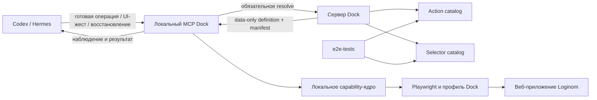

# Loginom Dock: MVP и план развития полного исполнителя

Обновлено: 5 сентября 2026 года.
Статус: агентский цикл реализован во внутреннем `0.1.0-rc.4`: наблюдение,
ограниченные UI-действия и восстановление в той же сессии. Проверены сохранение
полезных и удаление ненужных штатных автосвязей, самостоятельное исправление
ошибок и сценарии из установленного серверного комплекта. 136/136 клиентских
тестов прошли; точные pins и границы live-приёмки указаны в журнале.
Публичный выпуск и production cutover остаются отдельным этапом.

Документ объединяет историю MVP (§§0–12) и подробную инструкцию следующему
агенту по выходу из MVP (§§13–21). **Начинать продолжение с §13 и этапа P0
в §17**, затем сверять нужные ограничения в предыдущих разделах. Исторические
«точки продолжения» от 4 сентября не являются актуальной очередью работ.
P0 начат: source/live preflight, базовый launcher/audit и проверка источников реализованы;
этап целиком ещё не завершён. P1–P9 — запланированная работа.
Уже реализованное состояние системы и доказательства приёмки находятся в
[журнале реализации](../loginom-dock/implementation-status.md), устройство
существующих компонентов — в [архитектуре](../loginom-dock/architecture.md).

Навигация по продолжению:

- [§13 — цель полной версии и границы](#post-mvp-scope).
- [§14 — проверенная исходная точка](#post-mvp-baseline).
- [§15 — карта кода и источников](#post-mvp-code-map).
- [§16 — найденные нюансы и причины прежних ошибок](#post-mvp-lessons).
- [§17 — этапы P0–P9 с зависимостями и критериями готовности](#post-mvp-phases).
- [§18 — порядок добавления новой возможности](#post-mvp-action-checklist).
- [§19 — независимая приёмка работы агента](#post-mvp-acceptance).
- [§20 — существующие команды и порядок выпуска](#post-mvp-release).
- [§21 — передача результата следующему агенту](#post-mvp-handoff).

## 0. Исторический checkpoint перед возобновлением 4 сентября 2026 года

Сохранён для объяснения решений и прежних сбоев. Актуальная исходная точка —
§14; следующий этап — P0, а не повтор ранней приёмки из этого раздела.

### Что реализовано

- Добавлены data-only action/selector/source catalogs и schemas для ровно трёх
  действий: `node.add`, `link.create`, `package.save_as`. Каталоги привязаны к
  импортированному E2E commit
  `2cad5602158fd2e4836d821d644a2b8d92f571a2` и хешам использованных файлов.
- Реализована детерминированная сборка catalog release, dependency-based stale
  invalidation, проверка provenance/digests и раздельные операции stage/activate.
- Реализовано локальное capability-ядро: строгая проверка входов и outputs,
  session pins, deadline, bounded retry, типизированные исходы, semantic trace,
  selector resolver, graph/port/link diff, drag и Loginom file dialog.
- Добавлены режимы `executor-preview` и операторский `executor-replay`. В обоих
  агенту доступны `dock_action_describe` и `dock_action_run`, но не raw browser
  и clipboard tools. Обычный `classic` сохранён для ещё не покрытых сценариев.
- В skill-инструкциях Codex и Hermes закреплено обязательное использование
  action tools при их наличии.
- Последний полностью завершённый локальный прогон unit/contract тестов дал
  `42/42`. После него была внесена ещё одна узкая правка live-bootstrap; она
  подтверждена реальным вызовом `node.add`, но полный набор тестов после этой
  последней правки ещё не перезапускался.

### Каталог-кандидат и серверное состояние

- На Dock VPS staged immutable candidate
  `2026.09.04-mvp.1-candidate` с manifest SHA-256
  `28a20f41afd19669ec2a77ef900b162e3691b78745f4494ae40baecc00fbdb3f`.
- Candidate прочитан обратно и проверен. Production pointer `current.json` не
  создавался, candidate не активирован и существующие сессии не переключены.
- Клиентские release-артефакты на VPS после этих изменений не собирались;
  установка, обновление и откат нового runtime не принимались.

### Что показала live-проверка

- Фактически подтверждены Hermes `0.21.0`, provider `xiaomi`, model
  `mimo-v2.5`; автоматическая подмена модели не наблюдалась, credentials в
  evidence не выводились.
- Hermes получил только action tools и выполнил полный ранний replay
  `node.add ×2 → link.create → package.save_as` в реальном Loginom из чистого
  профиля. Replay не прошёл: ввод через `fill()` не фиксировал новое имя узла,
  дополнительное поле `position` не соответствовало output schema, а последующие
  link/save завершились каскадными ошибками из-за неверного состояния графа и
  активной маски. Ни один такой ранний результат не был принят как успех.
- По live-evidence исправлены клавиатурное переименование, transient race между
  идентификаторами вкладки и workflow при bootstrap, ожидание окончания mask и
  несоответствие output schema.
- После этих исправлений изолированный вызов актуального `node.add` в реальном
  Loginom завершился `SUCCEEDED`: создан ровно один узел `Источник`, rename
  подтверждён через 1070 мс, полная postcondition — через 1133 мс. В DOM остался
  ровно один ожидаемый label `MF;TF-1;Graph;Источник;Label;Label`.
- Полный Hermes replay после последних исправлений не запускался: работа была
  остановлена по запросу пользователя. Поэтому позитивная live-приёмка
  `link.create` с `Input_Add`, `package.save_as` с close/reopen, негативные и
  неоднозначные исходы, а также cleanup ещё не подтверждены.

### Текущее состояние рабочей копии и точка продолжения

- Изменения находятся в незакоммиченной рабочей копии. До начала этой итерации
  в ней уже были пользовательские изменения документации; они не откатывались.
- При продолжении сначала нужно выполнить полный локальный тестовый прогон после
  последней bootstrap-правки, затем новый чистый Hermes replay на Xiaomi MiMo 2.5.
- Если все три действия вернут `SUCCEEDED`, отдельно проверить negative,
  `AMBIGUOUS`, conflict policy, cleanup и повторное открытие пакета. Только после
  этого собирать клиентский release на VPS и активировать production catalog.

## 0.1. Принятые рекомендации и порядок продолжения

По запросу пользователя рекомендации архитектурного разбора включены в реализацию.
Сервер знаний, локальный браузер, E2E provenance, неизменяемые каталоги и session
pins сохраняются. Принятый 4 сентября MVP ограничен тремя встроенными доменными обработчиками;
универсальный язык сценариев в эту итерацию не входит. Серверный каталог меняет
селекторы, параметры и поддержанные политики; изменение алгоритма требует выпуска
клиентского runtime. Общие драйверы и ограниченная композиция выделяются позднее,
после подтверждения повторяющихся UI-паттернов на нескольких реальных сценариях.

Приоритеты продолжения:

1. **Контракты результатов и проверка поведения.** Исправить все успешные ветки
   `link.create`, включая existing-link reconciliation и `Input_Add`; тестировать
   исполнение capability-кода, а не наличие строк в сгенерированном JavaScript.
2. **Частичное выполнение и повтор.** Ввести operation ID и фазу выполнения,
   сохранять очищенное свидетельство до изменения UI. Любой необъяснённый эффект
   требует reconciliation; один новый add-port без связи уже запрещает повторный
   drag. Неизвестный результат после потери ответа — `AMBIGUOUS`. Освобождение
   мыши и восстановление временного состояния выполняются в `finally`.
   По уточнению пользователя сохранять фактические снимки портов и связей после
   каждой попытки drag и перед повтором: успешного ответа Hermes недостаточно.
3. **Публикация по приёмке.** Сборка по умолчанию создаёт candidate. Повторная
   сборка не повышает `stale/candidate` до production. Допуск в production хранится
   отдельно от неизменяемых проверенных данных и связан с их точным manifest SHA,
   runtime, сборкой Loginom и результатами обязательного Hermes replay. Запись
   current pointer выполняется после readback всех файлов и проверки attestation.
4. **Полнота источников и совместимость.** Проверять замыкание action → selectors /
   helpers → source files и равенство SHA в provenance. Закреплять проверенную
   сборку Loginom; для первого MVP достаточно одного точного профиля совместимости.
5. **Полный путь подготовки.** Обычная сессия и replay используют общий lifecycle:
   открыть Loginom, дождаться входа, определить workspace, проверить readiness и
   совместимость. До успешного `dock_prepare` изменения запрещены. Добавить
   типизированное наблюдение графа без раскрытия raw browser tools.
6. **Проверка доменного результата.** Ссылки на узлы связываются с workflow;
   положение узла сравнивается с запрошенным с учётом сетки. Сохранение подтверждается
   повторным открытием и сравнением наблюдаемой структуры пакета.
7. **Приёмка и измерение.** После локальных проверок на закреплённом Node выполнить
   чистый replay Hermes + Xiaomi MiMo 2.5: standard/Input_Add, conflict policy,
   negative/ambiguous/cancel/cleanup и save/reopen. Фиксировать долю завершённых
   сценариев, ложные `SUCCEEDED`, дубликаты, неопределённые исходы и длительность.

Ни один новый критерий не считается закрытым только наличием кода или mocks.
Результаты продолжения и ограничения записываются в журнал реализации.
Расширение этих границ по решению от 5 сентября описано в разделе 0.3.

## 0.2. Проверенный результат продолжения 4–5 сентября

- Все три действия прошли чистый replay Hermes 0.21.0 / Xiaomi `mimo-v2.5` на
  текущем Mac: два узла → `Input_Add` → сохранение → закрытие и открытие.
  Точный путь и структура графа проверены независимо по фактическим результатам
  tools и журналу. Runtime SHA —
  `dc4b8aebcb96efd4d56d5afadd691098520e9cfafc2b247e8e2137653b7611f8`.
- Подозрение на лишние порты проверено отдельно. До связи у «Объединения» было
  два входа данных; после — три; после открытия — три. В новом replay снимки
  после первой попытки и перед повтором не показали изменений; вторая добавила
  ровно один порт и одну правильную связь. Эта проверка теперь входит в trace.
- При открытии Loginom перенумеровывает динамические порты. Fingerprint сохраняет
  направление, вид, число и порядковый номер порта внутри вида, а также точные
  концы всех связей. Простого удаления номеров или сравнения количества узлов
  недостаточно. Проверяется структура; настройки и данные узлов этим fingerprint
  не сравниваются. Источники и границы — в
  [описании закреплённых probes](../loginom-dock/pinned-ui-probes.md).
- Отдельно проверены стандартная связь, распознавание существующей связи,
  повтор успешного запроса с тем же ID, отказы до изменения, `fail/replace`,
  искусственная потеря подтверждения реального apply и настоящая MCP-отмена.
  В дополнительном replay два запроса действительно поступили одновременно;
  второй browser apply дождался завершения и cleanup первого.
- Локально и из серверного комплекта прошли **79/79** клиентских тестов.
  Изолированный цикл `rc.2 → rc.3 → rc.2 → rc.3` сохранил конфигурацию, посторонний
  файл состояния и личные настройки Codex/Hermes. Native-регистрация нового
  кандидата этим циклом не проверялась.
- Catalog candidate `2026.09.04-mvp.3-candidate` имеет manifest SHA
  `b0686dee91fe5ed5a748692ebbce9cfc03b704d7a37c7138997b7bdb708c2d09`.
  Проверенные данные не переписывались и production pointer не переключался.
- Внутренний Mac-комплект `0.1.0-rc.3-743676bf253a` собран на VPS из рабочего
  снимка с явным `sourceDirty=true`; SHA архива
  `063b2fa4f04f47e5e40274cb9cee8e37e084b0c6c70620b8a736d6763392b75b`.
  Его установка изолирована от личного клиента. Финальный replay
  `20260905-000512-1f3d4c40` именно этого установленного комплекта завершился:
  оба `node.add`, `link.create` и `package.save_as` вернули `SUCCEEDED`.

## 0.3. Агентский цикл и самостоятельное исправление — 5 сентября

Пользователь обратил внимание, что надёжное исполнение трёх операций и остановка
при неопределённости ещё не дают агенту возможности довести произвольную задачу
до результата. В `rc.3` известный лишний вход без связи блокирует последующие
изменения; произвольную настройку или исправление агент выполнить не может.
Live-приёмка этого кандидата доказала работу операций и защит, но не самостоятельное
восстановление агентом. Эти доказательства сохраняются без переименования в новый
результат.

Принятое продолжение сохраняет три готовые операции и добавляет ограниченные
инструменты в ту же executor-сессию. Hermes/Codex наблюдает, формулирует причину,
выбирает действие или исправление, проверяет результат и продолжает свой план.
Сервер поставляет знания; цикл решений остаётся у локального агента. Сценарий
не превращается в заранее заданную последовательность кликов.

| Инструмент | Контракт продолжения |
| --- | --- |
| `dock_action_describe` | Вызов с `{}` возвращает `available_actions`: `node.add`, `link.create`, `package.save_as`; вызов с `action_key` возвращает definition выбранной операции |
| `dock_workspace_observe` | Граф, настройки, диалоги, сообщения, маски, ячейки таблиц и доступные UI-ссылки; возвращает `observation_id` для следующего жеста |
| `dock_ui_action` | Один `click`, `double_click`, `fill`, `press` или `drag` по свежим ссылкам из наблюдения; `observation_id`, стабильный `operation_id`, типизированный `action`; JavaScript, CSS/XPath и clipboard не принимаются |
| `dock_operation_inspect` | По `operation_id` или текущей pending-операции читает фактическую браузерную квитанцию и сверяет наблюдаемое состояние |
| `dock_operation_recover` | Исходный `operation_id`, отдельный `recovery_operation_id`, стратегия `complete_link`, `restore_control`, `accept_observed_state` либо `abandon_operation`; последние две требуют `observation_id`; восстановление подтверждается наблюдением и журналом |

Границы восстановления:

- Успех UI-жеста означает выполнение жеста. Готовность настройки, графа, данных
  или пакета агент доказывает отдельным наблюдением в соответствии с целью.
- По уточнению пользователя автоматические связи при добавлении узлов рядом —
  штатное поведение Loginom. `node.add` принимает ровно один проверенный новый
  узел вместе с новыми связями, каждая из которых относится к этому узлу, если
  прежние узлы, порты и связи не изменились. После проверки имени и положения
  возвращаются `SUCCEEDED`, `output.auto_created_links`, `goal_verified: false`.
  Одни такие связи не создают pending. Агент сверяет их с целью, сохраняет полезные
  и удаляет ненужные обычными UI-действиями; посторонние изменения остаются
  `AMBIGUOUS`.
- `FAILED` не завершает сценарий автоматически. Агент анализирует trace и UI,
  исправляет доступную причину и продолжает. Повтор доставки прежнего запроса
  сохраняет его ID и параметры; изменение ID не разрешает обход pending-операции.
- Известный частичный результат различается с ещё выполняющимся или неизвестным
  браузерным вызовом. Пока окончание вызова не подтверждено, новые жесты запрещены.
- Если `Input_Add` создал один вход без связи, `complete_link` соединяет именно
  этот вход. Повторный drag на `Input_Add` не является восстановлением.
- Другое ограниченное исправление через `dock_ui_action` указывает ID исходной
  pending-операции в `recovery_operation_id`, использует свежее наблюдение и
  принадлежащие ему ссылки. Доступ к чужому или устаревшему состоянию запрещён.
- Квитанции сохраняются в локальном реестре Playwright для страницы. Потерянный
  ответ можно восстановить по фактической завершённой операции; это не догадка
  по DOM и не повторное применение. `restore_control` восстанавливает только
  cleanup; она не снимает блокировку неподтверждённого выполняющегося вызова.
- Если pending относится к завершённому `ui.act` и cleanup подтверждён, агент
  анализирует свежее наблюдение и может явно принять его через
  `accept_observed_state` с `observation_id`. Runtime повторно читает UI, требует
  точного совпадения и записывает `resolution: accepted_observed_state`,
  `goal_verified: false`. Блокировка снимается, исходный жест остаётся `AMBIGUOUS`.
  Это checkpoint для продолжения из понятого состояния, а не объявление успеха
  жеста или доменной цели и не обход через новый ID.
- Если агент после анализа больше не преследует исходный результат операции,
  `abandon_operation` позволяет явно завершить её разбор и изменить цель шага или
  переделать ошибочно выбранный запрос. Нужны фактическое окончание вызова,
  подтверждённый cleanup и свежее наблюдение; runtime повторно проверяет тот же UI
  и идентичность пакета. Исходный результат остаётся `AMBIGUOUS` с
  `resolution: abandoned_after_observation`, `goal_verified: false`. Квитанция
  recover `SUCCEEDED` подтверждает только отказ от прежнего исхода; pending
  снимается, исходный ID не исполняется снова, автоматического повтора нет.
  Неподтверждённый выполняющийся вызов нельзя abandon. Это не разрешает объявить
  доменную операцию успешной; `accept_observed_state` остаётся только для `ui.act`.
- Raw browser API, произвольные локаторы и исполняемый код с сервера остаются
  закрыты. Новый клиентский runtime добавляет эти интерфейсы; старый `rc.3` их
  не получает из обновления skill или каталога. Новая сессия не требуется,
  если нужное действие покрывается ограниченным UI-интерфейсом текущей сессии.

Приёмка расширения включает самостоятельное восстановление: Hermes получает
только цель, без готовой последовательности tools и без подсказки об инъекции.
Во время настоящего действия в Loginom воспроизводится частичный эффект — один
неподключённый вход. Успех требует, чтобы агент сам обнаружил его, выбрал
исправление, не создал лишних портов и довёл задачу до проверенного результата.
Отдельно проверяются настройки через UI, потерянный ответ, stale/чужие refs и
блокировка незавершённого вызова. Mocks подтверждают контракт, но не заменяют
живую приёмку. Полные goal-only проверки частичной связи, прерванного
переименования и потерянного ответа прошли через Hermes/Xiaomi MiMo 2.5.
На реальном Loginom также проверено сохранение полезной автосвязи и
самостоятельное повторное открытие файла через UI после отказа готовой операции.
Проверка удаления ненужной автосвязи выявила и помогла исправить точку клика
по изогнутой SVG-линии, доступность кнопок подтверждения и классификацию
фоновой маски с текстом «Загрузка». Удаление и сохранённый граф проверены
на текущем runtime, в том числе из установленного комплекта. Доказательства — в
[журнале реализации](../loginom-dock/implementation-status.md).

Первые три прогона расширения остановились до продуктивных действий из-за прежнего
поведения discovery и обработки прикладных ошибок; они не считаются успешной
live-приёмкой. Исправление контракта: неизвестное действие и неверные аргументы
возвращаются обычным MCP-content с `FAILED`, либо с `AMBIGUOUS`, если прежняя
операция уже неопределённа. Ошибка запроса не должна считаться отказом MCP-сервера.
`dock_prepare` явно сообщает capabilities и инструкции текущего клиента, уточняя
прежние ограничения более старого серверного skill.

Один из последующих диагностических прогонов содержал неоднозначное требование
к переименованию в приватном prompt («то же имя»). Его исход не доказывает ошибку
модели: критерий должен сначала однозначно задавать ожидаемое имя. Исправление
такого задания и новый прогон не приравниваются к успешной приёмке до проверки
фактического результата.

Допуск нового runtime к публичному выпуску дополнительно требует
`agent_partial_link_recovery`, `agent_ui_recovery` и `transport_receipt_recovery`.
Эти три результата добавляются к восьми прежним обязательным проверкам; старый
отчёт `rc.3` не может подтвердить расширенную приёмку.

## 1. Цель и границы

Цель итерации — дать агенту возможность создавать и исправлять сценарии Loginom,
опираясь на проверенные источники и фактическое состояние UI. Готовые операции
исполняются локальным кодом, а план, диагностику и выбор следующего шага определяет
агент. Источники `e2e-tests` подтверждают реализацию готовых операций и селекторов.

В эту итерацию входят:

- локальный исполнитель трёх встроенных доменных capabilities;
- серверные каталоги действий и символьных селекторов на основе `e2e-tests`;
- обязательное разрешение готовой доменной операции через E2E-каталог;
- три действия первого MVP: `node.add`, `link.create`, `package.save_as`;
- ограниченные UI-жесты по свежим ссылкам наблюдения без произвольного кода;
- диагностика, сверка операций и восстановление в одной executor-сессии;
- unit, contract и live-проверки в реальном Loginom;
- доставка, совместимость, обновление и откат нового клиентского runtime.

В эту итерацию не входят:

- доработка истории сессий, извлечения опыта и Agent Evolution;
- запуск пользовательских сценариев браузером на сервере Dock;
- автоматическое исполнение произвольных TestCafe helpers;
- установка Loginom на VPS Dock;
- загружаемые с сервера JavaScript-адаптеры.

### Обязательное окружение разработки и проверки

- Рабочая машина — текущий Mac, на котором находится checkout Loginom Dock.
- Локальные unit/contract проверки, воспроизведение ошибок и отладка executor
  выполняются на этом Mac.
- Агент для функциональной отладки, replay и live-приёмки — **Hermes**.
- С 5 сентября 2026 по прямому указанию пользователя для отладки и тестирования
  Hermes, включая replay и live-приёмку: **GPT-5.6 Luna, reasoning medium,
  провайдер — уже подключённая подписка ChatGPT**. CLI identifiers:
  `--provider openai-codex --model gpt-5.6-luna --reasoning medium`.
- Это заменяет прежнее требование Xiaomi MiMo 2.5. Модели серверных функций Dock
  не меняются. Перед запуском проверять фактическое подключение без вывода
  credentials; не подменять модель, провайдера или исполнителя при ошибке/лимите.
- Исторические прогоны MiMo сохраняют исходные результаты и pins. Новая приёмка
  должна отдельно подтвердить новую конфигурацию Hermes на текущем Mac.
- Релизные артефакты по-прежнему собираются на VPS, после чего кандидат
  устанавливается и принимается в указанном локальном окружении.

Это явное решение пользователя от 4 сентября 2026 года действует только для
итерации E2E-исполнителя и заменяет для неё прежнюю конфигурацию Hermes-приёмки.
Конфигурацию моделей серверных функций Dock оно не изменяет.

## 2. Принятое решение

Использовать гибрид:

1. На сервере Dock хранить версионированные **action definitions** и
   **selector catalog** в виде данных.
2. На машине пользователя установить редко обновляемое детерминированное
   **capability-ядро**.
3. Выполнять Loginom локально через Playwright и отдельный профиль Dock.
4. Использовать `e2e-tests` как источник селекторов, алгоритмов и acceptance
   evidence, но не как клиентскую runtime-библиотеку.

Локальный исполнитель не является отдельной языковой моделью. Codex или Hermes
выбирает готовую операцию либо отдельный доступный UI-жест, затем анализирует
наблюдение и при необходимости исправляет результат. Поиск definition, валидацию,
связывание refs, взаимодействие, ожидания и cleanup выполняет код Dock.



Сервер поставляет знания, но не становится исполнителем пользовательской задачи.
Для обычной работы устанавливать Loginom на сервер Dock не требуется. Отдельный
серверный Loginom в будущем допустим только как стенд replay/валидации.

## 3. Почему не используются другие варианты

| Вариант | Решение |
| --- | --- |
| Запуск существующих TestCafe helpers | Не использовать: helpers привязаны к TestCafe, его browser session и произвольному TypeScript |
| Линейный JSON из `click/fill/drag` | Не использовать как основную модель: он не выражает безопасно динамические порты, wizard, recovery и cleanup |
| Отдельный UI-жест по свежему ref | Использовать как ограниченный инструмент агента; следующий шаг выбирается после наблюдения, без серверного скрипта и произвольных локаторов |
| Встроенный доменный обработчик на каждое действие | Использовать для трёх MVP-действий; изменение алгоритма требует обновления runtime |
| JavaScript или скомпилированный adapter pack с сервера | Не использовать: это удалённая доставка исполняемого кода на компьютер пользователя |
| Capability-ядро + data-only definitions | Использовать для селекторов, контрактов и поддержанных настроек; композицию новых алгоритмов отложить до проверенных повторяющихся сценариев |

Исследование выполнено на локальной ревизии `e2e-tests`
`986c87134ac221b7af4cd4ebc75e1d0c9e050111`. Эта ревизия является evidence
исследования, но не вечной константой: каждая опубликованная версия каталогов
обязана хранить фактически использованный E2E commit и digests.

## 4. Термины и граница компонентов

| Термин | Где находится | Что означает |
| --- | --- | --- |
| Action definition | Сервер Dock | Типизированное описание законченной операции Loginom |
| Selector symbol | Сервер Dock | Стабильное имя локатора, связанное с E2E-источником |
| Capability | Клиентский runtime | Проверенный способ наблюдения или взаимодействия с UI |
| Executor | Клиентский runtime | Валидатор и исполнитель встроенных операций, ограниченных UI-жестов и восстановления |
| Observation ref | Клиентский runtime | Ссылка на наблюдаемый элемент текущего UI, связанная с observation и владельцем сессии |
| Adapter | Native-плагин Codex/Hermes | Интеграционный слой конкретного агента, а не действие Loginom |

В первом MVP совместимые selector symbols и поддержанные настройки существующих
трёх действий обновляются каталогом. Новое действие, изменение алгоритма или
исполняемой pre/postcondition, новый UI-паттерн, Playwright/Chromium и исправление
безопасности требуют клиентского выпуска. Возможность композиции новых действий
без выпуска клиента является отдельным последующим этапом.

## 5. Обязательное обращение к E2E

### 5.1. Публичный контракт

В `executor-preview` сохраняются два инструмента готовых доменных операций:

```text
dock_action_describe({}) -> available_actions
dock_action_describe({action_key}) -> definition
dock_action_run(action_key, parameters, operation_id)
```

`dock_action_run` обязан сам выполнить resolve. Корректность не должна зависеть
от того, сделал ли агент отдельный поисковый вызов перед запуском.
Пустой describe позволяет обнаружить имена без угадывания. Ошибки action key и
параметров возвращаются типизированным `FAILED` в обычном MCP-content;
существующая pending-неопределённость сохраняется как `AMBIGUOUS`. Они не становятся
транспортными сбоями и не снимают блокировку незавершённой операции.

До применения готовой доменной операции локальный Dock:

1. Получает definition из закреплённого на сессию action catalog.
2. Проверяет action revision, selector catalog digest и E2E commit.
3. Проверяет целостность definition и совместимость capability ABI.
4. Валидирует типы параметров, policy, timeout и разрешённые эффекты.
5. Только после этого передаёт definition локальному executor.

Если definition отсутствует, имеет статус `stale` или требует неизвестную capability,
запрос завершается до изменения UI с понятной диагностикой.

Расширение от 5 сентября добавляет наблюдение, отдельные UI-жесты и восстановление
по контрактам раздела 0.3. Для них границей служат фиксированный локальный код,
профиль совместимости, свежий `observation_id`, владение refs и журнал операции.
Жест не выдаётся за разрешённую из E2E-каталога готовую доменную операцию.

### 5.2. Запрет обхода

Playwright остаётся внутренним драйвером. Сырые browser tools не публикуются агенту
в каталоге `executor-preview` и не могут использоваться action definition.

Исследовательский режим допускается только через отдельный диагностический запуск
или явную настройку пользователя/администратора. Модель и серверная definition не
могут включить его автоматически. Результат исследования не становится production
action до review, replay и публикации новой версии каталога.

Существующий режим клиента сохраняется для сценариев, не покрытых готовыми
операциями и ограниченным UI-интерфейсом. `executor-preview` включается пользователем или
администратором отдельным запуском. Модель не может переключать режим в активной
сессии. Перевод executor в режим по умолчанию выполняется отдельным этапом только
после определения и проверки достаточного покрытия действий; первый MVP не должен
ухудшить уже работающие сценарии Dock.

## 6. Серверные каталоги

### 6.1. E2E action index

- [x] Построить индекс поверх уже импортированного Git-ресурса `e2e-tests`.
- [x] Для каждого действия хранить selector symbols, helpers, примеры тестов,
  строки источников и dependency graph.
- [x] Не создавать второй импортёр репозитория, отдельную копию исходников или
  параллельный поисковый движок.
- [x] При обновлении E2E создавать новую candidate-версию каталогов и по dependency
  graph помечать только затронутые candidate-действия как `stale`. Уже закреплённые
  на активных сессиях каталоги не изменять.
- [x] Не публиковать `stale`-действие как проверенное до повторного review/replay.

### 6.2. Action definition

Минимальная схема:

```text
action_key
revision
typed inputs and outputs
selector symbols
E2E evidence references
preconditions and postconditions
effect and idempotency policy
timeout and retry budgets
required capabilities
min_executor_revision
cleanup and compensation
```

В MVP control flow реализован только встроенными доменными обработчиками.
Текстовые preconditions/postconditions/cleanup в каталоге описывают контракт и
не интерпретируются как программа. Исполняемые assertions, ограниченные повторы
и `try/finally` проверяются в клиентском коде. Будущий ограниченный интерпретатор
потребует отдельного контракта типов, последовательностей, ветвлений и cleanup;
его наличие не заявляется в текущей итерации.

Запрещены:

- JavaScript, `eval` и произвольные callbacks;
- raw CSS и XPath;
- произвольный substring-поиск по `data-tid`;
- старые DOM handles и координаты из прошлой сессии;
- фиксированные динамические префиксы вроде `TF-N`;
- рекурсия и циклы без ограничения;
- capability, не указанная в проверенном manifest.

### 6.3. Selector catalog

Каталог хранит символьные локаторы, а action definitions только ссылаются на них.
Минимально поддержать:

- точный `data-tid`;
- проверенный suffix или типизированный шаблон с безопасным кодированием параметров;
- ordered alternatives с диагностикой неоднозначности;
- scope `global | activeTab | activeWorkflow | modal | within`;
- cardinality `one | zeroOrOne | many`;
- visibility `visible | hidden | any`;
- relative child/descendant/ancestor;
- state probes `enabled | masked`;
- runtime references и snapshot/diff для динамически появившихся сущностей.

Каждый selector symbol хранит E2E source path, строку и revision. Resolver создаёт
свежий Playwright Locator при каждом использовании и не считает сохранённый
`ElementHandle` постоянной ссылкой.

### 6.4. Session manifest

На сессию закрепляются:

```text
client runtime revision
Playwright and Chromium revisions
capability ABI
action catalog digest
selector catalog digest
E2E commit
adapter revision
skill revision
```

Более новая версия серверного каталога применяется только в новой сессии.

## 7. Локальное capability-ядро

### 7.1. Resolver и наблюдение

- [ ] Определять активную вкладку, workflow и верхний modal.
- [ ] Проверять cardinality, attached, visibility, enabled и отсутствие маски.
- [ ] Проверять стабильность geometry и доступность точки взаимодействия.
- [ ] Читать текст, значение, атрибут, класс, bounding box и состояние контролов.
- [ ] Снимать snapshot коллекции и вычислять diff до/после.
- [ ] Возвращать логические ссылки на `node`, `port`, `link` и package.

### 7.2. Browser primitives и Loginom drivers

- [ ] Реализовать click/double/right/hover, ввод, клавиатуру и scroll.
- [ ] Реализовать geometry drag и необходимые операции с viewport.
- [ ] Реализовать button, menu и context menu drivers, необходимые MVP.
- [ ] Реализовать mask, toast, dialog и единый Loginom error observer.
- [ ] Реализовать Loginom file dialog и навигацию по хранилищу пакетов.
- [ ] Реализовать graph snapshot/diff, adaptive port drag и package identity.

Публичные жесты расширения ограничены `click`, `double_click`, `fill`, `press` и
`drag`. Остальные primitives и специализированные UI-drivers требуют отдельного
планирования; приведённый выше список не обещает их наличия в текущем runtime.

### 7.3. Надёжность

- [ ] Использовать единый deadline, отмену и bounded retry.
- [ ] Выполнять cleanup в `finally` при любом исходе.
- [ ] Перед повтором неидемпотентного действия выполнять reconciliation.
- [ ] Не повторять `add`, `connect` и `save/overwrite`, пока не доказано, что
  предыдущая попытка не применилась.
- [ ] Возвращать один из исходов:
  `SUCCEEDED | NOT_APPLIED | FAILED | AMBIGUOUS`.
- [ ] Сохранять semantic trace, разрешённые selector matches, наблюдения,
  screenshot/DOM/console/dialog evidence после redaction.

### 7.4. Самостоятельное восстановление агента

- [x] Расширить наблюдение до UI, настроек, диалогов, сообщений, масок и таблиц.
- [x] Привязать UI-жест к свежему `observation_id` и принадлежащим ему refs.
- [x] Добавить inspect, реестр фактических браузерных квитанций и безопасный recover.
- [x] Соединять уже созданный одиночный add-port без повторного создания порта.
- [x] Разрешить ограниченное UI-исправление по ID исходной pending-операции.
- [x] Учесть штатные автосвязи `node.add`: вернуть их агенту без pending при
  неизменности прежнего графа и проверить сохранение полезных/удаление ненужных.
- [x] Проверить `accept_observed_state` только для завершённого `ui.act` с
  подтверждённым cleanup и точным повторным readback; сохранить исходный
  `AMBIGUOUS` и `goal_verified: false`.
- [x] Проверить явный `abandon_operation` при смене цели шага: законченный вызов,
  подтверждённый cleanup, свежий UI/package readback, исходный `AMBIGUOUS`,
  отсутствие повторного исполнения прежнего ID и отсутствие доменного success.
- [x] Проверить на живом Loginom достижение цели и непредупреждённую частичную
  ошибку с самостоятельной диагностикой и исправлением Hermes.

## 8. Действия первого MVP

Сохраняются ровно три готовые доменные операции. Ограниченные UI-жесты и
восстановление расширения из раздела 0.3 дают агенту дополнительные способы
выполнить задачу в той же сессии, но не добавляют готовых доменных definitions.

### 8.1. `node.add`

Вход:

- стабильный семантический `component_key`; action definition сама разрешает его
  в selector symbol компонента;
- целевая позиция;
- необязательная ожидаемая метка.

Выполнение:

1. Проверить активный workflow и доступность компонента.
2. Снять snapshot узлов, портов и связей.
3. Выполнить drag компонента.
4. Вычислить diff и потребовать ровно один новый узел.
5. Привязать логический `node_ref`.
6. При необходимости переименовать узел.
7. Проверить положение с учётом поведения сетки Loginom.
8. Проверить неизменность прежних узлов, портов и связей. Разрешить новые связи,
   только если каждая относится к созданному узлу; вернуть их в
   `output.auto_created_links` вместе с `goal_verified: false`.

Loginom автоматически соединяет некоторые узлы при добавлении рядом. При этих
условиях `node.add` возвращает `SUCCEEDED` без pending только из-за таких связей.
Агент наблюдает граф, сопоставляет связи с задачей, оставляет полезные и удаляет
ненужные через обычный `dock_ui_action`. Техническое создание узла не доказывает
доменную цель. Любые посторонние изменения графа по-прежнему дают `AMBIGUOUS`.

После timeout сначала проверить snapshot и postcondition. Повтор разрешается
только после доказательства, что узел не появился.

### 8.2. `link.create`

Вход:

- исходный и целевой `node_ref`;
- типизированные описания исходного и целевого портов.

Выполнение:

1. Заново разрешить оба порта.
2. Перед каждой попыткой пересчитать geometry.
3. Выполнить bounded adaptive drag с контролируемыми offset и speed.
4. Для `Input_Add` определить новый порт через diff портов.
5. Проверить существование ровно нужной связи.
6. Вернуть логический `link_ref`.
7. В `finally` восстановить zoom и viewport.

Повтор после неоднозначного результата допускается только после проверки, что
связь или новый add-port не были созданы предыдущей попыткой.

### 8.3. `package.save_as`

Вход:

- типизированный путь внутри хранилища Loginom, а не путь файловой системы клиента;
- conflict policy как минимум `fail | replace`.

Выполнение:

1. Открыть меню и файловый диалог через selector symbols.
2. Проверить разрешённый корень хранилища Loginom, нормализовать путь и расширение.
3. Явно обработать overwrite согласно conflict policy.
4. Проверить все каналы ошибок Loginom.
5. Проверить identity активного пакета.
6. Закрыть и повторно открыть пакет по сохранённому пути.

Успешный toast сам по себе не считается доказательством сохранения.

## 9. Порядок реализации

### Шаг 1. Контракты и режимы

- [x] Зафиксировать action, selector и capability schemas.
- [x] Зафиксировать compatibility/session manifest.
- [x] Описать `executor-preview` и отдельно разрешаемый diagnostic/research mode.
- [x] До изменения кода синхронно дополнить `architecture.md`.

### Шаг 2. E2E-индекс и каталоги

- [x] Построить action index и dependency graph.
- [x] Сгенерировать selector catalog с provenance.
- [x] Добавить детерминированную сборку, digests и atomic publish.
- [x] Добавить invalidation затронутых действий при обновлении E2E.

### Шаг 3. Минимальное локальное ядро

- [x] Реализовать resolver, валидатор definitions и capability ABI.
- [x] Реализовать session pins, deadline, outcomes, trace и fail-closed policy.
- [x] Добавить unit/contract тесты безопасности и совместимости.

### Шаг 4. MVP-действия

- [x] Реализовать и проверить `node.add`.
- [x] Реализовать и проверить `link.create`.
- [x] Реализовать и проверить `package.save_as`.
- [x] Выносить повторяющуюся логику только в общие capabilities.

### Шаг 5. Принудительное использование

- [x] Добавить `dock_action_describe` и `dock_action_run`.
- [x] Убрать raw browser tools из каталога `executor-preview`.
- [x] Добавить отдельные, явно разрешаемые пользователем или администратором
  запуски `executor-preview` и диагностики.
- [x] Проверить, что модель и definition не могут сами включить research mode.
- [x] Сохранить текущий клиентский режим для непокрытых действий до отдельного
  решения о production cutover и достаточном action coverage.

### Шаг 6. Проверки в реальном Loginom

- [x] Выполнить все три действия из чистого профиля Dock на текущем Mac через
  Hermes с уже подключённой Xiaomi MiMo 2.5.
- [x] Перед запуском зафиксировать в evidence эффективные provider/model identifiers
  без credentials и подтвердить, что модель не была автоматически подменена.
- [x] Проверить позитивные, негативные и неоднозначные исходы.
- [x] Проверить стандартный порт и динамический `Input_Add`.
- [x] Проверить conflict policy и повторное открытие сохранённого пакета.
- [x] Проверить cleanup после успешного выполнения, ошибки и отмены.

Mock, headless DOM-проба, наличие tools или успешная конфигурация не заменяют
проверку drag и сохранения в реальном Loginom.

### Шаг 7. Выпуск

- [x] Собрать внутренний клиентский кандидат macOS на VPS.
- [x] Проверить runtime-only обновление, откат и сохранение чужих настроек.
- [ ] Проверить native-регистрацию нового выпуска из чистого опубликованного commit.
- [ ] Опубликовать release metadata и catalog digests после live-приёмки.
- [ ] Активировать новые каталоги только для новых сессий.

## 10. Граница обновлений

| Изменение | Что обновляется |
| --- | --- |
| Изменился совместимый selector symbol | Серверный catalog после replay; клиент не переустанавливается |
| Изменилась поддержанная настройка timeout/retry | Серверный catalog после replay в пределах клиентской политики |
| Добавлено действие или изменён порядок шагов / исполняемые pre/postconditions | Новый клиентский runtime и приёмка; общий интерпретатор не входит в MVP |
| Появился новый UI-паттерн, browser primitive или capability | Новый клиентский runtime/plugin |
| Обновляется Playwright/Chromium или безопасность ядра | Новый клиентский выпуск с проверкой отката |

## 11. Критерии готовности MVP

| Проверка | Критерий |
| --- | --- |
| Обязательный E2E-resolve | `dock_action_run` не изменяет UI без session-pinned definition, selector catalog и совместимого manifest |
| Fail closed | Отсутствующее, `stale` или несовместимое действие завершается до изменения UI |
| Безопасность | Definitions не содержат JavaScript, raw CSS/XPath и неограниченный control flow |
| Запрет обхода | В `executor-preview` агент не получает raw browser tools и не может сменить режим |
| Ограниченные UI-действия | Жест использует свежее наблюдение и принадлежащие сессии refs; успешный жест не объявляется доказательством цели |
| Восстановление | Известный частичный эффект исправляется по исходной операции; неизвестный выполняющийся вызов нельзя обойти новым ID |
| Самостоятельность агента | Goal-only задача с непредупреждённым частичным эффектом доведена Hermes до результата; trace и итоговый граф проверены независимо |
| Допуск расширенного runtime | К восьми прежним обязательным проверкам добавлены `agent_partial_link_recovery`, `agent_ui_recovery`, `transport_receipt_recovery`; все относятся к точному выпускаемому runtime |
| `node.add` | Создан ровно один ожидаемый узел; штатные новые связи только с ним возвращены в `auto_created_links` без pending при неизменности прежнего графа; `goal_verified: false`; неопределённый исход не создаёт дубликат при retry |
| `link.create` | Создана ровно нужная связь, включая `Input_Add`; zoom и viewport восстановлены |
| `package.save_as` | Путь хранилища Loginom и conflict policy соблюдены; пакет подтверждён повторным открытием |
| Ошибки и cleanup | При любом исходе возвращены типизированный статус и trace, временное состояние восстановлено |
| Серверное обновление | Новая совместимая definition или selector catalog применяются в новой сессии без переустановки |
| Несовместимость | Новая capability не исполняется старым клиентом и требует явного обновления |
| Live-приёмка | Все три действия проверены в реальном Loginom на текущем Mac через Hermes с Xiaomi MiMo 2.5; эффективные provider/model identifiers сохранены без credentials |

## 12. Результат итерации

Внутренний кандидат `rc.3` проверен в прежнем объёме: реализованы
обязательный E2E-resolve, три действия, общий lifecycle подготовки, журнал,
проверки результатов, остановка небезопасных повторов и запрет raw browser tools.
Реальная приёмка отделена от unit-проверок и от ответов модели.

Расширение от 5 сентября реализовано: готовые действия дополнены агентским
циклом диагностики и исправления в той же сессии. Штатные автосвязи возвращаются
агенту для проверки цели; полезные сохраняются, ненужные удаляются обычным UI.
Внутренний Mac-комплект `0.1.0-rc.4-551644cb00b6` собран на VPS, проверены
136/136 тестов, изолированная установка/откат и живые задачи из комплекта.
Пять полных задач на текущем runtime прошли 119/119 независимых утверждений;
точные результаты и применимость прежних fault-прогонов указаны в журнале.
Прежние **79/79** тестов и replay `rc.3` сохранены как история, отдельно от этих
доказательств.

Публичный выпуск ещё не выполнен. Для него нужны чистая зафиксированная ревизия,
приёмка native-регистрации, публикация обновлённого полного skill, выпуск metadata
и attestation для точного выпуска, затем отдельное переключение каталога для новых
сессий. Внутренний dirty-комплект не выдаётся за опубликованный native release.

<a id="post-mvp-scope"></a>

## 13. Цель полной версии и правила продолжения

### 13.1. Что пользователь должен получить

Агент принимает задачу на естественном языке, исследует открытый Loginom,
строит или изменяет сценарий, настраивает источники и преобразования, выполняет
его, проверяет данные, сохраняет результат и подтверждает его повторным открытием.
При ошибке агент получает факты о состоянии, выбирает исправление и продолжает
работу с уже созданным сценарием. Реализация не должна требовать заранее написанной
E2E-последовательности на каждую пользовательскую формулировку.

Полная версия исполнителя покрывает следующие группы задач:

| Область | Обязательный результат развития |
| --- | --- |
| Контекст и пакеты | Подготовка, создание, открытие без неявного запуска, несколько вкладок, сохранение, Save As, закрытие, повторное открытие, явные конфликты и read-only состояния |
| Граф | Добавление, настройка, переименование, перемещение, удаление и копирование узлов; создание, удаление, переподключение связей; поддержанные типы и настройки портов; штатные автосвязи |
| Данные | Доставка разрешённых файлов, текст/Excel/LGD, подключения и импорт БД, настройки форматов, типы и сопоставление полей |
| Обработка | Преобразования и выражения, объединение/соединение/группировка/фильтрация и остальные семейства компонентов по реестру покрытия |
| Управление | Переменные пакета/сценария/узла, управляющие порты, подмодели, переходы и преобразования compose/expand с сохранением внешних связей |
| Исполнение и результат | Запуск, наблюдение процесса, ошибки и остановка; схема, количество строк, значения, пустой результат; визуализаторы и экспорт |
| Агентская работа | Наблюдение, объяснимый выбор следующего действия, проверка цели, исправление частичного эффекта, управляемое продолжение после сбоя и сохранённые checkpoints |
| Поставка | E2E provenance, обновляемые совместимые каталоги и skill, Codex/Hermes, заявленные платформы, native lifecycle, публикация и проверенный откат |

«Все компоненты» нельзя заменить шестью `component_key` MVP. На P1 создать
конечный реестр возможностей из UI, каталога компонентов, E2E и доступной
документации Loginom. Для каждого семейства перечислить конкретные операции,
режимы и ограничения. Отсутствие лицензии, тестового подключения или источника
должно оставлять строку `blocked`/`unsupported` с причиной. Исключение обязательной
пользовательской возможности — изменение объёма, которое нельзя скрыть удалением
строки или объявлением оставшегося набора «полным».

Первоначальная инфраструктура Dock — знания, поиск, импорт источников, архив,
Studio, лендинг и установщики — уже существует. Её поведение сохраняется и
проверяется на регрессии. В эту дорожную карту не добавляются заново Agent
Evolution, второй importer, перенос браузера на VPS или произвольный запуск
TestCafe с сервера. Если пользователь отдельно расширит эти направления,
оформить связанную задачу и её границы в канонической документации.

### 13.2. Архитектура агентской работы

1. **Модель планирует и анализирует.** Выбирает следующий небольшой шаг по цели,
   текущим данным и наблюдению. Ошибка capability возвращает управление модели.
2. **Локальный клиент исполняет и проверяет.** Разрешает точный объект, фиксирует
   исходное состояние, выполняет ограниченное действие, проверяет эффект,
   сохраняет квитанцию и делает cleanup. Нельзя заменить эти проверки ответом модели.
3. **Сервер даёт знания и совместимые данные.** Definitions, selectors, provenance
   и позже ограниченные recipes не содержат произвольного исполняемого кода.
4. **Проверка сценария отдельна от проверки действия.** Успешный жест, созданный
   узел, правильный граф, правильные настройки и правильные выходные данные —
   разные обязательства. Итоговый успех требует всех обязательств задачи.

E2E нужны как источник проверенных UI-паттернов и регрессионных примеров. Они
не становятся агентом и не определяют единственно допустимую последовательность
его решений. При неопределённом эффекте pending gate блокирует все новые
независимые mutations, включая повтор под новым ID. Агенту остаются наблюдение
и диагностика; UI repair допускается после подтверждённого завершения вызова
и необходимого cleanup, в пределах объектов исходной операции.

<a id="post-mvp-baseline"></a>

## 14. Проверенная исходная точка на 5 сентября

Это снимок для передачи работы; перед исполнением следующего этапа сверить его
с [журналом](../loginom-dock/implementation-status.md), рабочими файлами и живой
системой. Идентификаторы ниже нельзя переносить на изменённую сборку.

| Составляющая | Подтверждённое состояние |
| --- | --- |
| Клиент / adapter / executor | `0.1.0-rc.4` / `0.1.0-rc.4` / `1.1.0`, capability ABI `1` |
| Runtime digest, 40 файлов | `ca4b9f4cdbf6d46358235147d445a45428b224046cf0074cae16a241d3bdc016` |
| Браузерные зависимости | Node `24.19.0`, Playwright `1.63.0-alpha-2026-08-31`, Chromium revision `1243`, версия `153.0.8010.12`, MCP SDK `1.30.0`, Playwright MCP `0.0.80` |
| Loginom | Наблюдённый frontend/UI `7.5.0-alpha+build.49202`, macOS/Chromium, русский интерфейс; это не отдельное доказательство версии серверного бинарника |
| E2E source pin | `2cad5602158fd2e4836d821d644a2b8d92f571a2` |
| Staged catalog | `viking://resources/loginom-dock/catalogs/executor-preview/releases/2026.09.05-agent.2-candidate/manifest.json` |
| Manifest digest | `290c59ed4af9d0861a158d4758ed849e5159a715ff7b1d4d659826b9df36d4b3`, `node.add` revision 2; production не активирован |
| Внутренний серверный комплект | `0.1.0-rc.4-551644cb00b6`; `sourceCommit=9a9a0bbc43c46685e2dd0af5753bfcc9374700ca`, **`sourceDirty=true`** |
| Публичное состояние | Клиент `rc.2`; новый native release, полный серверный skill и production catalog не опубликованы/не переключены |

Подробные SHA исходного архива, полного bundle и его manifest, пути на VPS и
локально сохранены в журнале. Source archive, Git commit, runtime digest и
bundle digest — разные сущности. Dirty-архив содержит файлы, которых ещё нет
в указанном commit; checkout этого commit не воспроизводит MVP автоматически.

Граница доказательства:

- 136/136 клиентских проверок прошли локально и в серверном комплекте.
  Один прежний параллельный локальный прогон завершил процесс Node с SIGSEGV;
  отдельный набор 22/22 и полный последовательный 136/136 затем прошли. Причина
  единичного процессного сбоя не установлена; не писать, что он исправлен.
- Пять полных задач на текущем runtime дали 119/119 независимых утверждений:
  две из исходников и три из установленного комплекта. Подтверждены в том числе
  сохранение полезной автосвязи и удаление ненужной.
- Три fault-задачи дали 65/65 на прежнем pin `2cf92…`. Для них есть анализ
  применимости: совпали 39/40 runtime inputs, изменение касается классификации
  масок, которых в этих задачах не было. Это **не повтор трёх задач на `ca4b…`**
  и не готовая attestation всех проверок одного нового выпуска.
- Цикл rc.2 → rc.4 → rollback rc.2 → rc.4 был runtime-only. Native hooks,
  регистрация и новая полная версия skill этим циклом не приняты.
- Приватный итог — `.dock/agent-recovery-acceptance/independent-final-acceptance-summary.json`,
  SHA `5e2bdc6f977234bc9425f5d0987ab89544ff5846c5dacbe2f4c94b66e83b1f17`.
  `.dock/` не входит в Git; отсутствие этого evidence у следующего агента требует
  честного указания недоступности и нового воспроизводимого прогона.

Актуальное правило от 5 сентября: debug/replay/acceptance выполняются на текущем
Mac через Hermes 0.21.0, **подписка ChatGPT / `openai-codex`, `gpt-5.6-luna`,
reasoning `medium`**. Это прямое изменение пользователя заменяет прежнюю MiMo
конфигурацию. Проверять effective identifiers без credentials, не обходить ошибки
другой моделью или провайдером. Исторические pins выше остаются историческими.

<a id="post-mvp-code-map"></a>

## 15. Где продолжать реализацию

Пути в таблице относительны корню `loginom-dock`. Новые предлагаемые файлы
в следующих разделах явно помечены как проектируемые.

| Область | Файлы и текущая граница |
| --- | --- |
| Public MCP и режимы | `client/lib/bridge.mjs`, `catalog.mjs`, `config.mjs`, `client/bin/loginom-dock.mjs`: prepare, dispatch, схемы tools, запрет raw browser/clipboard в executor; режим закрепляется при запуске |
| Каталог и валидация | `client/lib/action-catalog.mjs`, `executor/capability-abi.json`, `executor/schemas/`, `executor/catalog/`: закрытый список из трёх actions/capabilities и строгие pins |
| Исполнение и recovery | `client/lib/executor.mjs`: browser capability, host lifecycle, operation state, receipts, reconcile/recover, владение затронутыми объектами |
| UI и подготовка | `client/lib/workspace-ui.mjs`, `workspace.mjs`: observation/opaque refs/gestures, геометрия, маски, готовность Loginom; доказательства read-only probes — [pinned-ui-probes.md](../loginom-dock/pinned-ui-probes.md) |
| Журнал и session pin | `client/lib/execution-journal.mjs`, `session.mjs`: redacted append/fsync; ручной список 40 runtime inputs; reader/resume пока отсутствует |
| Каталог: build и publication | `deploy/loginom-dock/build-action-catalog.mjs`, `publish-action-catalog.py`: candidate, selective stale, stage/activate, acceptance; это не компилятор всей E2E-базы |
| Skill | `client/lib/skill.mjs`, `skills/loginom-automation/`, `plugins/loginom-dock/skills/loginom/`, `plugins/loginom-dock-hermes/skills/loginom/`, `deploy/loginom-dock/publish-skill.py`: полный skill отдельно от bootstrap и runtime bundle |
| Архив и взаимодействие | `client/lib/archive.mjs`, `history.mjs`, `hooks.mjs`, `hook-runtime.mjs`, `redact.mjs`, `clipboard.mjs`: подготовка/очистка/очередь/общий clipboard lock |
| Дистрибутив и native | `deploy/loginom-dock/package-client-source.py`, `build-client-bundle.py`, `client/lib/install.mjs`, `native.mjs`, `client/bin/setup.mjs`, оба native-плагина |
| Проверки поведения | `client/test/executor.test.mjs`, `recovery.test.mjs`, `workspace-ui.test.mjs`, `workspace.test.mjs`, `bridge.test.mjs`, `action-catalog*.test.mjs`, `execution-journal.test.mjs`, `support/` |
| Совместимость поставки | `client/test/install.test.mjs`, `native.test.mjs`, `skill.test.mjs`, suites архива/hooks/clipboard, `tests/unit/test_dock_client_packaging.py`, `landing/release.json` |

Полная [карта E2E-источников](../loginom-dock/e2e-source-map.md) содержит 14 областей,
точные пути/строки helpers, selectors и примеров, связанные зависимости и
предупреждения. На текущей машине источник — `/Users/kartamyshev/Git/e2e-tests`.
Его HEAD `986c871…` отличается от source pin, но 46 выбранных файлов сверены
побайтно с blobs `2cad560…`; для новой работы проверять выбранные файлы снова.
Старые пять retrieval-копий в `.dock/executor-mvp-acceptance/e2e` неполны.

Основные входы в E2E: `bg/helpers/packages.ts`, `workflow/node.ts`,
`workflow/links.ts`, `workflow/ports.ts`, `wizard.ts`, `progressForm.ts`,
`workflow/previewTable.ts`, `connections.ts`, `filestorage.ts`,
`workflow/components/supernode.ts`, `bg/selectors.ts`, `bg/sels/`.
Часть нужных helpers находится в `tests/toreview`; их расположение и наличие
acceptance-файла не являются доказательством качества или live PASS.

Фактический selector subset MVP уже проектного описания §6: только `data_tid`,
match `exact/prefix/suffix`, scope `global/activeTab/activeWorkflow/modal`,
cardinality `one/zeroOrOne/many`, visibility `visible/hidden/any`, состояния
enabled/masked, encoders `loginom_tid/integer` и optional `required_class`.
E2E `AltAttrs`, относительные оси, `within` и альтернативные selector strategies
не становятся доступными из-за наличия в источнике. Их поддержку вводить явно
через versioned contract и локальный resolver с проверками; неизвестные поля
не должны молча игнорироваться.

<a id="post-mvp-lessons"></a>

## 16. Нюансы, которые следующая реализация должна сохранить

### 16.1. Связи, порты и идентичность сценария

- **Автосвязь при близком добавлении узлов — штатная функция Loginom.** `node.add`
  revision 2 допускает только новые incident edges созданного узла при неизменности
  прежнего графа и возвращает `auto_created_links`, `goal_verified:false`. Агент
  решает, нужны ли они. Не создавать дубликат уже подходящей связи и не удалять
  все автосвязи автоматически. Старый output contract сохраняется: необъявленный
  им эффект остаётся `AMBIGUOUS`, а не маскируется успешным новым output.
- Drop на `Input_Add` может создать порт без связи. После этого запрещён повтор
  на Add: восстановление должно использовать **уже созданный** `Input_Data`.
  Сравнивать полный набор портов и связей после каждой попытки. Удаление нового
  узла может оставить добавленный порт у прежнего target; прежние labels ещё
  не означают `NOT_APPLIED`.
- Проверять точные source/target/port, количество и направления связей. При
  неверной связи разрешён cleanup только новой связи, принадлежащей операции.
  Для Data/Var/Tree/Order/ControlVar отдельно определить допустимую кратность.
- После Save/reopen `Input_Data-3` может стать `Input_Data-2`: числовой suffix
  отражает индекс среди портов направления. Fingerprint сохраняет тип, направление,
  количество и ordinal внутри типа; endpoints переводятся через ту же карту.
  Удаление всех чисел из идентификаторов скрывает реальные ошибки.
- Ref должен включать контекст пакета, вкладки и подмодели. Одинаковые названия
  во вкладках допустимы; выбирать первый `nth` или совпадение label нельзя.
  Путь пакета читается из cached `PackageTreeNode.PackageFileName` активного
  workspace, не из caption «Сценарий». Read-only обход родителей ограничен 32
  шагами и защитой от цикла. `Application.FInstance` не заменять getter,
  способным создать экземпляр, RPC или mutation модели.

### 16.2. UI: реальные причины прежних сбоев

- Rename использует временный textarea без собственного `data-tid` внутри
  `ModelForm;cmpDiagram`. Проверенный ввод: открыть редактор, заново наблюдать,
  сфокусировать, Select All + `keyboard.type`, отдельно Enter и readback имени.
  Обычный `fill()` менял DOM, но не фиксировал значение в модели Loginom.
- DOM `getBoundingClientRect` и Playwright `boundingBox` для SVG давали 56×76
  и 56×56 у того же объекта. Сравнивать одинаковые системы координат; сохранять
  zoom/scroll/translation/initialScale и grid 8. Не расширять допуск до целой
  ячейки сетки, чтобы скрыть неверное преобразование координат.
- Центр bbox SVG-связи может быть пустым. Текущий алгоритм выбирает точку на
  реальной геометрии descendant SVG через длину пути и screen CTM и подтверждает
  точного владельца `elementFromPoint`. Максимум 16 shapes × 9 fractions, один
  доказанный click. `SourceBend`/`TargetBend` не считать основной связью. Нулевые
  width/height разрешены только для точной нарисованной горизонтальной/вертикальной
  graph-link, а не для произвольных скрытых контролов.
- MessageBox кнопки `msgbox…;tlb;yes/no/ok/cancel` бывают anchors без button role
  и без `href`. Нужен поиск внутри точного диалога; общий запрет навигационных
  `a[href]` сохраняется.
- `bg-mask-message` может стоять на всём workspace: его `textContent` содержит
  также дерево компонентов. Текст маски читается из `bg-mask-text`.
  «Загрузка» может принадлежать background mask уже открытого foreground dialog.
  Классификация основана на DOM ownership и верхнем диалоге, не на пустоте текста:
  disjoint background mask допускает только контролы этого диалога; mask внутри
  него или его предок блокирует. Фактическое перекрытие кнопки всё равно отклоняет
  painted hit-test. Не разрешать весь background workspace из-за наличия диалога.
- После жеста асинхронная реакция Loginom может ещё не завершиться. Свежий ответ
  инструмента не гарантирует завершение бизнес-эффекта; нужны readback/ожидание
  нужного условия, а затем новое наблюдение перед следующим жестом.

Для уже оформленных probes использовать [pinned-ui-probes.md](../loginom-dock/pinned-ui-probes.md).
Дополнительный static source review подтвердил следующие assets той же UI-сборки:

| Asset и символы | SHA-256 |
| --- | --- |
| `bg/ext/Mask.js`, `AfterElementTextMaskContext`, `Create` | `60ecabc17c86df4a034bbace02e8d1f80ad7bbcf88f4a3a4721ebd656e858051` |
| `bg/ext/Lock.js`, `LS_Loading`, `MethodLock`, `MaskAfterElementText` | `e321d140d5da0ef14ab24435e9a6562c1042f2e5f789424de6d1c3dfa2af23bd` |
| `ext/build/ext-all-debug.js`, `MessageBox.makeButton`, `Button.getHref/getElConfig` | `5b8f534947c4396d72aa6f264721ab8e5bf190b3284969baf8aad9785798e2c5` |

Точные исходные строки и копии байтов этих трёх assets не сохранены как переносимый
fixture. Это подтверждённое ранее объяснение, но не готовая воспроизводимая
source-проверка нового checkout. P0 должен повторно прочитать именно эти assets,
сверить hash и оформить минимальные probes/локаторы; не придумывать номера строк.
SVG hit-point — алгоритм клиента, а не утверждение о внутреннем алгоритме Loginom.

### 16.3. Исходы, квитанции и границы восстановления

- `ui.act:SUCCEEDED` означает `gesture_applied:true`, `verification_required:true`.
  Структурный fingerprint Save As доказывает граф, **не настройки, формулы, файлы
  и вычисленные данные**. Полной проверкой цели это станет только после P3/P4.
- ID доменной операции обозначает одно намерение с неизменными аргументами.
  Потеря ответа требует inspect/reconcile исходного ID. Новый ID не снимает
  pending gate; совпадение видимого графа не доказывает завершение browser call.
- Browser receipts находятся на объекте Playwright `Page`, вне JS-мира страницы:
  переживают навигацию в существующем Page, но не потерю browser server/client.
  `createActionRuntime` создаёт новый namespace, Maps операций/наблюдений теряются.
  JSONL с fsync пока не читается для resume. Durable exactly-once не реализован.
- `restore_control` — mouse release/Escape и cleanup, не отмена изменений.
  `complete_link` завершает известный частичный link. `accept_observed_state`
  относится только к завершённому generic UI ambiguity и не отменяет предметную
  postcondition. `abandon_operation` после доказанного завершения, cleanup и свежего
  readback освобождает pending, оставляя исходный `AMBIGUOUS`, resolution
  `abandoned_after_observation`, `goal_verified:false`; он ничего не откатывает.
- При MCP cancel host browser gate удерживается до реального завершения вызова.
  Нельзя снимать его по одному timeout, PID или желанию агента продолжить.
  Recovery ограничен 12 физическими попытками и объектами исходной операции.
  После исчерпания вернуть проверенный checkpoint и оставшиеся варианты.
- **Текущая неоднозначность API:** `dock_ui_action.recovery_operation_id` означает
  исходную pending operation; у `dock_operation_recover` исходный ID находится
  в `operation_id`, а `recovery_operation_id` означает новый repair request.
  Одинаковый ID с иными параметрами отклоняется. После нового observation для
  нового жеста нужен новый request ID. В P1 сделать назначение полей явным,
  предусмотрев совместимость старых вызовов.
- `view().recovery_options` сейчас содержит подсказки `inspect_ui` и `ui_repair`,
  хотя enum `dock_operation_recover.strategy` допускает только четыре стратегии
  выше. Hermes уже пробовал несуществующую strategy `ui_repair`. Исправить подсказки
  на структурированные next actions с именем tool и обязательными полями;
  не документировать подсказку как существующую strategy.
- Невалидные пользовательские аргументы возвращаются типизированным результатом,
  не серией MCP `isError`: несколько таких ошибок подряд включали защиту Hermes
  и закрывали ему путь исправления. При этом неверный запрос не должен менять UI.

### 16.4. Текущие пределы и тестовые допущения

| Предел MVP | Значение и последствие |
| --- | --- |
| Наблюдение | 240 контролов, 200 узлов, 500 связей, 100 портов/узел, 120 ячеек, по 12 dialogs/masks, 30 сообщений |
| Текст | Labels/messages обычно 240 символов; поле/ввод 2048; отдельного `value_truncated` пока нет |
| Память | 8 observations, очищаются после mutations, TTL нет; 128 browser receipts с удалением только завершённых; runtime Maps пока без eviction |
| Время | UI 15 с внутри / 35 с снаружи; node.add 60 с, link.create 90 с, save_as 180 с; link retry budget 9 допускает до 10 попыток только при доказанном отсутствии эффекта |
| UI verbs | Только click, double_click, fill, press, drag; конечный список клавиш, clipboard shortcuts запрещены |
| Компоненты / файлы | Шесть component keys; Save As только `.lgp` в `/user/data/packages`, fail/replace |

Caps обрезают результат **после общего DOM scan**, не стоимость обхода. `visible`
не обязательно означает viewport; flag портов консервативен уже при ровно 100.
Проверка deadline между шагами не прерывает синхронный scan. Увеличение лимитов
не заменяет scope/cursor и доказательство полноты графа.

Нижний observer видит LoginForm, но публичный `dock_workspace_observe` в bridge
требует успешный prepare. До него исследовать `LOGIN_REQUIRED` этим tool нельзя.
Нужна ограниченная read-only диагностика bootstrap без преждевременного архива.

Не переносить буквально из E2E:

- `OpenPackage` по умолчанию запускает все узлы; `MakeNodeSettings` по умолчанию
  выполняет узел. `CloseNodeSettings` при `finalAction != Close` проходит страницы
  до последней, а при `Close` подтверждает discard без этого прохода. Будущий
  cancel не должен выполнять ветвь завершения. Сделать каждый эффект явным.
- `CheckPreviewDataShowing` ждёт первую строку: корректный пустой dataset должен
  быть успешным проверяемым результатом. Видимые ячейки и ограниченная история
  процесса не являются полными данными/журналом.
- `LaunchAllNodes(excludeCheck)` всё равно запускает исключённые узлы: параметр
  выключает проверки. Quarantine, `.skip`, TODO и подавление ошибок не дают
  runtime права игнорировать сбой. В supernode saving test есть TODO полного
  persistence с Save Package.
- TestCafe `ClientFunction`, прямой DOM click, serverApi cleanup, autologin,
  безусловное принятие dialogs, restart сервера, testdata path rewrite и чужие
  credentials не являются допустимыми production capabilities Dock.
- Hidden file upload, clipboard и редакторы кода/SQL требуют отдельных локальных
  контрактов. Снятие запретов generic UI ради импорта/Калькулятора недопустимо.
  Пользовательское выражение внутри узла отличается от исполняемого browser JS
  в серверной definition; разрешать только конкретный подтверждённый редактор.

В `workspace-ui.test.mjs` 22 проверки исполняют сериализованный UI body с DOM
double. `support/executor-fixture.mjs` заменяет extraction/incarnation/hit-point
готовым snapshot, оставляя domain runtime и gesture body. Эти уровни дополняют
друг друга; ни один не заменяет реальную агентскую приёмку из установленного bundle.

<a id="post-mvp-phases"></a>

## 17. Этапы выхода из MVP

### Зависимости и порядок работы

Основной путь: **P0 → P1 → P2 → P3 → P4 → P5 → P6/P7 → P9**.
P8 можно проектировать после P1 и выполнять параллельно развитию capabilities;
он обязателен до публичного переключения каталога и полного skill. P7 можно
начать после P2, но принимать resume нужно также на новых действиях P3–P5.
P6 вводится только после подтверждения повторяющихся паттернов; если композиция
не сокращает сложность, сначала зафиксировать доказанный вывод и пересмотреть
формат, сохранив пользовательские возможности P3–P5.

Один рабочий этап — ограниченная вертикальная возможность и её независимая
приёмка. Не объединять переписывание executor, все мастера и выпуск в один diff.
После каждого этапа обновлять реестр покрытия, этот план, архитектуру при её
изменении и журнал проверенных результатов. Новые галочки ставить только по
указанным ниже доказательствам, а не по наличию файлов.

### P0. Сделать исходную точку и приёмку воспроизводимыми

**Зачем:** новый агент из Git не получает значительную часть MVP и приватный
приёмочный инструментарий автоматически.

- [x] Сверить `AGENTS.md`, handoff, этот план, architecture/status, текущий
  `git status` и состав tracked/untracked. Сохранить чужие изменения. Не сбрасывать
  checkout и не коммитить автоматически все файлы рабочей области одним набором.
- [x] Просмотреть и зафиксировать относящиеся к MVP исходники, schemas, catalog,
  tests и документацию как самостоятельный проверяемый набор. Проверить новый
  чистый checkout: ни один необходимый import/fixture не должен зависеть от `.dock/`.
- [x] Вынести очищенные harness, goal-only задания, fault wrappers, независимые
  auditors и их тесты в поддерживаемый `tools/loginom-acceptance/`. Не копировать
  целиком `.dock`, Hermes SQLite, системные prompts, reasoning, credentials,
  browser profiles и сырые transcripts. Fault wrappers — операторский инструмент,
  они не входят в production runtime и проверяют SHA исходного места инъекции.
- [x] Описать воспроизводимые команды preflight/run/audit: проверить зависимости,
  effective provider/model и pins, подготовить отдельные Dock/Hermes/browser
  states и принадлежащие задаче пути пакетов. Запуск модели должен быть явным,
  проверка конфигурации сама не запускает приёмку. Сохранить исходные goal prompts
  без подсказки последовательности инструментов или ожидаемого сбоя.
- [x] Оформить очищенный индекс evidence: run ID, goal ID, входные pins, исход,
  SHA отчёта и проверяемое место его хранения. Недоступные старые доказательства
  обозначить как недоступные, а не восстанавливать из итогового текста модели.
- [x] Проверить pinned E2E файлы по карте источников. Дополнить минимальные
  source/probe fixtures для Mask/Lock/MessageBox из §16.2; сохранять атрибуцию
  и только необходимые разрешённые выдержки/утверждения.
- [x] Воспроизвести существующие unit/contract и packaging checks из чистого
  checkout. Описать различие полного UI body и domain fixture. Затем выполнить
  базовую реальную goal-only проверку существующего поведения на нужных pins.

**Готово, когда:** другой агент может получить исходники и зависимости, запустить
проверки и одну базовую задачу без приватного авторского launcher; отчёт связан
с реальным входным составом. `--source-clean` подтверждён равенством build inputs
commit, а не изменением флага. Публичный release для этого этапа не нужен.

Начато 5 сентября: в `tools/loginom-acceptance/` добавлен source-only preflight
с пофайловым inventory, сверкой байтов/режимов/состава с commit и runtime pin.
Временная чистая Git-копия выбранных inputs проходит изолированный client suite.
Исходная goal-only задача перенесена в `goals/basic-graph.txt` без изменения текста.
Продолжено 5 сентября: поддерживаемые `run.py`/`audit.py` выполнили одну базовую
задачу через Hermes 0.21.0 / Xiaomi `mimo-v2.5`; независимый audit — 25/25.
Добавлен индекс новых evidence с повторной сверкой SHA. Сверены 46 E2E blobs
и три UI asset, минимальные локаторы сохранены с атрибуцией. Основная рабочая
копия остаётся dirty. Реализованы пофайловый archive manifest, проверка точных
байтов архива и source-clean gate builder по Git objects с повторной сверкой
staging; положительный gate проверен на временном commit, не на финальном выпуске.
Перенесены четыре fault wrappers и legacy availability index (41 runs / 31 reports).
Lost-response launcher/audit поддержаны, 9 JS и 17 Python checks прошли.
Два новых fault runs не получили frozen PASS; исправлены узкие критерии получения
квитанции, а во втором run дополнительно выявлены лишний порт при сохранении и
UI-клик после save/reopen без нового наблюдения. Исходные отчёты не повышены поздней диагностикой.
Дополнительно исправлены аудит/экспорт read-only знаний и закреплён preload
native skill; добавлены `--require-knowledge-recovery` и строгий rename proof.
Четыре дополнительные реальные попытки не подтвердили чтение E2E и Help после
ошибки; инструкции и доступность инструментов не считаются подтверждением.
Последующее изменение добавило автоматическую доставку источников через
существующие OpenViking read/search: отдельный контракт
`--require-delivered-context` прошёл 35/35 на реальном Hermes/Xiaomi run
`20260905-080210-c36a7f7b`. E2E/Help доставлены до исправления связи через Input_Add;
точная цель проверена save/close/reopen. Это не подтверждение собственных
поисковых вызовов модели; прежние FAIL сохранены. Текущие pins — в журнале.
Перенесён partial_link proof: реальный run `20260905-112721-45b852c3`
прошёл 35/35, восстановление через сохранённый порт complete_link без повторного
Input_Add, с доставкой E2E/Help и независимым save/reopen.
Position proof также перенесён: run `20260905-114717-ed0c4c7d` прошёл 35/35;
реальный сдвиг 24px и явный abandon без повторного создания, с сохранением
исходной AMBIGUOUS-квитанции и проверкой итоговой структуры после reopen.
Перенесены auto-link retain/remove CLI и proofs; два реальных запуска
`20260905-115815-03d1d051` / `20260905-120159-69f00baa` прошли по 32/32,
с подтверждением штатной связи и её сохранения либо точного удаления через UI.
Manual reopen после AMBIGUOUS Save As перенесён и принят на новой конфигурации
Hermes/подписка ChatGPT/GPT-5.6 Luna/medium: run `20260905-125931-a3a46bef`,
28/28 frozen PASS, с доставкой E2E/Help, связанным abandon и точным графом
после ручного открытия исходного пути. Прежние неудачи и остановка сохранены;
новый результат не меняет их статусы. Команда/pins и SHA — в журнале.
Исправлен выявленный в rename live-прогоне runtime-баг: скрытая inline-редактором
подпись больше не даёт ложный NOT_APPLIED и не снимает pending guard.
Новый runtime `a97afec8…` прошёл связанный rename UI repair + save/reopen:
`20260905-132537-623287bf`, 35/35 с E2E/Help; 139 client / 58 Python tests.
Rename-after-abandon завершён: `20260905-135741-5c45f2f3`, 34/34 frozen PASS
на том же runtime, с E2E/Help и точным save/reopen. Экспорт теперь различает
копии истории Hermes после сжатия и реальные повторные вызовы, сохраняя
исходные IDs и связи storage_copies. Реальные 24 копии сопоставлены в отдельном
run `20260905-135148-6fa2b372`; его общий 33/34 FAIL сохранён. 64 Python tests.
Индекс содержит 24 попытки / 9 PASS. Следующий объём — review/фиксация исходников
и чистая поставка на VPS; перенос инструментария/команд/индекса завершён.
Фиксация MVP и проверка окончательной чистой поставки ещё не завершены. Подробности и команды —
в [README инструментария](../../tools/loginom-acceptance/README.md).

P0 завершён 5 сентября: commits `cb2bc041` / `28657479`, чистый checkout
139 client / 64 Python / 10 packaging checks; source-clean сборки на VPS
для macOS/Linux с проверкой Git objects. Новый basic-graph run
`20260905-141558-dad96a91` — 29/29 frozen PASS, runtime `7160fdac…`,
Hermes/ChatGPT/Luna/medium. Реальная задача запускалась из чистого checkout
с Node/dependencies серверного комплекта; native cutover остаётся этапом P9.
Полные hashes и границы доказательств — в начале implementation-status.

### P1. Зафиксировать объём и расширяемые контракты

**Менять:** `action-catalog.mjs`, `executor/capability-abi.json`, schemas/catalog,
tool schemas в `bridge.mjs`/`catalog.mjs`, bootstrap/full skills и publisher
в части единого списка возможностей.

- [ ] Создать **проектируемый** `executor/coverage.json` и его краткое описание:
  family/action, пользовательская цель, inputs/outputs/effects, source dependencies,
  поддержанные builds/platforms, status, unit/live evidence, known gaps, следующий
  шаг. Статусы различают `planned`, `implemented`, `live_verified`, `released`,
  `blocked`, `unsupported`. Области §13.1 и E2E-карта — исходный перечень, который
  дополнить инвентаризацией реально доступных компонентов и режимов.
- [x] Выбрать явный локальный registry capabilities с версионированными handlers
  и contracts. Убрать расхождение трёх повторённых allowlists, сохранив отказ
  неизвестным actions. Один JSON action без handler не должен стать исполняемым.
- [x] Определить новые effect kinds для настройки, удаления, исполнения,
  read-only inspection и передачи файлов. Текущий validator допускает только
  `create/save`; не подгонять все эффекты под них. Зафиксировать precondition,
  postcondition, reconciliation и ownership для каждого вида.
- [x] Разделить outputs: выполненный жест, проверенный domain effect, полнота
  наблюдения, проверенные настройки/данные, выполненные обязательства цели.
  Усилить validation discriminated outcome: сейчас `assertActionOutcome`
  проверяет только object/status/trace, а предметный output — отдельная schema.
- [x] Устранить путаницу operation/recovery IDs и `recovery_options` из §16.3.
  Ошибка должна возвращать доступный tool, обязательные поля, требование нового
  observation/receipt, а не предлагать несуществующий enum. Добавить contract
  проверки на реально повторявшиеся неправильные вызовы Hermes.
- [x] Описать версии schemas и ABI. Текущий JSON Schema validator поддерживает
  лишь type/properties/required/additionalProperties/enum, числовые и строковые
  bounds/pattern, items/description; `$ref`, `oneOf` и defaults не реализованы.
  Либо явно сохранить небольшой subset, либо выпустить проверенную реализацию
  нового subset; не принимать поля, которые runtime игнорирует.

**Готово, когда:** реестр конечен и обозрим; добавление одного тестового нового
контракта согласованно отражается в schema/describe/dispatch/admission, а старый
клиент отказывает ему до browser call. Неполный snapshot и успешный жест нельзя
принять как доказанный сценарий. Старые три actions продолжают работать.

P1 начат 5 сентября: локальный registry связывает key/capability/handler/effect;
tool schemas, admission и dispatch согласованы, неизвестные и перепутанные
действия отклоняются до браузера. Next steps содержат реальные tools/поля/роли
IDs; recovery_options больше не предлагает несуществующие strategies.
Subset схем проверяет типы/место keywords и не игнорирует неизвестные поля;
закрыт обход через prototype properties. Outcome envelope усилен, но полный
раздельный proof ещё предстоит. Начальный coverage: 78 E2E компонентов +
68 общих операций; live/Help inventory остаются незавершёнными.
См. `docs/loginom-dock/executor-contracts.md` и `coverage.md`.

Registry/schema/recovery подтверждены реальным rename run
`20260905-142903-f1cc2e29` — 34/34 PASS с E2E/Help и save/reopen,
commit `78b0a103`, runtime `96043954…`, 145 client / 10 packaging tests.
P1 остаётся незавершённым по inventory, новым effects и раздельному proof.

Раздельный outcome verification v1 принят: `f9f80a21`, runtime `e9027c5b…`,
43 inputs; 148 client / 66 Python / 10 packaging checks. Реальный run
`20260905-144056-ad856011` — 30/30 с обязательной доставкой verification и
journal binding, точным save/reopen. Полнота DOM не объявляется доказанной;
settings/data и goal остаются not_checked/not_verified до профильных handlers.
Далее P1 live/Help inventory и расширение effect contracts.

Effect contracts реализованы в `4743d427` (семь kinds и binding resource).
Реальная palette-inventory `20260905-145533-e12491a5` не принята (18/23):
102 КБ наблюдения ушли в недоступный агенту Hermes spillover. Для завершения
инвентаризации P1 требуется сначала часть P2 по compact/scoped/paged observation.
Это не внешний блокер и не уменьшение объёма: P1 остаётся незавершённым.

### P2. Общие UI-драйверы и доступное наблюдение

Root discovery + scoped details + действия приняты на реальном Text Import
в `20260905-195407-939bc201`: 25/25 frozen PASS, runtime `d2f70522…`.
179 client / 81 Python / 10 packaging. Scoped scan с 6500 background elements
и внешним blocker/duplicate tid принят локально, не большим live fixture.
Полный пункт P2 остаётся открытым: type filters/table identity/виртуализация,
options/radio/large-field и остальные профили ещё требуют реализации/приёмки.

DOM epoch реализован и совместимость принята в `20260905-172843-f90ebea6`:
25/25 frozen PASS, runtime `f4db7d2a…`. 172 client / 80 Python / 10 packaging.
Локально проверен DOM A→B→A и устаревший cursor; live run подтвердил работу
меню/мастера/checkbox, а не отдельную ABA fault injection. Root/filter всё ещё
не реализованы; property-only/canvas/server изменения вне MutationObserver.

Context-menu opening + Text Import checkbox cycle приняты 5 сентября в
`20260905-171627-dab12302`: **25/25 frozen PASS**, runtime `65c1e28a…`.
Правый клик, выбор observed SetupNode и отложенное появление мастера доказаны.
170 client / 80 Python / 10 packaging. Это не закрывает весь P2: root/filter,
epoch/ABA, radio/options, большие поля и остальные профили ещё предстоят.

5 сентября checkbox Text Import принят в `20260905-164903-1372db2d`:
24/24 frozen PASS, включая смену, idempotent no-op и возврат значения.
Это не приёмка radio, apply или сохранённых настроек. Следом реализован
right_click с guards/cleanup; его live ещё предстоит (169 client tests).

Вертикальный scroll палитры 0→800→0 принят в новом run
`20260905-161157-1fb1e122`: **27/27 frozen PASS**, runtime `1f654a57…`.
164 client / 75 Python / 10 packaging. Остальные P2 пункты остаются открытыми;
особенно крупные roots, epoch/ABA и управление состоянием виджетов.

Run `20260905-154306-0e121bd2` — 26/26: bootstrap not_open до prepare с
неактивным архивом и неподготовленным workspace; затем bounded readUi на 1920
DOM элементах, 77 компонентов/12 групп. Runtime `e579941f…`. Ветки bootstrap
login/blocked/incompatible пока только unit; root/filter/scroll ещё предстоят.

Реальные страницы приняты в palette run `20260905-151931-7698def0`:
24/24, runtime `7eaebd2e…`, 77 компонентов/12 групп. Строки coverage получили
только presence evidence; скрытые элементы и режимы не объявлены полными.
Rename regression с новым форматом ещё предстоит, как и остальные пункты P2.

5 сентября добавлена первая host-часть observation paging: компактные ответы,
scopes, cursors с проверкой свежего snapshot digest и admission только выданных
refs. Это не закрывает пункт ниже: browser scan/root filters/virtualization и
epoch ещё предстоят. Live acceptance нового формата пока не проводилась;
сначала требуется строгая адаптация независимого аудитора receipt projection.

**Менять:** `workspace-ui.mjs`, `workspace.mjs`, browser/host части `executor.mjs`,
bridge и session/build input lists. Новые driver modules сначала проектируются,
их имена не означают уже существующую инфраструктуру.

- [ ] Выделить повторяющиеся resolver/incarnation, geometry/hit-point, field
  commit, modal/mask, topology/package identity, cleanup/deadline без изменения
  подтверждённого поведения. Сериализованный browser body обязан получить все
  зависимости; обычный host import сам по себе не переносит функцию в browser.
- [ ] Добавить read-only bootstrap observation до prepare: только состояние
  приложения, требование авторизации, блокирующие dialogs/masks и поддержанность
  сборки. Не читать пароль, не входить автоматически и не запускать archive capture.
  Локально реализован scope=bootstrap, проверены serialized code и MCP gate
  (159 client tests); checkbox остаётся открытым до live acceptance.
- [ ] Добавить scope/root ref, фильтры по типу, курсоры, явные completeness и
  truncation/value_truncated, schema/identity таблиц и деревьев. Ограничивать
  работу scan, а не только длину ответа. Отличать offscreen от доступного target.
  Связать страницы одним snapshot revision/epoch графа или результата: при
  изменении между страницами отвергать объединение и начинать новое чтение.
  Реализованы host paging/digest и cooperative browser scan budget с явным
  UI_SCAN_LIMIT; browser root/filter, epoch/ABA и live приёмка scan ещё открыты.
  Добавлены value_truncated/value_length_utf16 для полей; generic gestures
  запрещены для усечённых значений до отдельного large-field контракта.
- [ ] Реализовать scroll и новое observe после него для виртуализированных
  списков/таблиц; устаревшие incarnations должны отклоняться даже при одинаковом
  data-tid. Нельзя строить proof полного графа из ограниченной viewport-выборки.
  Вертикальный scroll реализован по наблюдаемому owner с clamping и свежим
  snapshot; 162 client tests. Live scroll, горизонтальное направление и ABA
  при повторном использовании того же DOM элемента ещё не закрыты.
- [ ] По реальным мастерам добавить выбор option, checkbox/radio по желаемому
  состоянию, context menu/right click, hover при необходимости и ввод больших
  значений в конкретные поддержанные поля. set_checked реализован для
  native/ARIA/Loginom Ext с readback и no-op,
  167 client tests; live мастер и остальные виды управления ещё предстоят.
  Все gestures используют увиденные
  refs и bounded budgets; raw CSS/XPath/JS и произвольные viewport-координаты
  generic UI от модели не появляются. Логический `target_position` доменного
  node.add/move допустим при проверенном преобразовании в геометрию Loginom.
- [ ] Сохранить ограничение UI repair объектами pending operation. Новая
  возможность scroll/menus не должна давать обход блокировки неизвестной mutation.

**Проверки:** сериализованный UI body, stale target после re-render/scroll,
одноимённые вкладки, SVG edge/hit-test, background/foreground masks, потеря
ответа, transient rename; большие графы свыше нынешних caps и virtualized grids.
Live-приёмка должна показать доступность нужного объекта, корректный отказ
старому ref и отказ «полной» выборке из разных ревизий. Не заменять это увеличением
timeout и лимита до «достаточно большого».

### P3. Первая полная цепочка с настоящими данными

Уточнение пользователя 5 сентября: имя учётной записи Loginom и личного
каталога не обязано быть `user`. Имена и destination задаются явно либо
определяются по наблюдаемому Loginom, затем путь проверяется по интерфейсу.
Не выводить их из пользователя ОС/SSH. Пользователь разрешил отдельную учётную
запись Loginom `test` для отладки и тестирования; это не default продукта.
Новые acceptance runs должны фиксировать выбранный destination до запуска.


5 сентября подготовлен `tools/loginom-acceptance/fixtures/data-pipeline`:
CSV (6 строк), полный expected import/calculator/group (6/6/3 строки), task
и ограничения приёмки. Типы, quoted delimiter, empty/null и суммы зафиксированы
до model run. Статус fixture-only: upload, выполнение и сохранение ещё не приняты.

Подготовлены host-only stageUpload/stageDownload: отдельные private leases,
проверка скачанных bytes/SHA/имени, cleanup после подтверждения завершения.
Native MCP/Chromium synthetic file input → download → host verification пройден.
Это транспортная проверка, не Loginom acceptance: ещё нужны привязка события
к server destination, конфликт/overwrite, лимит скачивания и reconciliation.

**Зависит от:** P1/P2. Сначала одна цель от файла до проверенного результата;
по ней выделить устойчивые lifecycle мастера и исполнения.

- [ ] Добавить package open/create/close с точным path/context и явной политикой
  unsaved/read-only/exclusive/overwrite. Открытие пакета не выполняет узлы без
  отдельного запроса. Существующий `save_as` расширять, сохраняя path/readback.
- [ ] Ввести отдельную доставку разрешённого локального файла в хранилище
  Loginom: artifact identity, SHA/size, source и destination, overwrite, receipt,
  postcondition. Проверять существующий файл и различать локальный путь/серверный
  путь Loginom. Не открывать общий raw file input через generic UI.
- [ ] Реализовать wizard open/inspect/set/next/apply/cancel для текстового
  импорта: кодировка, разделители, заголовок, пропуск строк, null/типы, выходной
  порт. После apply читать реальные настройки, не только закрытие окна.
- [ ] Реализовать Калькулятор с выражением и сопоставлением входных полей,
  затем одну групповую операцию (например, Группировку). Редактор выражения —
  отдельный типизированный UI-контракт с readback текста/ошибки, без исполнения
  browser JS или серверного кода каталога.
- [ ] Разделить execution start/status/wait/stop: связать запуск с пакетом,
  узлом, актуальным состоянием/версией графа и новым execution identity.
  Timeout ответа не запускает узел повторно. Читать status/errors/progress;
  старый успешный значок или старая строка истории не подтверждают новый запуск.
- [ ] Реализовать result inspect: схема и типы, число строк, sample с границами,
  null/пустая строка, ошибки, truncation. Для малого fixture проверить весь output;
  для больших данных — явно объявленные агрегаты/выборку, не обещание полной сверки.
- [ ] Сохранить пакет, закрыть/открыть точный путь, проверить настройки и mappings,
  повторно выполнить и сопоставить данные. Графовый fingerprint остаётся отдельным
  доказательством, не заменяет сохранность конфигурации.

**Приёмочная цель:** из небольшого контролируемого CSV с типами и null создать
Text Import → Calculator → Group, получить заранее рассчитанные значения и
число строк, сохранить и воспроизвести. Отдельно проверить корректный пустой
результат, неверный delimiter/type/formula и исправление агентом по наблюдаемой
ошибке. Точные задания/данные/ожидаемые значения зафиксировать до model run.
Прохождение только add/link/save без вычислений этап не закрывает.

### P4. Редактирование существующих и составных сценариев

- [ ] Добавить rename/move/delete/clone, link delete/reconnect, port settings
  и поддержанные типы портов. Каждый составной эффект фиксирует точный selection,
  graph diff и ownership; изменение существующего пользовательского графа требует
  соблюдения его задачи и сохранения посторонних объектов.
- [ ] Для copy/cut/paste использовать отдельную capability и существующий
  host-wide clipboard lock до подтверждённого paste. Учесть существующий механизм
  блокировки в `clipboard.mjs` (loopback 46419); не вводить вторую независимую
  блокировку. UI keyboard shortcuts не должны обходить этот контракт.
- [ ] Реализовать переменные пакета/сценария/узла: scope, name/displayName, type,
  null/value, variant, readonly, mapping; locale-aware числа/даты. Не переносить
  ограничение старого helper «name != displayName» в продукт без доказательства.
  Update переменной не равен delete+create, если это разрушает ссылки.
- [ ] Реализовать enter/leave, compose/expand подмоделей, boundary port mapping
  и переходы вложенного контекста. Не полагаться на default label «Подмодель».
- [ ] Дополнить goal obligations: какие объекты должны остаться, какие связи
  нужны/не нужны, какие новые порты допустимы, какие настройки сохраняются.
  Агент должен уметь сохранить подходящую автосвязь, удалить неподходящую и
  продолжить после известного частичного эффекта без пересоздания всего пакета.

**Приёмка:** изменить ранее сохранённый пакет с одинаковыми именами во вкладках
и подмоделях; выполнить downstream и проверить данные. После save/reopen
сопоставить переменные, параметры, внутренние/внешние связи и типы портов.
Отдельно принять Input_Add partial, неверный endpoint, автосвязь, отмену мастера
и отказ от операции с полезными уже созданными объектами. TODO E2E о сохранении
подмодели не закрывает эту проверку.

### P5. Покрыть остальные семейства пользовательских возможностей

Работать по реестру P1, отдельными небольшими цепочками, а не создавать десятки
непринятых handlers сразу. Для каждой строки применять §18.

| Группа | Следующая цепочка и специфические проверки |
| --- | --- |
| Excel/LGD и прочие файловые импорты | Лист/диапазон/типы, неверный файл и encoding, readback настроек, доставка/сохранность входного файла, данные после reopen |
| Подключения/БД | Отдельная identity коллекции connections, driver/provider, test/connect/disconnect, table/SQL import, доступность и ошибка подключения, read-only fixture; секреты не попадают в observe/archive |
| Преобразования | Union/Join/Filter/Group/Pivot и остальные обнаруженные семейства: mapping по identity поля, null/type/duplicate semantics, expected output. AutoLink столбцов внутри мастера не смешивать с auto-edge графа |
| Управление/переменные/код | Остальные управляющие узлы и поддержанные редакторы: явные входы/выходы/исполнение, настройки и ошибки. Код пользователя ограничен конкретным узлом и полномочиями задачи; серверные definitions остаются data-only |
| Визуализаторы | Новый объект определяется diff, привязан к точному выходному порту; открыть/настроить/прочитать результат и проверить сохранение, не выбирать последний `nth(-1)` |
| Экспорт и файловый результат | Тип/формат/путь/overwrite, artifact identity и schema/data readback; download отдельной capability, проверка отмены/частичной записи и повторного запроса |

Для подключения/экспорта явно указывать среду и разрешённые артефакты; негативный
тест не должен менять произвольные внешние данные. Нет лицензии или тестовой
среды — строка остаётся непроверенной. Поддержка узла «можно добавить на поле»
отличается от «можно настроить, выполнить, проверить и сохранить».

**Готово, когда:** все обязательные строки реестра имеют такую сквозную приёмку
и declared compatibility; оставшиеся исключения видны и согласованы. Реальные
прежние classic-задачи CSV/вычисление/save/reopen воспроизводятся в executor.

### P6. Ограниченная композиция поверх проверенных capabilities

**Предпосылка:** P3–P5 дали несколько разных реальных мастеров с повторяющимися
UI-паттернами. Сначала документировать, какие повторения убирает композиция.

- [ ] Спроектировать новую versioned data-only recipe schema: типизированные
  inputs/outputs и ссылки на результаты, небольшой конечный набор локальных
  capabilities, последовательность и bounded ветвления/обход конечной коллекции,
  общий effect/step/time budget, явные pre/postconditions и cleanup.
- [ ] Изменить клиент/ABI/валидаторы и admission. Текущий v1 явно запрещает
  `steps/control_flow`, `js/code/eval/callback/css/xpath/recursion`; вписать поле
  steps в старую definition недостаточно. Не снимать весь forbidden scan.
- [ ] Компоновать небольшие устойчивые операции; goal planning и перепланирование
  остаются у модели. На ambiguity остановить recipe, вернуть checkpoint и
  конкретный частичный эффект. Resume начинает с доказанного состояния,
  а не заново воспроизводит все предыдущие mutations.
- [ ] Новое значение параметра или совместимый selector после проверки может
  прийти с сервера; новый локальный алгоритм, predicate или primitive требует
  client release. Pre/postconditions должны исполняться проверяемой типизированной
  логикой, не быть текстом, который только выглядит как проверка.

**Приёмка:** один и тот же локальный runtime выполняет несколько проверенных
recipes с различными именами, данными и UI-состоянием; частичный сбой возвращается
агенту для исправления. Неизвестная операция, рекурсия, неограниченный цикл,
невалидная ссылка и неверная версия отклоняются до mutation. Редактирование
recipe проходит candidate/replay, не автоматически становится production.

### P7. Продолжение после перезапуска и длительные задачи

- [ ] Спроектировать versioned journal reader и восстановление состояний:
  operation signatures, runtime/catalog/skill/browser identity, receipt namespace,
  phases, cleanup и явное владение процессом/браузером. Проверить повреждённую
  последнюю запись, повтор доставки, падение до/после apply и до/после fsync.
- [ ] Разделить reconnect к живому вызову и новый browser process. Если выполнение
  старой mutation неизвестно, не воспроизводить её автоматически по журналу:
  сначала доказать completion и эффект либо остаться в read-only диагностике.
- [ ] Ввести сохраняемые checkpoints цели и пакета: завершённые обязательства,
  точный путь/hash/граф/настройки, unresolved operations, разрешённые следующие
  шаги. Если resume технически невозможен, объяснить причину и предложить
  проверяемый путь через последний сохранённый пакет, без ложного rollback.
- [ ] Ограничить рост host Maps/журнала и определить срок idempotency. Eviction
  завершённой receipt не должен разрешить повтор старого ID: нужны сохраняемые
  signatures/tombstones либо явный контракт срока действия. Running/unknown
  записи по лимиту или возрасту не удаляются как «успешные».
- [ ] Принять длительное выполнение, stop, повторное наблюдение после reconnect,
  отмену агентской задачи, новые tabs и большие графы/таблицы. Семантика прогресса
  не сводится к повышению timeout; исчерпание бюджета возвращает checkpoint.

**Готово, когда:** независимая fault-приёмка доказывает отсутствие дублей после
каждой точки отказа, честную остановку при недоказуемом эффекте и продолжение
из доступного checkpoint. Exactly-once обещать только в доказанном контрактом
диапазоне; общая отмена всех изменений не выводится из cleanup.

### P8. Источники, совместимость каталогов и полного skill

**Можно параллелить после P1; обязательно до public cutover.**

- [ ] Дополнить source index транзитивными helper/selector dependencies. Сейчас
  он содержит 7 файлов и 3 action dependencies; builder обнаруживает изменения
  только уже объявленных файлов. При добавлении helper его imports, scopes,
  encoders и evidence включаются после review. Не создавать второй Git importer.
- [ ] Сохранить candidate → source review → live verification → admission.
  Builder не пересчитывает смысл изменившихся строк и не запускает replay;
  автоматическая подстановка нового SHA не заменяет проверку evidence. Уже
  `stale` действие не повышается повторной сборкой.
- [ ] Выбрать политику источников: рекомендуемый путь — неизменяемый E2E snapshot
  принятого release, а новый import создаёт кандидата с dependency diff. Сейчас
  publisher сверяет живой imported manifest только при публикации; клиент не
  проверяет последующие импорты. Если вместо snapshots выбран непрерывный
  stale-monitor, его нужно отдельно реализовать и принять.
- [ ] Реализовать выбор совместимого release/admission для нескольких runtime
  и профилей. Сейчас один глобальный `current.json` содержит одну attestation
  с точным runtime digest: переключение на новую версию может закрыть старт
  старой. Рекомендуется versioned release-set/index с точным admission каждого
  поддержанного сочетания; альтернатива — отдельные совместимые каналы. Не
  ослаблять проверки до одного ABI. Предусмотреть чтение старым клиентом при
  переходе, новые сессии, frozen активные сессии и откат на прежний runtime.
- [ ] Разделить подготовку/проверку/публикацию полного skill и его выбор по
  совместимости. Сейчас `publish-skill.py` сразу пишет фиксированный
  `viking://agent/skills/loginom-automation`, `--stage`/другого target нет;
  `skill.mjs` тоже закрепляет этот URI. Новую схему вводить адаптером поверх
  существующего Skills API, сохранив старый контракт, URI и upstream поведение.
- [ ] Добавить skill revision/ZIP digest и bundle digest в versioned acceptance
  contract. Проверять точное множество files/references, включая отсутствие
  лишних: старый publisher сверяет только ожидаемые файлы. Полный skill не
  входит в client source bundle; дополнение инструкций в bridge — временная
  совместимость MVP, не доказательство нового полного skill.
- [ ] Реализовать проверяемое переключение pointer: сохранить preimage, исключить
  конкурирующих publishers, журналировать шаги и согласовать восстановление при
  неизвестном результате записи. Сейчас после `replace current.json` readback
  может упасть, автоматического отката/CAS нет. Существующий тест прежнего pointer
  покрывает отказ **до записи**, не отказ после неё. Нужны оба вида fault-тестов
  и операторская процедура возврата прежнего совместимого release-set.

**Приёмка:** старый и новый клиент стартуют после нового выпуска согласно матрице;
старый/новый full skill совместимы с объявленными runtime; активная сессия не
меняется; новый source import создаёт ожидаемый candidate; rollback возвращает
совместимое сочетание. Повреждённые digests, отсутствующие evidence и unsupported
profiles отклоняются. Не выдавать проектируемые `--stage-skill`/`--rollback-catalog`
за существующие команды.

### P9. Полная приёмка, native-поставка и переход из classic

- [ ] Зафиксировать реестр обязательных пользовательских задач и профилей.
  Проверить §19 на конечных исходниках и установить именно VPS-built bundle.
  Новая правка любого runtime input (включая manifest/lock/bootstrap skill)
  требует нового runtime pin и повторения
  затронутой приёмки; переносимость прежних проверок оформляется отдельно.
- [ ] Выпустить проверяемую attestation (§19.3), привязанную к точному runtime,
  каталогу, полному skill, Loginom profile и evidence. Не собирать выпуск из
  успешных фрагментов разных неподтверждённых ревизий.
- [ ] Принять native Codex/Hermes и каждую заявленную платформу: fresh install,
  update, rollback, повторная установка, uninstall; MCP/hook registration,
  реальный runtime/skill новой сессии, сохранность чужих настроек, credentials,
  профилей, очереди и ранее работающих сессий. Правило модели из §14 сохраняется.
  Наличие Windows/Linux bundle не доказывает executor compatibility: сегодня
  admission разрешает только macOS/Chromium/exact Loginom build.
- [ ] Проверить регрессии знаний/поиска, подготовки/архива/redaction/resume delivery
  и общего clipboard lock. Сохранить Dock-owned конфиги и identity; недоступный
  сервер не заменяется личным memory provider.
- [ ] Опубликовать неизменяемые клиентские артефакты и проверить скачанные SHA;
  обновить `landing/release.json` только после этого. Полный порядок — §20 и
  [releasing.md](../loginom-dock/releasing.md), live inventory — operations.
- [ ] Переключить default на executor только после паритета обязательных classic
  задач, native-приёмки и проверки совместимого rollback. Убрать временные
  противоречия skill/prepare и явно сообщать непокрытые возможности. Classic
  остаётся отдельным операторским режимом миграции, не скрытым raw fallback
  модели при первой ошибке.

**Выход из MVP завершён**, когда обязательные возможности реестра проверены
сквозными задачами с данными и восстановлением, передаваемые исходники/приёмка
воспроизводимы, поддержанные клиенты обновляются/откатываются, а публичная
поставка и новый default подтверждены отдельно. Внутренний feature-complete
кандидат и опубликованный выпуск отмечаются разными статусами.

<a id="post-mvp-action-checklist"></a>

## 18. Практическая инструкция: как добавить одну возможность

Следующий агент применяет этот порядок к каждой строке реестра. Названия новых
actions выбираются после согласования общего registry на P1; примеры в roadmap
не объявляют несуществующие tools доступными сегодня.

1. **Сформулировать пользовательское обязательство.** Что должно измениться,
   что должно сохраниться, какие данные/настройки подтверждают результат.
   Описать входы, scope, prerequisites, допустимые side effects, файловые/внешние
   результаты и отрицательные случаи. Из одной задачи выделить небольшой action,
   после которого агент может наблюдать состояние и изменить дальнейший план.
2. **Найти source evidence.** В pinned E2E прочитать helper, selectors, вызывающие
   tests и транзитивные imports. Проверить номера строк/файлы/SHA, активный tab
   scope, data-tid encoding, маски, способы commit, default effects и cleanup.
   Через существующий source importer добавить отсутствующие источники; при
   неясной семантике свериться с конкретной версией Loginom Help/static source
   и реальным UI. Не выводить product requirement из одного тестового workaround.
3. **Описать контракт.** Versioned input/output schema, effect kind, required
   observations, typed refs/identities, полнота snapshot, deadline/retry policy,
   pre/postconditions, возможные `FAILED/AMBIGUOUS/NOT_APPLIED/SUCCEEDED` и
   recovery. Изменение состояния вне declared effect остаётся неопределённым.
4. **Реализовать локальный handler.** Сначала свежий resolve и checkpoint,
   durable prepared запись, затем apply под общим gate, actual readback,
   finally cleanup и completed receipt. Нельзя писать результат в журнал после
   mutation так, будто prepared уже был сохранён. Browser code должен исполнять
   только проверенные локальные алгоритмы; server definitions не подменяют его.
5. **Реализовать неизвестный и частичный результат сразу.** Потеря ответа,
   commit без ответа, порт без связи, незакрытый редактор/диалог и неправильный
   endpoint — часть контракта, не последующая необязательная доработка. Retry
   допускается только после доказанного отсутствия эффекта и завершения вызова.
   Compensation отдельна от `restore_control`; ограничить её своими объектами.
6. **Подключить весь путь.** Registry/ABI, action и selector catalogs, source
   index, schema validator, describe/run/inspect/recover, bridge capability
   summary, оба bootstrap skills и full skill, build/activation validators.
   Если action read-only, это должно быть явно согласовано с gate и архивом.
7. **Закрепить поставляемый код.** Каждый новый исполняемый модуль включить в
   browser serialization closure, whitelist source packager, bundle manifest
   и список `session.mjs` для runtime digest. Обновить packaging fixtures и
   dependency/license manifests при необходимости. Не удалять нужные общие
   `examples/memory-plugin-shared` как «чужой upstream» и не терять включённые
   landing-модули, которые используются существующими tests.
8. **Проверить логику и интерфейс.** Реально исполнить handler и serialized UI
   body, проверить false success/extra effect/stale ref/wrong context/unknown
   receipt/cleanup. Через SDK bridge проверить public schema и typed ошибки,
   не только прямой вызов функции. В server Linux fixture явно задавать
   тестируемый macOS profile, не выдавая это за поддержку Linux UI.
9. **Принять с агентом.** Передать goal-only задачу с изменёнными именами,
   расположением и данными, плюс негативный/частичный случай; фиксировать actual
   tools, snapshots, expected data и save/reopen. По §19 аудитор независимо
   подтверждает цель. Не исправлять пакет другим агентом и затем приписывать
   успех Hermes.
10. **Опубликовать только проверенный уровень.** До live — `implemented/candidate`;
    после live — `live_verified` с pins, ограничениями и evidence. `released`
    только после admission и поставки. Обновить documentation/handoff, указать
    следующий конкретный action и невыполненные зависимости.

Проверка новой capability должна ловить неверное поведение, а не повторять её
display strings или сравнивать текст сгенерированного JavaScript. Повторять
полные дорогие проверки после неизменившей runtime документации не требуется;
изменения browser/driver/skill могут затрагивать несколько capabilities и требуют
явной карты влияния, а не произвольного сокращения приёмки.

<a id="post-mvp-acceptance"></a>

## 19. Как доказать, что работает агент и достигнута цель

### 19.1. Независимый приёмочный контур

Поддерживаемый harness из P0 готовит изолированную задачу и, для fault cases,
вводит ограниченный сбой в операторской оболочке. Hermes получает цель, входные
данные и критерии результата, без готовой цепочки tools, предупреждения о точке
сбоя и подсказки recovery strategy. Fault wrapper подтверждает факт инъекции
и точный runtime source hash. Он не исправляет граф за модель и не попадает
в поставляемый клиент.

Аудитор читает реальные запросы/ответы tools, исходные snapshots, receipts,
ожидаемые данные и граф, фактический путь Save As и reopen. Он не принимает
успешный exit process, наличие итогового `.lgp` или фразу Hermes «готово» за PASS.
Отдельно фиксируются: способность агента закончить задачу; корректность runtime
при непредсказуемом исходе; полнота доказательств. Честный `AMBIGUOUS` без
безопасного продолжения может подтвердить отказоустойчивость, но не PASS цели.

Для save/reopen сравнивать состояние непосредственно перед Save, а не последний
старый snapshot до последующих изменений. UI close/open, выполненные агентом,
могут служить доказательством, если подтверждены точный закрытый/открытый путь,
активный пакет, актуальное состояние и отсутствие необъяснённых mutations.
После появления настроек/данных графовой сверки недостаточно.

### 19.2. Матрица обязательных ситуаций

| Ситуация | Что должен доказать независимый audit |
| --- | --- |
| Обычная задача с данными | Целевые настройки и вычисления, ожидаемые schema/count/values, точный save/reopen и повторяемость результата |
| Штатная полезная автосвязь | Агент увидел её, сохранил и не продублировал; extra ports/edges отсутствуют |
| Ненужная автосвязь | Агент удалил конкретную новую связь обычным UI, сохранил нужные объекты и продолжил цель |
| Partial Input_Add | Новый порт без связи замечен; исправление использует этот порт; его число не растёт от retry |
| Ошибка размещения/endpoint | Обнаружена по фактам, локально исправлена либо исходная операция честно abandoned; общий успех подтверждён заново |
| Rename/editor/dialog/mask | Ввод реально committed, foreground диалог доступен по ownership, stale ref отвергнут, cleanup выполнен |
| Ошибка настройки/данных | Модель прочитала конкретную ошибку, изменила допустимую настройку и проверила новый результат; пустой dataset отличается от timeout |
| Потеря ответа | Та же операция reconciliation/receipt, без повторного неизвестного apply, без дубликатов |
| Отмена/долгий запуск | Реальное завершение/остановка и cleanup, связь статуса с новым запуском; нет ложного повторного старта |
| Restart/reconnect | До P7 явно unsupported; после P7 — чтение checkpoint/журнала, отсутствие дублей и честный отказ при недоказуемом эффекте |
| Большой/виртуализированный UI | Полнота графа/данных известна, paging и stale incarnation работают, truncation не считается полной проверкой |
| Подмодели/несколько вкладок | Изменён точный контекст, посторонние объекты сохранены, mappings и переменные пережили reopen |
| Несовместимость/повреждение | Неверный build/runtime/schema/digest/stale action отклонён до browser mutation |
| Установка/обновление | Реальные MCP/hooks/runtime/skill, новая сессия, сохранность настроек/очередей и совместимый rollback |

До серии запусков зафиксировать goals, variants, budget, число повторений и
критерии PASS. Считать все попытки, включая ошибки и остановки; не удалять
неудачные варианты из знаменателя. Жёсткое требование — отсутствие ложного
`SUCCEEDED`, дубликатов от retry и необъявленных изменений чужих объектов.
Целевую долю завершённых агентом задач и предельную стоимость/время выбрать
по результатам базовой серии и записать до следующей сравнительной приёмки;
один удачный пример не доказывает устойчивость всего покрытия.

У самого аудитора нужны отрицательные fixtures: неправильный source/port,
лишний порт, другая сохранённая папка, старый snapshot, неверный runtime hash,
truncated evidence, текст успеха без apply, повторный apply после lost response.
Каждый должен быть отвергнут. Raw model DB/рассуждения не нужны для такой проверки.

### 19.3. Допуск конкретного выпуска

Текущая `executor/schemas/replay-acceptance.schema.json` и оба валидатора требуют
ровно 11 базовых checks:

```text
node_add
link_create_standard
link_create_input_add
package_save_as
reopen
negative
ambiguous
cleanup
agent_partial_link_recovery
agent_ui_recovery
transport_receipt_recovery
```

Для расширения добавить versioned checks по реестру, в том числе явные
`abandon_operation`, сохранение/удаление автосвязей, конфигурацию, данные,
restart, skill и native lifecycle. Новые имена здесь — требования к будущей
схеме, их нельзя вписать в текущую attestation и ожидать принятия.

Сейчас `evidence_uri` проверяется как строка, SHA — по формату; publisher/client
не читают сам evidence. На P8/P9 сделать генератор attestation из независимых
audits: сверить входные hashes, соответствие каждого check, целостность и
доступность очищенных evidence. Зафиксировать доверенную точку этой проверки
и сведения о ней в admission; не выдавать тестовый JSON fixture за релизную
квитанцию. Итог должен связывать runtime, bundle, catalog, full skill, source
snapshot, Loginom profile и реально выполненные задачи.

Все обязательные проверки относятся к конечному сочетанию выпуска. Применимость
прежнего результата допускается только явно выраженным проверяемым контрактом
новой версии admission; сегодняшние 119/119 + 65/65 не следует превращать
в полную повторную приёмку `ca4b…`. Если новый runtime pin получен после freeze,
обновить кандидата и нужные прогоны до activation.

<a id="post-mvp-release"></a>

## 20. Команды и последовательность поставки

Это инструкция будущему исполнителю после соответствующих этапов, не команда
публиковать текущий dirty MVP. Правка этого плана сама не требует VPS build,
переустановки, model run, переключения catalog/skill или серверного деплоя.
Перед будущими server mutations прочитать актуальные
[operations.md](../loginom-dock/operations.md) и
[releasing.md](../loginom-dock/releasing.md), сверить live inventory и полномочия
текущей задачи. Ниже проверенные формы **существующих** команд; значения в
угловых скобках подготовить и проверить, буквально их не выполнять.

### 20.1. Локальные проверки и подготовка источников

Из корня репозитория, с закреплёнными зависимостями:

```sh
"<Node 24.19.0>" --test --test-concurrency=1 client/test/*.test.mjs
"<Python с зависимостями проекта>" -m pytest tests/unit/test_dock_client_packaging.py

python3 deploy/loginom-dock/package-client-source.py \
  --root "<чистый-checkout>" --output "<source.tar.gz>"
```

Проверить сводку упаковки (`sha256/files/bytes` в stdout) и автоматически созданный
`<archive>.manifest.json` с пофайловым inventory относительно commit.
Он включает неигнорируемые untracked рабочие файлы: `sourceCommit` не доказывает
состав автоматически. Whitelist исключает `.dock`, `.git`, node_modules и secrets;
не расширять его копированием всего рабочего каталога. Зафиксировать SHA архива,
количество файлов и commit; проверить архив через `client-source-inventory.py`
и извлечь его в новый каталог. Для чистого выпуска использовать `--require-clean`
при упаковке и `--source-clean --source-repository <доверенный-Git-на-VPS>` при
сборке: builder сверяет распакованные inputs с Git objects до создания output,
затем staged inputs перед добавлением runtime/dependencies. Один sidecar не
удостоверяет соответствие commit.

### 20.2. Каталог-кандидат

```sh
"<закреплённый-Node>" deploy/loginom-dock/build-action-catalog.mjs \
  --input executor/catalog --out "<пустой-каталог>" \
  --version "<версия-кандидата>" \
  --e2e-manifest "<проверенный-source-manifest.json>" \
  --compatibility "<compatibility.json>"

python3 deploy/loginom-dock/publish-action-catalog.py \
  --build "<каталог-кандидат>" --stage --validate-only

python3 deploy/loginom-dock/publish-action-catalog.py \
  --build "<каталог-кандидат>" --activate \
  --attestation "<attestation.json>" --validate-only
```

Builder всегда создаёт candidate; имеющийся `--candidate` сейчас ничего не
меняет. `--out` должен быть пустым. `--validate-only` не требует credentials
и не публикует. Для настоящего stage/activate убрать только `--validate-only`,
добавить `--admin "<защищённый-файл>" --report "<очищенный-отчёт>"` и при
необходимости `--endpoint`. Значения ключей не выводить. Stage пишет immutable
release и проверяет readback без изменения current. Activate требует ровно
staged bytes и допустимую attestation. До реализации P8 учитывать отсутствие
защищённого переключения нескольких runtime и полноценного rollback.

### 20.3. Сборка на VPS и установка

Production artifacts собирать на Dock VPS, не на локальном Mac. Целевой Node
и зависимости должны соответствовать платформе и pins, а не runtime хоста сборки:

```sh
python3 deploy/loginom-dock/build-client-bundle.py \
  --source "<распакованный-source>" --node "<Node-целевой-платформы>" \
  --node-license "<LICENSE>" --dependencies "<закреплённый-node_modules>" \
  --platform darwin-arm64 --output "<новый-каталог>" \
  --source-commit "<полный-SHA>" --source-clean
```

Поддержанные builder targets: `darwin-arm64`, `linux-x64`, `win32-x64`.
Флаг `--source-clean` только записывает декларацию: ставить его после доказанной
сверки. Изменение source list/packaging также требует новой проверки bundle.

Из распакованного комплекта macOS/Linux:

| Действие | Существующая команда |
| --- | --- |
| Изолированный runtime | `./install.sh --agent hermes --runtime-only --home "<отдельный-каталог>" --config-from "<защищённый-config.json>"` |
| Изолированный rollback | `./install.sh --runtime-only --rollback --home "<тот-же-каталог>"` |
| Native установка/обновление | `./install.sh --agent hermes --config-from "<защищённый-config.json>"` |
| Native rollback | `./install.sh --agent hermes --rollback` |
| Удаление регистрации | `./install.sh --agent hermes --uninstall` |

На Windows префикс — `powershell -ExecutionPolicy Bypass -File .\install.ps1`.
Для Codex — `--agent codex`; его профиль задаётся `CODEX_HOME`, Hermes —
`--hermes-home`. Не перезаписывать личный профиль ради приёмки; заранее проверить
изолированные пути и сохранить относящийся к изменениям preimage конфигурации.
Флагов `--update`/`--register` нет. Native требует стандартный Dock home
`~/.loginom-dock`; произвольный `--home` разрешён для runtime-only. Последний
всё равно проверяет CLI агента, config, server identity и Chromium, но пропускает
native registration. Uninstall сохраняет runtime, профили и очередь.

Hermes native требует clean full source SHA и доступность закреплённого commit
**до native-приёмки**: `native.mjs` устанавливает plugin из заданного GitHub remote
с `--ref manifest.sourceCommit`. Это отдельный шаг до публикации release assets;
старый порядок в releasing.md, где отправка commit следует после native-проверки,
для нового ещё недоступного commit неприменим. Проверять настоящий установленный
plugin, не подменять эту проверку fixture.
Codex сейчас не имеет такого же dirty gate. Это не разрешение публиковать dirty
Codex release: одинаковую воспроизводимость доказать для обоих. Runtime install
проверяет integrity/platform/config, но не заменяет replay admission каталога.
Для Loginom нужны HTTP и WebSocket; успешный GET недостаточен. Прежняя Windows
rc.2-приёмка не подтверждает новый executor или доступность VPN сейчас.

### 20.4. Публичный выпуск и откат

1. Чистые reviewed исходники и новый commit → проверенный source archive →
   VPS-built immutable bundles. Обеспечить доступность commit для pinned Hermes.
2. Установка именно этих bundles, независимая приёмка конечного catalog/full
   skill и native lifecycle. Candidate можно принимать без переключения public
   current; staged/versioned skill для этого должен быть реализован на P8.
3. Сохранить прежние pointers/skill/release metadata и проверить совместимость
   нового и старого runtime. Подготовить конкретный rollback, включая отказ
   после pointer write и отсутствие ответа publisher. Единого существующего
   `--rollback` для каталога или skill сегодня нет.
4. Применить принятый P8 порядок admission/skill/catalog для **новых** сессий,
   сохранив frozen активные сессии и поддержку старого клиента. Проверить старт
   обычной новой сессии из конечного bundle с production release-set и полным
   skill, без replay overrides. Она должна работать до появления публичной
   ссылки загрузки; старый клиент и обратный переход также должны работать.
5. Опубликовать неизменяемые GitHub prerelease assets под клиентским тегом,
   проверить скачивание и SHA, затем обновить `landing/release.json`. Не менять
   существующие теги/assets; upstream Python `v*` — другой release namespace.
   Если assets нужны ранее для проверки доставки, сначала доказать совместимый
   обычный запуск этого доступного bundle; публикация заведомо неработающей
   обычной сессии в ожидании последующей activation недопустима.
6. Собрать/развернуть затронутые landing assets на VPS, проверить ссылки и
   Caddy. Домен лендинга `loginom-dock.duckdns.org` остаётся отдельным от
   API/MCP/Studio `loginom.duckdns.org`. Новый клиент сам по себе не требует
   rebuild backend/Studio.
7. Проверить именно публично скачанный installed client, фактический default,
   metadata и обратный переход. Только затем отметить `released`.

Серверный rollback независим от клиентского: сохранить прежние `current`,
`deploy.env`, src и image references; при отказе использовать Compose прежнего
src и прежние образы/config, восстановить готовность. Не откатывать рабочие
данные вместе с образом. Следовать live-путям operations, не старому checkpoint.
Автоматического client release pipeline сейчас нет; его добавление — отдельная
проверяемая работа с обновлением CI-документации и согласованной копии памяти.

<a id="post-mvp-handoff"></a>

## 21. Что оставлять следующему агенту после каждого этапа

Обновлять канонические документы, сохраняя различие между планом, реализацией
и live-приёмкой. Приватный `.dock` не может быть единственным способом продолжить.
Минимальный checkpoint в журнале:

```text
Этап и пользовательская возможность:
Что реализовано / что остаётся недоступным:
Commit и dirty status; изменённые области:
Runtime / bundle / catalog / skill / E2E / Loginom profile pins:
Доступный способ получить исходники и воспроизвести проверки:
Unit/contract проверки и результат:
Live goals, все run IDs, результаты и границы применимости:
Evidence index, SHA и место хранения; недоступные доказательства:
Найденные нюансы и принятые решения:
Публичное/установленное состояние; менялся ли current/skill/default:
Проверенный rollback или ещё не выполненная проверка:
Первый следующий шаг, его prerequisites и критерий завершения:
```

В handoff оставлять короткую ссылку на последний checkpoint и текущую фазу.
В coverage — status каждого action/profile, а не одну общую галочку «MVP готов».
В architecture — только принятые изменения и явные запланированные границы.
Не сохранять credentials, reasoning, системные prompts, полные разговоры и raw
browser/model databases. Для OpenViking сначала точное scoped retrieval и чтение
существующей копии; публикация документации не подразумевается автоматически.
Канонические решения остаются в Git; точные URI публикуемых копий согласуются
отдельно согласно `AGENTS.md`.

**Первое действие следующего исполнителя:** начать P0 со сверки рабочей копии
и переноса очищенной приёмки; после воспроизводимой исходной точки оформить
реестр P1 и выполнять P2/P3. Не начинать с активации staged MVP-каталога,
массового генератора handlers или повторного создания уже работающего сервера.
