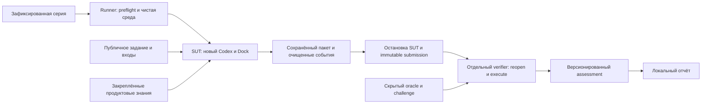

# Дизайн регрессионного benchmark Loginom

Дата: 10 сентября 2026. **Статус: цельный черновик для ревью, не согласованный итог.**
Последняя проверка согласованности: 11 сентября 2026.
Дополнено после rebase на `main` (`f223859b`): учтены Параметры полей,
Группировка и Сортировка. Новые benchmark-кейсы ниже пока не прошли live-проверку.
Источник требований: [rl-benchmark.md](../../../rl-benchmark.md).
Этот этап заканчивается дизайн-документом. Реализация benchmark, прогоны модели
и переход к writing-plans в него не входят. По отдельному поручению пользователя
установлен диагностический Playwright MCP для Chrome и проверено управление
живым Loginom; эта подготовка не является реализацией benchmark.

## 1. Рекомендуемое решение

Небольшой самостоятельный проект на TypeScript в `evals/`: последовательный
runner запускает **Codex CLI как первый SUT** в готовой контейнерной изоляции,
замораживает результат попытки, передаёт его отдельному программному verifier
и собирает локальный отчёт из неизменяемых результатов. Docker используется
как граница среды, существующие интерфейсы Dock — как продуктовые инструменты,
Playwright — для независимого наблюдения результата в Loginom. Основной агент
не изменяется ради прохождения тестов.

Главный компромисс: небольшой протокол попытки и отчёт придётся написать,
зато не потребуется подстраивать сохранение Loginom, семь исходов и независимую
проверку под чужую платформу. Готовые eval-системы не устраняют эту специфичную
работу. Резерв для первых двух дней — JSON и Markdown/CSV без графиков.
Независимость проверки и изоляция в резервном варианте сохраняются.

Предлагаемый baseline: **три сценария × три автономные попытки**, один профиль,
один стенд, без параллельных UI-сессий. Сначала один полный цикл на импорте,
затем вычисления и изменение существующего сценария. Низкая успешность SUT
является полезным результатом benchmark, а не основанием исправлять агента
или переписывать критерии во время серии.

Срок — пять рабочих дней, при пригодном для изоляции Loginom. Доступ к живому UI
подтверждён; изоляция, полный цикл сохранения и совместимость source runtime
на данном хосте ещё требуют проверки. Документ задаёт проверки допуска;
он не объявляет всё окружение готовым.

## 2. Что установлено исследованием

Основной checkout: `/home/kiselev/git/loginom-dock`, ветка `rl-bench`.
После rebase база `main` — `f223859ba7c0c83e105e721c26be67da18e167a3`,
HEAD до этой правки — `41469f24`. При фиксации SUT одного HEAD недостаточно.

| Подтверждённый факт | Следствие для дизайна |
| --- | --- |
| [Индекс подпланов](../../../docs/plans/loginom-dock/README.md) подтверждает 01–05, 07 и 08; полные обработчики: текстовый импорт, Калькулятор «Выражение», Параметры полей `scalar`, Группировка и Сортировка | A/B/C сохраняются как короткий набор; D/E добавляют проверку схемы, агрегатов и порядка. Фильтр строк06, Слияние09, Объединение10 и новые11–16 остаются planned; Excel и отдельный экспорт не включены |
| Аудиты [05](../../../docs/plans/loginom-dock/05-completion-audit.md), [07](../../../docs/plans/loginom-dock/07-completion-audit.md), [08](../../../docs/plans/loginom-dock/08-completion-audit.md) подтверждают 49/49, 49/49 и 56/56; обновлённый клиент установлен на Mac | Это доказательства соответствующих pins и окружения. Допуск текущей Linux-поставки и новых benchmark-fixtures проверяется отдельно; V4/V5 и публичный выпуск не объявлены завершёнными |
| Существуют pins, журналы raw UI, проверки полноты таблиц, execution identity и save/reopen | Переиспользуем форматы и подходящие нижние проверяющие функции; не создаём второй исполнитель узлов |
| Полный `calculator_node_acceptance.py` требует конкретный goal, fixture, формулы, manifest и четыре операции в одной сессии | Это регрессионный аудитор исторического сценария, а не готовый универсальный verifier нового benchmark |
| Клиент поддерживает Linux, требует Node 24.19.0; старый acceptance launcher требует macOS | Внешний TS-адаптер вызывает штатный клиент, не переносит Mac-only launcher целиком и не правит его |
| [Текстовый импорт](../../../client/lib/text-import-procedure.mjs) в `validateSettings`, строки 26–28, требует абсолютный `source_path` | Относительные пути не становятся условием первых кейсов. Verifier восстанавливает копии из frozen bytes последовательно под теми же абсолютными URI в run-owned области |
| Codex CLI 0.153.4 имеет `exec`, JSON events, ephemeral run и конфигурацию изолированного запуска; rootless Docker подтверждён read-only проверкой | Нет подтверждённого основания отвергать предпочтительный Codex. Контейнерный запуск с Dock и подпиской ещё предстоит проверить |
| Проверка путей на этом Linux-хосте нашла Hermes и конфигурацию Dock; активный Node — 22.16.0, отличный от требуемого Dock | Наличие файлов не подтверждает effective profile, pinned runtime или browser; их надо сверить перед серией |
| Диагностический Playwright MCP 0.0.80 подключён к Chrome 131.0.6778.204; Codex загрузил 30 его инструментов. В живом Loginom показана версия 7.4.2 | Проверены доступ и базовые UI-действия; это отдельная диагностическая среда, не подтверждение готовности pinned Dock runtime или полного verifier |
| Все четыре соседних репозитория доступны; чужие ветки прочитаны без checkout | Берём fixtures, UI-семантику и уроки изоляции; старого XML-агента и большой eval-контур не переносим |

Прочитаны проектные [правила](../../../AGENTS.md),
[handoff](../../../docs/loginom-dock/agent-handoff.md),
[состояние](../../../docs/loginom-dock/implementation-status.md),
[архитектура](../../../docs/loginom-dock/architecture.md),
[канонический план](../../../docs/plans/2026-09-02-loginom-dock-implementation-plan.md)
и [операции](../../../docs/loginom-dock/operations.md). Точные ревизии соседних
источников, ссылки на код и ограничения reuse сохранены в
[исследовании репозиториев](../research/2026-09-10-repository-evidence.md).
Локальная проверка CLI, подписочной авторизации и границ sandbox описана в
[исследовании исполнителя](../research/2026-09-10-executor-isolation.md).

Официальная Help подтверждает явный маркер Null и форматы
[текстового импорта](https://help.loginom.ru/userguide/integration/import/txt-csv.html),
ссылки на предыдущие
[выражения Калькулятора](https://help.loginom.ru/userguide/processors/transformation/calc/expression.html),
различие черновика и сохранённого пакета в
[меню пакетов](https://help.loginom.ru/userguide/interface/main-menu.html).
Сверены соответствующие TestCafe helpers и integration tests. Перенос всего
TestCafe не требуется; Playwright нужен только для нескольких операций verifier.
BatchLauncher из integration — полезный резерв, но его доступность и лицензия
на текущем Linux-стенде не установлены; он не является зависимостью MVP.

**Живая проверка 2026-09-10.** Первоначальное ограничение CUA
(`ERR_BLOCKED_BY_CLIENT`, Chrome unavailable) обойдено установкой запрошенного
Playwright MCP. Через его инструменты открыт документированный тестовый URL,
выполнен вход под документированным аккаунтом `user`, создан отдельный черновик,
перетащены узлы импорта и Калькулятора, открыты мастер текстового импорта,
редактор выражений и раздел «Файлы». Версия на странице — 7.4.2. Изолированный
диагностический Chrome запущен видимым с `viewport:null`; outer window
1920×1048 совпадает с доступным экраном, inner viewport — 1920×961.

Перетаскивание одним перемещением MCP не добавило узел; последовательность
промежуточных перемещений, согласующаяся с существующим обработчиком Dock,
сработала. Это наблюдение UI, а не изменение SUT. Данные не загружались,
вычисления, полное чтение таблицы, сохранение/reopen и reset/restore ещё не
проверены. Механика независимого verifier требует этих проверок на следующем
этапе. Версии, конфигурация и доказательства:
[проверка Playwright MCP](../research/2026-09-10-playwright-mcp-check.md).

OpenViking healthy; после отдельного разрешения прочитана запись kiselev о
предыдущем ревью промпта. Учтены разделение ролей и защита эталонов. Документы
и эталоны в память не публиковались; личная память автора не попадёт в SUT.

## 3. Готовые решения и три архитектуры

Первоначальные четыре кандидата проверены 2026-09-10 отдельным исследовательским
субагентом по официальным документам и GitHub. После вопроса пользователя
2026-09-11 добавлен DeepEval и уточнён Langfuse. Оценки трудоёмкости — инженерные,
без интеграционного запуска.

| Средство | Что подтверждено | Ограничение для этой задачи |
| --- | --- | --- |
| [promptfoo 0.123.0](https://github.com/promptfoo/promptfoo/releases/tag/0.123.0), MIT, локальные Node CLI/UI | Custom JS/exec provider, async assertion, repeat, concurrency и отключение cache; внешний CLI может сохранить свою подписку | Dock trace требует конвертера; изоляция и Loginom verifier остаются внешними. `retry` изменяет исходный eval, поэтому не владеет канонической историей. Добавочно 0.5–1.5 дня |
| [Harbor v0.22.0](https://github.com/harbor-framework/harbor/releases/tag/v0.22.0), Apache-2.0, Python ≥3.12, Docker | Installed/external agent, повторные trials, отдельная verifier environment; Codex adapter поддерживает existing auth.json | Стандартный adapter добавляет CLI flags и копирует полные session logs. Нельзя принять это как неизменный SUT и разрешённый capture. GUI/Loginom требуют адаптации. Добавочно 1.5–3 дня |
| [Inspect AI](https://github.com/UKGovernmentBEIS/inspect_ai/tree/84d2c14b47f1137bfa0021674c12a9613122ce35), MIT, локальный Python ≥3.10 | Solvers/scorers, Docker, epochs, rescore и viewer | Agent Bridge направляет вызовы модели через Inspect и меняет передачу generation/reasoning. Отдельный CLI без bridge возможен, но это свой адаптер. Добавочно 1.5–3 дня |
| [Langfuse v4.33.0](https://github.com/langfuse/langfuse/releases/tag/v4.33.0), MIT кроме ee, self-host | SDK experiments с task/evaluators, JS/TS, OTLP ingestion; это не только просмотрщик traces | Несколько сервисов хранения, свой runner/изоляция и конвертер Dock всё равно нужны; штатный repetitions в изученных docs не найден. Добавочно 1–2.5 дня |
| [DeepEval TS v0.9.13](https://github.com/confident-ai/deepeval/releases/tag/typescript-v0.9.13), Apache-2.0, локальная библиотека, TS SDK beta | Vitest/CLI, локальный trace viewer, собственный `BaseMetric` без LLM/API; внешний неизменённый CLI может вызываться тестом | Семь исходов и lifecycle остаются нашим контрактом; готовый Dock trace importer не подтверждён. Добавочно 0.5–1 день без полного переноса traces; готовые trajectory judges не заменяют saved-package verifier |

Произвольный provider/task в promptfoo и Langfuse позволяет вызвать CLI без
покупки LLM API; это вывод из интерфейса, а не проверенная здесь совместимость
с данной подпиской. В Harbor auth.json подтверждён исходниками. Никакой SaaS
и загрузки пользовательских данных в сторонний сервис в MVP не предлагается.
Подробные первоисточники, лицензии, pins и capture-ограничения:
[исследование готовых решений](../research/2026-09-10-eval-frameworks.md).

Три целостных варианта:

1. **Рекомендуемый: небольшой TS runner + готовая Docker-изоляция + свой
   Loginom verifier.** Канонические JSON, статический отчёт, один lifecycle.
   Меньше интеграций; ответственность за корректный lifecycle остаётся у нас.
2. **promptfoo как engine и UI**, внешний TS provider запускает тот же
   изолированный CLI, assertion вызывает тот же verifier. Быстрее получить
   viewer, но появляются две модели результатов. Все семь исходов сохраняются
   во внешнем журнале; cache off, concurrency=1, встроенный retry не используется.
3. **Harbor как trial engine**, собственный adapter сохраняет конфигурацию
   Codex/Dock и разрешённый capture. Выгоднее при большом числе сред и задач,
   но Python-оркестратор и адаптация GUI увеличивают объём первой недели.

Inspect и Langfuse не входят в критический путь. Выбор варианта 1 не запрещает
поздний экспорт очищенных данных, но dashboard, tracing platform и CI/CD не
становятся условиями первого результата.

**Уточнение Langfuse после ревью 2026-09-11.** Он технически подходит для
нашего внешнего TS task/evaluator и готового UI сравнения; наличие собственного
Loginom verifier требуется во всех архитектурах. Причина отложить Langfuse —
добавочные компоненты self-host и интеграция данных при первом наборе из девяти
попыток. Оценка 1–2.5 дня относится ко всему подключению, не к одной установке
Docker Compose, и пока не измерена. При уже доступном экземпляре или приоритете
интерактивного анализа с первого дня связка нашего lifecycle/verifier с Langfuse
обоснованна.

Внутриплатформенные [Code evaluators](https://langfuse.com/docs/evaluation/evaluation-methods/code-evaluators)
имеют лимит 2 секунды, не имеют network egress и сторонних библиотек: живой
Playwright verifier выполняется во внешнем процессе/SDK evaluator, затем
передаёт оценки. Это ограничение конкретного evaluator runtime, не всей платформы.
Семь исходов можно представить categorical scores; правила их расчёта остаются
у benchmark. Локальные datasets дают traces/scores без dataset runs, поэтому
полноценный UI сравнения требует отдельно закреплённой копии dataset на локальном
Langfuse и передачи SUT только публичной части. Подробности и источники добавлены
в [сравнение средств](../research/2026-09-10-eval-frameworks.md).

**DeepEval технически пригоден и впервые исследован 2026-09-11.** Это может
быть библиотека внутри того же TS-контура: внешний lifecycle запускает Codex,
независимый verifier проверяет пакет, custom metric представляет его результат
в DeepEval. Требовать Python, judge API или Confident AI для этого не нужно.
Готовый `TaskCompletionMetric` оценивает trace посредством LLM; он подходит
для дополнительной диагностики, но не доказывает сохранение/reopen/вычисления.
Полноценный Confident AI web UI и его Enterprise self-host отделены от бесплатной
локальной библиотеки; терминальный `inspect` доступен локально.

Основание пока сохранить минимальный TS-вариант — небольшой ожидаемый выигрыш
от готовых метрик для наших трёх программно проверяемых кейсов при необходимости
внешнего lifecycle/verifier в любом случае. Это оценка, не установленная
несовместимость: библиотеку можно выбрать, если ограниченная пробная интеграция
на следующем этапе подтвердит экономию на отчётах/диагностике. TS beta требует
закрепления версии, но сам по себе не повод отказа. Возможности и pins:
[исследование DeepEval](../research/2026-09-11-deepeval-followup.md).

## 4. SUT и роли

**SUT** — не только модель: executor Codex CLI; фактические model/provider/reasoning;
полные продуктовые инструкции и skills; tool catalog и их политики; исходники,
зависимости, конфигурация и native adapter Dock; закреплённые знания Dock;
Chromium/Playwright; Loginom build, лицензия, локаль и начальные ресурсы.
Подписка не делает запросы воспроизводимыми побитово: provider rollout,
скрытые serving-настройки и случайность фиксируются как uncontrolled/unknown.

Codex в текущей задаче — автор исследования и интерфейс оператора. Измеряемый
Codex — **новый CLI-процесс без контекста этой задачи**, с минимально нужным
штатным продуктовым окружением. Desktop task, worktree и collaboration-subagent
в общей рабочей области не являются измеряемой изоляцией.
Возможность программного запуска и подписочной авторизации подтверждается
[официальной документацией](https://developers.openai.com/codex/noninteractive/)
и [описанием авторизации](https://developers.openai.com/codex/auth/);
конкретные параметры CLI проверены локально, live model call не выполнялся.

Для Codex конкретная доступная модель не выбирается по имени «по умолчанию»:
до baseline требуется подтверждённый разрешённый профиль из конфигурации и
проверка фактических идентификаторов. Если их нельзя установить, запуск закрыт.
Не наследуем профиль исследовательского субагента и не меняем модель ради обхода
отказа. Для Hermes профиль уже определён:
`openai-codex / gpt-5.6-sol / low`, existing ChatGPT subscription, fallback нет.

Hermes остаётся обязательным для **отдельно заявляемой итоговой автономной
приёмки проекта**. Codex baseline измеряет Codex-профиль и не закрывает эту
приёмку. При необходимости отдельная Hermes-серия использует тот же контракт
задач, но другой `sut_profile_id` и отдельный отчёт. Успех процесса, summary
Hermes и ручная работа Codex не заменяют независимый audit полного результата.

| Роль | Доступ и ответственность |
| --- | --- |
| Автор case | До серии утверждает публичное задание, fixtures, oracle, контрпримеры; не помогает SUT во время попытки |
| Runner | Объявляет серию, готовит чистую среду, закрепляет условия, лимитирует и завершает процесс, принимает артефакт |
| SUT | Получает только пользовательское задание, публичные данные и разрешённые продуктовые средства; самостоятельно строит/меняет сценарий через UI Dock |
| Verifier | После остановки SUT открывает точный сохранённый пакет в новой сессии, выполняет и проверяет; не исправляет решение и не возвращает подсказки |
| Report builder | Читает сохранённые манифесты и assessments; не запускает агента или Loginom |

Независимого LLM-рецензента для каждого запуска отложить: малые fixtures имеют
программно проверяемый результат, дополнительная модель не устраняет главные
риски. Позднее допустим reviewer с чистым контекстом, рубрикой и ссылками на
свидетельства; его замечание не превращает обязательный FAIL в PASS.

## 5. Изоляция и проверка отсутствия утечек

Граница строится вокруг **всех каналов SUT**, а не вокруг папки с эталонами.
Будущая контейнерная конфигурация и сценарии проверок находятся в `evals/`;
продуктовая установка и конфигурация SUT не переписываются. Отдельное
диагностическое подключение MCP добавлено в локальный `.codex/config.toml`
по поручению пользователя, с сохранением подключения OpenViking. Изменяемые на уровне
эксперимента endpoint, state directories, allowed resources и account отражаются
как явные отличия профиля, а не скрытая правка SUT.

Минимальная схема: доверенный runner вне SUT; disposable rootless container
для Codex; отдельный контейнер для Dock MCP и браузера без model-auth mount;
отдельное окружение verifier; готовые сетевые/файловые ограничения.
Браузер, clipboard и профиль принадлежат только попытке. Системный X11/Wayland
socket хоста не монтируется: предпочтителен отдельный desktop display контейнера
с просмотром оператором. Visible Chromium запускается с `--start-maximized`,
`viewport:null`; фактическая геометрия проверяется. Headless не выдаётся за
проектную visible-приёмку.

Для авторизации выбран штатный механизм Codex: модельный процесс читает свой
auth, а native sandbox каждого встроенного tool subprocess запрещает чтение
auth и путей управления родительским процессом, включая доступ через `/proc`,
file descriptors и symlink. Escalation и запуск инструмента вне этой политики
запрещены. Dock/browser tools работают в отдельном контейнере, где auth вообще
отсутствует. Политика и её effective configuration закрепляются в манифесте.
Это выбранная механика, а не уже доказанная возможность установленного CLI:
готовое native enforcement внутри rootless-контейнера сначала проверяется
живыми canary через каждый доступный инструмент. Если nested sandbox не
обеспечивает границу, benchmark не запускается; разработка auth broker или
модификация Codex не включаются в недельный объём.

| Канал | Техническая граница | Проверка допуска до измерения |
| --- | --- | --- |
| Файлы, shell, Git | В SUT только отобранные byte-identical runtime/skills и публичный case; `.git`, `evals/private`, отчёты, история задач, соседние repo и домашний каталог не монтируются. Контейнер без Docker socket, host PID/net, privileged и host display | Через доступные shell/file tools попытаться прочитать контрольный скрытый файл, путь родителя, symlink и Git object; ожидается отказ |
| Контекст и память | Новый процесс, ephemeral history, чистые state/profile; нет памяти автора, auto-recall и результатов прошлых попыток. Продуктовая память при необходимости имеет фиксированный начальный снимок и изолированные записи | Контрольный маркер прошлой попытки не находится через доступные memory/session/search tools; список реально загруженных инструкций/skills сверяется с pin |
| MCP и знания Dock | Разрешены конкретные версии skill/catalog и проверенные Help/E2E fragments с dependency closure. Сначала использовать существующие ACL; при их недостаточности — узкий внешний allowlist-adapter существующего API, без нового импортёра/поисковика | Проверить list/read/search/find/grep/glob, пустой target, encoded URI, source-копии и ссылки. Область ограничивается до поиска, одного удаления URI из готового ответа недостаточно |
| Сеть и браузер | Egress ограничен провайдером подписки, назначенным Loginom и разрешённым Dock endpoint. Browser/MCP имеют собственные ограничения: sandbox Codex не покрывает их автоматически. Прямой обход Dock proxy запрещён | Попытки обратиться к hidden artifact endpoint, другой сессии/порту, direct Dock origin, file URL и forbidden redirect должны отказать |
| Credentials | Только существующая авторизация в контейнере Codex; модельный процесс читает auth. Native deny-read ограничивает auth и parent-control paths в каждом встроенном tool subprocess, escalation запрещён. Dock MCP/браузер — отдельный контейнер без этого mount | Через каждый доступный инструмент проверить canary auth, обходы через родительские paths, symlink, `/proc` и descriptors, а также отказ escalation; значения секретов не выводятся. Отсутствие подтверждённого native enforcement закрывает допуск |
| Loginom storage | Отдельный аутентифицированный benchmark principal с ACL либо полностью сбрасываемый тестовый экземпляр. В каждую попытку только public inputs/starter. Путь `/<account>/<run_id>` сам по себе не изоляция | Из UI и разрешённых file tools не видны эталоны, чужие и предыдущие пакеты. Нельзя сменить identity на более привилегированную через доступный passwordless login |
| Verifier и отчёты | Private expectations, challenge и assessments вне всех SUT mounts/ресурсов; отдельная browser session начинается после прекращения SUT | Canary private verifier недоступен агенту; новый verifier читает только переданный immutable submission и свои fixtures |

Документированный account `user` выбран оператором для прежней диагностики,
а не выведен из OS username. Для него ещё не доказана нужная ACL. Не создаём
аккаунт и не очищаем `/user` этой работой. Перед запуском оператор задаёт account
и разрешённый корень явно; если существующий account не даёт изоляции, нужны
выделенная identity/сброс тестового экземпляра. Один контейнер этого не исправляет.

Знания Dock проверяются на тексты задач, fixture hashes, готовые решения и старые
acceptance reports. Берутся новые небольшие данные, а не известный sales fixture
или старый `calc-data-double` целиком. Product Help и нужные E2E helpers сохраняются.
Разрешённый набор и исключения pin-ятся; результаты относятся к этому профилю
знаний. Независимая от сценария семантика Help допустима; готовый ответ данного
case в доступных ресурсах делает серию загрязнённой.

Архив после `dock_prepare` может записываться штатным механизмом Dock; чтение
таких архивов/новой памяти следующими попытками запрещается на серверной или
внешней границе. Не ограничиваемся очисткой локального HOME. По завершении серии
не публикуем verifier/gold в общую память.

Canary проверяет перечисленные каналы, но не доказывает отсутствие неизвестных
уязвимостей контейнера или скрытого знания провайдера. Непроверенная обязательная
граница запрещает статус `benchmark_valid=true`: возможен только явно отдельный
диагностический запуск, который не входит в baseline и не выдаётся за полную
проектную приёмку.

## 6. Поток данных и протокол попытки



Runner заранее создаёт `series_id`, полный список слотов выбранного набора:
для `core-v1` — девять, порядок `A1,B1,C1,A2,B2,C2,A3,B3,C3`;
для `extended-v1` — пятнадцать по §7. Seed/порядок фиксируются до старта. Первый smoke
при разработке помечается `diagnostic`; он не добавляется в baseline задним числом.
Каждая запланированная попытка имеет собственный `run_id`, даже если не дошла
до старта модели. Транспортный повтор и новая автономная попытка — разные события.

Последовательность одной попытки:

1. Захватить lease стенда и host-wide clipboard lock/координацию с другими Dock
   сессиями; подтвердить account/root, отсутствие чужой активности и чистый start.
2. Проверить изоляцию, модельный профиль, runtime/knowledge/verifier pins,
   доступность Loginom и корректность fixture; создать приватный manifest.
3. Доставить только public task/data/starter; запустить новый SUT без resume.
   Самостоятельные исправления разрешены в рамках неизменного бюджета.
4. По завершении или лимиту остановить принадлежащий попытке локальный process
   tree и независимо проверить её процессы выполнения на сервере Loginom.
   Если они ещё активны, отменить только executions с подтверждёнными
   run/account/package/node identity; общий stop чужих задач запрещён.
   Доверенный observer подтверждает terminal/idle серверного состояния и
   отсутствие дальнейших записей, затем закрывается SUT session. Только после
   этого замораживаются пакет и inputs: точный путь, байты/SHA-256, время,
   принадлежность run и список файлов. Неопределённое владение процессом или
   неподтверждённый idle блокируют freeze, verifier и следующие попытки.
5. После проверки сохранённого вне Loginom immutable оригинала controller
   сбрасывает только подтверждённую run-owned область и восстанавливает её копию
   из frozen bytes под теми же абсолютными URI и тем же выделенным benchmark
   principal. Новый `workspace_generation_id`, независимое чтение восстановленных
   байтов/SHA и новая verifier session связывают проверку с этой копией saved
   artifact. Verifier выполняет её без исправлений параметров или графа.
   Для B/C следующая generation повторяет reset/restore с теми же байтами пакета
   и заранее закреплённым challenge input; протокол подробно задан в разделе 8.
6. Подтвердить завершение также принадлежащих verifier серверных executions;
   записать новый immutable assessment, затем выполнить ограниченную уборку
   только ресурсов с owner/run marker. Ошибка уборки или неподтверждённый
   server idle фиксируются отдельно и блокируют следующий старт; уже доказанный
   результат не переписывается.

Capture, timeout и lifecycle не зависят от произвольного текста ответа агента.
Сериализация замораживания и чтения защищает от проверки файла, который агент
ещё дописывает. При передаче verifier доверенный controller проверяет regular
file, отсутствие symlink/path traversal, размер и SHA; SUT не выбирает путь к
private verifier или исполняемый проверяющий код.

Манифест включает schema version, series/run/case/attempt IDs, parent attempt
для повторов; task/public data/starter/private oracle/challenge hashes;
SUT profile и пофайловые dirty hashes; runtime artifact/build inputs; фактические
модель/provider/reasoning; tool/skill/catalog/resource pins; executor/browser/Node/
Loginom versions; account и storage root; начальное состояние; isolation report;
`workspace_generation_id`, predecessor generation, exact resource manifest,
quiescence/reset/restore receipts и hashes независимо прочитанных обратно копий;
локаль, timezone, ограничения; версии runner/verifier и status timestamps.
Секреты, auth payload, скрытые рассуждения и system prompt body в manifest не
попадают; инструкции подтверждаются хешами отобранных источников. Недоступный
параметр обозначается `unknown`, а не выдуманным значением.

Предлагаемые пределы до фиксации серии: preflight 5 минут, A — 12 минут и
60 внешних tool calls, B — 18 минут/100 calls, C — 20 минут/100 calls;
verifier — 10 минут на обычное выполнение и challenge вместе; graceful local
stop — до 60 секунд, отмена/подтверждение idle серверных executions — ещё до
60 секунд. Истечение stop-бюджета оставляет стенд заблокированным для следующих
попыток. Верхняя граница 3×3 с подготовкой/проверкой — около пяти часов
стенда, без обещания доступной квоты подписки. Model-call count дополнительно
измеряется; hard cap вводится только если доступен полный online counter.

До первого измерения диагностический smoke проверяет разумность лимитов;
изменение лимитов после начала baseline требует новой версии протокола.
При исчерпании подписки серия приостанавливается с явными неисполненными слотами,
fallback и покупка API не выполняются автоматически.

Транспорт: повторять read-only запрос не более двух раз с backoff 1/3 секунды
внутри того же бюджета. Для мутаций повтор разрешён только при подтверждённом
idempotency key и reconciliation состояния/receipt; неизвестный исход UI
не вызывает слепое повторение. Внутренние retries штатного SUT не изменяются,
но их политика и доступные счётчики фиксируются. Ручная помощь завершает
автономность попытки; её продолжение — только отдельная диагностика.

## 7. Первые три сценария

A/B/C — короткая серия `core-v1` (9 попыток). После проверки новых кейсов
доступна отдельная расширенная серия `extended-v1`: A–E по три попытки
(15 слотов), с порядком A1,B1,C1,D1,E1 → A2,…,E2 → A3,…,E3.
Выбор набора фиксируется до измерений. D/E не добавляются задним числом
в знаменатель уже начатой серии; сравнение возможно по совпадающим кейсам
при выполнении остальных условий сопоставимости из §9.

Все кейсы требуют самостоятельного построения/изменения через штатный Dock UI,
сохранения по явному пути, закрытия и повторного открытия результата. Публичная
задача содержит все условия PASS; скрываются ответы и проверяющий код.
Порядок строк не требуется, если не указан явно: сравнивается мультимножество
с сохранением дублей. Порядок столбцов ниже требуется публично.

| Case | Публичная задача и start | Скрытая обязательная проверка | Неверный контрольный результат |
| --- | --- | --- | --- |
| A `import-schema-null/v1` | Новый пакет. Импортировать UTF-8 CSV, `;`, кавычки, decimal `.`, Null `\N`, явные типы; сохранить все шесть строк и поля без преобразования | Saved identity; reopen/fresh execute; все 6×5 значений, типы, имена/метки и порядок полей; Null ≠ empty; дубли | `\N` стало строкой, empty стало Null, потерян дубль, тип изменён или настройки остались только в черновике |
| B `calculate-fields/v1` | Новый пакет. CSV → Калькулятор «Выражение»: Amount из Qty×Price, Adjusted из Amount+0.25, Note из Comment; сохранить исходные поля/строки. Использовать предоставленный абсолютный путь входа | Все 6×8 значений и схема после reopen; обязательный Калькулятор; восстановленная копия и hidden input challenge, включая новые значения и Null/empty | Неверный знак/округление, константы под public fixture, потерян дубль, Note подменяет пустую строку Null, ссылка на другой вход |
| C `edit-calculation/v1` | Публичный starter CSV → существующий Калькулятор с Amount=Qty×Price. Изменить именно его поле Amount на сумму со скидкой 10%, без переименования; сохранить под новым путём исходные поля/строки и остальные элементы. Предоставленный абсолютный путь входа сохранить | Starter hash неизменен; изменён требуемый existing node без дубля; новая семантика выхода/схемы, восстановленная копия, fresh execute и challenge | Старая формула, новый дублирующий расчёт вместо изменения, потеря исходного поля, перезаписанный starter, ссылка на другой вход |

Для A размер/схема/тип/Null — контракт импорта, а не snapshot preview. Для B/C
полный graph/XML не сравнивается побайтно. Имена выходов/required component и
изменение existing node проверяются, потому что явно нужны в заданиях; внутренние
GUID, расположение и эквивалентная запись формул не задают успех.

C не затрагивает известный дефект переименования expression с настроенным
mapping. Это ограничение выбранного пилота, а не утверждение, что дефект исправлен.
Starter создаёт автор через реальный UI до серии; он содержит старую законченную
задачу и не содержит нового ответа. Его пригодность проверяет отдельный verifier.
В публичном run layout `starter.lgp` и сохраняемый `result.lgp` находятся рядом
с каталогом `input/`; исходный starter не перезаписывается. Путь источника задан
явным абсолютным URI Loginom. Переносимость на другой путь от SUT не требуется;
verifier копирует тестовые ресурсы последовательно с сохранением исходных URI.

### D/E: расширение под новые обработчики

Это проекты новых контрактов, не результаты выполненных проверок. До допуска
автор проверяет fixtures и known-good пакеты в Loginom, фиксирует oracle и
контрпримеры; SUT получает только публичную часть. Повторное открытие, fresh
execution и последовательные public/challenge generations обязательны как в B.
Успех старых продуктовых аудитов не заменяет эту подготовку.

**D `field-schema/v1` — Параметры полей.** Публичная задача: импортировать
заданный UTF-8 CSV с полями Id (целое), Qty (целое), Comment (строка),
Debug (строка); через «Параметры полей» переименовать Qty в Quantity,
дать ему метку «Количество», преобразовать целое в вещественное, исключить
Debug и вывести Quantity, Id, Comment в этом порядке. Сохранить все строки,
дубли, Null и пустые строки, исходные значения Id/Comment и их метки.
Сохранить пакет по предоставленному пути, вход не изменять.

Fixture — шесть строк с отрицательным, нулевым и положительным Qty, одним
Null в Qty, Null и пустой строкой в Comment, одной полной дублирующейся
строкой. Целые ограничены диапазоном точного представления binary64.
Verifier проверяет весь выход 6×3, имена, метки, типы, порядок полей,
отсутствие Debug и наличие требуемого узла. Oracle независимо проецирует
строки и преобразует Qty; hidden challenge меняет значения и число строк
при сохранении входной схемы. Контрпримеры: изменена только метка вместо
имени, Quantity остался целым, потерян дубль, Null заменён нулём, Debug
только скрыт в визуализаторе, а не исключён из выходной схемы.
Не включаем в первый D неоднозначные строковые/датовые конверсии; полная
матрица 25 переходов остаётся продуктовой приёмкой, а не контрактом этого case.

**E `aggregate-ranking/v1` — Группировка и Сортировка.** Публичная задача:
импортировать Id (целое), Category (строка), Qty (целое), Price (вещественное),
вычислить Amount=Qty×Price Калькулятором, Группировкой получить сумму Amount
по Category с именем Total (вещественное). Сортировкой упорядочить весь
результат по Total DESC, затем Category ASC, сравнение строк без локали,
с учётом регистра. Выход — Category, Total. Сохранить пакет и не менять вход.
Дубли учитываются как отдельные продажи; запрещено подставлять готовые итоги.

Fixture — восемь строк, три категории из латинских ASCII-букв одного регистра,
положительные/нулевые/отрицательные Qty, одна полная дублирующаяся строка;
Null во входах E отсутствует. Цены кратны 0.25, суммы двух категорий равны:
это проверяет второй ключ, не вводя неопределённость collation и Null-order.
Независимый oracle вычисляет Amount, суммы и сортировку; verifier проверяет
все три строки и два поля, точную последовательность, полный состав групп,
типы и присутствие требуемых компонентов. Допуск чисел — как в B; сами
равенства для tie-break заданы точно представимыми значениями.
Challenge меняет суммы, число категорий и лидера, сохраняя схему и хотя бы
одну пару равных итогов. Контрпримеры: count вместо sum, удалён дубль,
ASC вместо DESC, отсутствует второй ключ, выведен только лидер,
сохранены старые итоги после изменения входа. Граф не сравнивается побайтно.

Для D/E требуются новые данные: fixtures и готовые рейтинги продуктовой
приёмки не копируются. В knowledge contamination scan добавляются источники
05/07/08 и отчёты продаж. Тесты verifier обязаны отвергать перечисленные
контрпримеры до первой измеряемой попытки. Pure-аудиторы схемы, группировки
и сортировки можно переиспользовать после проверки их входного контракта;
целые goal-specific acceptance scripts не становятся oracle этих кейсов.

Предварительные бюджеты: D — 18 минут/100 внешних вызовов, E — 25 минут/140;
verifier каждого — 10 минут на public и challenge вместе. Проверить лимиты
на диагностическом smoke и заморозить до серии. Расширение добавляет шесть
попыток: суммарный верхний бюджет стенда около 9 часов вместо 5, плюс подготовка
двух fixtures, oracle и негативных проверок. Оно не помещается автоматически
в прежнюю оценку 28–40ч: недельный приоритет остаётся полный цикл A, затем B/C;
D/E допускаются после готовности их независимых проверок с отдельной оценкой
срока. Неподготовленные D/E не заменяются частичным preview под видом PASS.

### Полный контракт B: публичная часть

Текст, который получит SUT после подстановки run-specific путей:

> Создай пакет Loginom из предоставленного файла
> `<storage_root>/<run_id>/input/sales.csv`, используя этот абсолютный путь.
> Кодировка UTF-8, разделитель `;`, текст в двойных кавычках, заголовок в первой
> строке, десятичная точка, `\N` означает Null, пустая строка остаётся пустой.
> Поля: Id — целый, Qty — целый, Price — вещественный, Comment — строковый,
> Region — строковый. Имена и метки совпадают. Используй Калькулятор в режиме
> «Выражение»: Amount — Qty, умноженное на Price; Adjusted — Amount плюс 0.25;
> Note — «нет», если Comment равен Null, иначе Comment с добавленным `!`.
> Amount и Adjusted — вещественные, Note — строковый. Выведи поля в порядке
> Id, Qty, Price, Comment, Region, Amount, Adjusted, Note. Сохрани все строки,
> включая дубли; сортировать их не требуется. Расчёт должен работать для других
> строк того же входного формата, без подстановки готового результата.
> Сохрани пакет как `<storage_root>/<run_id>/result.lgp`, закрой его, открой
> сохранённый пакет, выполни заново и проверь выход. Путь источника сохрани
> указанным выше; исходные данные не изменяй.

Предлагаемые **публичные данные** (проект fixture, ещё не live-проверенный файл):

```csv
Id;Qty;Price;Comment;Region
1;2;12.50;ок;Север
2;0;7.25;"";Юг
3;-1;8.00;\N;Север
4;3;0.00;дубль;Запад
4;3;0.00;дубль;Запад
5;2;1.10;"a;b";Восток
```

Для A те же исходные поля в том же порядке, без трёх вычисленных; его публичное
задание отдельно фиксирует все описанные форматы. C получает те же входы и
подготовленный starter, но отдельный task/hash.

### Полный контракт B: только проверяющий контур

Ожидаемые тройки `(Amount, Adjusted, Note)` по порядку строк fixture:
`(25,25.25,"ок!")`, `(0,0.25,"!")`, `(-8,-7.75,"нет")`,
`(0,0.25,"дубль!")` два раза, `(2.2,2.45,"a;b!")`.
Исходные пять полей сохраняются, Null в Comment третьей строки остаётся Null.
Значения вычисляются отдельным простым oracle из исходных байтов и сверяются
с вручную рассчитанной контрольной таблицей; код SUT не импортируется в oracle.

Целые/строки/Null и число строк — точно; вещественные:
`abs(actual−expected) ≤ 1e-9 + 1e-12×abs(expected)`. NaN/Infinity запрещены.
Тип `integer` не заменяется на `real` только из-за одинакового отображения.
Данные без дат: не вводим неоднозначности timezone в первый набор.
Допуск и нормализация задаются до серии, не выбираются по полученному результату.

Скрытый challenge содержит новые Id, положительные/нулевые/отрицательные Qty,
другие Price и Comment, повторяющуюся строку, Null и empty. Набор и ожидаемые
значения фиксируются до baseline. В данном документе числовой ответ challenge
не нужен: он хранится только в `evals/private/`, недоступном SUT. Этот дизайн,
содержащий public-fixture ответы, также не включается в SUT image или знания Dock.

Обычная проверка и challenge завершаются отдельными machine-readable checks
с expected/actual/ref. Уборка удаляет только run-owned Loginom-копии после
фиксации доказательств, сохраняет original submission/assessment локально и
не трогает канонический starter вне run-owned области или файлы другого владельца.

## 8. Независимый verifier и надёжность доказательства

PASS требует одновременно: соответствия контракту попытки, существующего
сохранённого пакета по заданному пути, immutable binding к его SHA, успешного
открытия в **новой verifier session**, нового выполнения и полной проверки всех
малых таблиц. Свежий execution подтверждается сменой process/execution identity
и завершением нужного узла. Использование старого cache/preview без доказательства
нового выполнения не проходит.

Рекомендуемый observer — небольшой Playwright-модуль в `evals/`, который открывает
пакет, выполняет уже настроенный сценарий, читает schema/types и все ячейки
native таблицы с точностью и Null semantics. Он не вызывает configure-операции
SUT и не выводит expected из `node.apply` result. E2E selectors и Python
evidence helpers используются только там, где подходят контракту новой сессии.
Журнал SUT остаётся дополнительным свидетельством и материалом диагностики.

Verifier выполняет пакет только в ограниченной тестовой среде с доступом к
назначенным inputs. Повреждённый/не соответствующий контракту пакет отклоняется;
неизвестные внешние зависимости не исполняются на host с доступом к private gold.
Исходный submission не переписывается. Временные runtime effects наблюдения
и выполнения не сохраняются обратно как исправленное решение.

Выбрана **последовательная копия изолированных run-owned ресурсов под теми же
абсолютными URI**. Одновременно исходная среда SUT и verifier-копия в Loginom
не существуют; неизменяемый оригинал submission и входов хранится вне Loginom
в недоступном SUT хранилище controller. Это позволяет сохранить обязательные
для нынешнего Dock абсолютные source paths без изменения пакета или SUT.

Каждая материализация имеет новый `workspace_generation_id`:

1. `sut`: controller фиксирует начальные public bytes и exact resource manifest.
   После попытки он останавливает локальные и принадлежащие ей серверные
   executions, закрывает/отзывает старые SUT sessions и независимо подтверждает
   quiescence. Затем скачивает saved submission, текущие inputs и public starter,
   если он предоставлялся, фиксирует их байты/SHA вне Loginom и до reset проверяет
   неизменность исходных публичных данных/starter относительно начальных hashes.
   Несохранённый черновик не заменяет saved submission.
2. `verify-public`: только после подтверждения frozen копии controller сбрасывает
   точную run-owned область, независимо подтверждает отсутствие прежних файлов
   и открытых документов, затем восстанавливает package и public inputs из
   frozen bytes под теми же URI и тем же выделенным benchmark principal.
   Независимый read-back должен подтвердить SHA пакета и всех inputs.
   Новая verifier session открывает восстановленный saved пакет, выполняет
   его заново и связывает весь результат с generation и новым execution id.
3. `verify-challenge`, только B/C: после terminal/idle и закрытия предыдущей
   verifier session controller снова сбрасывает ту же область и восстанавливает
   новую копию. Пакет остаётся побайтно тем же; вместо public CSV под исходным
   абсолютным URI размещается предзаданный challenge snapshot. Read-back hashes,
   новая session и новое выполнение подтверждают результат именно этой generation.

Для каждого перехода сохраняются predecessor generation, owner/account,
URI→SHA manifest, quiescence/reset/restore receipts и read-back evidence.
У каждой generation отдельный immutable manifest со ссылкой на исходный run;
новый этап не перезаписывает сведения о предыдущем.
Server-side копия расходуема; frozen оригинал вне Loginom никогда не
перезаписывается, даже после verifier error. Само совпадение URI не считается
доказательством восстановления. Вызовы verifier не меняют XML, выражения,
источники или другие настройки пакета и не сохраняют runtime effects обратно.
Зависимости пакета должны вести только к объявленным run-owned inputs.

Сброс ограничен exact manifest ресурсов с подтверждённым owner; общий `/user`,
другие попытки и чужие файлы не удаляются. Если найдена неопределённая зависимость,
не доказаны ownership/quiescence/reset или hash восстановленной копии отличается,
следующая generation и следующий SUT не запускаются; область изолируется для
разбора. Между generations lease не отпускается, SUT не возобновляется и его
каналы доступа не восстанавливаются. Challenge и результаты verifier убираются
до допуска очередной попытки. Fresh process/execution proof исключает принятие
кеша вместо нового расчёта; число generation само по себе его не доказывает.

Механика reset/restore проверяется на A до baseline; это небольшая работа с
принадлежащими одному запуску файлами и сессиями, не клонирование всего Loginom
или разработка общего server namespace. Если public-generation не удаётся
доказать, baseline не запускается. Если обычная копия доказана, но challenge
не готов в срок, недельный набор сокращается до A×3, B/C переносятся.
Серия B/C без challenge не подменяет этот контракт.
Случайный дополнительный input не является доказательством для всех возможных
данных, но исключает примитивную подстановку известных строк.

Сам verifier принимается на корректном пакете, независимо подготовленном и
проверенном в Loginom, и на повреждённых копиях: неверная ячейка, тип, Null/empty,
дубль, missing column/page, устаревший execution, неверный путь/SHA, несохранённые
настройки, неоткрываемый пакет, hardcoded public result. Контроль формул не должен
отклонять семантически эквивалентное решение, разрешённое заданием.
Отсутствующий обязательный check или его `unknown/skipped` никогда не дают PASS.

## 9. Исходы и метрики

Attempt lifecycle, validity и assessment хранятся раздельно; у строки есть один
основной outcome и конкретные reason/evidence. Классификация не зависит от того,
выгодно ли исключение знаменателю SUT.
`benchmark_valid` имеет значения true/false/unknown и собственные reason/evidence;
invalid и unknown показываются отдельно от семи outcomes. Обнаруженная после
попытки утечка не удаляет её исходную запись: новая версия validity исключает
её из метрики качества с сохранением прежней оценки и объяснением причины.

| Outcome | Точное правило |
| --- | --- |
| `PASS` | SUT закончил автономно в бюджете, среда допустима, все обязательные проверки точного submission прошли |
| `FAIL` | К завершению попытки осталось доказанное нарушение публичного условия, ошибка SUT или отсутствующий/повреждённый/неверный артефакт; либо произошло необратимое нарушение протокола, например вмешательство в запрещённые ресурсы. Ошибка парсера на нарушающем контракт submission тоже FAIL. Неатрибутированный сбой, прервавший попытку после старта, по умолчанию остаётся non-success FAIL с `cause=unattributed`, до отдельной доказанной переоценки |
| `TIMEOUT` | SUT не завершил задачу до wall-clock/action лимита при отсутствии ранее доказанной иной причины; остановлен runner. Сохранённый промежуточный пакет не превращает timeout в PASS |
| `INFRA_ERROR` | Есть независимое свидетельство внешнего сбоя: недоступность стенда, auth/subscription quota, неисправность host/network/setup; не ошибка в запросе или действии SUT. Без свидетельства инфраструктурная классификация запрещена |
| `VERIFIER_ERROR` | Дефект проверяющего кода/сборщика, его собственный timeout либо недостаточная независимая проверка на допустимом submission. Невалидный submission сначала классифицируется как FAIL; плохой парсер не оправдывает SUT |
| `ABORTED` | Оператор явно остановил попытку или внёс помощь до нормального завершения; фиксируется причина и стадия. Уже установленный FAIL/TIMEOUT не скрывается последующим abort |
| `NOT_RUN` | Объявленный слот вообще не исполнялся: серия остановлена, бюджет не выделен либо prerequisite не готов. Если preflight был начат и реально обнаружил инфраструктурный сбой, исход его слота — INFRA_ERROR |

Ошибки, исправленные самим SUT внутри бюджета, и отклонённые tool calls
остаются событиями trace, а не конечным FAIL. До завершения попытки сохраняется
возможность самокоррекции, кроме необратимых нарушений протокола. Установленный
при завершении FAIL либо необратимое нарушение до внешнего сбоя сохраняются;
последующий сбой добавляется отдельным событием. При конфликте причин сохраняются
их время и основание выбора. Неполный verifier не маскируется под PASS
и не списывается на инфраструктуру без свидетельства.

Основные показатели по каждому case и всему набору:

- `valid_PASS / planned`, где `valid_PASS` — количество PASS с
  `benchmark_valid=true` в выбранной версии оценки. Это доля подтверждённых
  успехов среди **всех объявленных слотов**; при 3×3 знаменатель остаётся 9,
  включая invalid/unknown и все неисполненные попытки. Рядом — полная раскладка
  семи исходов и отдельная раскладка validity.
- `valid_PASS / N_evaluable`, где `N_evaluable` — количество попыток с
  `benchmark_valid=true` и outcome из PASS/FAIL/TIMEOUT. Invalid/unknown,
  INFRA_ERROR, VERIFIER_ERROR, ABORTED, NOT_RUN явно исключены с причинами
  и отдельными числами. Невалидность не является восьмым outcome. Если
  знаменатель ноль, результат `unknown`, не 0% или 100%.
- Длительность SUT и verifier отдельно, median/range при такой выборке,
  внешние tool calls, model/API calls, внутренние retries и группы ошибок.
  Время timeout видно как ограниченное бюджетом наблюдение.
- Токены только по доступным данным с описанием provider accounting;
  cache/reasoning могут быть частями других счётчиков и не суммируются повторно.
  Недоступные значения `unknown`. Цена подписочного запуска в долларах не
  вычисляется из токенов как будто это API-счёт.

Не используем лучший из N/pass@k как основной показатель. Для долей показываем
95% Wilson interval и `n`: даже 3/3 дают примерно 44–100%. Для объединения
разных кейсов pooled interval только описательный — это неоднородная малая
выборка, а не доказательство превосходства. По трём повторам сильные выводы
об улучшении не делаются.

Сравнение двух серий разрешается при совпадающих task/data/oracle/challenge,
budgets, runner/verifier, isolation, Loginom и условиях знания, кроме заранее
объявленного изменения SUT. Report показывает все различия и статус
`comparable/limited/not_comparable`; новый executor не смешивается со старым.
Первому baseline не нужна искусственная вторая версия агента.

## 10. Артефакты, история и trace

Минимум на попытку: приватный manifest, immutable submission `.lgp` либо
проверяемая controller-ссылка и SHA, input/starter hashes, isolation/setup
report, очищенный trace, machine-readable checks и краткая строка отчёта.
Все evidence refs связаны с run и assessment version. Артефакт, оставшийся
только по изменяемой серверной ссылке, без фиксированного snapshot не достаточен.

Пример строки — **иллюстрация схемы, не результат выполненного теста**:

| Run | Case | Outcome | Причина | SUT / verifier | Свидетельства |
| --- | --- | --- | --- | --- | --- |
| illustrative-B-02 | calculate-fields/v1 | FAIL | строка 3: Note отличается от «нет» | 8м12с / 2м05с | manifest → submission SHA → reopen execution → check `note-null` |

Runner читает существующие доступные event interfaces и stdout-потоки в памяти,
пропускает только разрешённые типы, редактирует чувствительные данные **до**
записи и любой отправки. Содержательный capture начинается лишь после успешного
`dock_prepare`, с инициировавшего пользовательского сообщения; до него допустимы
только технические lifecycle metadata. Полные system prompts, скрытые reasoning,
auth, browser profiles и бинарные данные не включаются в архив. Если CLI сам
сохраняет такие логи, нужен ephemeral/tmpfs путь и проверка штатного отключения
сохранения без изменения модельного поведения; сырой session log не копируется.

Пакет и разрешённый screenshot — отдельные контролируемые тестовые артефакты,
не бинарные части архива диалога. Raw secret fixtures/credentials отсутствуют.
Статический отчёт экранирует недоверенный текст SUT и не исполняет HTML из trace.

Повтор всегда получает новый run_id и parent reference. Исправленный verifier
создаёт `assessment/v2` рядом с `v1`, не переписывает исходные evidence и outcome.
Отчёт явно выбирает assessment version и показывает, какие результаты изменились.
Предыдущие оценки доступны. Для полного нового verifier run нужны immutable
пакет и inputs; если они не сохранены, исторический PASS задним числом не строится.
Отчёт пересобирается offline из этих файлов без модели и Loginom.

## 11. Минимальный состав внешнего проекта

Это границы будущих модулей, **не созданный scaffold и не implementation plan**:

| Область в `evals/` | Назначение и публичный контракт служебного кода |
| --- | --- |
| `package.json`, lockfile, `src/cli.ts` | Отдельный TS-проект; команды preflight/run/verify/report/compare; frozen release зависимостей |
| `src/manifest.ts`, `src/runner.ts` | Проверка manifest, объявленный schedule, lifecycle, бюджеты, остановка, append-only outcomes |
| `src/executors/codex.ts` | Запуск штатного CLI; публичное задание на входе, events/termination/submission refs на выходе; без скрытого oracle и изменения SUT |
| `src/environment.ts`, `sandbox/` | Готовая контейнерная среда, leases, allowlist, clean start/teardown и canary; endpoint/profile параметризованы |
| `src/capture.ts`, `src/artifacts.ts` | Capture gate/redaction, atomic immutable receipt и SHA, безопасные пути, доступ к evidence |
| `src/verifier/loginom.ts`, `src/verifier/compare.ts` | Новая verifier session, fresh execution/full observations; типизированное сравнение с независимым oracle |
| `src/report.ts` | Offline outcome table, простые диаграммы и сравнение условий; Markdown достаточен для первого цикла |
| `cases/*/public/`, `private/*/` | Задания/inputs/starters отдельно от gold/oracle/challenge; разделение обеспечивается mounts/ACL, а не названием каталога |
| `tests/`, `runs/`, `docs/` | Быстрые harness tests, неизменяемые результаты, исследование/дизайн/инструкция. Raw runs исключаются из Git |

Новые Python-модули по умолчанию не нужны. Подходящие существующие pure
auditors можно вызывать как read-only dependency с точным hash и без записи
`__pycache__` вне `evals/`; их контракт и входы сначала проверяются. Не копируем
огромный XML eval runtime и не переписываем executor Dock.

## 12. TDD и недельный объём

Для будущего служебного кода выбран
[mattpocock TDD, commit 3cca18b368ae95cdbdebbff572ccafa662551015](https://github.com/mattpocock/skills/blob/3cca18b368ae95cdbdebbff572ccafa662551015/skills/engineering/tdd/SKILL.md).
Исследователь прочитал SKILL.md, tests.md и mocking.md. Локальный одноимённый
skill прочитан и **не совпадает побайтно**; в upstream refactoring перенесён
на review-stage. Здесь приоритет у требования пользователя:
тест наблюдаемого поведения → подтверждённый RED → минимальный GREEN → refactoring.
После правки — затронутые тесты, после законченного среза — все быстрые harness
tests. Модельные прогоны имеют отдельный бюджет и не заменяют TDD.

Именно контракты из предыдущей таблицы — согласуемые публичные границы тестов.
Особенно важны late write и активный серверный execution после local stop,
неподтверждённый server idle, lost response без duplicate mutation,
невалидный submission против verifier bug, неполная таблица, повтор с новым ID,
секрет до redaction, неподтверждённая изоляция, исключение invalid из числителей
обеих долей и знаменателя качества при сохранении planned, восстановление
неверных bytes/URI, перепутанные generations, reset чужого ресурса и offline
rebuild отчёта.
Тесты только названий/строк документации не создаются. Моки проверяют служебную
логику, но не считаются проверкой реального сохранения, clipboard или ACL.

Поиск skills.sh ai/eval выполнен; конкретные Langfuse и agentic-evaluation
SKILL.md прочитаны. Их зависимости и широкие workflows не упрощают выбранный
MVP, поэтому они отложены. Ни один новый skill не добавляется в SUT.
Pins и различия записаны в исследовании готовых средств.

| День / оценка | Проверяемый результат | TDD и зависимости |
| --- | --- | --- |
| 1, 6–8ч | Доступный живой UI; выбранный account/root; frozen Codex/Dock profile; native deny-read и отдельный Dock/browser container проверены canary; один case A от запуска до submission | RED на leak/escalation, wrong profile, missing submission и local/server lifecycle; GREEN минимального среза. Зависит от рабочего стенда, auth, nested native sandbox и совместимого pinned client |
| 2, 6–8ч | Один полный реальный цикл A: frozen оригинал вне Loginom, server idle, ограниченный reset/restore public-generation под теми же URI с read-back SHA, отдельный reopen/execute/full compare, immutable assessment и offline отчёт; known-good и повреждённый пакет | RED на late write, неверного owner, несовпавший restored SHA, stale execution, неверные тип/Null/значение, неоткрываемый/несохранённый пакет; live check после source tests. Это первый полезный результат |
| 3, 6–8ч | B с новой challenge-generation на уже проверенной механике reset/restore; C добавляется при оставшемся времени на проверенный starter и existing-edit verifier. Если challenge не готов — подготовка A×3 и усиление его verifier | RED на hardcoded output, перепутанные generation/input snapshot, потери дублей, старую формулу/перезапись starter. Доработка SUT и клонирование всего Loginom не выполняются |
| 4, 6–8ч, включая последовательные live-прогоны | Замороженный пригодный набор 3×3, A/B×3 или A×3 и baseline; проверены timeout, infra/verifier error, validity, canary и clean restart | Состав объявлен до первого измерения; oracle/SUT не подгоняются по попыткам. Fault-injection проверки harness идут отдельными диагностическими runs |
| 5, 4–8ч | Отчёт, offline rebuild, comparison contract, инструкция добавления case, ограничения и итоговый audit benchmark | Быстрые tests; независимая проверка происхождения verdict/denominators. Отдельный Hermes run только для явно заявляемой проектной автономной приёмки и при готовом Hermes host |

Итого 28–40ч. Это оценка без многодневного получения лицензии, доступа,
разработки общего network gateway, auth broker, клонирования всего Loginom
или переноса клиента на новую несовместимую платформу. В день 1 проверка
инфраструктурной пригодности ограничена 2–4 часами; недоступное native enforcement
не заменяется собственным механизмом внутри этой недели.
Если требуется доработка SUT, она выносится в отдельную работу; неделя benchmark
не расходуется на незаметное исправление продукта.

Если к концу дня 2 не завершён полный цикл, сначала исключаются dashboard и
платформенная интеграция, затем C; минимальный достоверный выпуск — A×3,
позднее A/B×3. Неготовый challenge исключает оба B/C из недельной серии, если
обычный reset/restore и полный контракт A уже доказаны. Неподтверждённые owner,
quiescence или public-generation блокируют весь baseline. Новый меньший состав
объявляется как отдельная серия; слоты уже объявленной полной серии остаются
в истории, не удаляются. Ослаблять обязательные
проверки ради срока нельзя. Если не готова техническая изоляция, результат
первой недели — диагностика с конкретным blocker, а не фиктивный baseline.

## 13. Готовность MVP и ревью

MVP принят, когда есть воспроизводимый запуск и stop/cleanup без изменений
исходников/config SUT; выполнена зафиксированная реальная серия выбранного
объёма; проверены canary и чистый повторный старт; каждый PASS имеет отдельное
saved-artifact/reopen/execute/full-output доказательство; verifier принимает
known-good и отвергает заведомые ошибки; timeout/infra/verifier/aborted/not-run
не теряются; offline report и история переоценок воспроизводимы. Высокий
процент PASS не является критерием готовности benchmark.

**На ревью предлагается одно архитектурное решение:** вариант 1 — TypeScript
runner, первый executor Codex, обязательная внешняя изоляция и отдельный
программный verifier, с уменьшением числа кейсов при нехватке недели.
Варианты 2/3 остаются альтернативами, описанными выше. Переход на Hermes
не происходит автоматически и создаёт отдельный профиль/серию.

Неопределённые предпосылки до реальных запусков, которые не следует выдавать
за уже выполненные проверки:

1. Фактический account/storage ACL, сохранение/reopen/full output и безопасное
   последовательное reset/restore под теми же абсолютными URI. Доступ через
   Playwright MCP и базовые мастера уже проверены; полного цикла verifier ещё нет.
2. Разрешённый конкретный Codex model profile, его effective IDs и подписка
   внутри изолированного запуска; совместимость pinned source client с Linux.
3. Allowlisted knowledge без решений/архивов и техническая защита всех каналов,
   включая credentials и browser/MCP egress.

Эти сведения сначала проверяются по конфигурации и стенду. Вопрос оператору
нужен только если проверка не позволяет выбрать доступный account/profile/host;
общие требования повторно не обсуждаются. На этапе дизайна ресурсы и аккаунты
не создаются и настройки безопасности не меняются.

После ревью: внести согласованные поправки, изменить статус этого документа
на согласованный, проверить ссылки/целостность и сохранить итог здесь.
На этом этап завершён; `writing-plans` и реализация не запускаются.
